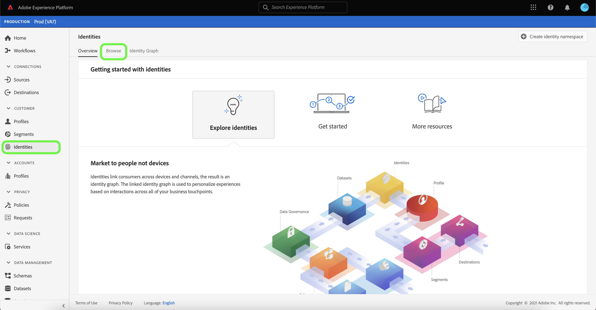

# Overzicht naamruimte identiteit

Identiteitsnaamruimten zijn een component van [[!DNL Identity Service]](./home.md) die als indicatoren van de context dienen waarop een identiteit betrekking heeft. Ze onderscheiden bijvoorbeeld de waarde &quot;name@email.com&quot; als e-mailadres of &quot;443522&quot; als een numerieke CRM-id.

## Aan de slag

Als u met naamruimten werkt, moet u de verschillende betrokken Adobe Experience Platform-services begrijpen. Voordat u begint te werken met naamruimten, raadpleegt u de documentatie voor de volgende services:

- [[!DNL Real-time Customer Profile]](../profile/home.md): Verstrekt een verenigd, klantenprofiel in real time die op samengevoegde gegevens van veelvoudige bronnen wordt gebaseerd.
- [[!DNL Identity Service]](./home.md): Verbeter een beter beeld van individuele klanten en hun gedrag door identiteiten over apparaten en systemen te overbruggen.
- [[!DNL Privacy Service]](../privacy-service/home.md): Identiteitsnaamruimten worden gebruikt om te voldoen aan de algemene gegevensbeschermingsverordening (GDPR), waarbij GDPR-aanvragen kunnen worden ingediend ten opzichte van een naamruimte.

## Naamruimten voor identiteiten

Een volledig gekwalificeerde identiteit omvat een waarde van identiteitskaart en een namespace. Bij het afstemmen van recordgegevens over profielfragmenten, zoals wanneer [!DNL Real-time Customer Profile] profielgegevens samenvoegt, moeten zowel de identiteitswaarde als de naamruimte overeenkomen.

Twee profielfragmenten kunnen bijvoorbeeld verschillende primaire id&#39;s bevatten, maar ze hebben dezelfde waarde voor de naamruimte E-mail, zodat [!DNL Platform] kan zien dat deze fragmenten in feite hetzelfde individu zijn en de gegevens samenvoegt in de identiteitsgrafiek voor het individu.

### Identiteitstypen

Gegevens kunnen worden geïdentificeerd door verschillende typen identiteiten. Het identiteitstype wordt gespecificeerd op het tijdstip dat identiteitskaart namespace wordt gecreeerd en controleert al dan niet het gegeven aan de identiteitsgrafiek en om het even welke speciale instructies voor hoe die gegevens zouden moeten worden behandeld wordt voortgeduurd. Alle identiteitstypes behalve **Niet-personendetentidentifier** volgen het zelfde gedrag van het stitching van een namespace en zijn overeenkomstige waarde van identiteitskaart aan een cluster van de identiteitsgrafiek. Gegevens worden niet samengevoegd bij gebruik van **Niet-persoonlijke id**.

De volgende identiteitstypen zijn beschikbaar binnen [!DNL Platform]:

| Identiteitstype | Beschrijving |
| --- | --- |
| Cookie-id | Cookie-id&#39;s identificeren webbrowsers. Deze identiteiten zijn essentieel voor uitbreiding en vormen het grootste deel van de identiteitsgrafiek. Maar door de natuur verval ze snel en verliezen hun waarde in de loop der tijd. |
| Apparaatoverschrijdende id | Apparaatoverschrijdende id&#39;s identificeren een individu en koppelen gewoonlijk andere id&#39;s aan elkaar. Voorbeelden zijn een aanmeldings-id, CRM-id en een loyale-id. Dit is een aanwijzing voor [!DNL Identity Service] om de waarde gevoelig af te handelen. |
| Apparaat-id | Apparaat-id&#39;s identificeren hardwareapparaten, zoals IDFA (iPhone en iPad), GAID (Android) en RIDA (Roku), en kunnen door meerdere personen in huishoudens worden gedeeld. |
| E-mailadres | E-mailadressen zijn vaak gekoppeld aan één persoon en kunnen daarom worden gebruikt om die persoon op verschillende kanalen te identificeren. Tot dit type identiteiten behoren ook PII&#39;s (Persoonlijke identificeerbare informatie). Dit is een aanwijzing voor [!DNL Identity Service] om de waarde gevoelig af te handelen. |
| Id van niet-personen | Niet-persoonlijke id&#39;s worden gebruikt voor het opslaan van id&#39;s die naamruimten vereisen maar niet zijn verbonden met een personencluster. Bijvoorbeeld een product-SKU, gegevens met betrekking tot producten, organisaties of winkels. |
| Telefoonnummer | Telefoonnummers zijn vaak gekoppeld aan één persoon en kunnen daarom worden gebruikt om die persoon via verschillende kanalen te identificeren. Tot dit type identiteiten behoren PII. Dit is een indicatie voor [!DNL Identity Service] om de waarde gevoelig af te handelen. |

### Standaardnaamruimten

Experience Platform biedt verschillende naamruimten die beschikbaar zijn voor alle organisaties. Deze worden standaardnaamruimten genoemd en zijn zichtbaar met de [!DNL Identity Service]-API of via de interface van het Platform.

De volgende standaardnaamruimten kunnen door alle organisaties in Platform worden gebruikt:

| Weergavenaam | Beschrijving |
| ------------ | ----------- |
| AdCloud | Een naamruimte die Adobe AdCloud vertegenwoordigt. |
| Adobe Analytics (verouderd ID) | Een naamruimte die Adobe Analytics vertegenwoordigt. Zie het volgende document op [Adobe Analytics namespaces](https://experienceleague.adobe.com/docs/analytics/admin/data-governance/gdpr-namespaces.html?lang=en#namespaces) voor meer informatie. |
| Apple IDFA (ID for Advertisers) | Een naamruimte die Apple-id voor adverteerders vertegenwoordigt. Zie het volgende document op [op rente-gebaseerde advertenties](https://support.apple.com/en-us/HT202074) voor meer informatie. |
| Apple Push Notification-service | Een naamruimte die identiteiten vertegenwoordigt die zijn verzameld met de Apple Push Notification-service. Zie het volgende document op [Apple Push Notification service](https://developer.apple.com/library/archive/documentation/NetworkingInternet/Conceptual/RemoteNotificationsPG/APNSOverview.html#//apple_ref/doc/uid/TP40008194-CH8-SW1) voor meer informatie. |
| CORE | Een naamruimte die Adobe Audience Manager vertegenwoordigt. Naar deze naamruimte kan ook worden verwezen met de oudere naam: &quot;Adobe AudienceManager&quot;. Zie het volgende document op [Audience Manager IDs](https://experienceleague.adobe.com/docs/audience-manager/user-guide/overview/data-privacy/data-privacy-reference/data-privacy-ids.html?lang=en#aam-ids) voor meer informatie. |
| ECID | Een naamruimte die ECID vertegenwoordigt. Naar deze naamruimte kan ook worden verwezen door de volgende aliassen: &quot;Adobe Marketing Cloud ID&quot;, &quot;Adobe Experience Cloud ID&quot;, &quot;Adobe Experience Platform ID&quot;. Zie het volgende document op [ECID](./ecid.md) voor meer informatie. |
| Email | Een naamruimte die een e-mailadres vertegenwoordigt. Dit type naamruimte is vaak gekoppeld aan één persoon en kan daarom worden gebruikt om die persoon op verschillende kanalen te identificeren. |
| E-mails (SHA256, verlaagd) | A namespace for pre-hashed email address. Waarden die in deze naamruimte worden opgegeven, worden omgezet in kleine letters voordat er een hash plaatsvindt met SHA256. De spaties aan het begin en aan het einde moeten worden bijgesneden alvorens een e-mailadres wordt genormaliseerd. Deze instelling kan niet met terugwerkende kracht worden gewijzigd. Raadpleeg het volgende document over [SHA256-hash-ondersteuning](https://experienceleague.adobe.com/docs/id-service/using/reference/hashing-support.html?lang=en#hashing-support) voor meer informatie. |
| Firebase Cloud Messaging | Een naamruimte die identiteiten vertegenwoordigt die zijn verzameld met Google Firebase Cloud Messaging voor pushberichten. Raadpleeg het volgende document op [Google Firebase Cloud Messaging](https://firebase.google.com/docs/cloud-messaging) voor meer informatie. |
| Google-advertentie-ID (GAID) | Een naamruimte die staat voor een Google-advertentie-id. Raadpleeg het volgende document op [Google Advertising ID](https://support.google.com/googleplay/android-developer/answer/6048248?hl=en) voor meer informatie. |
| Google Click-id | Een naamruimte die een Google Click-id vertegenwoordigt. Raadpleeg het volgende document op [Click tracking in Google Ads](https://developers.google.com/adwords/api/docs/guides/click-tracking) voor meer informatie. |
| Telefoon | Een naamruimte die een telefoonnummer vertegenwoordigt. Dit type naamruimte is vaak gekoppeld aan één persoon en kan daarom worden gebruikt om die persoon op verschillende kanalen te identificeren. |
| Telefoon (E.164) | A namespace that represents raw phone numbers that need to be hashed in E.164 format. De indeling E.164 omvat een plusteken (`+`), een internationale aanroepende code van het land, een lokale gebiedscode, en een telefoonaantal. Bijvoorbeeld: `(+)(country code)(area code)(phone number)`. |
| Telefoon (SHA256) | Een naamruimte die telefoonnummers vertegenwoordigt die moeten worden gehasht met behulp van SHA256. U moet symbolen, letters en voorloopnullen verwijderen. U moet ook het land toevoegen dat code aanroept als voorvoegsel. |
| Telefoon (SHA256_E.164) | A namespace that represents raw phone numbers that need to be hashed using both SHA256 and E.164 format. |
| TNTID | Een naamruimte die Adobe Target vertegenwoordigt. Zie het volgende document op [Doel](https://experienceleague.adobe.com/docs/target/using/target-home.html?lang=en) voor meer informatie. |
| Windows-ID | A namespace that represents a Windows Advertising ID. Zie het volgende document op [Windows Advertising ID](https://docs.microsoft.com/en-us/uwp/api/windows.system.userprofile.advertisingmanager.advertisingid?view=winrt-19041) voor meer informatie. |

### Identiteitsnaamruimten weergeven

Als u naamruimten in de gebruikersinterface wilt weergeven, selecteert u **[!UICONTROL Identities]** in de linkernavigatie en selecteert u **[!UICONTROL Browse]**.

Er wordt een lijst met naamruimten voor identiteiten weergegeven in de hoofdinterface van de pagina. Deze lijst bevat informatie over de namen, identiteitssymbolen, de datum die als laatste is bijgewerkt en of het een standaard- of een aangepaste naamruimte betreft. De rechterrail bevat informatie over [!UICONTROL Unique identities] en [!UICONTROL Identity graph strength]. [!UICONTROL Unique identities] verwijst naar het aantal identiteiten in de specifieke zandbak die u gebruikt, terwijl de  [!UICONTROL Identity graph strength] sterkte informatie over het aantal koekje en niet-koekjesidentiteitskaarts binnen uw zandbak toont.

Platform biedt ook naamruimten voor integratiedoeleinden. Deze naamruimten zijn standaard verborgen omdat ze worden gebruikt om verbinding te maken met andere systemen en niet om identiteiten aan te sluiten. Selecteer **[!UICONTROL View integration identities]** om integratienamen weer te geven.

Selecteer een naamruimte voor identiteit in de lijst om informatie over een specifieke naamruimte weer te geven. Als u een naamruimte voor identiteiten selecteert, wordt de weergave op de rechtertrack bijgewerkt met metagegevens over de naamruimte die u hebt geselecteerd, inclusief het aantal ingevoerde identiteiten en het aantal mislukte en overgeslagen records.

## Aangepaste naamruimten beheren {#manage-namespaces}

Afhankelijk van uw organisatorische gegevens en gebruiksgevallen hebt u mogelijk aangepaste naamruimten nodig. Aangepaste naamruimten kunnen worden gemaakt met de API [[!DNL Identity Service]](./api/create-custom-namespace.md) of via de interface.

Als u een aangepaste naamruimte wilt maken met de gebruikersinterface, navigeert u naar de werkruimte **[!UICONTROL Identities]**, selecteert u **[!UICONTROL Browse]** en selecteert u **[!UICONTROL Create identity namespace]**.

Het dialoogvenster **[!UICONTROL Create identity namespace]** wordt weergegeven. Geef een uniek **[!UICONTROL Display name]** en **[!UICONTROL Identity symbol]** op en selecteer het type identiteit dat u wilt maken. U kunt ook een optionele beschrijving toevoegen om meer informatie over de naamruimte toe te voegen. Alle identiteitstypen, behalve **Niet-personentype**, volgen hetzelfde gedrag bij het stitching. Als u **Niet-persoonlijke id** selecteert als type identiteit bij het maken van een naamruimte, vindt het stitching niet plaats. Voor specifieke informatie betreffende elk identiteitstype, verwijs naar de lijst op [identiteitstypes](#identity-types).

Selecteer **[!UICONTROL Create]** als u klaar bent.

>[!IMPORTANT]
>
>De naamruimten die u definieert, zijn persoonlijk voor uw organisatie en vereisen een uniek identiteitssymbool om te kunnen worden gemaakt.

Net als bij standaardnaamruimten kunt u een aangepaste naamruimte selecteren op het tabblad **[!UICONTROL Browse]** om de details weer te geven. Met een aangepaste naamruimte kunt u echter ook de weergavenaam en de beschrijving van de naamruimte wijzigen vanuit het detailgebied.

>[!NOTE]
>
>Nadat een naamruimte is gemaakt, kan deze niet worden verwijderd en kunnen het identiteitssymbool en het type van de naamruimte niet worden gewijzigd.

## Naamruimten in identiteitsgegevens

Het leveren van de naamruimte voor een identiteit is afhankelijk van de methode die u gebruikt voor het opgeven van identiteitsgegevens. Zie de sectie over [het verschaffen van identiteitsgegevens](./home.md#supplying-identity-data-to-identity-service) in het [!DNL Identity Service]-overzicht voor meer informatie over het opgeven van identiteitsgegevens.

## Volgende stappen

Nu u de belangrijkste concepten identiteitsnaamruimten begrijpt, kunt u beginnen te leren hoe te met uw identiteitsgrafiek te werken gebruikend [de kijker van de identiteitsgrafiek](./ui/identity-graph-viewer.md).
