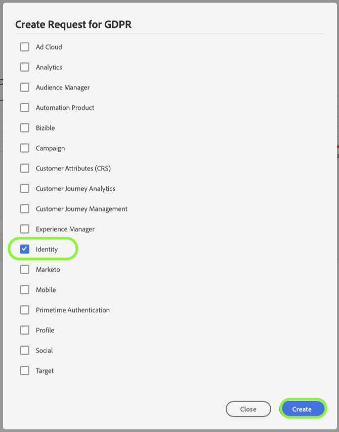

# Behandeling van privacyaanvraag in [!DNL Identity Service]

Adobe Experience Platform [!DNL Privacy Service] verwerkt verzoeken van klanten om toegang te krijgen tot, zich uit de verkoop te sluiten van of hun persoonsgegevens te verwijderen, zoals is vastgelegd in privacyregels zoals de General Data Protection Regulation (GDPR) en [!DNL California Consumer Privacy Act] (CCPA).

In dit document worden de belangrijkste concepten besproken die betrekking hebben op het verwerken van privacyverzoeken voor [!DNL Identity Service] in Adobe Experience Platform.

>[!NOTE]
>
>In deze handleiding wordt alleen uitgelegd hoe u privacyaanvragen voor de opslag van identiteitsgegevens in Experience Platform kunt indienen. Als u ook van plan bent om privacyverzoeken voor het de gegevensmeer of [!DNL Real-Time Customer Profile] van het Platform te maken, verwijs naar de gids op [ verwerking van het privacyverzoek in het gegevens meer ](../catalog/privacy.md) en naar de gids op [ verwerking van het privacyverzoek voor Profiel ](../profile/privacy.md) naast dit leerprogramma.
>
>Voor stappen op hoe te om privacyverzoeken voor andere toepassingen van Adobe Experience Cloud te maken, verwijs naar de [ documentatie van de Privacy Service ](../privacy-service/experience-cloud-apps.md).

## Aan de slag

U wordt aangeraden eerst de volgende [!DNL Experience Platform] -services te leren kennen voordat u deze handleiding leest:

* [[!DNL Privacy Service]](../privacy-service/home.md): Beheert verzoeken van klanten om toegang te krijgen tot, uit de verkoop te stappen of hun persoonlijke gegevens te verwijderen in Adobe Experience Cloud-toepassingen.
* [[!DNL Identity Service]](../identity-service/home.md): lost de fundamentele uitdaging op die door de fragmentatie van de gegevens van de klantenervaring wordt gesteld door identiteiten over apparaten en systemen te overbruggen.
* [[!DNL Real-Time Customer Profile]](home.md): biedt een uniform, real-time consumentenprofiel dat is gebaseerd op geaggregeerde gegevens van meerdere bronnen.

## Naamruimten voor identiteiten {#namespaces}

Adobe Experience Platform [!DNL Identity Service] biedt een brug tussen identiteitsgegevens van klanten op systemen en apparaten. [!DNL Identity Service] gebruikt **identiteit namespaces** om context aan identiteitswaarden te verstrekken door hen op hun systeem van oorsprong met elkaar in verband te brengen. Een naamruimte kan een algemeen concept vertegenwoordigen, zoals een e-mailadres (&quot;e-mail&quot;) of de identiteit koppelen aan een specifieke toepassing, zoals een Adobe Advertising Cloud-id (&quot;AdCloud&quot;) of een Adobe Target-id (&quot;TNTID&quot;).

De Dienst van de identiteit handhaaft een opslag van globaal bepaalde (standaard) en user-defined (douane) identiteitsnamespaces. Standaard naamruimten zijn beschikbaar voor alle organisaties (bijvoorbeeld E-mail en ECID), terwijl uw organisatie aangepaste naamruimten kan maken die aan de specifieke behoeften voldoen.

Voor meer informatie over identiteit namespaces in [!DNL Experience Platform], zie het [ overzicht van identiteitskaart namespace ](../identity-service/features/namespaces.md).

## Verzoeken indienen {#submit}

In de onderstaande secties wordt beschreven hoe u privacyverzoeken voor [!DNL Identity Service] kunt indienen met de API of UI van [!DNL Privacy Service] . Alvorens deze secties te lezen, wordt het sterk geadviseerd dat u de [ Privacy Service API ](../privacy-service/api/getting-started.md) of [ Privacy Service UI ](../privacy-service/ui/overview.md) documentatie voor volledige stappen op bekijkt hoe te om een privacybaan voor te leggen, met inbegrip van hoe te om gebruikersgegevens in verzoekladingen behoorlijk te formatteren.

### De API gebruiken

Bij het maken van taakaanvragen in de API moeten alle id&#39;s in `userIDs` een specifieke `namespace` en `type` gebruiken. Een geldige [ identiteitskaart namespace ](#namespaces) die door [!DNL Identity Service] wordt erkend moet voor de `namespace` waarde worden verstrekt, terwijl `type` of `standard` of `unregistered` (voor standaard en douanenaamruimten, respectievelijk) moet zijn.

Bovendien moet de `include` -array van de payload van de aanvraag de productwaarden voor de verschillende gegevensopslagruimten bevatten waarnaar de aanvraag wordt verzonden. Wanneer u [!DNL Identity] aanvraagt, moet de array de waarde `Identity` bevatten.

Met het volgende verzoek wordt een nieuwe privacytaak onder de GDPR gemaakt voor de gegevens van één klant in de [!DNL Identity] store. Er zijn twee identiteitswaarden voor de klant opgegeven in de array `userIDs` . Een die de standaard naamruimte `Email` identity gebruikt en een andere die naamruimte `ECID` gebruikt, bevat ook de productwaarde voor [!DNL Identity] (`Identity`) in de array `include` :

>[!TIP]
>
>Wanneer u een aangepaste naamruimte verwijdert met behulp van de API, moet u het identiteitssymbool opgeven als de naamruimte in plaats van de weergavenaam.

```shell
curl -X POST \
  https://platform.adobe.io/data/core/privacy/jobs \
  -H 'Authorization: Bearer <key>' \
  -H 'Content-Type: application/json' \
  -H 'x-api-key: acp_privacy_ui_gdpr' \
  -H 'x-gw-ims-org-id: sample@AdobeOrg' \
  -d '{
    "companyContexts": [
      {
        "namespace": "imsOrgID",
        "value": "sample@AdobeOrg"
      }
    ],
    "users": [
      {
        "key": "bob",
        "action": ["delete"],
        "userIDs": [
          {
            "namespace": "email",
            "value": "bob@adobe.com",
            "type": "standard"
          },
          {
            "namespace": "ECID",
            "type": "standard",
            "value":  "123451234512345123451234512345",
            "isDeletedClientSide": false
          }
        ]
      }
    ],
    "include": ["Identity"],
    "regulation": "gdpr"
}'
```

### UI gebruiken

>[!TIP]
>
>Wanneer u een aangepaste naamruimte verwijdert via de gebruikersinterface, moet u het identiteitssymbool opgeven als de naamruimte in plaats van de weergavenaam. Bovendien kunt u geen aangepaste naamruimten in de gebruikersinterface verwijderen voor niet-productiesandboxen.

Wanneer u taakaanvragen maakt in de gebruikersinterface, moet u **[!UICONTROL Identity]** onder **[!UICONTROL Products]** selecteren om taken voor gegevens te verwerken die zijn opgeslagen in [!DNL Identity Service] .



## Verzoek om verwerking verwijderen

Wanneer [!DNL Experience Platform] een verwijderaanvraag ontvangt van [!DNL Privacy Service] , stuurt [!DNL Platform] een bevestiging naar [!DNL Privacy Service] dat de aanvraag is ontvangen en de desbetreffende gegevens zijn gemarkeerd voor verwijdering. De verwijdering van de individuele identiteit is gebaseerd op de opgegeven naamruimte en/of ID-waarde. Bovendien worden alle sandboxen die bij een bepaalde organisatie horen, verwijderd.

Afhankelijk van of u ook het Profiel van de Klant in real time (`ProfileService`) en het gegevens meer (`aepDataLake`) als producten in uw privacyverzoek voor de Dienst van de Identiteit (`identity`) omvatte, worden de verschillende reeksen gegevens met betrekking tot de identiteit verwijderd uit het systeem op potentieel verschillende tijden:

| Producten inbegrepen | Effecten |
| --- | --- |
| alleen `identity` | De opgegeven identiteit wordt verwijderd zodra Platform de bevestiging verzendt dat het verwijderingsverzoek is ontvangen. Het profiel dat is samengesteld uit die identiteitsgrafiek blijft behouden, maar wordt niet bijgewerkt wanneer nieuwe gegevens worden ingevoerd omdat de identiteitskoppelingen nu worden verwijderd. De gegevens die aan het profiel zijn gekoppeld, blijven ook in het datumpeer staan. |
| `identity` en `ProfileService` | De opgegeven identiteit wordt verwijderd zodra Platform de bevestiging verzendt dat het verwijderingsverzoek is ontvangen. De gegevens die aan het profiel zijn gekoppeld, blijven in het datumpeer. |
| `identity` en `aepDataLake` | De opgegeven identiteit wordt verwijderd zodra Platform de bevestiging verzendt dat het verwijderingsverzoek is ontvangen. Het profiel dat is samengesteld uit die identiteitsgrafiek blijft behouden, maar wordt niet bijgewerkt wanneer nieuwe gegevens worden ingevoerd omdat de identiteitskoppelingen nu worden verwijderd.<br><br> wanneer het product van het gegevensmeerproduct antwoordt dat het verzoek werd ontvangen en momenteel verwerkt, worden de gegevens verbonden aan het profiel soft-deleted en daarom niet toegankelijk door om het even welke [!DNL Platform] dienst. Zodra de baan wordt voltooid, worden de gegevens volledig verwijderd uit het gegevens meer. |
| `identity` , `ProfileService` en `aepDataLake` | De opgegeven identiteit wordt verwijderd zodra Platform de bevestiging verzendt dat het verwijderingsverzoek is ontvangen.<br><br> wanneer het product van het gegevensmeerproduct antwoordt dat het verzoek werd ontvangen en momenteel verwerkt, worden de gegevens verbonden aan het profiel soft-deleted en daarom niet toegankelijk door om het even welke [!DNL Platform] dienst. Zodra de baan wordt voltooid, worden de gegevens volledig verwijderd uit het gegevens meer. |

Verwijs naar de [[!DNL Privacy Service]  documentatie ](../privacy-service/home.md#monitor) voor meer informatie bij het volgen van baanstatussen.

## Volgende stappen

Door dit document te lezen, hebt u kennis genomen van de belangrijke concepten voor het verwerken van privacyverzoeken in [!DNL Identity Service] . Voor informatie bij het verwerken van privacyverzoeken voor andere [!DNL Experience Cloud] toepassingen, zie het document op [[!DNL Privacy Service]  en  [!DNL Experience Cloud]  toepassingen ](../privacy-service/experience-cloud-apps.md).
