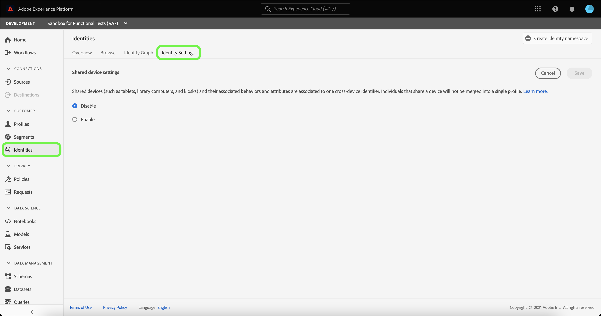
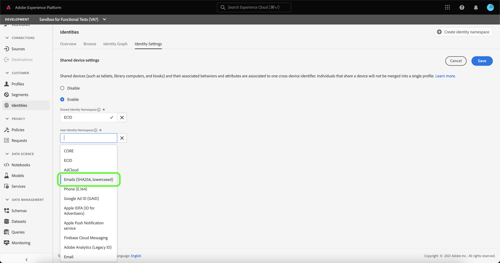

# Overzicht van gedeelde apparaatdetectie (bèta)

>[!IMPORTANT]
>
>De functie [!DNL Shared Device Detection] bevindt zich in bèta. De kenmerken en documentatie van het programma kunnen worden gewijzigd.

Met Adobe Experience Platform [!DNL Identity Service] kunt u een beter beeld krijgen van uw klant en zijn gedrag door identiteiten tussen apparaten en systemen te overbruggen, zodat u in real-time een indrukwekkende, persoonlijke digitale ervaring kunt bieden.

[!DNL Shared Device] heeft betrekking op apparaten die door meer dan één persoon worden gebruikt. Voorbeelden van een gedeeld apparaat zijn tablets, bibliotheekcomputers en kiosken. Met de functie [!DNL Shared Device Detection] kunnen verschillende gebruikers van hetzelfde apparaat niet worden samengevoegd tot één identiteit, waardoor een individu nauwkeuriger kan worden weergegeven.

Met [!DNL Shared Device Detection] kunt u:

* Maak afzonderlijke identiteitsgrafieken voor verschillende gebruikers van hetzelfde apparaat;
* voorkomen dat gegevens van verschillende personen met hetzelfde apparaat worden gemengd;
* Een schonere en nauwkeurigere weergave van uw klanten maken.

>[!TIP]
>
>Configuraties voor [!DNL Shared Device Detection] moeten worden voltooid alvorens Profiel voor dataset toe te laten omdat u montages niet meer kunt herzien zodra de grafieken in [!DNL Identity Service] worden geproduceerd.

## Aan de slag

Als u met [!DNL Shared Device Detection] werkt, moet u de verschillende services van het Platform begrijpen. Lees de documentatie voor de volgende services voordat u met [!DNL Shared Device Detection] begint te werken:

* [[!DNL Identity Service]](../home.md): Verbeter een beter beeld van individuele klanten en hun gedrag door identiteiten over apparaten en systemen te overbruggen.
   * [Identiteitsgrafiekviewer](./identity-graph-viewer.md): Visualiseer en communiceer met de kijker van de identiteitsgrafiek om beter te begrijpen hoe de klantenidentiteiten samen worden vastgemaakt, en op welke manieren.
   * [Naamruimten](../namespaces.md) van identiteit: Zie de componenten van een volledig gekwalificeerde identiteit, en hoe identiteitskaart namespaces u toestaat om de context en het type van een identiteit te onderscheiden.

### Terminologie

De volgende lijst bevat een lijst van termijnen die essentieel zijn om [!DNL Shared Device Detection] te begrijpen:

| Voorwaarden | Definitie |
| --- | --- |
| Gedeeld apparaat | Een gedeeld apparaat is elk apparaat dat door meerdere personen wordt gebruikt. Voorbeelden van gedeelde apparaten zijn tablets, bibliotheekcomputers en kiosken. |
| [!DNL Shared Device Detection] | [!DNL Shared Device Detection] verwijst naar een configuratie die plaatst die voor gegevens van verschillende gebruikers van het zelfde apparaat om van elkaar toestaat te worden gescheiden. |
| [!UICONTROL Shared Identity Namespace] | Een [!UICONTROL Shared Identity Namespace] wordt gebruikt om één enkel apparaat te vertegenwoordigen dat door veelvoudige verschillende gebruikers wordt gedeeld. |
| [!UICONTROL User Identity Namespace] | Een [!UICONTROL User Identity Namespace] wordt gebruikt om de voor authentiek verklaarde, of het programma geopende, gebruiker van een gedeeld apparaat te vertegenwoordigen. |

## Gebruikersinterface voor gedeelde apparaten

Selecteer **[!UICONTROL Identities]** in de interface van het Platform in de linkernavigatie en selecteer **[!UICONTROL Identity settings]**.

De [!UICONTROL Shared device settings] pagina verschijnt, die u van een interface voorzien om gedeelde apparatenmontages voor uw gegevens te vormen. De instellingen voor gedeelde apparaten worden standaard uitgeschakeld.

Wanneer gedeelde apparaatinstellingen zijn ingeschakeld, kunnen gegevens van verschillende gebruikers van hetzelfde apparaat van elkaar worden gescheiden. Met deze configuratie-instelling kunt u identiteitsgrafieken helderder en nauwkeuriger weergeven, waarbij de gebruikersidentiteiten van hetzelfde apparaat niet met elkaar worden gecombineerd.

Selecteer **[!UICONTROL Enable]** om uw gedeelde apparatenmontages te beginnen wijzigen.

De [!UICONTROL Shared Identity Namespace] en [!UICONTROL User Identity Namespace] configuratieopties verschijnen, toestaand u om de identiteitsnamespaces te wijzigen die u wilt gebruiken.

[!UICONTROL Shared Identity Namespace] vertegenwoordigt één enkel apparaat dat door veelvoudige verschillende gebruikers wordt gebruikt. Deze naamruimte is altijd ingesteld op **[!UICONTROL ECID]** omdat alle gebruikers van het Platform **[!UICONTROL ECID]** als id van de webbrowser gebruiken.

Met [!UICONTROL User Identity Namespace] kunt u verschillende gebruikers van hetzelfde apparaat identificeren en voorkomen dat gegevens in dezelfde identiteitsgrafiek worden gecombineerd.

Selecteer de zoekbalk **[!UICONTROL User Identity Namespace]** en voer een naamruimte voor de identiteit in of selecteer een naamruimte voor de identiteit in het vervolgkeuzemenu.

>[!TIP]
>
>[!UICONTROL User Identity Namespace] zou aan identiteitsnamespace moeten worden in kaart gebracht die aan login identiteitskaart van de eindgebruiker beantwoordt. U kunt onder andere de klant-id, e-mail en gehashte e-mail kiezen.

Nadat u de [!UICONTROL Shared Device Settings] hebt geconfigureerd, selecteert u **[!UICONTROL Save]**.

Er verschijnt een pop-upvenster waarin u wordt gevraagd uw selectie te bevestigen. Selecteer **[!UICONTROL Yes]** om de configuratie-instelling te voltooien.

