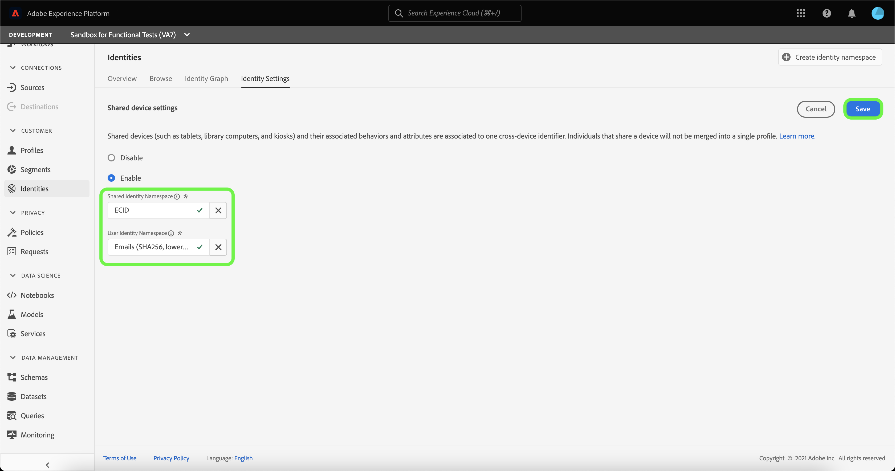

# Overzicht van gedeelde apparaatdetectie (bèta)

>[!IMPORTANT]
>
>De [!DNL Shared Device Detection] Deze functie bevindt zich in bèta. De kenmerken en documentatie van het programma kunnen worden gewijzigd.

Adobe Experience Platform [!DNL Identity Service] helpt u om een beter beeld van uw klant en hun gedrag te krijgen door identiteiten over apparaten en systemen te overbruggen, die u toestaan om daadwerkelijke, persoonlijke digitale ervaringen in echt te leveren - tijd.

[!DNL Shared Device] heeft betrekking op apparaten die door meer dan één persoon worden gebruikt. Voorbeelden van een gedeeld apparaat zijn tablets, bibliotheekcomputers en kiosken. Via de [!DNL Shared Device Detection] kunnen verschillende gebruikers van hetzelfde apparaat niet worden samengevoegd tot één identiteit, waardoor een individu nauwkeuriger kan worden weergegeven.

Met [!DNL Shared Device Detection] u kunt:

* Maak afzonderlijke identiteitsgrafieken voor verschillende gebruikers van hetzelfde apparaat;
* voorkomen dat gegevens van verschillende personen met hetzelfde apparaat worden gemengd;
* Een schonere en nauwkeurigere weergave van uw klanten maken.

>[!TIP]
>
>Configuraties voor [!DNL Shared Device Detection] moet voltooid zijn voordat u Profiel inschakelt voor gegevensset omdat u instellingen niet meer kunt wijzigen als er grafieken zijn gegenereerd in [!DNL Identity Service].

## Aan de slag met [!DNL Shared Device Detection]

Werken met [!DNL Shared Device Detection] vereist een goed begrip van de verschillende betrokken diensten van de Platform. Voordat u begint te werken met [!DNL Shared Device Detection]Raadpleeg de documentatie bij de volgende services:

* [[!DNL Identity Service]](../home.md): Verbeter een beter beeld van individuele klanten en hun gedrag door identiteiten over apparaten en systemen te overbruggen.
   * [Identiteitsgrafiekviewer](./identity-graph-viewer.md): Visualiseer en communiceer met de kijker van de identiteitsgrafiek om beter te begrijpen hoe de klantenidentiteiten samen worden vastgemaakt, en op welke manieren.
   * [Identiteitsnaamruimten](../namespaces.md): Zie de componenten van een volledig gekwalificeerde identiteit, en hoe identiteitskaart namespaces u toestaat om de context en het type van een identiteit te onderscheiden.

## [!DNL Shared Device Detection] begrijpen

Het is belangrijk de volgende terminologie te begrijpen wanneer het werken met
[!DNL Shared Device Detection]. Zie de onderstaande tabel voor een lijst met termen die essentieel zijn voor een goed begrip [!DNL Shared Device Detection].

### Terminologie

| Voorwaarden | Definitie |
| --- | --- |
| Gedeeld apparaat | Een gedeeld apparaat is elk apparaat dat door meerdere personen wordt gebruikt. Voorbeelden van gedeelde apparaten zijn tablets, bibliotheekcomputers en kiosken. |
| [!DNL Shared Device Detection] | [!DNL Shared Device Detection] verwijst naar een configuratie die plaatst die voor gegevens van verschillende gebruikers van het zelfde apparaat om van elkaar toestaat te worden gescheiden. |
| Naamruimte van gedeelde identiteit | De naamruimte Gedeelde identiteit vertegenwoordigt het apparaat dat door meerdere gebruikers kan worden gebruikt. De naamruimte Gedeelde identiteit is doorgaans de ECID, maar kan ook worden ingesteld op andere apparaat-id&#39;s. |
| Naamruimte gebruikersnaam gebruiker | De naamruimte Gebruikers-id vertegenwoordigt de geverifieerde (aangemelde) gebruiker van een gedeeld apparaat. |
| Laatst geverifieerde gebruiker | De laatste voor authentiek verklaarde gebruiker vertegenwoordigt de gebruiker die het laatst aan een apparaat het programma werd geopend, als een apparaat door veelvoudige rekeningen wordt het programma geopend. |

{style=&quot;table-layout:auto&quot;}

[!DNL Shared Device Detection] werkt door twee naamruimten op te zetten: de **Naamruimte van gedeelde identiteit** en de **Naamruimte gebruikersnaam gebruiker**.

* De naamruimte Gedeelde identiteit vertegenwoordigt het apparaat dat door meerdere gebruikers kan worden gebruikt. Adobe raadt klanten aan ECID te gebruiken als de id van het gedeelde apparaat.
* De naamruimte voor de gebruikersnaam wordt toegewezen aan de naamruimte voor de identiteit die overeenkomt met de aanmeldings-id van een gebruiker. Dit kan de CRM-id, het e-mailadres, de gehashte e-mail of het telefoonnummer van de gebruiker zijn.

Een gedeeld apparaat, zoals een tablet, heeft één **Naamruimte van gedeelde identiteit**. Aan de andere kant heeft elke gebruiker van een gedeeld apparaat een eigen toegewezen apparaat **Naamruimte gebruikersnaam gebruiker** die overeenkomt met hun respectievelijke aanmeldings-id&#39;s. Een tablet dat Kevin en Nora bijvoorbeeld delen voor e-commerce gebruik heeft een eigen ECID van `1234`, terwijl Kevin zijn eigen naamruimte voor de gebruikersnaam heeft die aan zijn `kevin@email.com` account en Nora heeft haar eigen naamruimte voor gebruikersnaam toegewezen aan haar `nora@email.com` account.

[!DNL Shared Device Detection] kan onderscheid maken tussen verschillende gebruikers van hetzelfde apparaat door de naamruimte voor gedeelde identiteit te koppelen (bijvoorbeeld ECID) met de gebruikersnaam die als laatste is geverifieerd (aanmeldings-id).

### Hoe identiteitsgegevens naar een identiteitsgrafiek worden verzonden

Neem het volgende voorbeeld om u te helpen begrijpen hoe [!DNL Shared Device Detection] werken:

>[!NOTE]
>
>In dit diagram, wordt de Gedeelde Namespace van de Identiteit gevormd aan ECID en de Namespace van de Identiteit van de Gebruiker wordt gevormd aan identiteitskaart van CRM.

* Kevin en Nora delen een tablet om een e-commercewebsite te bezoeken. Ze beschikken echter allebei over hun eigen onafhankelijke accounts waarmee ze online kunnen bladeren en winkelen.
   * Als gedeeld apparaat heeft de tablet een bijbehorende ECID, die de webbrowser cookie-id van de tablet vertegenwoordigt;
* Veronderstel dat Kevin het tablet en **aanmelden** naar zijn e-commerceaccount om naar hoofdtelefoons te bladeren, betekent dit dan dat Kevin&#39;s CRM-id (**Naamruimte gebruikersnaam gebruiker**) is nu gekoppeld aan de ECID van de tablet (**Naamruimte van gedeelde identiteit**). De browsergegevens van het tablet zijn nu opgenomen in Kevin&#39;s identiteitsgrafiek.
   * If Kevin **logout** en Nora gebruikt de tablet en **aanmelden** voor haar eigen rekening en koopt een camera, dan is haar CRM-id nu gekoppeld aan de ECID van de tablet. De browsergegevens van de tablet zijn daarom opgenomen in de identiteitsgrafiek van Nora.
   * Indien Nora **niet afmelden** en Kevin gebruikt de tablet, maar **niet aanmelden** De browsergegevens van de tablet zijn nog steeds opgenomen in Nora, omdat ze als geverifieerde gebruiker blijft en haar CRM-id nog steeds gekoppeld is aan de ECID van de tablet.
   * Indien Nora **meldt zich af** en Kevin gebruikt de tablet, maar **niet aanmelden** en de browsergegevens van de tablet zijn nog steeds opgenomen in de identiteitsgrafiek van Nora, omdat **laatst geverifieerde gebruiker**, haar CRM-id blijft gekoppeld aan de ECID van de tablet.
   * If Kevin **aanmelden** Ook hier wordt zijn CRM-id nu gekoppeld aan de ECID van de tablet, omdat hij nu de laatst geverifieerde gebruiker is en de browsergegevens van de tablet nu zijn opgenomen in zijn identiteitsgrafiek.

### Hoe [!DNL Profile Service] voegt profielfragmenten samen met [!DNL Shared Device Detection] enabled

[!DNL Profile Service] neemt nota van profielfragmenten en samengevoegde profielen. Elk individueel klantprofiel bestaat uit meerdere profielfragmenten die zijn samengevoegd tot één weergave van die klant. Bijvoorbeeld, als een klant met uw merk over verscheidene kanalen in wisselwerking staat, zal uw organisatie veelvoudige profielfragmenten met betrekking tot die enige klant hebben die in veelvoudige datasets verschijnen. Wanneer deze fragmenten in Platform worden opgenomen, worden ze samengevoegd om één profiel voor die klant te maken.

Wanneer [!DNL Shared Device Detection] is ingeschakeld, [!DNL Profile] Hiermee definieert u de primaire identiteit van het profielfragment op basis van het feit of de ervaringsgebeurtenis al dan niet is geverifieerd

An **geverifieerde ervaringsgebeurtenis** is een actie die door een gebruiker wordt voltooid terwijl het programma geopend aan een apparaat. Voor geverifieerde ervaringsgebeurtenissen is de primaire identiteit de **Naamruimte gebruikersnaam gebruiker** (Aanmeldings-id). An **niet-geverifieerde ervaringsgebeurtenis** is een actie die door een gebruiker wordt voltooid die niet het programma wordt geopend aan een apparaat. Voor niet-geverifieerde ervaringsgebeurtenissen is de primaire identiteit de **Naamruimte van gedeelde identiteit** (ECID).

Zie voor meer informatie de  [[!DNL Real-time Customer Profile] overzicht](../../profile/home.md).

## Gebruikersinterface voor gedeelde apparaten

Selecteer in de gebruikersinterface van het Platform de optie **[!UICONTROL Identities]** van de linkernavigatie en selecteer dan **[!UICONTROL Identity settings]**.

De [!UICONTROL Shared device settings] wordt weergegeven, zodat u een interface hebt voor het configureren van gedeelde apparaatinstellingen voor uw gegevens. De instellingen voor gedeelde apparaten worden standaard uitgeschakeld.

Wanneer gedeelde apparaatinstellingen zijn ingeschakeld, kunnen gegevens van verschillende gebruikers van hetzelfde apparaat van elkaar worden gescheiden. Met deze configuratie-instelling kunt u identiteitsgrafieken helderder en nauwkeuriger weergeven, waarbij de gebruikersidentiteiten van hetzelfde apparaat niet met elkaar worden gecombineerd.

Selecteren **[!UICONTROL Enable]** om de instellingen van uw gedeelde apparaat te wijzigen.

De [!UICONTROL Shared Identity Namespace] en [!UICONTROL User Identity Namespace] Er worden configuratieopties weergegeven, waarmee u de naamruimten kunt wijzigen die u wilt gebruiken.

[!UICONTROL Shared Identity Namespace] vertegenwoordigt één enkel apparaat dat door veelvoudige verschillende gebruikers wordt gebruikt. Deze naamruimte is altijd ingesteld op **[!UICONTROL ECID]** omdat alle gebruikers van het Platform **[!UICONTROL ECID]** als de id van de webbrowser.

De [!UICONTROL User Identity Namespace] Hiermee kunt u verschillende gebruikers van hetzelfde apparaat identificeren en voorkomen dat gegevens in dezelfde identiteitsgrafiek worden gecombineerd.

Selecteer **[!UICONTROL User Identity Namespace]** zoekbalk en voert u een naamruimte voor de identiteit in of selecteert u een naamruimte voor de identiteit in het vervolgkeuzemenu.

>[!TIP]
>
>De [!UICONTROL User Identity Namespace] moet worden toegewezen aan de naamruimte identity die overeenkomt met de aanmeldings-id van de eindgebruiker. U kunt onder andere de klant-id, e-mail en gehashte e-mail kiezen.

Zodra u uw hebt gevormd [!UICONTROL Shared Device Settings], selecteert u **[!UICONTROL Save]**.

Er verschijnt een pop-upvenster waarin u wordt gevraagd uw selectie te bevestigen. Selecteren **[!UICONTROL Yes]** om de configuratie-instelling te voltooien.

