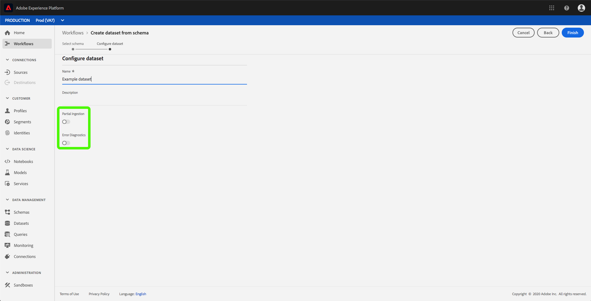

# Gedeeltelijke batch ingestie (Beta)

Gedeeltelijke batch-opname is de mogelijkheid om gegevens met fouten in te voeren, tot een bepaalde drempel. Met deze functie kunnen gebruikers al hun correcte gegevens opnemen in het Adobe Experience Platform terwijl al hun onjuiste gegevens afzonderlijk worden opgeslagen, samen met de details over waarom de gegevens ongeldig zijn.

Dit document bevat een zelfstudie voor het beheren van gedeeltelijke batch-opname.

Daarnaast bevat de [bijlage bij](#appendix) deze zelfstudie een verwijzing naar fouttypen voor gedeeltelijke batch-opname.

>[!IMPORTANT] Deze functie bestaat alleen met de API. Neem contact op met uw team om toegang te krijgen tot deze functie.

## Aan de slag

Deze zelfstudie vereist een praktische kennis van de verschillende services van het Adobe Experience Platform die betrokken zijn bij gedeeltelijke batchverwerking. Voordat u met deze zelfstudie begint, raadpleegt u de documentatie voor de volgende services:

- [Inname](./overview.md)in batch: De methode die Platform gegevens uit gegevensbestanden, zoals CSV en Parquet, opneemt en opslaat.
- [XDM (Experience Data Model)](../../xdm/home.md): Het gestandaardiseerde kader waardoor Platform gegevens van de klantenervaring organiseert.

De volgende secties verstrekken extra informatie die u zult moeten weten om met succes vraag aan Platform APIs te maken.

### API-voorbeeldaanroepen lezen

Deze gids verstrekt voorbeeld API vraag om aan te tonen hoe te om uw verzoeken te formatteren. Dit zijn paden, vereiste kopteksten en correct opgemaakte ladingen voor aanvragen. Voorbeeld-JSON die wordt geretourneerd in API-reacties, wordt ook verschaft. Voor informatie over de overeenkomsten die in documentatie voor steekproefAPI vraag worden gebruikt, zie de sectie over [hoe te om voorbeeld API vraag](../../landing/troubleshooting.md#how-do-i-format-an-api-request) in de het oplossen van problemengids van het Platform van de Ervaring te lezen.

### Waarden verzamelen voor vereiste koppen

Om vraag aan Platform APIs te maken, moet u de [authentificatieleerprogramma](../../tutorials/authentication.md)eerst voltooien. Het voltooien van de autorisatiezelfstudie biedt de waarden voor elk van de vereiste headers in alle API-aanroepen van het Experience Platform, zoals hieronder wordt getoond:

- Autorisatie: Drager `{ACCESS_TOKEN}`
- x-api-key: `{API_KEY}`
- x-gw-ims-org-id: `{IMS_ORG}`

Alle bronnen in het ervaringsplatform zijn geïsoleerd naar specifieke virtuele sandboxen. Alle aanvragen voor platform-API&#39;s vereisen een header die de naam aangeeft van de sandbox waarin de bewerking plaatsvindt:

- x-sandbox-name: `{SANDBOX_NAME}`

>[!NOTE] Raadpleeg de documentatie bij het overzicht van de [sandbox voor meer informatie over sandboxen in Platform](../../sandboxes/home.md).

## Een dataset inschakelen voor gedeeltelijke batch-opname in de API

<!-- >[!NOTE] This section describes enabling a dataset for partial batch ingestion using the API. For instructions on using the UI, please read the [enable a dataset for partial batch ingestion in the UI](#enable-a-dataset-for-partial-batch-ingestion-in-the-ui) step. -->

U kunt een nieuwe dataset tot stand brengen of een bestaande dataset wijzigen met gedeeltelijke toegelaten opname.

Om een nieuwe dataset tot stand te brengen, volg de stappen in [creeer een datasetleerprogramma](../../catalog/api/create-dataset.md). Zodra u *Create een datasetstap* bereikt, voeg het volgende gebied binnen het verzoeklichaam toe:

```json
{
    ...
    "tags" : {
        "partialBatchIngestion":["errorThresholdPercentage:5"]
    },
    ...
}
```

| Eigenschap | Beschrijving |
| -------- | ----------- |
| `errorThresholdPercentage` | Het percentage van aanvaardbare fouten vóór de volledige partij zal ontbreken. |

Op dezelfde manier om een bestaande dataset te wijzigen, volg de stappen in de de ontwikkelaarsgids [van de](../../catalog/api/update-object.md)Catalogus.

Binnen de dataset, zult u de hierboven beschreven markering moeten toevoegen.

<!-- ## Enable a dataset for partial batch ingestion in the UI

>[!NOTE] This section describes enabling a dataset for partial batch ingestion using the UI. If you have already enabled a dataset for partial batch ingestion using the API, you can skip ahead to the next section.

To enable a dataset for partial ingestion through the Platform UI, click **Datasets** in the left navigation. You can either [create a new dataset](#create-a-new-dataset-with-partial-batch-ingestion-enabled) or [modify an existing dataset](#modify-an-existing-dataset-to-enable-partial-batch-ingestion).

### Create a new dataset with partial batch ingestion enabled

To create a new dataset, follow the steps in the [dataset user guide](../../catalog/datasets/user-guide.md). Once you reach the *Configure dataset* step, take note of the *Partial Ingestion* and *Error Diagnostics* fields.



The *Partial ingestion* toggle allows you to enable or disable the use of partial batch ingestion.

The *Error Diagnostics* toggle only appears when the *Partial Ingestion* toggle is off. This feature allows Platform to generate detailed error messages about your ingested batches. If the *Partial Ingestion* toggle is turned on, enhanced error diagnostics are automatically enforced.


The *Error threshold* allows you to set the percentage of acceptable errors before the entire batch will fail. By default, this value is set to 5%.

### Modify an existing dataset to enable partial batch ingestion

To modify an existing dataset, select the dataset you want to modify. The sidebar on the right populates with information about the dataset. 


The *Partial ingestion* toggle allows you to enable or disable the use of partial batch ingestion.

The *Error threshold* allows you to set the percentage of acceptable errors before the entire batch will fail. By default, this value is set to 5%. -->

## Fouten bij gedeeltelijke inname van batch ophalen

Als de partijen mislukkingen bevatten, zult u fouteninformatie over deze mislukkingen moeten terugwinnen zodat kunt u de gegevens opnieuw opnemen.

### Status controleren

Om de status van de ingesloten batch te controleren, moet u de batch-id opgeven in het pad van een GET aanvraag.

**API-indeling**

```http
GET /catalog/batches/{BATCH_ID}
```

| Parameter | Beschrijving |
| --------- | ----------- |
| `{BATCH_ID}` | De `id` waarde van de partij u de status van wilt controleren. |

**Verzoek**

```shell
curl -X GET https://platform.adobe.io/data/foundation/catalog/batches/{BATCH_ID} \
  -H 'Authorization: Bearer {ACCESS_TOKEN}' \
  -H 'x-api-key: {API_KEY}' \
  -H 'x-gw-ims-org-id: {IMS_ORG}' \
  -H 'x-sandbox-name: {SANDBOX_NAME}'
```

**Antwoord**

Een succesvolle reactie retourneert HTTP status 200 met gedetailleerde informatie over de status van de batch.

```json
{
    "af838510-2233-11ea-acf0-f3edfcded2d2": {
        "status": "success",
        "tags": {
            ...
        },
        "relatedObjects": [
            {
                "type": "dataSet",
                "id": "5deac2648a19d218a888d2b1"
            }
        ],
        "id": "af838510-2233-11ea-acf0-f3edfcded2d2",
        "externalId": "af838510-2233-11ea-acf0-f3edfcded2d2",
        "inputFormat": {
            "format": "parquet"
        },
        "imsOrg": "{IMS_ORG}",
        "started": 1576741718543,
        "metrics": {
            "inputByteSize": 568,
            "inputFileCount": 4,
            "inputRecordCount": 519,
            "outputRecordCount": 497
        },
        "completed": 1576741722026,
        "created": 1576741597205,
        "createdClient": "{API_KEY}",
        "createdUser": "{USER_ID}",
        "updatedUser": "{USER_ID}",
        "updated": 1576741722644,
        "version": "1.0.5"
    }    
}
```

Als de batch een fout heeft en foutdiagnose is ingeschakeld, is de status &#39;geslaagd&#39; met meer informatie over de fout in een downloadbaar foutbestand.

## Volgende stappen

Dit leerprogramma behandelde hoe te om een dataset tot stand te brengen of te wijzigen om gedeeltelijke partijingestie toe te laten. Lees voor meer informatie over het in de partij innemen van de [partij de ontwikkelaarsgids](./api-overview.md).

## Typen fout bij gedeeltelijk in batch opnemen {#appendix}

Gedeeltelijke batch-opname heeft vier verschillende fouttypen bij het opnemen van gegevens.

- [Onleesbare bestanden](#unreadable)
- [Ongeldige schema&#39;s of kopteksten](#schemas-headers)
- [Onscheidbare rijen](#unparsable)
- [Ongeldige XDM-conversie](#conversion)

### Onleesbare bestanden {#unreadable}

Als de ingesloten batch onleesbare bestanden bevat, worden de fouten van de batch toegevoegd aan de batch zelf. Meer informatie over het ophalen van de mislukte batch vindt u in de handleiding voor het [ophalen van mislukte batches](../quality/retrieve-failed-batches.md).

### Ongeldige schema&#39;s of kopteksten {#schemas-headers}

Als de partij ingesloten een ongeldig schema of ongeldige kopballen heeft, zullen de fouten van de partij op de partij zelf worden vastgemaakt. Meer informatie over het ophalen van de mislukte batch vindt u in de handleiding voor het [ophalen van mislukte batches](../quality/retrieve-failed-batches.md).

### Onscheidbare rijen {#unparsable}

Als de partij ingesloten unparsable rijen heeft, zullen de fouten van de partij in een dossier worden opgeslagen dat kan worden betreden door het hieronder geschetste eindpunt te gebruiken.

**API-indeling**

```http
GET /export/batches/{BATCH_ID}/failed?path=parse_errors
```

| Parameter | Beschrijving |
| --------- | ----------- |
| `{BATCH_ID}` | De `id` waarde van de partij u fouteninformatie van terugwint. |

**Verzoek**

```shell
curl -X GET https://platform.adobe.io/data/foundation/export/batches/{BATCH_ID}/failed?path=parse_errors \
  -H 'Authorization: Bearer {ACCESS_TOKEN}' \
  -H 'x-api-key: {API_KEY}' \
  -H 'x-gw-ims-org-id: {IMS_ORG}' \
  -H 'x-sandbox-name: {SANDBOX_NAME}'
```

**Antwoord**

Een geslaagde reactie retourneert HTTP-status 200 met details van de onscheidbare rijen.

```json
{
    "_corrupt_record":"{missingQuotes:"v1"}",
    "_errors": [{
         "code":"1401",
         "message":"Row is corrupted and cannot be read, please fix and resend."
    }],
    "_filename": "a1.json"
}
```

### Ongeldige XDM-conversie {#conversion}

Als de partij ingesloten ongeldige XDM omzettingen heeft, zullen de fouten van de partij in een dossier worden opgeslagen dat door het volgende eindpunt kan worden betreden.

**API-indeling**

```http
GET /export/batches/{BATCH_ID}/failed?path=conversion_errors
```

| Parameter | Beschrijving |
| --------- | ----------- |
| `{BATCH_ID}` | De `id` waarde van de partij u fouteninformatie van terugwint. |

**Verzoek**

```shell
curl -X GET https://platform.adobe.io/data/foundation/export/batches/{BATCH_ID}/failed?path=conversion_errors \
  -H 'Authorization: Bearer {ACCESS_TOKEN}' \
  -H 'x-api-key: {API_KEY}' \
  -H 'x-gw-ims-org-id: {IMS_ORG}' \
  -H 'x-sandbox-name: {SANDBOX_NAME}'
```

**Antwoord**

Een succesvolle reactie keert status 200 van HTTP met details van de mislukkingen in omzetting XDM terug.

```json
{
    "col1":"v1",
    "col2":"v2",
    "col3":[{
        "g1":"h1"
    }],
    "_errors":[{
        "column":"col3",
        "code":"123",
        "message":"Cannot convert array element from Object to String"
    }],
    "_filename":"a1.json"
},
{
    "col1":"v1",
    "col2":"v2",
    "col3":[{
        "g1":"h1"
    }],
    "_errors":[{
        "column":"col1",
        "code":"100",
        "message":"Cannot convert string to float"
    }],
    "_filename":"a2.json"
}
```
