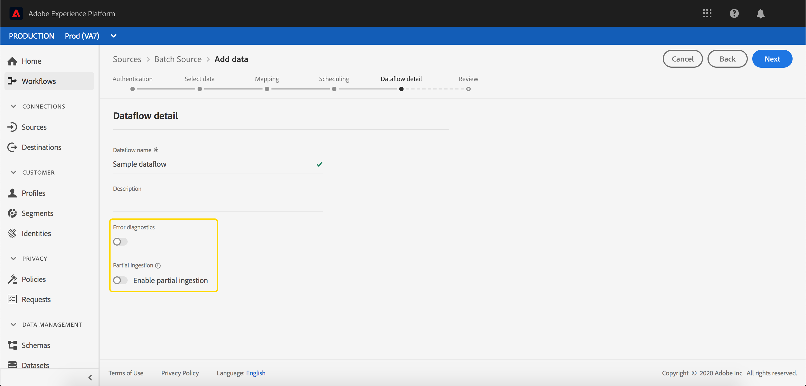

# Gedeeltelijke batch ingestie

Gedeeltelijke batch-opname is de mogelijkheid om gegevens met fouten in te voeren, tot een bepaalde drempel. Met deze functie kunnen gebruikers al hun juiste gegevens in Adobe Experience Platform opnemen terwijl al hun onjuiste gegevens afzonderlijk worden opgeslagen, samen met informatie over waarom de gegevens ongeldig zijn.

Dit document bevat een zelfstudie voor het beheren van gedeeltelijke batch-opname.

## Aan de slag

Deze zelfstudie vereist een praktische kennis van de verschillende Adobe Experience Platform-services die betrokken zijn bij gedeeltelijke batchopname. Voordat u met deze zelfstudie begint, raadpleegt u de documentatie voor de volgende services:

- [Inname](./overview.md)in batch: De methode die gegevens uit gegevensbestanden, zoals CSV en Parquet, [!DNL Platform] opneemt en opslaat.
- [[!DNL Experience Data Model (XDM)]](../../xdm/home.md): Het gestandaardiseerde kader waardoor de gegevens van de klantenervaring worden [!DNL Platform] georganiseerd.

De volgende secties verstrekken extra informatie die u zult moeten weten om met succes vraag aan APIs te maken. [!DNL Platform]

### API-voorbeeldaanroepen lezen

Deze gids verstrekt voorbeeld API vraag om aan te tonen hoe te om uw verzoeken te formatteren. Dit zijn paden, vereiste kopteksten en correct opgemaakte ladingen voor aanvragen. Voorbeeld-JSON die wordt geretourneerd in API-reacties, wordt ook verschaft. Voor informatie over de overeenkomsten die in documentatie voor steekproefAPI vraag worden gebruikt, zie de sectie over [hoe te om voorbeeldAPI vraag](../../landing/troubleshooting.md#how-do-i-format-an-api-request) in de het oplossen van [!DNL Experience Platform] problemengids te lezen.

### Waarden verzamelen voor vereiste koppen

Als u aanroepen wilt uitvoeren naar [!DNL Platform] API&#39;s, moet u eerst de [verificatiezelfstudie](../../tutorials/authentication.md)voltooien. Het voltooien van de zelfstudie over verificatie biedt de waarden voor elk van de vereiste headers in alle API-aanroepen, zoals hieronder wordt getoond: [!DNL Experience Platform]

- Autorisatie: Drager `{ACCESS_TOKEN}`
- x-api-key: `{API_KEY}`
- x-gw-ims-org-id: `{IMS_ORG}`

Alle bronnen in [!DNL Experience Platform] zijn geïsoleerd naar specifieke virtuele sandboxen. Alle aanvragen voor [!DNL Platform] API&#39;s vereisen een header die de naam van de sandbox opgeeft waarin de bewerking plaatsvindt:

- x-sandbox-name: `{SANDBOX_NAME}`

>[!NOTE]
>
>Zie de documentatie over het [!DNL Platform]sandboxoverzicht voor meer informatie over sandboxen in [de](../../sandboxes/home.md)sandbox.

## Een batch voor gedeeltelijke batch-opname inschakelen in de API {#enable-api}

>[!NOTE]
>
>In deze sectie wordt beschreven hoe u een batch voor gedeeltelijke batch-opname via de API inschakelt. Voor instructies over het gebruiken van UI, te lezen gelieve een partij voor gedeeltelijke partijopname in de stap UI [](#enable-ui) toelaat.

U kunt een nieuwe partij tot stand brengen met gedeeltelijke toegelaten opname.

Als u een nieuwe batch wilt maken, volgt u de stappen in de ontwikkelaarshandleiding voor [batchverwerking](./api-overview.md). Als u de batchstap **[!UICONTROL Maken]** hebt bereikt, voegt u het volgende veld toe aan de aanvraaginstantie:

```json
{
    "enableErrorDiagnostics": true,
    "partialIngestionPercentage": 5
}
```

| Eigenschap | Beschrijving |
| -------- | ----------- |
| `enableErrorDiagnostics` | Een vlag die toestaat [!DNL Platform] om gedetailleerde foutenmeldingen over uw partij te produceren. |
| `partialIngestionPercentage` | Het percentage van aanvaardbare fouten vóór de volledige partij zal ontbreken. In dit voorbeeld kan maximaal 5% van de batch fouten zijn voordat deze mislukt. |


## Een batch voor gedeeltelijke batch-opname inschakelen in de gebruikersinterface {#enable-ui}

>[!NOTE]
>
>In deze sectie wordt beschreven hoe u een batch voor gedeeltelijke batchinvoer via de gebruikersinterface inschakelt. Als u al een batch voor gedeeltelijke batch-opname hebt ingeschakeld met de API, kunt u verdergaan met de volgende sectie.

Om een partij voor gedeeltelijke opname door [!DNL Platform] UI toe te laten, kunt u een nieuwe partij door bronverbindingen tot stand brengen, een nieuwe partij in een bestaande dataset tot stand brengen, of een nieuwe partij tot stand brengen door &quot;[!UICONTROL Kaart CSV aan stroom]XDM&quot;.

### Een nieuwe bronverbinding maken {#new-source}

Om een nieuwe bronverbinding tot stand te brengen, volg de vermelde stappen in het [Bronoverzicht](../../sources/home.md). Zodra u de de detailstap **[!UICONTROL van de]** Dataflow bereikt, neem nota van de **[!UICONTROL Gedeeltelijke opname]** en van de **[!UICONTROL Diagnostiek]** van de Fout.



Met de **[!UICONTROL optie Partiële]** inname kunt u het gebruik van gedeeltelijke batch-inname in- of uitschakelen.

De schakeloptie **[!UICONTROL Foutdiagnostiek]** wordt alleen weergegeven wanneer de schakeloptie **[!UICONTROL Partiële inname]** is uitgeschakeld. Met deze functie kunt u gedetailleerde foutberichten genereren [!DNL Platform] over ingesloten batches. Als de **[!UICONTROL schakeloptie Partiële inname]** is ingeschakeld, wordt de uitgebreide foutdiagnose automatisch afgedwongen.


Met de **[!UICONTROL foutdrempel]** kunt u het percentage acceptabele fouten instellen voordat de gehele batch mislukt. Deze waarde is standaard ingesteld op 5%.

### Een bestaande gegevensset gebruiken {#existing-dataset}

Om een bestaande dataset te gebruiken, begin door een dataset te selecteren. De zijbalk rechts vult informatie over de gegevensset.


Met de **[!UICONTROL optie Partiële]** inname kunt u het gebruik van gedeeltelijke batch-inname in- of uitschakelen.

De schakeloptie **[!UICONTROL Foutdiagnostiek]** wordt alleen weergegeven wanneer de schakeloptie **[!UICONTROL Partiële inname]** is uitgeschakeld. Met deze functie kunt u gedetailleerde foutberichten genereren [!DNL Platform] over ingesloten batches. Als de **[!UICONTROL schakeloptie Partiële inname]** is ingeschakeld, wordt de uitgebreide foutdiagnose automatisch afgedwongen.


Met de **[!UICONTROL foutdrempel]** kunt u het percentage acceptabele fouten instellen voordat de gehele batch mislukt. Deze waarde is standaard ingesteld op 5%.

Nu kunt u gegevens uploaden met de knop Gegevens **** toevoegen. Deze gegevens worden vervolgens gedeeltelijk opgenomen.

### De CSV-[!UICONTROL toewijzing aan het XDM-schema]gebruiken {#map-flow}

Als u de stroom &quot;CSV[!UICONTROL toewijzen aan XDM-schema]&quot; wilt gebruiken, volgt u de vermelde stappen in de zelfstudie [Een CSV-bestand toewijzen](../tutorials/map-a-csv-file.md). Zodra u de stap Gegevens **** toevoegen bereikt, neem nota van de **[!UICONTROL Gedeeltelijke opname]** en de diagnostische **[!UICONTROL gebieden van de]** Fout.


Met de **[!UICONTROL optie Partiële]** inname kunt u het gebruik van gedeeltelijke batch-inname in- of uitschakelen.

De schakeloptie **[!UICONTROL Foutdiagnostiek]** wordt alleen weergegeven wanneer de schakeloptie **[!UICONTROL Partiële inname]** is uitgeschakeld. Met deze functie kunt u gedetailleerde foutberichten genereren [!DNL Platform] over ingesloten batches. Als de **[!UICONTROL schakeloptie Partiële inname]** is ingeschakeld, wordt de uitgebreide foutdiagnose automatisch afgedwongen.


**[!UICONTROL De drempel]** van de fout staat u toe om het percentage aanvaardbare fouten te plaatsen alvorens de volledige partij zal ontbreken. Deze waarde is standaard ingesteld op 5%.

## Volgende stappen {#next-steps}

Dit leerprogramma behandelde hoe te om een dataset tot stand te brengen of te wijzigen om gedeeltelijke partijingestie toe te laten. Lees voor meer informatie over het in de partij innemen van de [partij de ontwikkelaarsgids](./api-overview.md).

Lees voor meer informatie over het controleren van fouten met betrekking tot gedeeltelijke inname de diagnostische handleiding voor de [batch-inname](../quality/error-diagnostics.md).
