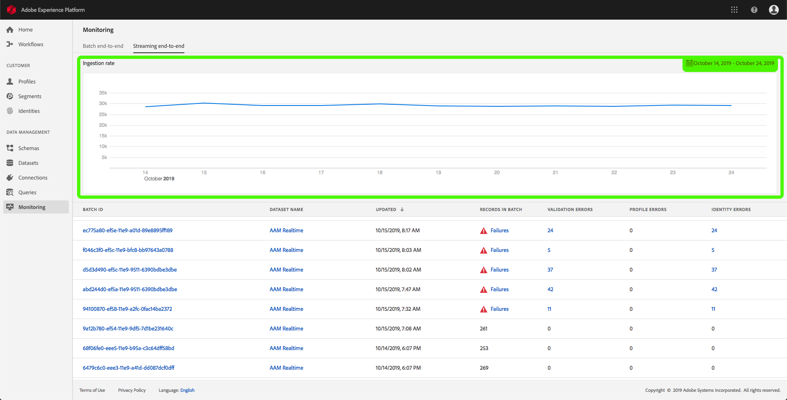

# Inname van gegevens controleren

Met gegevensinvoer kunt u uw gegevens opnemen in het Adobe Experience Platform. U kunt batch-opname gebruiken, waarmee u gegevens kunt invoegen met behulp van verschillende bestandstypen (zoals CSV&#39;s), of streaming opname, waardoor u uw gegevens kunt opnemen in Platform met streaming eindpunten in real-time.

Deze gebruikershandleiding bevat een aantal stappen voor het controleren van uw gegevens in de gebruikersinterface van het Adobe Experience Platform. Voor deze handleiding hebt u een Adobe-id nodig en hebt u toegang tot het Adobe Experience Platform.

## Doorlopende gegevensinvoer controleren

In de UI [van het Platform van de](https://platform.adobe.com)Ervaring, klik **Controle** op het linkernavigatiemenu, dan klik het **Streamen van begin tot eind**.

De *overzichtspagina voor streaming van begin tot einde* wordt weergegeven. Deze werkruimte biedt een grafiek waarin de snelheid van berichten wordt weergegeven die worden gestreamd en een gedetailleerde lijst met binnenkomende gegevens.

Standaard toont de grafiek de mate van inname in de afgelopen zeven dagen. U kunt dit datumbereik aanpassen om verschillende tijdsperioden weer te geven door op de gemarkeerde knop te klikken.

Onder de grafiek bevindt zich een lijst met alle streaming opname-records die overeenkomen met het hierboven weergegeven datumbereik. Elke vermelde partij toont zijn identiteitskaart, datasetnaam, toen het het laatst werd bijgewerkt, het aantal verslagen in de partij, evenals het aantal fouten (als om het even welk bestaan). U kunt op een van de records klikken voor meer informatie over die record.

### Streaming records weergeven

Wanneer u de details van een gestreamde record weergeeft, wordt informatie weergegeven zoals het aantal records dat wordt opgenomen, de bestandsgrootte en de begin- en eindtijd van de opname.

De details van een mislukte streamingrecord geven dezelfde informatie weer als een geslaagde record.

Bovendien bevatten mislukte records details over de fouten die zijn opgetreden tijdens het verwerken van de batch. In het onderstaande voorbeeld is er een systeemfout opgetreden tijdens het valideren van de datasetId uit de catalogus.

## Gegevens van begin tot einde bijhouden in batch

Klik in de gebruikersinterface [van het](https://platform.adobe.com)ervaringsplatform op **Controle** in het linkernavigatiemenu.

De controlepagina Van begin tot eind **van de** Partij van de Partij verschijnt, die een lijst van de eerder opgenomen partijen toont. U kunt op een van de batches klikken voor meer informatie over de record.

### Batches weergeven

Wanneer u de details van een geslaagde batch bekijkt, wordt informatie weergegeven zoals het aantal records dat wordt opgenomen, de bestandsgrootte en de begin- en eindtijd van de opname.

De details van een mislukte partij tonen de zelfde informatie zoals een succesvolle partij, met de toevoeging van het aantal ontbroken verslagen.

Bovendien bevatten mislukte batches details over de fouten die zijn opgetreden tijdens de verwerking van de batch. In het onderstaande voorbeeld is er een fout opgetreden met de ingevoerde batch omdat deze een onbekend veld van `_experience`gebruikt.

