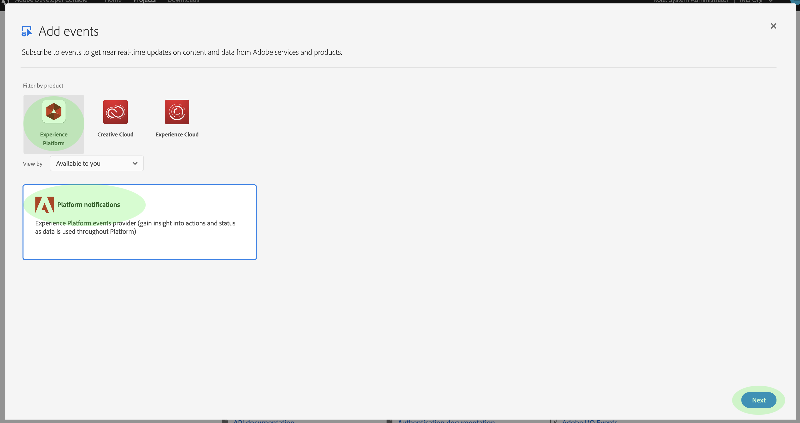

# Meldingen voor gegevensinvoer

Het proces voor het opnemen van gegevens in het Adobe Experience Platform bestaat uit meerdere stappen. Zodra u gegevensdossiers identificeert die in Platform moeten worden opgenomen, begint het innameproces en elke stap komt achtereenvolgens tot de gegevens of met succes worden opgenomen of ontbreken. Het insluitingsproces kan worden gestart met de [Adobe Experience Platform Data Ingestie-API](https://www.adobe.io/apis/experienceplatform/home/api-reference.html#!acpdr/swagger-specs/ingest-api.yaml) of via de Experience Platform-gebruikersinterface.

De gegevens die in Platform worden geladen moeten door veelvoudige stappen gaan om zijn bestemming, het meer van Gegevens of de gegevens opslag van het Profiel van de Klant in real time te bereiken. Elke stap omvat het verwerken van de gegevens, het valideren van de gegevens en het opslaan van de gegevens voordat u deze doorgeeft aan de volgende stap. Afhankelijk van de hoeveelheid gegevens die wordt opgenomen, kan dit een tijdrovend proces worden en er is altijd een kans dat het proces mislukt door validatie-, semantiek- of verwerkingsfouten. In geval van een fout moeten de gegevensproblemen worden opgelost en moet het volledige innameproces opnieuw worden gestart met de gecorrigeerde gegevensbestanden.

Om bij het controleren van het innameproces te helpen, maakt het Platform van de Ervaring het mogelijk om aan een reeks gebeurtenissen in te tekenen die door elke stap van het proces worden gepubliceerd, die u op de hoogte brengen van de status van de opgenomen gegevens en om het even welke mogelijke mislukkingen.

## Beschikbare statusmeldingsgebeurtenissen

Hieronder vindt u een lijst met beschikbare gegevensinvoerstatusmeldingen waarop u zich kunt abonneren.

>[!NOTE] Er is slechts één gebeurtenisonderwerp dat voor alle gegevens wordt verstrekt die berichten invoeren. Om onderscheid te maken tussen verschillende statussen, kan de gebeurteniscode worden gebruikt.

| Platform Service | Status | Beschrijving van gebeurtenis | Gebeurteniscode |
| ---------------- | ------ | ----------------- | ---------- |
| Gegevenslanding | succes | Opname - Batch voltooid | ing_load_success |
| Gegevenslanding | fout | Opname - Batch mislukt | ing_load_failure |
| Klantprofiel in realtime | succes | Profielservice - Gegevensladingbatch geslaagd | ps_load_success |
| Klantprofiel in realtime | fout | Profielservice - Gegevensbatch is mislukt | ps_load_failure |
| Identiteitsgrafiek | succes | Identiteitsgrafiek - Gegevensladingbatch geslaagd | ig_load_success |
| Identiteitsgrafiek | fout | Identiteitsgrafiek: batch voor laden van gegevens is mislukt | ig_load_failure |

## Payloadschema voor berichten

Het gebeurtenisschema voor gegevensinvoer is een XDM-schema (Experience Data Model) dat velden en waarden bevat die details bevatten over de status van de gegevens die worden ingevoerd. Gelieve te bezoeken de openbare reactie XDM GitHub om het recentste schema [van de](https://github.com/adobe/xdm/blob/master/schemas/common/notifications/ingestion.schema.json)berichtlading te bekijken.

## Abonneren op statusmeldingen voor gegevensinvoer

Via [Adobe I/O-gebeurtenissen](https://www.adobe.io/apis/experienceplatform/events.html)kunt u zich op meerdere berichttypen abonneren met behulp van websites. In de onderstaande secties vindt u een overzicht van de stappen voor het abonneren op platformberichten voor gegevensinsluitingsgebeurtenissen met behulp van Adobe Developer Console.

### Nieuw project maken in Adobe Developer Console

Ga naar [Adobe Developer Console](https://www.adobe.com/go/devs_console_ui) en meld u aan met uw Adobe-id. Voer vervolgens de stappen uit die worden beschreven in de zelfstudie over het [maken van een leeg project](https://www.adobe.io/apis/experienceplatform/console/docs.html#!AdobeDocs/adobeio-console/master/projects-empty.md) in de documentatie van de Adobe Developer Console.

### Voeg de gebeurtenissen van het Platform van de Ervaring aan het project toe

Nadat u een nieuw project hebt gemaakt, navigeert u naar het overzichtsscherm van dat project. Klik hier op **[!UICONTROL Gebeurtenis]** toevoegen.

Het dialoogvenster Gebeurtenissen __toevoegen wordt weergegeven. Klik op**[!UICONTROL  ervaringsplatform ]**om de lijst met beschikbare opties te filteren en klik vervolgens op**[!UICONTROL  Platformmeldingen ]**voordat u op**[!UICONTROL  Volgende ]**klikt.

In het volgende scherm wordt een lijst weergegeven met gebeurtenistypen waarop u zich wilt abonneren. Selecteer **[!UICONTROL Gegevensinvoer bericht]**, dan klik **[!UICONTROL daarna]**.

In het volgende scherm wordt u gevraagd een JSON Web Token (JWT) te maken. U wordt gegeven de optie om een zeer belangrijk paar automatisch te produceren, of uw eigen openbare sleutel te uploaden die in de terminal wordt geproduceerd.

In deze zelfstudie wordt de eerste optie gevolgd. Klik op het optievak voor **[!UICONTROL Een sleutelpaar]** genereren en klik vervolgens op de knop **[!UICONTROL Keypair]** genereren in de rechterbenedenhoek.

Wanneer het sleutelpaar produceert, wordt het automatisch gedownload door browser. U moet dit bestand zelf opslaan omdat het niet wordt voortgezet in de Developer Console.

In het volgende scherm kunt u de details van het nieuwe sleutelpaar bekijken. Klik op **[!UICONTROL Volgende]** om door te gaan.

Geef in het volgende scherm een naam en een beschrijving op voor de registratie van de gebeurtenis. De beste manier is om een unieke, gemakkelijk identificeerbare naam te maken om deze gebeurtenisregistratie te onderscheiden van andere registraties voor hetzelfde project.

Verderop op het zelfde scherm, kunt u naar keuze vormen hoe te om gebeurtenissen te ontvangen. **[!UICONTROL Met WebHaak]** kunt u een aangepast webhaadres opgeven voor het ontvangen van gebeurtenissen, terwijl met **[!UICONTROL Runtime-actie]** u hetzelfde kunt doen met [Adobe I/O-runtime](https://www.adobe.io/apis/experienceplatform/runtime/docs.html).

Deze zelfstudie slaat deze optionele configuratiestap over. Als u klaar bent, klikt u op **[!UICONTROL geconfigureerde gebeurtenissen]** opslaan om de gebeurtenisregistratie te voltooien.

De detailspagina voor de pas gecreëerde gebeurtenisregistratie verschijnt, waar u ontvangen gebeurtenissen kunt herzien, zuivert het vinden uitvoeren, en zijn configuratie uitgeven.

## Volgende stappen

Zodra u de berichten van het Platform aan uw project hebt geregistreerd, kunt u ontvangen gebeurtenissen van het projectdashboard bekijken. Raadpleeg de handleiding [OvertrekAdobe I/O-gebeurtenissen](https://www.adobe.io/apis/experienceplatform/events/docs.html#!adobedocs/adobeio-events/master/support/tracing.md) voor gedetailleerde instructies over het overtrekken van gebeurtenissen.
