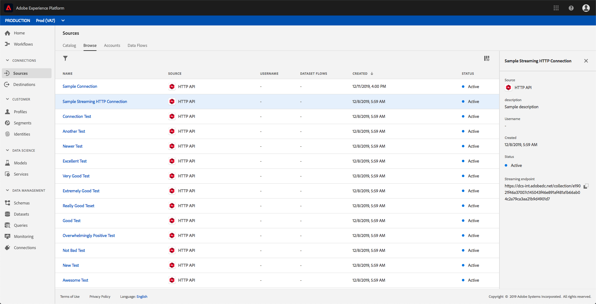
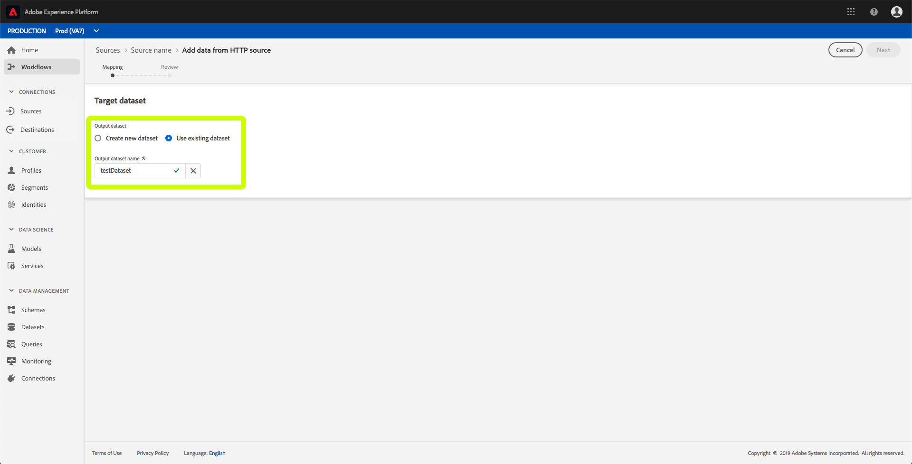

# Een streamingverbinding maken met de gebruikersinterface

Deze UI-handleiding helpt u bij het maken van een streamingverbinding met behulp van Adobe Experience Platform.

## Aan de slag

Als u wilt beginnen met streamen van gegevens naar Experience Platform, moet u eerst een streaming HTTP-verbinding maken. Wanneer u een streamingverbinding maakt, moet u belangrijke details opgeven, zoals de bron van streaminggegevens, en of u gegevens wilt verzenden van een vertrouwde (geverifieerde) of niet-vertrouwde (niet-geverifieerde) bron.

Nadat u een streamingverbinding hebt geregistreerd, beschikt u over een unieke URL waarmee u gegevens kunt streamen naar Platform.

Please note that in order to complete this guide, you will need access to Adobe Experience Platform. Als u geen toegang tot Platform hebt, gelieve uw systeembeheerder te contacteren alvorens te werk te gaan.

## Een streamingverbinding maken

Nadat u zich hebt aangemeld bij de gebruikersinterface van het ervaringsplatform, klikt u op **Bronnen** om het tabblad *Catalogus* te openen. Deze pagina toont de beschikbare brontypes als individuele kaarten, met elke kaart die een bel bevat die het aantal gegevensstromen toont die van het stromen verbindingen aan datasets zijn gecreeerd.

Klik op de pagina *Bronnen* op **HTTP API** en vervolgens op **Connect-bron**.

Het scherm *Verbinding maken met HTTP* wordt weergegeven. Geef onder *Servicedetails* zowel de **naam** als een **beschrijving** voor de nieuwe streamingverbinding op.

Selecteer onder *Accountverificatie* de volgende configuratie-eigenschappen voor uw streamingverbinding:

- **Verificatie:** Of verificatie vereist is voor de streamingverbinding. Authentication ensures that data is collected from trusted sources. Aanbevolen wordt deze optie in te schakelen als het gaat om PII (Personal Identified Information).
- **Compatibiliteit XDM-schema:** Of deze streamingverbinding gebeurtenissen verzendt die compatibel zijn met XDM-schema&#39;s. Deze eigenschap is standaard **ingeschakeld**.

Nadat u de configuratie-eigenschappen hebt geselecteerd, klikt u op **Verbinden**. Uw streaming HTTP-verbinding wordt nu gemaakt en kan nu worden weergegeven onder het tabblad *Bladeren* in de werkruimte *Bronnen* .

Via het tabblad *Bladeren* kunt u op de nieuwe streamingverbinding van HTTP klikken en de details van die verbinding weergeven.

Door op hyperlink van de verbindingsnaam te klikken, kunt u gegevens selecteren die moeten worden getoond door te vormen welke dataset wordt aangesloten, door *Uitgezochte gegevens* te klikken.

U kunt of een nieuwe dataset  creëren of een bestaande dataset gebruiken.

### Een nieuwe gegevensset maken

Om een nieuwe dataset tot stand te brengen, verstrek de **Naam**, de **Beschrijving**, evenals het doel **Schema** voor de dataset.

Nadat u alle details hebt ingevoegd en op **Volgende** hebt geklikt, kunt u de verschafte details controleren voordat u op **Voltooien** klikt om de gegevensset te verbinden met uw streaming HTTP-verbinding.

### Een bestaande gegevensset gebruiken

Als u een bestaande gegevensset wilt gebruiken, selecteert u de naam **van de** uitvoergegevensset.

Nadat u op **Volgende** hebt geklikt, kunt u de details controleren voordat u op **Voltooien** klikt om de geselecteerde dataset te verbinden met uw streaming HTTP-verbinding.

## Volgende stappen

Door deze zelfstudie te volgen, hebt u een het stromen verbinding van HTTP gecreeerd, toelatend u om het het stromen eindpunt te gebruiken om tot een verscheidenheid van de Ingestie APIs van Gegevens toegang te hebben. Voor instructies voor het maken van een streamingverbinding in de API leest u de zelfstudie voor het [maken van een streamingverbinding](../tutorials/create-streaming-connection.md).
