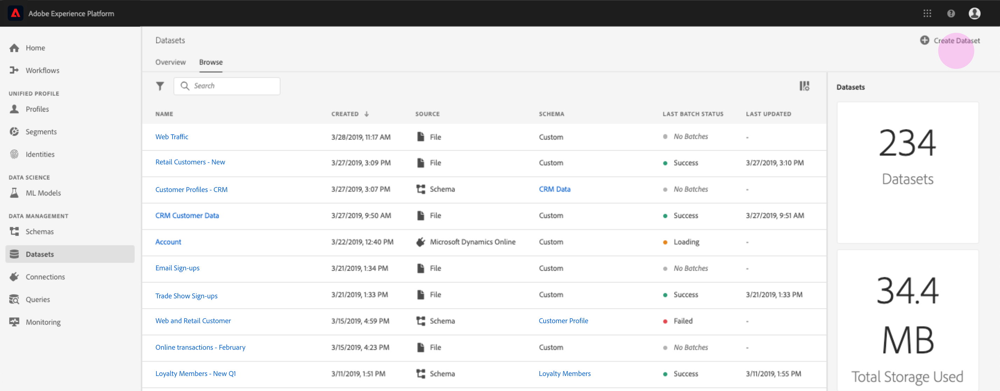

# Gegevens verzamelen in het Adobe Experience Platform

Met het Adobe Experience Platform kunt u gegevens eenvoudig als batchbestanden importeren in Platform. Voorbeelden van gegevens die moeten worden opgenomen, kunnen profielgegevens bevatten van een plat bestand in een CRM-systeem (zoals een parketbestand) of gegevens die voldoen aan een bekend XDM-schema (Experience Data Model) in de Schemaregistratie.

## Aan de slag

Als u deze zelfstudie wilt voltooien, hebt u toegang nodig tot Experience Platform. Als u geen toegang tot een IMS Organisatie in het Platform van de Ervaring hebt, gelieve met uw systeembeheerder te spreken alvorens te werk te gaan.

Als u gegevens liever met API&#39;s voor gegevensinname wilt invoeren, leest u eerst de handleiding voor [Batch Ingestie-ontwikkelaars](../batch-ingestion/api-overview.md).

## Werkruimte Gegevensbestanden

De werkruimte Datasets binnen het Platform van de Ervaring staat u toe om alle datasets te bekijken en te beheren die uw organisatie IMS heeft gemaakt, evenals nieuwe te creëren.

Bekijk de werkruimte Datasets door in de linkernavigatie op **Datasets** te klikken. De werkruimte van Datasets bevat een lijst van datasets, met inbegrip van kolommen die _Naam_, _Gemaakt_ (datum en tijd), _Bron_, _Schema_, en de Status _van de___ Laatste Partij tonen, evenals de datum en de tijd de dataset was Last Updated.

>[!NOTE] Klik op het filterpictogram naast de bar van het Onderzoek om het filtreren mogelijkheden te gebruiken om slechts die datasets te bekijken die voor Profiel worden toegelaten.

## Een gegevensset maken

Als u een gegevensset wilt maken, klikt u op Gegevensset **maken** in de rechterbovenhoek van de werkruimte Datasets.

Op het **Create scherm van de Dataset** , selecteer of u &quot;Dataset van Schema&quot;of &quot;creeer Dataset van Csv- Dossier&quot;zou willen &quot;tot stand brengen.

Voor dit leerprogramma, zal een schema worden gebruikt om de dataset tot stand te brengen. Klik op Gegevensset **maken van schema** om door te gaan.

## Gegevenssetschema selecteren

Kies in het scherm Schema **** selecteren een schema door op het keuzerondje naast het schema te klikken dat u wilt gebruiken. Voor deze zelfstudie wordt de gegevensset gemaakt met het schema Loyalty-leden. Het gebruiken van de onderzoeksbar aan filterschema&#39;s is een nuttige manier om het nauwkeurige schema te vinden u zoekt.

Als u het keuzerondje hebt geselecteerd naast het schema dat u wilt gebruiken, klikt u op **Volgende**.

## Gegevensset configureren

Op het **Configure scherm van de Dataset** , zult u uw dataset een **Naam** moeten geven en kan ook een **Beschrijving** van de dataset eveneens verstrekken.

**Opmerkingen over gegevenssetnamen:**

- De namen van gegevenssets moeten kort en beschrijvend zijn, zodat de gegevensset later gemakkelijk in de bibliotheek kan worden gevonden.
- Dataset-namen moeten uniek zijn, wat betekent dat ze ook specifiek genoeg moeten zijn om in de toekomst niet opnieuw te worden gebruikt.
- Het is beste praktijken om extra informatie over de dataset te verstrekken gebruikend het beschrijvingsgebied, aangezien het andere gebruikers kan helpen tussen datasets in de toekomst differentiëren.

Als de gegevensset een naam en een beschrijving heeft, klikt u op **Voltooien**.

## Gegevensactiviteit

Een lege dataset is nu gecreeerd en u bent teruggekeerd aan het lusje van de Activiteit **van de** Dataset in de werkruimte van Datasets. U zou de naam van de dataset in de upper-left hoek van de werkruimte, samen met een bericht moeten zien dat &quot;Geen partijen zijn toegevoegd.&quot; Dit moet worden verwacht aangezien u nog geen partijen aan deze dataset hebt toegevoegd.

Rechts in de werkruimte Datasets ziet u het tabblad **Info** met informatie over uw nieuwe gegevensset, zoals de id _van de_ gegevensset, de _naam_, de _beschrijving_, de naam _van de_ tabel, de naam ______ van deTabel, de combinatieSchema, de combinatieStreamingen deBron. Het tabblad Info bevat ook informatie over het tijdstip waarop de gegevensset is _gemaakt_ en de datum waarop deze voor het _laatst is gewijzigd_ .

Ook in het lusje van Info is een _knevel van het Profiel_ die voor het toelaten van uw dataset voor gebruik met het Profiel van de Klant in real time wordt gebruikt. Het gebruik van deze knevel, en het Profiel van de Klant in real time, zal meer in detail in de sectie worden verklaard die volgt.

## Gegevensset inschakelen voor realtime klantprofiel

Datasets worden gebruikt voor het opnemen van gegevens in het Experience Platform en die gegevens worden uiteindelijk gebruikt om individuen te identificeren en informatie die uit meerdere bronnen afkomstig is aan elkaar te koppelen. Deze samengevoegde informatie wordt een Real-Time Klantprofiel genoemd. Opdat Platform weet welke informatie in het Real-Time Profiel zou moeten worden omvat, kunnen de datasets voor opneming worden gemerkt gebruikend de knevel van het **Profiel** .

Deze schakeloptie is standaard uitgeschakeld. Als u verkiest om op Profiel van een knevel te voorzien, zullen alle gegevens die in de dataset worden opgenomen worden gebruikt helpen een individu identificeren en hun Real-Time Profiel aaneenschakelen.

Raadpleeg de documentatie bij [Identiteitsservice](../../identity-service/home.md) voor meer informatie over het realtime profiel van de klant en over het werken met identiteiten.

Om de dataset voor het Profiel van de Klant in real time toe te laten, klik de **knevel van het Profiel** op het **lusje van Info** .

Er verschijnt een dialoogvenster waarin u wordt gevraagd te bevestigen dat u de gegevensset wilt inschakelen voor realtime-klantprofiel.

Klik op **Inschakelen** en de schakeloptie wordt blauw om aan te geven dat deze is ingeschakeld.

## Gegevens toevoegen aan gegevensset

Gegevens kunnen op verschillende manieren aan een gegevensset worden toegevoegd. U kunt ervoor kiezen om API&#39;s voor gegevensinname te gebruiken of een ETL-partner zoals Unifi of Informatica. Voor dit leerprogramma, zullen de gegevens aan de dataset worden toegevoegd gebruikend het **Add lusje van Gegevens** binnen UI.

Als u gegevens aan de gegevensset wilt toevoegen, klikt u op het tabblad Gegevens **** toevoegen. U kunt nu bestanden slepen en neerzetten of op uw computer bladeren naar de bestanden die u wilt toevoegen.

>[!NOTE] Platform ondersteunt twee bestandstypen voor gegevensinvoer, parket of JSON. U kunt maximaal vijf bestanden tegelijk toevoegen, waarbij de maximale bestandsgrootte van elk bestand 10 GB is.

## Een bestand uploaden

Nadat u een parket of JSON-bestand dat u wilt uploaden hebt gesleept en neergezet (of gebladerd en geselecteerd), wordt meteen begonnen met het verwerken van het bestand. Het dialoogvenster **Uploaden** wordt weergegeven op het tabblad Gegevens **** toevoegen, waarin de voortgang van het uploaden van het bestand wordt weergegeven.

## Dataset-meetgegevens

Nadat het bestand is geüpload, wordt op het tabblad **Datasetactiviteit** niet meer aangegeven dat er geen batches zijn toegevoegd. In plaats daarvan, toont het lusje van de Activiteit van de Dataset nu datasetmetriek. Alle metriek tonen &quot;0&quot;in dit stadium aangezien de partij nog niet heeft geladen.

Onder aan het tabblad vindt u een lijst met de _batch-id_ van de gegevens die zojuist zijn opgenomen via het proces [&quot;Gegevens toevoegen aan gegevensset&quot;](#add-data-to-dataset) . Ook wordt informatie over de batch opgenomen, waaronder de datum van _Ingested_ , het aantal _Records Ingested_ en de huidige _status_ van de batch.

## Batchgegevens

Klik op de _Batch-id_ om een **Batch-overzicht** weer te geven met aanvullende gegevens over de batch. Zodra de partij klaar is met laden, zal de informatie over de partij worden bijgewerkt om het aantal _Verweven_ Verslagen en de Grootte _van het_ Dossier te tonen. De _status_ wordt ook gewijzigd in &quot;Voltooid&quot; of &quot;Mislukt&quot;. Als de partij ontbreekt zal de sectie van de Code _van de_ Fout details betreffende om het even welke fouten tijdens opname bevatten.

Raadpleeg de handleiding voor het oplossen van problemen bij [Batch-inname voor meer informatie en veelgestelde vragen over het gebruik van batch-inname](../batch-ingestion/troubleshooting.md).

Om aan het scherm van de Activiteit **van de** Dataset terug te keren, klik de naam van de dataset (_Loyalty Details_) in breadcrumb.

## Gegevensset voorvertoning

Zodra de dataset klaar is, verschijnt een optie om de Dataset **van de** Voorproef bij de bovenkant van de Activiteit **van de** Dataset.

Klik de Dataset **van de** Voorproef om een dialoog te openen die steekproefgegevens van binnen de dataset toont. Als de dataset gebruikend een schema werd gecreeerd, zullen de details voor het datasetschema op de linkerkant van de voorproef verschijnen. U kunt het schema uitbreiden gebruikend de pijlen om de schemastructuur te zien. Elke kolomkop in de voorvertoningsgegevens vertegenwoordigt een veld in de gegevensset.

## Volgende stappen

Nu u een dataset en met succes ingebedde gegevens in het Platform van de Ervaring hebt gecreeerd, kunt u deze stappen herhalen om een nieuwe dataset tot stand te brengen of meer gegevens in de bestaande dataset in te voeren.

Lees voor meer informatie over het gebruik van batch-inname het overzicht [van de](../batch-ingestion/overview.md)Batch-inname.
