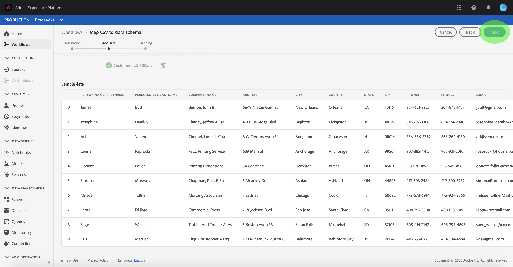
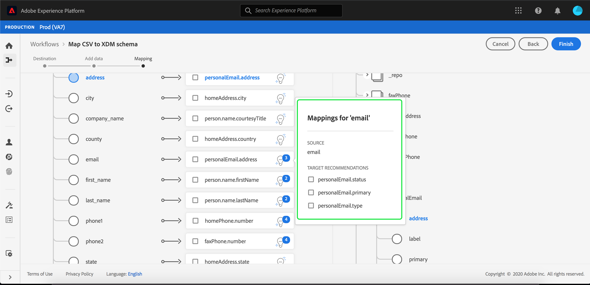

# Een CSV-bestand toewijzen aan een XDM-schema

Als u CSV-gegevens wilt opnemen in [!DNL Adobe Experience Platform], moeten de gegevens worden toegewezen aan een [!DNL Experience Data Model] (XDM)-schema. In deze zelfstudie wordt uitgelegd hoe u een CSV-bestand met de gebruikersinterface [!DNL Platform] kunt toewijzen aan een XDM-schema.

Daarnaast bevat de bijlage bij deze zelfstudie nadere informatie over het gebruik van [toewijzingsfuncties](#mapping-functions).

## Aan de slag

Deze zelfstudie vereist een goed begrip van de volgende componenten van [!DNL Platform]:

- [[!DNL Experience Data Model (XDM System)]](../../xdm/home.md): Het gestandaardiseerde kader waardoor de gegevens van de  [!DNL Platform] klantenervaring worden georganiseerd.
- [[!DNL Batch ingestion]](../batch-ingestion/overview.md): De methode waarmee gegevens uit door de gebruiker opgegeven gegevensbestanden worden  [!DNL Platform] ingesloten.

Deze zelfstudie vereist ook dat u al een dataset hebt gemaakt om uw CSV-gegevens in te voeren. Voor stappen bij het creëren van een dataset in UI, zie [gegeven ingest leerprogramma](./ingest-batch-data.md).

## Kies een bestemming

Meld u aan bij [[!DNL Adobe Experience Platform]](https://platform.adobe.com) en selecteer **[!UICONTROL Workflows]** in de linkernavigatiebalk om de werkruimte **[!UICONTROL Workflows]** te openen.

Selecteer **[!UICONTROL Workflows]** in het scherm **[!UICONTROL Map CSV to XDM schema]** onder de sectie **[!UICONTROL Data ingestion]** en selecteer **[!UICONTROL Launch]**.

De **[!UICONTROL Map CSV to XDM schema]**-workflow wordt weergegeven, te beginnen bij de stap **[!UICONTROL Destination]**. Kies een dataset voor binnenkomende gegevens waarin moeten worden opgenomen. U kunt of een bestaande dataset gebruiken of nieuwe creëren.

**Een bestaande gegevensset gebruiken**

Als u uw CSV-gegevens wilt opnemen in een bestaande gegevensset, selecteert u **[!UICONTROL Use existing dataset]**. U kunt of een bestaande dataset terugwinnen gebruikend de onderzoeksfunctie of door door de lijst van bestaande datasets in het paneel te scrollen.

Als u uw CSV-gegevens wilt opnemen in een nieuwe gegevensset, selecteert u **[!UICONTROL Create new dataset]** en voert u een naam en beschrijving in voor de gegevensset in de velden die worden opgegeven. Selecteer een schema door of de onderzoeksfunctie te gebruiken of door door de lijst van schema&#39;s te scrollen verstrekt. Selecteer **[!UICONTROL Next]** om door te gaan.

## Gegevens toevoegen

De stap **[!UICONTROL Add data]** wordt weergegeven. Sleep het CSV-bestand naar de beschikbare ruimte en zet het neer of selecteer **[!UICONTROL Choose files]** om het CSV-bestand handmatig in te voeren.

De sectie **[!UICONTROL Sample data]** wordt weergegeven zodra het bestand is geüpload, met daarin de eerste tien rijen met gegevens. Nadat u hebt bevestigd dat de gegevens naar behoren zijn geüpload, selecteert u **[!UICONTROL Next]**.

## CSV-velden toewijzen aan XDM-schemavelden

De stap **[!UICONTROL Mapping]** wordt weergegeven. De kolommen van het CSV-bestand worden weergegeven onder **[!UICONTROL Source Field]**, met de bijbehorende XDM-schemavelden onder **[!UICONTROL Target Field]**.

[!DNL Platform] verstrekt automatisch intelligente aanbevelingen voor auto-in kaart gebrachte gebieden die op het doelschema of de dataset worden gebaseerd dat u selecteerde. U kunt toewijzingsregels handmatig aanpassen aan uw gebruiksgevallen.

Als u alle automatisch gegenereerde toewijzingswaarden wilt accepteren, schakelt u het selectievakje &quot;[!UICONTROL Accept all target fields]&quot; in.

Soms is er meer dan één aanbeveling beschikbaar voor het bronschema. Als dit gebeurt, wordt op de kaart de meest prominente aanbeveling weergegeven, gevolgd door een blauwe cirkel die het aantal aanvullende aanbevelingen bevat dat beschikbaar is. Als u het gloeilamppictogram selecteert, wordt een lijst met aanvullende aanbevelingen weergegeven. U kunt één van de afwisselende aanbevelingen kiezen door checkbox naast de aanbeveling te selecteren u aan in plaats daarvan wilt in kaart brengen.

Alternatief, kunt u verkiezen om uw bronschema aan uw doelschema manueel in kaart te brengen. Houd de muisaanwijzer boven het bronschema dat u wilt toewijzen en selecteer vervolgens het plusteken.

De pop-up **[!UICONTROL Map source to target field]** wordt weergegeven. Van hieruit kunt u selecteren welk veld u wilt toewijzen, gevolgd door **[!UICONTROL Save]** om de nieuwe toewijzing toe te voegen.

Als u een van de toewijzingen wilt verwijderen, plaatst u de muisaanwijzer boven de toewijzing en selecteert u het minteken.

### Berekend veld toevoegen

Met berekende velden kunnen waarden worden gemaakt op basis van de kenmerken in het invoerschema. Deze waarden kunnen vervolgens aan kenmerken in het doelschema worden toegewezen en een naam en beschrijving worden gegeven om de referentie eenvoudiger te maken.

Selecteer de **[!UICONTROL Add calculated field]** knoop om te werk te gaan.

Het **[!UICONTROL Create calculated field]** paneel verschijnt. Het linkerdialoogvenster bevat de velden, functies en operatoren die in berekende velden worden ondersteund. Selecteer een van de tabbladen om functies, velden of operatoren toe te voegen aan de expressie-editor.

| Tab | Beschrijving |
| --------- | ----------- |
| Velden | Het tabblad Veld bevat velden en kenmerken die beschikbaar zijn in het bronschema. |
| Functies | Op het tabblad Functies staan de functies die beschikbaar zijn voor het transformeren van de gegevens. Voor meer informatie over de functies die u kunt gebruiken binnen berekende velden, leest u de handleiding op [met de functies Data Prep (Mapper)](../../data-prep/functions.md). |
| Operatoren | Het tabblad Operatoren bevat een lijst met operatoren die beschikbaar zijn om de gegevens te transformeren. |

U kunt handmatig velden, functies en operatoren toevoegen met de expressieeditor in het midden. Selecteer de editor om een expressie te maken.

Selecteer **[!UICONTROL Save]** om door te gaan.

Het kaartscherm verschijnt weer met het nieuwe bronveld. Pas het desbetreffende doelveld toe en selecteer **[!UICONTROL Finish]** om de toewijzing te voltooien.

## Gegevens bijhouden

Nadat het CSV-bestand is toegewezen en gemaakt, kunt u de gegevens controleren die er doorheen worden ingevoerd. Zie de zelfstudie over [het controleren van gegevensinvoer](../../ingestion/quality/monitor-data-ingestion.md) voor meer informatie over het controleren van gegevensinvoer.

## Volgende stappen

Door deze zelfstudie te volgen, hebt u met succes een vlak Csv- dossier aan een XDM- schema in kaart gebracht en het opgenomen in [!DNL Platform]. Deze gegevens kunnen nu worden gebruikt door downstreamservices [!DNL Platform], zoals [!DNL Real-time Customer Profile]. Zie het overzicht voor [[!DNL Real-time Customer Profile]](../../profile/home.md) voor meer informatie.
