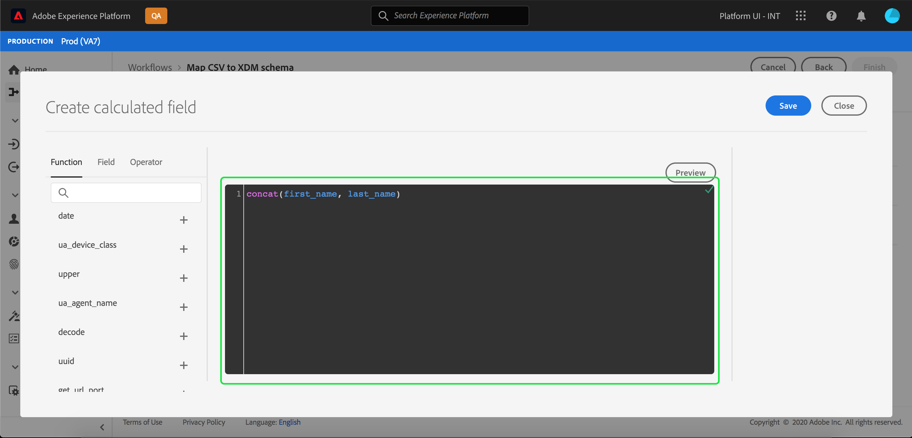

# Een CSV-bestand toewijzen aan een bestaand XDM-schema

>[!NOTE]
>
>In dit document wordt beschreven hoe u een CSV-bestand toewijst aan een bestaand XDM-schema. Voor informatie over hoe te om het AI-Gegenereerde hulpmiddel van de schemaaanbeveling (momenteel in bèta) te gebruiken, zie het document op [ in kaart brengend een Csv- dossier gebruikend machine-leert aanbevelingen ](./recommendations.md).

Als u CSV-gegevens in [!DNL Adobe Experience Platform] wilt invoeren, moeten de gegevens worden toegewezen aan een [!DNL Experience Data Model] (XDM)-schema. In deze zelfstudie wordt uitgelegd hoe u een CSV-bestand via de gebruikersinterface van [!DNL Platform] kunt toewijzen aan een XDM-schema.

## Aan de slag

Deze zelfstudie vereist een goed begrip van de volgende componenten van [!DNL Platform] :

- [[!DNL Experience Data Model (XDM System)]](../../../xdm/home.md): Het gestandaardiseerde framework waarmee [!DNL Platform] gegevens voor de klantervaring indeelt.
- [ Inname van de Partij ](../../batch-ingestion/overview.md): De methode waardoor [!DNL Platform] gegevens van user-provided gegevensbestanden opneemt.
- [ Prep van Gegevens van Adobe Experience Platform ](../../batch-ingestion/overview.md): Een reeks mogelijkheden die u toestaan om opgenomen gegevens in kaart te brengen en om te zetten om met schema&#39;s in overeenstemming te zijn XDM. De documentatie over [ Prep functies van Gegevens ](../../../data-prep/functions.md) is bijzonder relevant voor schemaafbeelding.

Deze zelfstudie vereist ook dat u al een dataset hebt gemaakt om uw CSV-gegevens in te voeren. Voor stappen bij het creëren van een dataset in UI, zie [ gegevens ingest leerprogramma ](../ingest-batch-data.md).

## Kies een bestemming

Meld u aan bij [[!DNL Adobe Experience Platform] ](https://platform.adobe.com) en selecteer vervolgens **[!UICONTROL Workflows]** in de linkernavigatiebalk om de **[!UICONTROL Workflows]** -werkruimte te openen.

Selecteer in het scherm **[!UICONTROL Workflows]** de optie **[!UICONTROL Map CSV to XDM schema]** onder de sectie **[!UICONTROL Data ingestion]** en selecteer vervolgens **[!UICONTROL Launch]** .

De **[!UICONTROL Map CSV to XDM schema]** -workflow wordt weergegeven, vanaf de **[!UICONTROL Destination]** -stap. Kies een dataset voor binnenkomende gegevens waarin moeten worden opgenomen. U kunt een bestaande gegevensset gebruiken of een nieuwe gegevensset maken.

**Gebruik een bestaande dataset**

Als u uw CSV-gegevens in een bestaande gegevensset wilt opnemen, selecteert u **[!UICONTROL Use existing dataset]** . U kunt of een bestaande dataset terugwinnen gebruikend de onderzoeksfunctie of door door de lijst van bestaande datasets in het paneel te scrollen.

Als u uw CSV-gegevens in een nieuwe gegevensset wilt opnemen, selecteert u **[!UICONTROL Create new dataset]** en voert u een naam en beschrijving in voor de gegevensset in de velden die u opgeeft. Selecteer een schema door of de onderzoeksfunctie te gebruiken of door door de lijst van schema&#39;s te scrollen verstrekt. Selecteer **[!UICONTROL Next]** om door te gaan.

## Gegevens toevoegen

De stap **[!UICONTROL Add data]** wordt weergegeven. Sleep het CSV-bestand naar de beschikbare ruimte en zet het neer of selecteer **[!UICONTROL Choose files]** om het CSV-bestand handmatig in te voeren.

De sectie **[!UICONTROL Sample data]** wordt weergegeven wanneer het bestand is geüpload. De eerste tien rijen met gegevens worden weergegeven. Selecteer **[!UICONTROL Next]** als u hebt bevestigd dat de gegevens naar behoren zijn geüpload.

## CSV-velden toewijzen aan XDM-schemavelden

De stap **[!UICONTROL Mapping]** wordt weergegeven. De kolommen van het CSV-bestand worden weergegeven onder **[!UICONTROL Source Field]** en de bijbehorende XDM-schemavelden onder **[!UICONTROL Target Field]** .

[!DNL Platform] verstrekt automatisch intelligente aanbevelingen voor auto-in kaart gebrachte gebieden die op het doelschema of de dataset worden gebaseerd die u selecteerde. U kunt toewijzingsregels handmatig aanpassen aan uw gebruiksgevallen.

Om alle auto-genererende toewijzingswaarden goed te keuren, selecteer checkbox geëtiketteerd &quot;[!UICONTROL Accept all target fields]&quot;.

Soms is er meer dan één aanbeveling beschikbaar voor het bronschema. Als dit gebeurt, wordt op de kaart de meest prominente aanbeveling weergegeven, gevolgd door een blauwe cirkel die het aantal aanvullende aanbevelingen bevat dat beschikbaar is. Als u het gloeilamppictogram selecteert, wordt een lijst met aanvullende aanbevelingen weergegeven. U kunt één van de afwisselende aanbevelingen kiezen door checkbox naast de aanbeveling te selecteren u aan in plaats daarvan wilt in kaart brengen.

U kunt ook handmatig uw bronschema toewijzen aan uw doelschema. Houd de muisaanwijzer boven het bronschema dat u wilt toewijzen en selecteer vervolgens het plusteken.

De pop-up **[!UICONTROL Map source to target field]** wordt weergegeven. Van hieruit kunt u selecteren welk veld u wilt toewijzen, gevolgd door **[!UICONTROL Save]** om de nieuwe toewijzing toe te voegen.

Als u een van de toewijzingen wilt verwijderen, plaatst u de muis boven de toewijzing en selecteert u het min-pictogram.

### Berekend veld toevoegen {#add-calculated-field}

Met berekende velden kunnen waarden worden gemaakt op basis van de kenmerken in het invoerschema. Deze waarden kunnen vervolgens aan kenmerken in het doelschema worden toegewezen en een naam en beschrijving worden gegeven om de referentie eenvoudiger te maken.

Selecteer de knop **[!UICONTROL Add calculated field]** om door te gaan.

Het deelvenster **[!UICONTROL Create calculated field]** wordt weergegeven. Het linkerdialoogvenster bevat de velden, functies en operatoren die in berekende velden worden ondersteund. Selecteer een van de tabbladen om functies, velden of operatoren toe te voegen aan de expressie-editor.

| Tabtoets | Beschrijving |
| --------- | ----------- |
| Velden | Het tabblad Veld bevat velden en kenmerken die beschikbaar zijn in het bronschema. |
| Functies | Op het tabblad Functies staan de functies die beschikbaar zijn voor het transformeren van de gegevens. Om meer over de functies te leren u binnen berekende gebieden kunt gebruiken, te lezen gelieve de gids op [ gebruikend de functies van de Prep van Gegevens (Mapper) ](../../../data-prep/functions.md). |
| Operatoren | Het tabblad Operatoren bevat een lijst met operatoren die beschikbaar zijn om de gegevens te transformeren. |

U kunt handmatig velden, functies en operatoren toevoegen met de expressieeditor in het midden. Selecteer de editor om een expressie te maken.

Selecteer **[!UICONTROL Save]** om door te gaan.

Het kaartscherm verschijnt weer met het nieuwe bronveld. Pas het desbetreffende doelveld toe en selecteer **[!UICONTROL Finish]** om de toewijzing te voltooien.

## Gegevens bijhouden

Nadat het CSV-bestand is toegewezen en gemaakt, kunt u de gegevens controleren die er doorheen worden ingevoerd. Voor meer informatie bij het controleren van gegevensopname, zie het leerprogramma op [ controle gegevensopname ](../../../ingestion/quality/monitor-data-ingestion.md).

## Volgende stappen

Aan de hand van deze zelfstudie hebt u een standaard CSV-bestand toegewezen aan een XDM-schema en het ingepakt in [!DNL Platform] . Deze gegevens kunnen nu worden gebruikt door downstream [!DNL Platform] -services, zoals [!DNL Real-Time Customer Profile] . Zie het overzicht voor [[!DNL Real-Time Customer Profile]](../../../profile/home.md) voor meer informatie.

>[!TIP]
>
>U kunt machine het leren (ML) algoritmen ook gebruiken om **een schema van steekproefgegevens** van de werkruimte van het Schema te produceren. Deze workflow maakt automatisch een nieuw schema op basis van de structuur en inhoud van het bestand. Het schema moet overeenkomen met de indeling van uw gegevens. Zo bespaart u tijd en vergroot u de nauwkeurigheid bij het definiëren van de structuur, velden en gegevenstypen voor grote complexe gegevenssets. Zie de [ ML-Begeleidde van de schemaverwezenlijking ](../../../xdm/ui/ml-assisted-schema-creation.md) voor meer informatie over dit werkschema.
