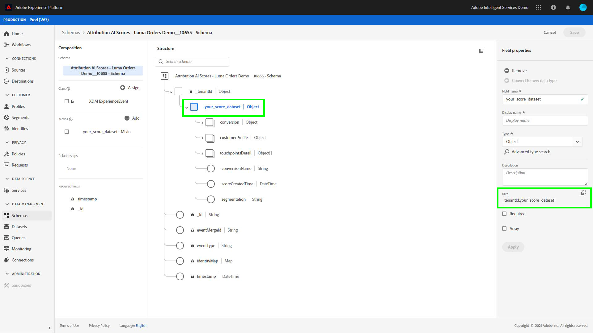

# Snelstartgids voor Adobe Experience Platform Query Service voor het analyseren van toewijzingsscores

Elke rij in de gegevens vertegenwoordigt een conversie, waarbij informatie voor verwante aanraakpunten wordt opgeslagen als een array van structs onder de kolom `touchpointsDetail`.

| Informatie over aanraakpunten | Kolom |
| ---------------------- | ------ |
| Naam aanraakpunt | `touchpointsDetail. touchpointName` |
| Aanraakpuntkanaal | `touchpointsDetail.touchPoint.mediaChannel` |
| AAI-algoritmische aanraakpunten | <li>`touchpointsDetail.scores.algorithmicSourced`</li> <li> `touchpointsDetail.scores.algorithmicInfluenced` </li> |

## Gegevenspaden zoeken

Selecteer **[!UICONTROL Datasets]** in de linkernavigatie in de gebruikersinterface van Adobe Experience Platform. De pagina **[!UICONTROL Datasets]** wordt weergegeven. Vervolgens selecteert u het tabblad **[!UICONTROL Bladeren]** en zoekt u de uitvoergegevensset voor de scores van uw Attribution AI.


Selecteer uw uitvoerdataset. De pagina met gegevenssetactiviteiten wordt weergegeven.


Selecteer **[!UICONTROL Gegevensset voorvertonen]** in de rechterbovenhoek van de activiteitenpagina van de gegevensset om een voorvertoning van uw gegevens weer te geven en ervoor te zorgen dat de gegevensset op de verwachte manier is opgenomen.


Nadat u een voorvertoning van uw gegevens hebt weergegeven, selecteert u het schema in de rechtertrack. Er verschijnt een pop-up met de schemanaam en de beschrijving. Selecteer de hyperlink naar de schemanaam om deze om te leiden naar het scoreschema.


Met het scoreschema kunt u een waarde selecteren of zoeken. Als deze optie is geselecteerd, worden de **[!UICONTROL Veldeigenschappen]** naast elkaar geopend, zodat u het pad kunt kopiëren voor gebruik bij het maken van query&#39;s.



## Access Query Service

Om tot de Dienst van de Vraag van binnen de Platform UI toegang te hebben, begin door **[!UICONTROL Vragen]** in de linkernavigatie te selecteren, dan selecteer **[!UICONTROL Browse]** tabel. Er wordt een lijst met eerder opgeslagen query&#39;s geladen.


Selecteer vervolgens **[!UICONTROL Query maken]** in de rechterbovenhoek. De Query-editor wordt geladen. Met behulp van de Query-editor kunt u query&#39;s maken met behulp van uw score-gegevens.


Voor meer informatie over de Redacteur van de Vraag, bezoek [de gebruikersgids van de Redacteur van de Vraag](../../query-service/ui/user-guide.md).

## Zoeksjablonen voor analyse van de toewijzingsscore

De hieronder vragen kunnen als malplaatje voor verschillende scenario&#39;s van de scoreanalyse worden gebruikt. U moet `_tenantId` en `your_score_output_dataset` met de juiste waarden vervangen die in uw het scoren outputschema worden gevonden.

>[!NOTE]
>
> Afhankelijk van de manier waarop uw gegevens zijn ingevoerd, kunnen de waarden die hieronder worden gebruikt, zoals `timestamp`, een andere indeling hebben.

### Validatievoorbeelden

**Totaal aantal conversies via conversiegebeurtenis (binnen in een conversievenster)**

```sql
    SELECT conversionName,
           SUM(scores.firstTouch) as total_conversions,
           SUM(scores.algorithmicSourced) as total_attributed_conversions
    FROM
        (SELECT
                _tenantId.your_score_output_dataset.conversionName
                    as conversionName,
                inline(_tenantId.your_score_output_dataset.touchpointsDetail),
                timestamp as conversion_timestamp
         FROM
                your_score_output_dataset
        )
    WHERE
        conversion_timestamp >= '2020-07-16'
      AND
        conversion_timestamp <  '2020-10-14'
    GROUP BY
        conversionName
```

**Het totale aantal conversie-enige gebeurtenissen (binnen in een conversievenster)**

```sql
    SELECT
        _tenantId.your_score_output_dataset.conversionName as conversionName,
        COUNT(1) as convOnly_cnt
    FROM
        your_score_output_dataset
    WHERE
        _tenantId.your_score_output_dataset.touchpointsDetail.touchpointName[0] IS NULL AND
        timestamp >= '2020-07-16' AND
        timestamp <  '2020-10-14'
    GROUP BY
        conversionName
```

### Voorbeelden van trendanalyses

**Aantal omzettingen per dag**

```sql
    SELECT conversionName,
           DATE(conversion_timestamp) as conversion_date,
           SUM(scores.firstTouch) as convertion_cnt
    FROM
        (SELECT
                _tenantId.your_score_output_dataset.conversionName as conversionName,
                inline(_tenantId.your_score_output_dataset.touchpointsDetail),
                timestamp as conversion_timestamp
         FROM
                your_score_output_dataset
        )
    GROUP BY
        conversionName, DATE(conversion_timestamp)
    ORDER BY
        conversionName, DATE(conversion_timestamp)
    LIMIT 20
```

### Voorbeelden van de distributieanalyse

**Hoeveelheid aanraakpunten op conversiepaden op gedefinieerde tekst (in een conversievenster)**

```sql
    SELECT conversionName,
           touchpointName,
           COUNT(1) as tp_count
    FROM
        (SELECT
                _tenantId.your_score_output_dataset.conversionName as conversionName,
                inline(_tenantId.your_score_output_dataset.touchpointsDetail),
                timestamp as conversion_timestamp
         FROM
                your_score_output_dataset
        )
    WHERE
        conversion_timestamp >= '2020-07-16' AND
        conversion_timestamp < '2020-10-14' AND
        touchpointName IS NOT NULL
    GROUP BY
        conversionName, touchpointName
    ORDER BY
        conversionName, tp_count DESC
```

### Voorbeelden van het genereren van inzicht

**Uitsplitsing van incrementele eenheden naar aanraakpunt en conversiedatum (binnen een conversievenster)**

```sql
    SELECT conversionName,
           touchpointName,
           DATE(conversion_timestamp) as conversion_date,
           SUM(scores.algorithmicSourced) as incremental_units
    FROM
        (SELECT
                _tenantId.your_score_output_dataset.conversionName as conversionName,
                inline(_tenantId.your_score_output_dataset.touchpointsDetail),
                timestamp as conversion_timestamp
         FROM
                your_score_output_dataset
        )
    WHERE
        conversion_timestamp >= '2020-07-16' AND
        conversion_timestamp < '2020-10-14'  AND
        touchpointName IS NOT NULL
    GROUP BY
        conversionName, touchpointName, DATE(conversion_timestamp)
    ORDER BY
        conversionName, touchpointName, DATE(conversion_timestamp)
```

**Uitsplitsing van incrementele eenheden naar aanraakpunt en aanraakpunt (binnen een conversievenster)**

```sql
    SELECT conversionName,
           touchpointName,
           DATE(touchpoint.timestamp) as touchpoint_date,
           SUM(scores.algorithmicSourced) as incremental_units
    FROM
        (SELECT
                _tenantId.your_score_output_dataset.conversionName as conversionName,
                inline(_tenantId.your_score_output_dataset.touchpointsDetail),
                timestamp as conversion_timestamp
         FROM
                your_score_output_dataset
        )
    WHERE
        conversion_timestamp >= '2020-07-16' AND
        conversion_timestamp < '2020-10-14'  AND
        touchpointName IS NOT NULL
    GROUP BY
        conversionName, touchpointName, DATE(touchpoint.timestamp)
    ORDER BY
        conversionName, touchpointName, DATE(touchpoint.timestamp)
    LIMIT 20
```

**Geaggregeerde scores voor een bepaald type aanraakpunt voor alle scoremodellen (in een conversievenster)**

```sql
    SELECT
           conversionName,
           touchpointName,
           SUM(scores.algorithmicSourced) as total_incremental_units,
           SUM(scores.algorithmicInfluenced) as total_influenced_units,
           SUM(scores.uShape) as total_uShape_units,
           SUM(scores.decayUnits) as total_decay_units,
           SUM(scores.linear) as total_linear_units,
           SUM(scores.lastTouch) as total_lastTouch_units,
           SUM(scores.firstTouch) as total_firstTouch_units
    FROM
        (SELECT
                _tenantId.your_score_output_dataset.conversionName as conversionName,
                inline(_tenantId.your_score_output_dataset.touchpointsDetail),
                timestamp as conversion_timestamp
         FROM
                your_score_output_dataset
        )
    WHERE
        conversion_timestamp >= '2020-07-16' AND
        conversion_timestamp < '2020-10-14'  AND
        touchpointName = 'display'
    GROUP BY
        conversionName, touchpointName
    ORDER BY
        conversionName, touchpointName
```

**Geavanceerd - analyse van padlengte**

Hiermee wordt een verdeling over padlengte opgehaald voor elk type conversiegebeurtenis:

```sql
    WITH agg_path AS (
          SELECT
            _tenantId.your_score_output_dataset.conversionName as conversionName,
            sum(size(_tenantId.your_score_output_dataset.touchpointsDetail)) as path_length
          FROM
            your_score_output_dataset
          WHERE
            _tenantId.your_score_output_dataset.touchpointsDetail.touchpointName[0] IS NOT NULL AND
            timestamp >= '2020-07-16' AND
            timestamp <  '2020-10-14'
          GROUP BY
            _tenantId.your_score_output_dataset.conversionName,
            eventMergeId
    )
    SELECT
        conversionName,
        path_length,
        count(1) as conversionPath_count
    FROM
        agg_path
    GROUP BY
        conversionName, path_length
    ORDER BY
        conversionName, path_length
```

**Geavanceerd - verschillend aantal aanraakpunten op de analyse van omzettingspaden**

Haal de distributie voor het aantal verschillende aanraakpunten op een conversiepad voor elk conversiegebeurtenistype:

```sql
    WITH agg_path AS (
      SELECT
        _tenantId.your_score_output_dataset.conversionName as conversionName,
        size(array_distinct(flatten(collect_list(_tenantId.your_score_output_dataset.touchpointsDetail.touchpointName)))) as num_dist_tp
      FROM
        your_score_output_dataset
      WHERE
        _tenantId.your_score_output_dataset.touchpointsDetail.touchpointName[0] IS NOT NULL AND
        timestamp >= '2020-07-16' AND
        timestamp <  '2020-10-14'
      GROUP BY
        _tenantId.your_score_output_dataset.conversionName,
        eventMergeId
    )
    SELECT
        conversionName,
        num_dist_tp,
        count(1) as conversionPath_count
    FROM
     agg_path
    GROUP BY
        conversionName, num_dist_tp
    ORDER BY
        conversionName, num_dist_tp
```
