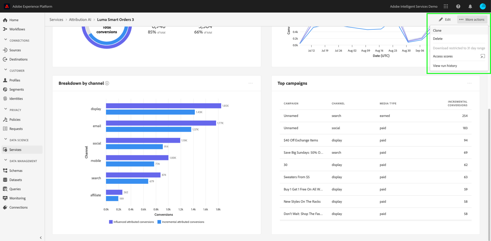

# Inzichten in Attribution AI ontdekken

De instanties van de dienst van de Attribution AI geven inzicht die kunnen worden gebruikt om bij het maken en het meten van marketing besluiten met betrekking tot marketing prestaties en rendement van investering te helpen. Het selecteren van een de dienstinstantie verstrekt visualisaties en filters om u bij het begrijpen van het effect van elke klanteninteractie in elke fase van de klantenreis te helpen.

Dit document fungeert als richtlijn voor het communiceren met de inzichten van serviceversies in de gebruikersinterface van Adobe Intelligent Services.

## Aan de slag

Om inzichten voor Attribution AI te gebruiken, moet u een de dienstinstantie hebben met een succesvolle beschikbare looppasstatus. Om een nieuwe de dienstinstantie tot stand te brengen bezoek de gids [van het](./user-guide.md)gebruikersinterface van de Attribution AI. Als u onlangs een de dienstinstantie creeerde en het nog opleidt en het scoring, gelieve 24 uren voor het te beëindigen loopt.

## Overzicht van inzichten in servicevergaderingen

In the [!DNL Adobe Experience Platform] UI, select **[!UICONTROL Services]** in the left navigation. De browser **[!UICONTROL Services]** wordt weergegeven en geeft de beschikbare Adobe Intelligente services weer. Selecteer **[!UICONTROL Openen]** in de container voor Attribution AI.

De de dienstpagina van de Attribution AI verschijnt. Deze pagina bevat een overzicht van de service-instanties van Attribution AI en informatie over deze instanties, zoals de naam van de instantie, conversiegebeurtenissen, hoe vaak de instantie wordt uitgevoerd en de status van de laatste update. Selecteer de naam van een service-instantie om te beginnen.

>[!NOTE]
>
>Alleen serviceversies die een scoring hebben voltooid, kunnen worden geselecteerd.

Vervolgens wordt de pagina met inzichten voor die service-instantie weergegeven, waarin u een aantal visualisaties en filters hebt om met uw gegevens te werken. De visualisaties en filters worden in deze handleiding gedetailleerder uitgelegd.

### Details van serviceinstantie

Als u aanvullende details voor een service-instantie wilt weergeven, selecteert u **[!UICONTROL Meer]** tonen rechtsboven.

Er wordt een gedetailleerde lijst weergegeven. Raadpleeg de gebruikershandleiding bij de [Attribution AI voor meer informatie over de vermelde eigenschappen](./user-guide.md).

### Een instantie bewerken

Als u een instantie wilt bewerken, selecteert u **[!UICONTROL Bewerken]** in de navigatie rechtsboven.

Het dialoogvenster Bewerken wordt weergegeven. In dit venster kunt u de naam, beschrijving en frequentie van de instantie bewerken. Als de status van de instantie is uitgeschakeld, kan de scorefrequentie niet worden bewerkt. Als u uw wijzigingen wilt bevestigen en het dialoogvenster wilt sluiten, selecteert u **[!UICONTROL Opslaan]** in de rechterbenedenhoek.

### Meer handelingen {#more-actions}

De knop **[!UICONTROL Meer handelingen]** bevindt zich in de navigatie rechtsboven naast **[!UICONTROL Bewerken]**. Als u **[!UICONTROL Meer handelingen]** selecteert, wordt een vervolgkeuzelijst geopend waarin u een van de volgende bewerkingen kunt selecteren:

- **[!UICONTROL Klonen]**: Hiermee wordt de instantie gekloond.
- **[!UICONTROL Verwijderen]**: Hiermee wordt de instantie verwijderd.
- **[!UICONTROL Samenvattingsgegevens]** downloaden: Hiermee downloadt u een CSV-bestand met de overzichtsgegevens.
- **[!UICONTROL Toegangscores]**: Als u **[!UICONTROL Toegangscores]** selecteert, wordt u omgeleid naar de [toegangscores voor de zelfstudie](./download-scores.md)Attribution AI.
- **[!UICONTROL Runtimegeschiedenis]** weergeven: Er wordt een pop-upmenu weergegeven met een lijst van alle scoring-reeksen die aan de service-instantie zijn gekoppeld.

## Gegevens filteren

Met Attribution AI-inzichten kunt u uw gegevens filteren en de gebruikersinterface-visuele elementen automatisch bijwerken op basis van de geselecteerde filters.

### Conversion-gebeurtenis

Wanneer u een nieuwe instantie maakt in Attribution AI, is een van de vereiste velden Conversiegebeurtenissen. Conversiegebeurtenissen zijn bedrijfsdoelstellingen die het effect van marketingactiviteiten, zoals e-commerceorders, aankopen in winkel en websitebezoeken, identificeren.

Vanuit de instantie kunt u met het vervolgkeuzemenu **[!UICONTROL Conversiegebeurtenissen]** een van de gebeurtenissen selecteren die voor de instantie zijn gedefinieerd om uw gegevens te filteren. Als u specifieke gebeurtenissen selecteert, worden de gebruikersinterfacevisualisaties gewijzigd en worden conversies die bij die gebeurtenissen horen alleen gevuld.

### Attributiemodel

Als u **[!UICONTROL Attributiemodel]** selecteert, wordt een vervolgkeuzelijst geopend met alle verschillende beschikbare attributiemodellen. U kunt meerdere modellen selecteren om de resultaten te vergelijken. Voor meer informatie over de verschillende attributiemodellen en hoe zij werken, bezoek het overzicht van de [Attribution AI](./overview.md) dat een lijst met informatie over elk model bevat.

### Regio

>[!NOTE]
>
>Dit filter is slechts aanwezig als u de facultatieve stap op gebied-gebaseerde modellering  in de gebruikersinterfacegids van de Attribution AI toen het creëren van uw de dienstinstantie uitvoerde.

Met dit filter kunt u alle gebieden selecteren die u hebt ingesteld in het proces voor het maken van instanties.

### Filters toevoegen

U kunt extra filters toevoegen door het **filterpictogram** te selecteren om de **[!UICONTROL Add filters]** popover te openen. Met de pop-up Filters **** toevoegen kunt u filteren op Kanaal, Geografie, Mediatype en Product. Alleen de toepasselijke filters voor een service-instantie worden gevuld door de pop-over. Als u bijvoorbeeld geen geografische gegevens of een mediatype hebt opgegeven, zijn deze filterkenmerken niet beschikbaar voor uw instantie.

- **[!UICONTROL Kanaal]:** Als u het kanaalkenmerk selecteert, kunt u elk van de beschikbare marketingkanalen filteren. U kunt meerdere kanalen selecteren om ze te vergelijken.
- **[!UICONTROL Geografie]:** Als u het kenmerk geography selecteert, kunt u landcodes filteren op basis van regionale modellen. Afhankelijk van uw gegevens kan dit filter al dan niet aanwezig zijn. Landcodes zijn twee tekens lang. Zie de volledige lijst met landcodes [hier](https://datahub.io/core/country-list).
- **[!UICONTROL Mediatype]:** Als u het kenmerk van het mediatype selecteert, kunt u elk van de gedefinieerde mediatypen filteren.
- **[!UICONTROL Product]:** Als u het kenmerk product selecteert, kunt u filteren op producten die oorspronkelijk zijn opgenomen in het ontwerp van de instantie.

### Datumbereik

Selecteer het kalenderpictogram om de popover van het datumbereik te openen. De begin- en einddatum van de conversiegebeurtenis bepalen hoeveel gegevens worden ingevuld in de gebruikersinterface. U kunt ervoor kiezen het datumbereik te beperken of uit te breiden om de hoeveelheid gegevens die is ingevuld, scherper te maken of uit te breiden.

## Overzicht van uw gegevens

De **[!UICONTROL kaart van het Overzicht]** toont uw totale omzettingen door attributiemodel. Het totale aantal verandert op basis van hoe specifiek u de zoekopdracht maakt met de filters die eerder in dit document zijn beschreven. Als u meer modellen selecteert, worden extra cirkels aan het overzicht toegevoegd, elk met een eigen kleur die overeenkomt met de legenda.

## Wekelijkse trends

De **[!UICONTROL kaart voor wekelijkse trends]** splitst uw totale conversie in op het datumbereik dat u instelt tijdens het filterproces.

Als u de ovalen rechtsboven op de **weeklendetrends** selecteert, wordt een keuzelijst weergegeven waarmee u dagelijkse, wekelijkse of maandelijkse trends kunt selecteren.

Als u de muis boven de gegevensregel van een specifiek toewijzingsmodel houdt, wordt een pop-up gemaakt met het totale aantal conversies voor die datum.

## Uitsplitsing naar kanaal

De **[!UICONTROL uitsplitsing per kanaal]** wordt gebruikt om het totale aantal omzettingen met betrekking tot elk kanaal te bepalen. Deze kaart kan worden gebruikt om beslissingen te nemen over de doeltreffendheid van elk kanaal en het rendement van investeringen.

Als u de ovalen rechtsboven op de kaart **[!UICONTROL Onderbreken via kanaal]** selecteert, wordt een vervolgkeuzelijst geopend waarin u gegevens kunt vullen op basis van aanraakpunten.

## Beste campagnes

De **[!UICONTROL bovenste campagnerekaart]** geeft een overzicht van uw campagnes en hoe de campagne in elk kanaal presteert. Deze kaart kan u helpen uw team te informeren over de doeltreffendheid van een specifieke campagne voor een bepaald kanaal en kan inzichten verstrekken zoals welke campagnes u verder in zou moeten investeren.

## Uitsplitsing naar positie aanraakpunt

Als u het tabblad **[!UICONTROL Padanalyse]** selecteert, worden de grafieken van de **[!UICONTROL Padanalyse per positie]** van het aanraakpunt en de **[!UICONTROL bovenste conversiepaden]** geladen.

De **[!UICONTROL uitsplitsing naar positie]** van het aanraakpunt is een uitsplitsing van de toegerekende omzettingen naar positie van het aanraakpunt in vergelijking met alle omrekeningspaden. Deze grafiek helpt u begrijpen welke aanraakpunten effectiever zijn in verschillende stadia van het conversiepad. De stadia zijn starter, speler, en dichter.

- **Starter:** Geeft aan dat het aanraakpunt de eerste aanraking in een conversiepad was.
- **Speler:** Geeft aan dat het aanraakpunt niet het eerste of laatste aanraakpunt was dat tot een conversie heeft geleid.
- **Dichter:** Geeft aan dat het aanraakpunt de laatste aanraking vóór een conversie was.

>!![NOTE]
De som van de procentuele bijdrage voor een toewijzingsmodel voor alle aanraakpunten en posities moet gelijk zijn aan 100.

## Bovenste omzetpaden

In de grafiek van de **[!UICONTROL bovenste conversiepaden]** worden de beïnvloede en algoritmische scores weergegeven op de bovenste conversiepaden in de geselecteerde gebieden. In deze grafiek kunt u visualiseren wat aanraakpunten bijdragen aan conversies en wat de attributiescore is voor elk aanraakpunt. U kunt deze informatie gebruiken om de meest frequente paden in een bepaald gebied weer te geven en te zien of er patronen ontstaan tussen de verschillende sets aanraakpunten.

## Efficiëntie van aanraakpunten

Als u het tabblad **[!UICONTROL Aanraakpunteffectiviteit]** selecteert, wordt de **[!UICONTROL Touchpoint-effectiviteitskaart]** geladen. Deze kaart gebruikt de verspreiding van gegevens door Attribution AI om informatie voor elk touchpoint te tonen. De gegevens voor deze tabel worden alleen gegenereerd voor specifieke tijdsperiodes zoals aangegeven door de **[!UICONTROL vanaf]** datum in de rechterbovenhoek van de kaart.

Met de **[!UICONTROL Touchpoint-effectiviteitskaartgegevens]** kunt u begrijpen hoe een aanraakpunt bijdraagt aan een conversie. U kunt ook zien hoe effectief elk aanraakpunt is met de volgende prestatiemetriek:

**Aangeraakt** paden: Deze metrische vertoningen een percentage wegen die of geen omzetting voor touchpoint bereiken. U zult hogere toegeschreven omzettingen zien als de verhouding van wegen (percentage) die omzetting tot wegen bereiken die geen omzetting bereiken hoog is.

**Efficiëntiemaatregel**: Deze metrische vertoningen sterren op een schaal van één tot vijf. De schaal geeft het relatieve belang aan van een aanraakpunt voor het maken van een conversie.

>[!NOTE]
Een hoger aanraakpuntvolume garandeert geen hogere efficiëntiemaatregel.

**Totaal volume**: Het totale aantal keren dat een aanraakpunt is aangeraakt door een gebruiker. Dit zijn inclusief aanraakpunten die worden weergegeven op een pad dat conversie mogelijk maakt, en paden die geen conversie tot gevolg hebben.

## Volgende stappen

Wanneer u de gegevens hebt gefilterd en de juiste gegevens hebt kunnen weergeven, hebt u de mogelijkheid om toegang te krijgen tot de scores. Voor een uitgebreide gids over hoe te om tot uw scores toegang te hebben, bezoek de [toegangsscores in Attribution AI](./download-scores.md) zelfstudie. Bovendien kunt u de samenvattingsgegevens ook downloaden, zoals aangegeven in [meer acties](#more-actions). Als u Samenvattingsgegevens downloaden selecteert, worden de samengevoegde gegevens gedownload op datums.

## Aanvullende bronnen

De volgende video is ontworpen om u te helpen bij het leren hoe u de pagina met Attribution AI-inzichten kunt gebruiken om inzicht te krijgen in het rendement van marketingkanalen en campagnes.

>[!VIDEO](https://video.tv.adobe.com/v/32669?learn=on&quality=12)