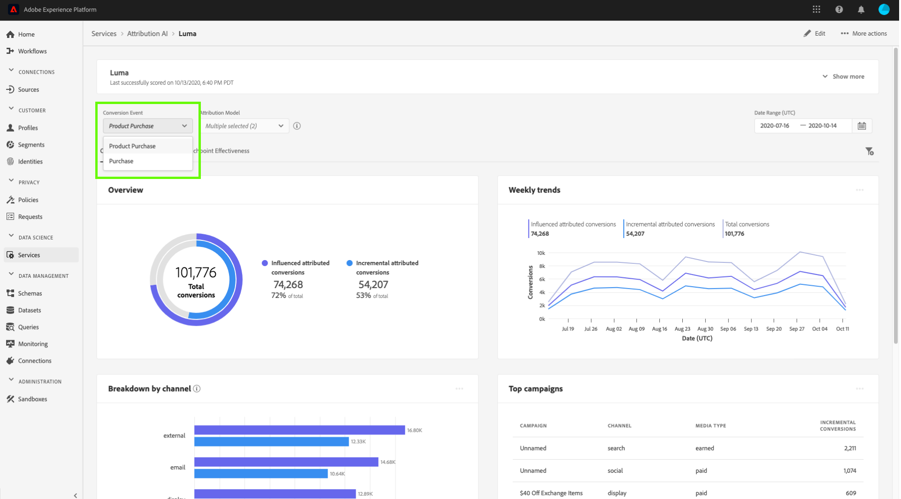

# Inzichten in Attribution AI ontdekken

De instanties van de dienst van de Attribution AI geven inzicht die kunnen worden gebruikt om bij het maken en het meten van marketing besluiten met betrekking tot marketing prestaties en rendement van investering te helpen. Het selecteren van een de dienstinstantie verstrekt visualisaties en filters om u bij het begrijpen van het effect van elke klanteninteractie in elke fase van de klantenreis te helpen.

Dit document fungeert als richtlijn voor het communiceren met de inzichten van serviceversies in de gebruikersinterface van Adobe Intelligent Services.

## Aan de slag

Om inzichten voor Attribution AI te gebruiken, moet u een de dienstinstantie hebben met een succesvolle beschikbare looppasstatus. Om een nieuwe de dienstinstantie tot stand te brengen bezoek de gids [van het](./user-guide.md)gebruikersinterface van de Attribution AI. Als u onlangs een de dienstinstantie creeerde en het nog opleidt en het scoring, gelieve 24 uren voor het te beëindigen loopt.

## Overzicht van inzichten in servicevergaderingen

Klik in de [!DNL Adobe Experience Platform] gebruikersinterface op **Services** in de linkernavigatie. De browser *Services* wordt weergegeven en geeft de beschikbare Adobe Intelligente services weer. Klik in de container voor Attribution AI op **Openen**.

De de dienstpagina van de Attribution AI verschijnt. Deze pagina bevat een overzicht van de service-instanties van Attribution AI en informatie over deze instanties, zoals de naam van de instantie, conversiegebeurtenissen, hoe vaak de instantie wordt uitgevoerd en de status van de laatste update. Klik op de naam van een service-instantie om te beginnen.

>[!NOTE]
>
>Alleen serviceversies die een scoring hebben voltooid, kunnen worden geselecteerd.

Vervolgens wordt de pagina met inzichten voor die service-instantie weergegeven, waarin u een aantal visualisaties en filters hebt om met uw gegevens te werken. De visualisaties en filters worden in deze handleiding gedetailleerder uitgelegd.

### Details van serviceinstantie

Als u meer details voor een service-instantie wilt weergeven, klikt u rechtsboven op Meer **** tonen.

Er wordt een gedetailleerde lijst weergegeven. Raadpleeg de gebruikershandleiding bij de [Attribution AI voor meer informatie over de vermelde eigenschappen](./user-guide.md).

### Een instantie bewerken

Als u een instantie wilt bewerken, klikt u op *Bewerken* in de navigatie rechtsboven.

Het dialoogvenster Bewerken wordt geopend, waarin u de beschrijving en de scores van de instantie kunt bewerken. Klik in de rechterbenedenhoek op *Bewerken* om de wijzigingen te bevestigen en het dialoogvenster te sluiten.

### Meer handelingen {#more-actions}

De knop *Meer handelingen* bevindt zich in de navigatie rechtsboven naast *Bewerken*. Klik op **Meer handelingen** om een vervolgkeuzelijst te openen waarin u een van de volgende bewerkingen kunt selecteren:

- **Verwijderen**: Hiermee wordt de instantie verwijderd.
- **Samenvattingsgegevens** downloaden: Hiermee downloadt u een CSV-bestand met de overzichtsgegevens.
- **Toegangscores**: Als u op *Toegangsscores* klikt, wordt u omgeleid naar de [toegangscores voor de zelfstudie](./download-scores.md)Attribution AI.
- **Runtimegeschiedenis** weergeven: Er wordt een pop-upmenu weergegeven met een lijst van alle scoring-reeksen die aan de service-instantie zijn gekoppeld.

## Gegevens filteren

Met Attribution AI-inzichten kunt u uw gegevens filteren en de gebruikersinterface-visuele elementen automatisch bijwerken op basis van de geselecteerde filters.

>[!NOTE]
>
>Standaard is elk filter ingesteld op Alles, behalve het filter *Attributiemodel* , dat is ingesteld op &quot;Incrementele en Influenced toewijzingsconversies&quot;.

### Conversion-gebeurtenis

Wanneer u een nieuwe instantie maakt in Attribution AI, is een van de vereiste velden Conversiegebeurtenissen. Conversiegebeurtenissen zijn bedrijfsdoelstellingen die het effect van marketing activiteiten, zoals, e-commerceorders, in-store aankopen, en websitebezoeken identificeren.

Vanuit de instantie kunt u met het vervolgkeuzemenu *Conversiegebeurtenissen* een van de gebeurtenissen selecteren die voor de instantie zijn gedefinieerd om uw gegevens te filteren. Als u specifieke gebeurtenissen selecteert, worden de gebruikersinterfacevisualisaties gewijzigd en worden conversies die bij die gebeurtenissen horen alleen gevuld.

### Attributiemodel

Als u op het *kenmerkingsmodel* klikt, wordt een vervolgkeuzelijst geopend met alle verschillende beschikbare attributiemodellen. U kunt meerdere modellen selecteren om de resultaten te vergelijken. Voor meer informatie over de verschillende attributiemodellen en hoe zij werken, bezoek het overzicht van de [Attribution AI](./overview.md) dat een lijst met informatie over elk model bevat.

### Product

Met het filter *Product* kunt u een keuze maken uit alle producten die u aanvankelijk hebt opgenomen in het ontwerp van uw instantie. Klik op het vervolgkeuzemenu en gebruik de zoekfunctie om snel alle producten te selecteren die u wilt vergelijken.

### Geografie

Met het filter *Geografie* worden landcodes gevuld op basis van regionale modellen. Afhankelijk van uw gegevens kan dit filter al dan niet aanwezig zijn.

>[!NOTE]
>
>Landcodes zijn twee tekens lang. Een volledige lijst vindt u hier in [ISO 3166-1 alpha-2](https://datahub.io/core/country-list).

### Regio

>[!NOTE]
>
>Dit filter is slechts aanwezig als u de facultatieve stap op gebied-gebaseerde modellering  in de gebruikersinterfacegids van de Attribution AI toen het creëren van uw de dienstinstantie uitvoerde.

Met dit filter kunt u alle gebieden selecteren die u hebt ingesteld in het proces voor het maken van instanties.

### Kanaal

Klik op het filter *Kanaal* om een vervolgkeuzelijst weer te geven met al uw beschikbare marketingkanalen. U kunt meerdere kanalen selecteren om ze te vergelijken.

### Datumbereik

Klik op het kalenderpictogram om de popover van het datumbereik te openen. De begin- en einddatum van de conversiegebeurtenis bepalen hoeveel gegevens worden ingevuld in de gebruikersinterface. U kunt ervoor kiezen het datumbereik te beperken of uit te breiden om de hoeveelheid gegevens die is ingevuld, scherper te maken of uit te breiden.

## Overzicht van uw gegevens

De *kaart van het Overzicht* toont uw totale omzettingen door attributiemodel. Het totale aantal verandert op basis van hoe specifiek u de zoekopdracht maakt met de filters die eerder in dit document zijn beschreven. Als u meer modellen selecteert, worden extra cirkels aan het overzicht toegevoegd, elk met een eigen kleur die overeenkomt met de legenda.

## Wekelijkse trends

De *kaart voor wekelijkse trends* splitst uw totale conversie in op het datumbereik dat u instelt tijdens het filterproces.

Als u klikt op de ellipsen in de rechterbovenhoek van de *Wekelijkse trends* kaart, wordt een vervolgkeuzelijst weergegeven waarmee u dagelijkse, wekelijkse of maandelijkse trends kunt selecteren.

Als u de muis boven de gegevensregel van een specifiek toewijzingsmodel houdt, wordt een pop-up gemaakt met het totale aantal conversies voor die datum.

## Uitsplitsing naar kanaal

De *uitsplitsing per kanaal* wordt gebruikt om het totale aantal omzettingen met betrekking tot elk kanaal te bepalen. Deze kaart kan worden gebruikt om beslissingen te nemen over de doeltreffendheid van elk kanaal en het rendement van investeringen.

Als u klikt op de ellipsen rechtsboven in de kaart *Onderbreken via kanaal* , wordt een vervolgkeuzelijst geopend waarin u gegevens kunt vullen op basis van aanraakpunten.

## Beste campagnes

De *bovenste campagnerekaart* geeft een overzicht van uw campagnes en hoe de campagne in elk kanaal presteert. Deze kaart kan uw team helpen de doeltreffendheid van een specifieke campagne voor een bepaald kanaal te informeren en inzicht te geven in waar te om verder te investeren.

## Volgende stappen

Wanneer u de gegevens hebt gefilterd en de juiste gegevens hebt kunnen weergeven, hebt u de mogelijkheid om toegang te krijgen tot de scores. Voor een uitgebreide gids over hoe te om tot uw scores toegang te hebben, bezoek de [toegangsscores in Attribution AI](./download-scores.md) zelfstudie. Bovendien kunt u de samenvattingsgegevens ook downloaden, zoals aangegeven in [meer acties](#more-actions). Als u Samenvattingsgegevens downloaden selecteert, worden de samengevoegde gegevens gedownload op datums.

## Aanvullende bronnen

De volgende video is ontworpen om u te helpen bij het leren hoe u de pagina met Attribution AI-inzichten kunt gebruiken om inzicht te krijgen in het rendement van marketingkanalen en campagnes.

>[!VIDEO](https://video.tv.adobe.com/v/32669?learn=on&quality=12)