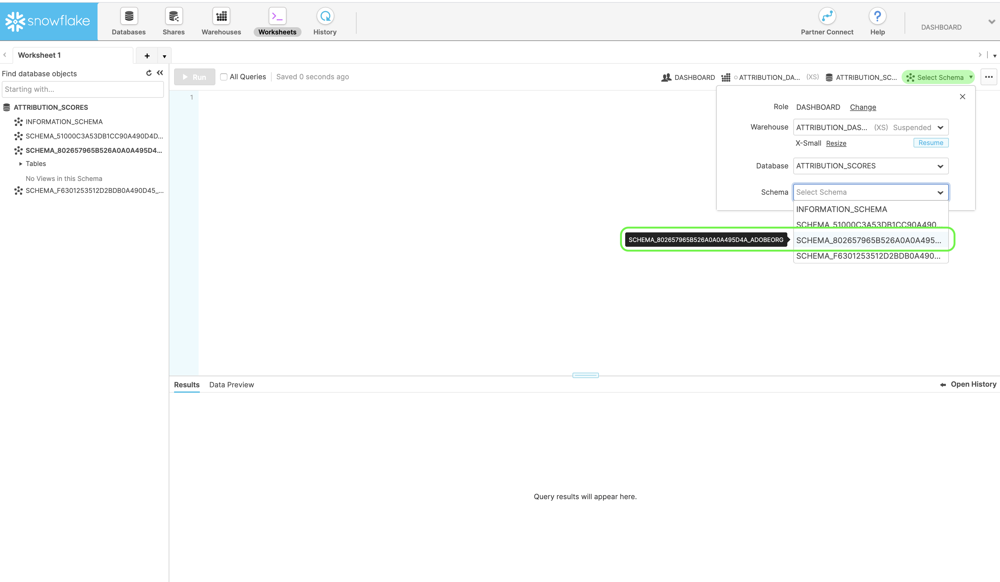

# Muziek downloaden in Attributie AI

Dit document dient als richtlijn voor het downloaden van scores voor Attribution AI.

## Aan de slag

Met kenmerk AI kunt u scores downloaden in de bestandsindeling parket. Deze zelfstudie vereist dat u de sectie Attribution AI-scores in de gids Aan de [slag](./getting-started.md) hebt gelezen en gedownload.

Daarnaast moet u een service-instantie met een geslaagde uitvoeringsstatus hebben om toegang te krijgen tot scores voor Attribution AI. Ga naar de gebruikershandleiding voor [Kenmerken AI om een nieuwe service-instantie te maken](./user-guide.md). Als u onlangs een de dienstinstantie creeerde en het nog opleidt en het scoring, gelieve 24 uren voor het te beëindigen loopt.

## Uw gegevensset-id zoeken {#dataset-id}

Klik in de serviceversie voor Kenmerken AI-inzichten op het vervolgkeuzemenu *Meer handelingen* in de navigatie rechtsboven en selecteer **[!UICONTROL Access scores]**.


Er wordt een nieuw dialoogvenster weergegeven met een koppeling naar de documentatie van downloadscores en de id van de gegevensset voor uw huidige instantie. Kopieer de id van de gegevensset naar het klembord en ga verder met de volgende stap.


## Batch-id ophalen {#retrieve-your-batch-id}

Gebruikend uw dataset identiteitskaart van de vorige stap, moet u een vraag aan de Catalogus API maken om een partijidentiteitskaart terug te winnen. Voor deze API-aanroep worden aanvullende queryparameters gebruikt om de laatste succesvolle batch te retourneren in plaats van een lijst met batches die bij uw organisatie horen. Als u extra batches wilt retourneren, verhoogt u het getal voor de `limit` queryparameter tot de gewenste hoeveelheid die u wilt retourneren. Voor meer informatie over de types van vraagparameters beschikbaar, bezoek de gids bij het [filtreren van de gegevens van de Catalogus gebruikend vraagparameters](../../catalog/api/filter-data.md).

**API-indeling**

```http
GET /batches?&dataSet={DATASET_ID}&createdClient=acp_foundation_push&status=success&orderBy=desc:created&limit=1
```

| Parameter | Beschrijving |
| --------- | ----------- |
| `{DATASET_ID}` | De dataset-id beschikbaar in het dialoogvenster &quot;Toegangsscores&quot;. |

**Verzoek**

```shell
curl -X GET 'https://platform.adobe.io/data/foundation/catalog/batches?&dataSet=5e8f81ce7a4ecb18a8d25b22&createdClient=acp_foundation_push&status=success&orderBy=desc:created&limit=1' \
  -H 'Authorization: Bearer {ACCESS_TOKEN}' \
  -H 'x-api-key: {API_KEY}' \
  -H 'x-gw-ims-org-id: {IMS_ORG}' \
  -H 'x-sandbox-name: {SANDBOX_NAME}'
```

**Antwoord**

Een geslaagde reactie retourneert een lading die een batch-id-object bevat. In dit voorbeeld is de waarde Key voor het geretourneerde object de batch-id `01E5QSWCAASFQ054FNBKYV6TIQ`. Kopieer de batch-id die u wilt gebruiken in de volgende API-aanroep.

>[!NOTE]
> In de volgende reactie is het `tags` object gereed voor leesbaarheid.

```json
{
    "01E5QSWCAASFQ054FNBKYV6TIQ": {
        "status": "success",
        "tags": {
            "Tags": [ ... ],
        },
        "relatedObjects": [
            {
                "type": "dataSet",
                "id": "5e8f81cf7a4ecb28a8d85b22"
            }
        ],
        "id": "01E5QSWCAASFQ054FNBKYV6TIQ",
        "externalId": "01E5QSWCAASFQ054FNBKYV6TIQ",
        "replay": {
            "predecessors": [
                "01E5N7EDQQP4JHJ93M7C3WM5SP"
            ],
            "reason": "Replacing for 2020-04-09",
            "predecessorListingType": "IMMEDIATE"
        },
        "inputFormat": {
            "format": "parquet"
        },
        "imsOrg": "412657965Y566A4A0A495D4A@AdobeOrg",
        "started": 1586715571808,
        "metrics": {
            "partitionCount": 1,
            "outputByteSize": 2380339,
            "inputFileCount": -1,
            "inputByteSize": 2381007,
            "outputRecordCount": 24340,
            "outputFileCount": 1,
            "inputRecordCount": 24340
        },
        "completed": 1586715582735,
        "created": 1586715571217,
        "createdClient": "acp_foundation_push",
        "createdUser": "sensei_exp_attributionai@AdobeID",
        "updatedUser": "acp_foundation_dataTracker@AdobeID",
        "updated": 1586715583582,
        "version": "1.0.5"
    }
}
```

## De volgende API-aanroep ophalen met uw batch-id {#retrieve-the-next-api-call-with-your-batch-id}

Als je eenmaal een batch-id hebt, kun je een nieuwe GET aanvraag indienen bij `/batches`. De aanvraag retourneert een koppeling die wordt gebruikt als de volgende API-aanvraag.

**API-indeling**

```http
GET batches/{BATCH_ID}/files
```

| Parameter | Beschrijving |
| --------- | ----------- |
| `{BATCH_ID}` | De batch-id die in de vorige stap is opgehaald, [haalt uw batch-id](#retrieve-your-batch-id)op. |

**Verzoek**

Voer de volgende aanvraag uit met uw eigen batch-id.

```shell
curl -X GET 'https://platform.adobe.io/data/foundation/export/batches/01E5QSWCAASFQ054FNBKYV6TIQ/files' \
  -H 'Authorization: Bearer {ACCESS_TOKEN}' \
  -H 'x-api-key: {API_KEY}' \
  -H 'x-gw-ims-org-id: {IMS_ORG}' \
  -H 'x-sandbox-name: {SANDBOX_NAME}'
```

**Antwoord**

Een geslaagde reactie retourneert een lading die een `_links` object bevat. Binnen het `_links` object bevindt zich een element `href` met een nieuwe API-aanroep als waarde. Kopieer deze waarde om door te gaan naar de volgende stap.

```json
{
    "data": [
        {
            "dataSetFileId": "01E5QSWCAASFQ054FNBKYV6TIQ-1",
            "dataSetViewId": "5e8f81cf7a4ecb28a8d85b22",
            "version": "1.0.0",
            "created": "1586715582571",
            "updated": "1586715582571",
            "isValid": false,
            "_links": {
                "self": {
                    "href": "https://platform.adobe.io:443/data/foundation/export/files/01E5QSWCXXYFQ054FNBKYV2BAQ-1"
                }
            }
        }
    ],
    "_page": {
        "limit": 100,
        "count": 1
    }
}
```

## Bestanden ophalen {#retrieving-your-files}

Gebruikend de `href` waarde u in de vorige stap als API vraag kreeg, doe een nieuw GET verzoek om uw dossierfolder terug te winnen.

**API-indeling**

```http
GET files/{DATASETFILE_ID}
```

| Parameter | Beschrijving |
| --------- | ----------- |
| `{DATASETFILE_ID}` | De id dataSetFile wordt geretourneerd in de `href` waarde van de [vorige stap](#retrieve-the-next-api-call-with-your-batch-id). Het is ook toegankelijk in de `data` array onder het objecttype `dataSetFileId`. |

**Verzoek**

```shell
curl -X GET 'https://platform.adobe.io/data/foundation/export/files/01E5QSWCAASFQ054FNBKYV6TIQ-1' \
  -H 'Authorization: Bearer {ACCESS_TOKEN}' \
  -H 'x-api-key: {API_KEY}' \
  -H 'x-gw-ims-org-id: {IMS_ORG}' \
  -H 'x-sandbox-name: {SANDBOX_NAME}'
```

**Antwoord**

De reactie bevat een gegevensarray die één item kan hebben, of een lijst met bestanden die tot die map behoren. Het onderstaande voorbeeld bevat een lijst met bestanden en is gecondenseerd voor leesbaarheid. In dit scenario moet u de URL van elk bestand volgen om toegang te krijgen tot het bestand.

```json
{
    "data": [
        {
            "name": "part-00000-tid-5614147572541837832-908bd66a-d856-47fe-b7da-c8e7d22a4097-1370467-1.c000.snappy.parquet",
            "length": "2380211",
            "_links": {
                "self": {
                    "href": "https://platform.adobe.io:443/data/foundation/export/files/01E5QSWCXXYFQ054FNBKYV2BAQ-1?path=part-00000-trd-5714147572541837832-938bd66a-d556-41fe-b7da-c8e7d22a4097-1320467-1.c000.snappy.parquet"
                }
            }
        }
    ],
    "_page": {
        "limit": 100,
        "count": 1
    }
}
```

| Parameter | Beschrijving |
| --------- | ----------- |
| `_links.self.href` | De GET aanvraag-URL waarmee een bestand in uw map wordt gedownload. |


Kopieer de `href` waarde voor elk bestandsobject in de `data` array en ga vervolgens verder met de volgende stap.

## Bestandsgegevens downloaden

Als u uw bestandsgegevens wilt downloaden, vraagt u GET de `"href"` waarde aan die u hebt gekopieerd in de vorige stap [bij het ophalen van uw bestanden](#retrieving-your-files).

>[!NOTE] Als u dit verzoek direct in bevellijn doet, zou u kunnen worden ertoe aangezet om een output na uw verzoekkopballen toe te voegen. Het volgende aanvraagvoorbeeld gebruikt `--output {FILENAME.FILETYPE}`.

**API-indeling**

```http
GET files/{DATASETFILE_ID}?path={FILE_NAME}
```

| Parameter | Beschrijving |
| --------- | ----------- |
| `{DATASETFILE_ID}` | De id dataSetFile wordt geretourneerd in de `href` waarde van een [vorige stap](#retrieve-the-next-api-call-with-your-batch-id). |
| `{FILE_NAME}` | De naam van het bestand. |

**Verzoek**

```shell
curl -X GET 'https://platform.adobe.io:443/data/foundation/export/files/01E5QSWCXXYFQ054FNBKYV2BAQ-1?path=part-00000-trd-5714147572541837832-938bd66a-d556-41fe-b7da-c8e7d22a4097-1320467-1.c000.snappy.parquet' \
  -H 'Authorization: Bearer {ACCESS_TOKEN}' \
  -H 'x-api-key: {API_KEY}' \
  -H 'x-gw-ims-org-id: {IMS_ORG}' \
  -H 'x-sandbox-name: {SANDBOX_NAME}' \
  -O 'file.parquet'
```

>[!TIP] Zorg ervoor dat u zich in de juiste map of map bevindt waarnaar u het bestand wilt opslaan voordat u de aanvraag GET uitvoert.

**Antwoord**

Het antwoord downloadt het bestand dat u in de huidige map hebt aangevraagd. In dit voorbeeld is de bestandsnaam &quot;file.parquet&quot;.


## Volgende stappen

In dit document worden de stappen beschreven die zijn vereist voor het downloaden van Attribution AI-scores. U kunt nu door de andere [Intelligente Diensten](../home.md) en gidsen blijven bladeren die worden aangeboden.

## Muziek openen met Snowflake

>[!IMPORTANT] Neem contact op met attributionai-support@adobe.com voor meer informatie over het gebruik van scores met SnowFlake.

U hebt toegang tot de geaggregeerde AI-scores voor kenmerken via Snowflake. U moet momenteel een e-mail sturen naar de ondersteuning van Adobe op attributionai-support@adobe.com om de aanmeldingsgegevens voor Snowflake in te stellen en deze naar uw lezeraccount te ontvangen.

Nadat uw verzoek door Adobe-ondersteuning is verwerkt, ontvangt u een URL voor het lezeraccount voor Snowflake en de bijbehorende referenties hieronder:

- Sneeuwvlok-URL
- Gebruikersnaam
- Wachtwoord

>[!NOTE] De lezeraccount is bedoeld voor het opvragen van gegevens met SQL-clients, werkbladen en BI-oplossingen die JDBC-connector ondersteunen.

Zodra u uw geloofsbrieven en URL hebt, kunt u de modellijsten vragen, die door touchpoint datum, of omzettingsdatum worden bijeengevoegd.

### Schema zoeken in Snowflake

Meld u aan bij Snowflake met de opgegeven referenties. Klik op het tabblad **Werkbladen** in de hoofdnavigatie linksboven en navigeer naar de databasemap in het linkerdeelvenster.


Klik vervolgens op Schema **** selecteren in de rechterbovenhoek van het scherm. Bevestig in de pop-up die wordt weergegeven dat u de juiste database hebt geselecteerd. Klik vervolgens op het vervolgkeuzemenu *Schema* en selecteer een van de weergegeven schema&#39;s. U kunt rechtstreeks zoeken vanuit de scoretabellen die onder het geselecteerde schema staan.



## PowerBI aansluiten op sneeuwvlok (optioneel)

Uw Sneeuwvloke-referenties kunnen worden gebruikt om een verbinding tot stand te brengen tussen PowerBI Desktop- en Snowflake-databases.

Typ eerst in het vak *Server* onder Sneeuwvlok-URL. Vervolgens typt u onder *Winkel*&quot;XSMALL&quot;. Typ vervolgens uw gebruikersnaam en wachtwoord.


Nadat de verbinding tot stand is gebracht, selecteert u de Snowflake-database en selecteert u het gewenste schema. U kunt nu alle tabellen laden.
