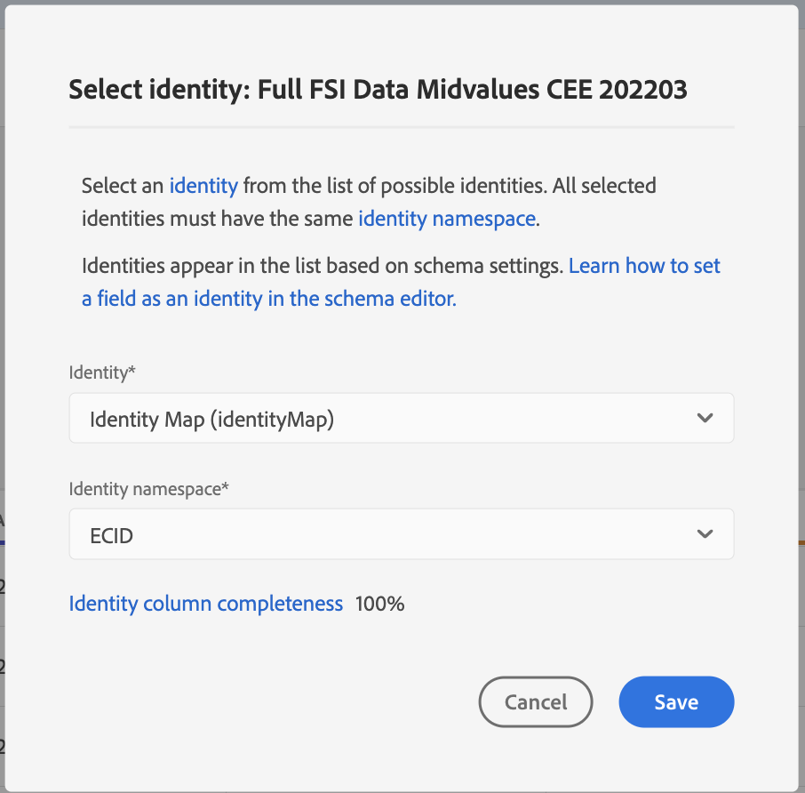

# Handleiding voor AI-gebruikersinterface voor kenmerken

Attribution AI, als onderdeel van Intelligent Services is een meerkanaals, algoritmische attributiedienst die de invloed en incrementele impact van klanteninteractie tegen gespecificeerde resultaten berekent. Met Attribution AI kunnen marketers marketing- en advertentieuitgaven meten en optimaliseren door inzicht te krijgen in de impact van elke afzonderlijke interactie van de klant in elke fase van de reizen van de klant.

Dit document fungeert als richtlijn voor interactie met Attribution AI in de Intelligent Services-gebruikersinterface.

## Een model maken

Selecteer in de gebruikersinterface van [!DNL Adobe Experience Platform] de optie **[!UICONTROL Services]** in de linkernavigatie. De browser **[!UICONTROL Services]** wordt weergegeven en geeft beschikbare intelligente Adobe-services weer. Selecteer **[!UICONTROL Open]** in de container for Attribution AI.

De pagina van de dienst van AI van de Attributie verschijnt. Deze pagina bevat servicemodellen van Attribution AI en geeft informatie over deze modellen, zoals de naam van het model, conversiegebeurtenissen, hoe vaak het model wordt uitgevoerd en de status van de laatste update.

U kunt de metrische waarde van **[!UICONTROL Total conversion events scored]** in de bodem-juiste kant van de **[!UICONTROL Create model]** container vinden. Deze metrische waarde houdt het totale aantal omzettingsgebeurtenissen bij die door Attribution AI voor het huidige kalenderjaar met inbegrip van alle zandbakmilieu&#39;s en om het even welke geschrapte de dienstmodellen worden gescoord.

De modellen van de dienst kunnen worden uitgegeven, worden gekloond, en worden geschrapt door de controles op de rechterkant van UI te gebruiken. Selecteer een model in uw bestaande **[!UICONTROL Service models]** om deze besturingselementen weer te geven. De besturingselementen bevatten de volgende informatie:

- **[!UICONTROL Edit]**: als u **[!UICONTROL Edit]** selecteert, kunt u een bestaand servicemodel wijzigen. U kunt de naam, de beschrijving, de status, het scoren frequentie van het model, en de extra kolommen van de scoredataset uitgeven.
- **[!UICONTROL Clone]**: als u **[!UICONTROL Clone]** selecteert, wordt het geselecteerde servicemodel gekopieerd. Vervolgens kunt u de workflow wijzigen om kleine wijzigingen aan te brengen en de naam ervan wijzigen in een nieuw model.
- **[!UICONTROL Delete]**: U kunt een servicemodel verwijderen, inclusief alle historische regels. De corresponderende uitvoergegevensset wordt uit Experience Platform verwijderd. De scores die zijn gesynchroniseerd met Real-Time Klantprofiel worden echter niet verwijderd.
- **[!UICONTROL Data source]**: Een koppeling naar de gegevensset die wordt gebruikt. Als meer dan één dataset door Attribution AI wordt gebruikt, &quot;Veelvoud&quot;die door het aantal datasets wordt gevolgd wordt getoond. Als u de hyperlink selecteert, wordt de voorvertoning van de datasets weergegeven.
- **[!UICONTROL Last run details]**: dit wordt alleen weergegeven wanneer een uitvoering mislukt. Hier wordt informatie weergegeven over waarom de uitvoering is mislukt, zoals foutcodes.

- **[!UICONTROL Conversion events]**: een kort overzicht van de conversiegebeurtenissen die voor dit model zijn geconfigureerd.
- **[!UICONTROL Lookback window]**: Het tijdkader dat u hebt gedefinieerd om aan te geven hoeveel dagen vóór de aanraakpunten voor conversiegebeurtenissen worden opgenomen.
- **[!UICONTROL Touchpoints]**: Een lijst met alle aanraakpunten die u tijdens het maken van dit model hebt gedefinieerd.

Selecteer **[!UICONTROL Create model]** om te beginnen.

Vervolgens wordt de instellingspagina voor Kenmerken AI weergegeven waar u een naam en een optionele beschrijving voor uw servicemodel kunt opgeven.

## Gegevens selecteren {#select-data}

<!-- https://www.adobe.com/go/aai-select-data -->

Door ontwerp, kan de AI van de Attributie Adobe Analytics, de gebeurtenis van de Ervaring, en de gegevens van de Gebeurtenis van de Consumentenervaring gebruiken om attributiescore te berekenen. Als u een gegevensset selecteert, worden alleen de gegevenssets weergegeven die compatibel zijn met Kenmerk AI. Om een dataset te selecteren, selecteer (**+**) symbool naast de datasetnaam of checkbox selecteren om veelvoudige datasets meteen toe te voegen. U kunt de onderzoeksoptie ook gebruiken om de datasets snel te vinden u in geinteresseerd bent.

Nadat u de gegevenssets hebt geselecteerd die u wilt gebruiken, selecteert u de knop **[!UICONTROL Add]** om de gegevenssets toe te voegen aan het voorbeeldvenster van de gegevensset.

Het selecteren van het infopictogram  naast een dataset opent de datasetvoorproefpopover.

De voorproef van de dataset bevat gegevens zoals de laatste updatetijd, bronschema, en een voorproef van de eerste tien kolommen.

Selecteer **[!UICONTROL Save]** om uw concepten op te slaan terwijl u de workflow beweegt. U kunt ook conceptmodelconfiguraties opslaan en naar de volgende stap in de workflow gaan. Gebruik **[!UICONTROL Save and continue]** om concepten te maken en op te slaan tijdens modelconfiguraties. De eigenschap laat u toe om concepten van de modelconfiguratie tot stand te brengen en te bewaren en is bijzonder nuttig wanneer u vele gebieden in het configuratiewerkschema moet bepalen.

### Volledige gegevensset {#dataset-completeness}

<!-- https://www.adobe.com/go/aai-dataset-completeness -->

In de voorproef van de dataset is een het percentagewaarde van de volledigheid van de dataset. Deze waarde verstrekt een snelle momentopname van hoeveel kolommen in uw dataset leeg/ongeldig zijn. Als een dataset veel ontbrekende waarden bevat en deze waarden elders worden vastgelegd, wordt u ten zeerste aangeraden de dataset met de ontbrekende waarden op te nemen.

>[!NOTE]
>
>De volledigheid van de gegevensset wordt berekend gebruikend het maximum trainingsvenster voor Attribution AI (één jaar). Dit betekent dat gegevens die meer dan een jaar oud zijn niet in aanmerking worden genomen bij het weergeven van de volledigheidswaarde van de gegevensset.

### Een identiteit selecteren {#identity}

U kunt zich nu bij veelvoudige datasets aan elkaar aansluiten die op de identiteitskaart (gebied) worden gebaseerd. U moet een identiteitstype (ook wel een naamruimte genoemd) en een identiteitswaarde binnen die naamruimte selecteren. Als u meerdere velden als een identiteit hebt toegewezen binnen uw schema onder dezelfde naamruimte, worden alle toegewezen identiteitswaarden weergegeven in het keuzemenu voor identiteit, dat wordt voorafgegaan door de naamruimte `EMAIL (personalEmail.address)` of `EMAIL (workEmail.address)` .

>[!IMPORTANT]
>
>Het zelfde identiteitstype (namespace) moet voor elke dataset worden gebruikt u selecteert. Een groen vinkje verschijnt naast het identiteitstype binnen de identiteitskolom erop wijst dat datasets compatibel zijn. Wanneer u bijvoorbeeld de naamruimte Telefoon en `mobilePhone.number` als id gebruikt, moeten alle id&#39;s voor de resterende datasets de naamruimte Telefoon bevatten en gebruiken.

Als u een identiteit wilt selecteren, selecteert u de onderstreepte waarde in de kolom Identiteit. De keuzelijst Selecteer een identiteit wordt weergegeven.

Als er meer dan één identiteit beschikbaar is binnen een naamruimte, selecteert u het juiste identiteitsveld voor uw gebruik. Er zijn bijvoorbeeld twee e-mailidentiteiten beschikbaar binnen de naamruimte van de e-mail, een werk en persoonlijke e-mail. Afhankelijk van het gebruiksgeval, zal een persoonlijke e-mail eerder worden ingevuld en nuttiger in individuele voorspellingen zijn. Dit betekent dat u `EMAIL (personalEmail.address)` selecteert als uw identiteit.

>[!NOTE]
>
> Als geen geldig identiteitstype (namespace) voor een dataset bestaat, moet u een primaire identiteit plaatsen en het toewijzen aan een identiteit namespace gebruikend de [&#x200B; schemaredacteur &#x200B;](../../xdm/schema/composition.md#identity). Meer over namespaces en identiteiten leren, bezoek de [&#x200B; namespaces van de Dienst van de Identiteit &#x200B;](../../identity-service/features/namespaces.md) documentatie.

## Media-kanaal en campagnevelden toewijzen {#aai-mapping}

<!-- https://www.adobe.com/go/aai-mapping -->

Nadat u het selecteren en het toevoegen van datasets hebt gebeëindigd, verschijnt de **de configuratiestappen van de Kaart**. Kenmerk AI vereist dat u het het kanaalgebied van Media voor elke dataset in kaart brengt u in de vorige stap selecteerde. Dit is omdat zonder de het kanaalafbeelding van Media tussen datasets, kunnen de inzichten die uit Attributie AI worden afgeleid niet behoorlijk tonen makend de inzichten pagina moeilijk te interpreteren maken. Hoewel alleen het Media-kanaal vereist is, wordt u ten zeerste aangeraden een aantal optionele velden zoals Media-actie, Campagnenaam, Campagnegroep en Campagne-tag toe te wijzen. Hierdoor biedt Attribution AI duidelijkere inzichten en optimale resultaten.

## Gebeurtenissen definiëren {#define-events}

<!-- https://www.adobe.com/go/aai-define-events -->

Er zijn drie verschillende typen invoergegevens die worden gebruikt voor het definiëren van gebeurtenissen:

- **de gebeurtenissen van de Omzetting:** Bedrijfs doelstellingen die het effect van marketing activiteiten, zoals, e-commerceorden, in-store aankopen, en websitebezoeken identificeren.
- **venster van de Lookback:** verstrekt een tijdkader erop wijst dat hoeveel dagen voorafgaand aan de omzettingsgebeurtenis touchpoints zouden moeten worden omvat.
- **Touchpoints:** ontvanger, individu, en of op koekjesniveau marketing gebeurtenissen die worden gebruikt om het numerieke of op opbrengst-gebaseerde effect van omzettingen te evalueren.

### Conversiegebeurtenissen definiëren {#define-conversion-events}

Om een omzettingsgebeurtenis te bepalen, moet u de gebeurtenis een naam geven en het gebeurtenistype selecteren door de dataset en het gebied van **te selecteren selecteer een dataset en gebied** dropdown menu.

Zodra een gebeurtenis wordt geselecteerd, verschijnt een nieuw drop-down aan zijn recht. Het tweede vervolgkeuzemenu wordt gebruikt om verdere context aan uw gebeurtenis door het gebruik van verrichtingen te verstrekken. Voor deze omzettingsgebeurtenis, bestaat de standaardverrichting ** wordt gebruikt.

>[!NOTE]
>
>Een koord onder uw *omzetnaam* wordt bijgewerkt aangezien u uw gebeurtenis bepaalt.

Daarna, kunt u een gecombineerde dataset selecteren die door alle inputdatasets in de vorige stap te combineren wordt geproduceerd. Alternatief, kunt u een kolom selecteren die op individuele datasets van **wordt gebaseerd een dataset en gebied** dropdown menu selecteren.

Met de knoppen **[!UICONTROL Add event]** en **[!UICONTROL Add Group]** kunt u de conversie verder definiëren. Afhankelijk van de conversie die u definieert, moet u mogelijk de knoppen **[!UICONTROL Add event]** en **[!UICONTROL Add group]** gebruiken voor verdere context.

 toe

Als u **[!UICONTROL Add event]** selecteert, worden aanvullende velden gemaakt die met dezelfde methode kunnen worden gevuld als hierboven beschreven. Hiermee voegt u een AND-instructie toe aan de tekenreeksdefinitie onder de conversienaam. Selecteer **x** om een gebeurtenis te verwijderen die is toegevoegd.

 toe

Als u **[!UICONTROL Add Group]** selecteert, kunt u extra velden maken die los staan van het origineel. Met de toevoeging van groepen, verschijnt een blauwe *en* knoop. Het selecteren **en** geeft een optie om de parameter te veranderen om &quot;of&quot;te bevatten. &quot;Of&quot; wordt gebruikt om meerdere succesvolle conversiepaden te definiëren. &quot;En&quot; breidt het conversiepad uit om aanvullende voorwaarden op te nemen.

Als u meer dan één omzetting vereist, uitgezochte **voegt omzetting** toe om een nieuwe omzettingstekaart tot stand te brengen. U kunt het bovenstaande proces herhalen om meerdere conversies te definiëren.

 toe

### Opzoekvenster definiëren {#lookback-window}

Nadat u de conversie hebt gedefinieerd, moet u het terugzoekvenster bevestigen. Geef met de pijltoetsen of door de standaardwaarde (56) te selecteren op hoeveel dagen vóór de conversiegebeurtenis u aanraakpunten wilt opnemen. Aanraakpunten worden gedefinieerd in de volgende stap.

### Aanraakpunten definiëren

Het bepalen van touchpoints volgt een gelijkaardige werkschema aan [&#x200B; bepalend omzettingen &#x200B;](#define-conversion-events). Aanvankelijk moet u uw touchpoint noemen en een touchpoint waarde van *selecteren gaat het drop-down menu van de Naam van het Gebied* binnen. Als deze optie is geselecteerd, wordt het vervolgkeuzemenu met de standaardwaarde &quot;exists&quot; weergegeven. Selecteer de vervolgkeuzelijst om een lijst met operatoren weer te geven.

Voor dit aanraakpunt, selecteert **evenaart**.

Zodra een exploitant voor een touchpoint wordt geselecteerd, *gaat de Waarde van het Gebied* ter beschikking wordt gesteld. De dropdown waarden voor *gaan de Waarde van het Gebied* bevolken die op de exploitant en touchpoint waarde wordt gebaseerd u eerder selecteerde. Als een waarde niet in de vervolgkeuzelijst wordt gevuld, kunt u die waarde handmatig invoeren. Selecteer dropdown en selecteer **KLIK**.

>[!NOTE]
>
>Aan de operatoren &quot;bestaat&quot; en &quot;niet bestaat&quot; zijn geen veldwaarden gekoppeld.

**voegt gebeurtenis** toe en **voegt de knopen van de Groep** toe worden gebruikt om uw touchpoint verder te bepalen. Vanwege de complexe aard van de omringende aanraakpunten is het niet ongebruikelijk om voor één aanraakpunt meerdere gebeurtenissen en groepen te hebben.

Wanneer geselecteerd, **voegt gebeurtenis** toe staat voor extra gebieden toe om worden toegevoegd. Selecteer **x** om een gebeurtenis te verwijderen die is toegevoegd.

 toe

Het selecteren **voegt groep** toe geeft u de optie om extra gebieden los van origineel tot stand te brengen. Met de toevoeging van groepen, verschijnt een blauwe *en* knoop. Selecteer **en** om de parameter te veranderen, wordt de nieuwe parameter &quot;of&quot;gebruikt om veelvoudige succesvolle wegen te bepalen. Dit specifieke aanraakpunt heeft slechts één succesvol pad, dus &quot;Of&quot; is niet nodig.

>[!NOTE]
>
>Gebruik het koord onder *Naam van het Aanraakpunt* voor een snel overzicht van uw aanraakpunt. De tekenreeks komt overeen met de naam van het aanraakpunt.

U kunt extra touchpoints toevoegen door **te selecteren voeg toe touchpoint** en herhalend het proces hierboven.

Zodra u klaar bent met het bepalen van alle noodzakelijke aanraakpunten, scrol omhoog en selecteer **daarna** in de hoger-juiste hoek om aan de definitieve stap te werk te gaan.

## Geavanceerde instellingen voor training en scores

De laatste pagina in Attribution AI is de **[!UICONTROL Advanced]** -pagina die wordt gebruikt voor het instellen van training en scoring.

### Training plannen

Gebruikend het *Programma*, kunt u een dag en een tijd van de week selecteren u het scoren wilt plaatsvinden.

Selecteer dropdown onder *het Schetsen Frequentie* tussen dagelijks, wekelijks, en maandelijks het scoren te selecteren. Selecteer vervolgens de dagen van de week waarop u de scoring wilt toepassen. U kunt meerdere dagen selecteren. Als u dezelfde dag opnieuw selecteert, wordt de selectie opgeheven.

Selecteer het klokpictogram om de tijd van de dag te wijzigen waarop u wilt scoren. Voer in de nieuwe overlay die wordt weergegeven de tijd in van de dag die u wilt scoren. Selecteer buiten de bedekking om deze te sluiten.

>[!NOTE]
>
>Het kan tot 24 uur duren voor elk scoringsproces wordt voltooid.

### Aanvullende kolommen met scoregegevens (optioneel)

Door gebrek, wordt een score dataset gecreeerd voor elk de dienstmodel in een standaardschema. U kunt desgewenst extra kolommen toevoegen op basis van uw Conversion-gebeurtenis en aanraakpuntconfiguraties aan de uitvoer van de scoredataset. Begin door kolommen te selecteren uit uw inputdataset, kunt u hen dan slepen en laten vallen om de orde te veranderen door de linkermuisknoop over het hamburgerpictogram te onderdrukken.

### Regionaal modelleren (optioneel) {#region-based-modeling-optional}

Het gedrag van uw klanten kan per land en geografische regio aanzienlijk verschillen. Voor globale ondernemingen, die op land-gebaseerde of op regio-gebaseerde modellen gebruiken kan attributienauwkeurigheid verhogen. Elk toegevoegd gebied leidt tot een nieuw model met de gegevens van dat gebied.

Als u een nieuw gebied wilt definiëren, selecteert u eerst **[!UICONTROL Add region]** . Geef in de container die wordt weergegeven een naam voor het gebied op. Slechts één waarde (&quot;placeContext.geo.countryCode&quot;) wordt gevuld vanuit het vervolgkeuzemenu **[!UICONTROL Enter Field Name]** . Selecteer deze waarde.

Selecteer vervolgens een operator.

Typ ten slotte de landcode in de vervolgkeuzelijst **[!UICONTROL Enter Field Value]** .

>[!NOTE]
>
>Landcodes zijn twee tekens lang. Een volledige lijst kan hier [&#x200B; worden gevonden ISO 3166-1 alpha-2 &#x200B;](https://datahub.io/core/country-list).

### Trainingsvenster {#training-window}

Om ervoor te zorgen dat u het meest nauwkeurige model mogelijk krijgt, is het belangrijk om uw model te trainen met historische gegevens die uw zaken vertegenwoordigen. Standaard wordt het model getraind met twee kwartalen (zes maanden) aan conversiegebeurtenisgegevens. Selecteer het vervolgkeuzemenu om de standaardinstelling te wijzigen. U kunt kiezen om met één tot vier kwart van gegevens (3-12 maanden) te trainen.

>[!NOTE]
>
>Een korter trainingsvenster is gevoeliger voor recente trends, terwijl een langer trainingsvenster een robuuster model creëert en minder gevoelig is voor recente trends.

Nadat u het trainingsvenster hebt geselecteerd, selecteert u **[!UICONTROL Finish]** in de rechterbovenhoek. Zorg ervoor dat de gegevens enige tijd duren. Na voltooiing, lijkt een popover dialoog bevestigend dat de instantie opstelling volledig is. Selecteer **[!UICONTROL Ok]** om te worden omgeleid naar de **[!UICONTROL Service instances]** -pagina waar u de serviceversie kunt zien.

## Volgende stappen

Aan de hand van deze zelfstudie hebt u een service-instantie gemaakt in Attribution AI. Zodra de instantie gebeëindigd het scoren (sta tot 24 uren toe), bent u bereid om de Inzichten van AI van de Attributie [&#128279;](./discover-insights.md) te ontdekken.  Bovendien, als u wenst om uw het sorteren resultaten te downloaden, bezoek de [&#x200B; downloadende scores &#x200B;](./download-scores.md) documentatie.

## Aanvullende bronnen

In de volgende video wordt een end-to-end workflow beschreven voor het maken van een nieuwe instantie in Attribution AI.

>[!VIDEO](https://video.tv.adobe.com/v/32668?learn=on&quality=12)
