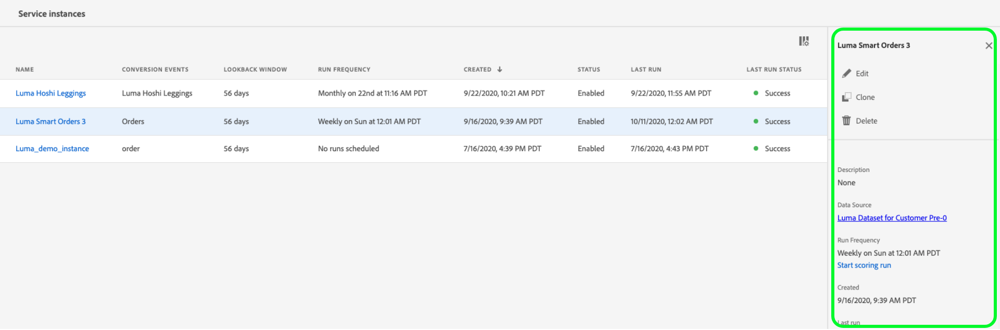

# Handleiding Attribution AI UI

Attribution AI, als onderdeel van Intelligente Diensten is een multi-channel, algoritmische attributiedienst die de invloed en de stijgende invloed van klanteninteractie tegen gespecificeerde resultaten berekent. Met Attribution AI kunnen marketeers marketing- en advertentieuitgaven meten en optimaliseren door inzicht te krijgen in de impact van elke individuele interactie van de klant in elke fase van de reis van de klant.

Dit document fungeert als richtlijn voor interactie met Attribution AI in de gebruikersinterface Intelligente services.

## Een instantie maken

Klik in de gebruikersinterface [!DNL Adobe Experience Platform] op **[!UICONTROL Services]** in de linkernavigatie. De browser **[!UICONTROL Services]** wordt weergegeven en geeft beschikbare intelligente Adobe-services weer. Klik in de container voor Attribution AI op **[!UICONTROL Open]**.

De de dienstpagina van de Attribution AI verschijnt. Deze pagina bevat een overzicht van de service-instanties van Attribution AI en informatie over deze instanties, zoals de naam van de instantie, conversiegebeurtenissen, hoe vaak de instantie wordt uitgevoerd en de status van de laatste update.

U kunt **[!UICONTROL Total conversion events scored]** metrisch vinden in de bodem-juiste kant van de **[!UICONTROL Create instance]** container wordt gevestigd die. Deze metrisch spoor het totale aantal omzettingsgebeurtenissen door Attribution AI voor het huidige kalenderjaar met inbegrip van alle zandbakmilieu&#39;s en om het even welke geschrapte de dienstinstanties worden gemeten die.

De instanties van de dienst kunnen worden uitgegeven, worden gekloond, en worden geschrapt door de controles op de rechterkant van UI te gebruiken. Om deze controles te tonen, selecteer een geval van uw bestaande **[!UICONTROL Service instances]**. De besturingselementen bevatten de volgende informatie:

- **[!UICONTROL Edit]**: Als u  **[!UICONTROL Edit]** deze optie selecteert, kunt u een bestaande service-instantie wijzigen. U kunt de naam, beschrijving, status en scores van de instantie bewerken.
- **[!UICONTROL Clone]**: Als u deze optie selecteert, wordt de geselecteerde service-instantie  **[!UICONTROL Clone]** gekopieerd. Vervolgens kunt u de workflow wijzigen om kleine tweaks te maken en deze een nieuwe naam te geven.
- **[!UICONTROL Delete]**: U kunt een de dienstinstantie met inbegrip van om het even welke historische looppas schrappen.
- **[!UICONTROL Data source]**: Een verbinding aan de dataset die door dit geval wordt gebruikt.
- **[!UICONTROL Last run details]**: Dit wordt alleen weergegeven wanneer een run mislukt. Hier wordt informatie weergegeven over waarom de uitvoering is mislukt, zoals foutcodes.

- **[!UICONTROL Conversion events]**: Een kort overzicht van de conversiegebeurtenissen die voor deze instantie zijn geconfigureerd.
- **[!UICONTROL Lookback window]**: Het tijdframe dat u hebt gedefinieerd, geeft aan hoeveel dagen voor de conversiegebeurtenis de aanraakpunten worden opgenomen.
- **[!UICONTROL Touchpoints]**: Een lijst met alle aanraakpunten die u tijdens het maken van deze instantie hebt gedefinieerd.

Selecteer **[!UICONTROL Create instance]** om te beginnen.

Daarna, verschijnt de opstellingspagina voor Attribution AI, waar u basisinformatie kunt verstrekken en een dataset voor de instantie specificeren.

### De instantie een naam geven

Geef onder **[!UICONTROL Basic information]** een naam en een optionele beschrijving op voor uw serviceexemplaar.

### Een gegevensset selecteren

Nadat u de basisgegevens hebt ingevuld, klikt u op de vervolgkeuzelijst met het label **Gegevensset selecteren** om de gegevensset te selecteren. De dataset wordt gebruikt om het model te trainen en de verdere gegevens te scoren het produceert. Wanneer het selecteren van een dataset van de dropdown selecteur, slechts degenen die met Attribution AI compatibel zijn en met het schema van de Gegevens van de Ervaring in overeenstemming zijn (XDM) zijn vermeld. Zodra een dataset wordt gekozen, klik **Volgende** in de hoger-juiste hoek om aan de bepaalde gebeurtenispagina te werk te gaan.

>[!TIP]
>
>Adobe Analytics-gegevenssets worden ondersteund via de Bronverbinding voor analyse.

## Gebeurtenissen definiëren

Er zijn drie verschillende typen invoergegevens die worden gebruikt voor het definiëren van gebeurtenissen:

- **Conversiegebeurtenissen:** bedrijfsdoelstellingen die het effect van marketing activiteiten, zoals, e-commerceorders, aankopen in-store, en websitebezoeken identificeren.
- **Lookback-venster:** biedt een tijdframe dat aangeeft hoeveel dagen voor de conversiegebeurtenis de aanraakpunten moeten worden opgenomen.
- **Aanraakpunten:marketinggebeurtenissen op** ontvangerniveau, op individuele basis of op cookieniveau die worden gebruikt om het numerieke of op inkomsten gebaseerde effect van conversies te evalueren.

### Conversiegebeurtenissen {#define-conversion-events} definiëren

Als u een conversiegebeurtenis wilt definiëren, moet u de gebeurtenis een naam geven en het gebeurtenistype selecteren door te klikken op het vervolgkeuzemenu **Veldnaam invoeren**.

Zodra een gebeurtenis wordt geselecteerd, verschijnt een nieuw drop-down aan zijn recht. Het tweede vervolgkeuzemenu wordt gebruikt om verdere context aan uw gebeurtenis door het gebruik van verrichtingen te verstrekken. Voor deze conversiegebeurtenis wordt de standaardbewerking *exists* gebruikt.

>[!NOTE]
>
>Een tekenreeks onder uw *conversienaam* wordt bijgewerkt terwijl u de gebeurtenis definieert.

De knoppen **[!UICONTROL Add event]** en **[!UICONTROL Add Group]** worden gebruikt om de conversie verder te definiëren. Afhankelijk van de conversie die u definieert, moet u mogelijk de knoppen **[!UICONTROL Add event]** en **[!UICONTROL Add group]** gebruiken om verdere context te bieden.

Als u op **[!UICONTROL Add event]** klikt, worden aanvullende velden gemaakt die met dezelfde methode kunnen worden gevuld als hierboven is beschreven. Hiermee voegt u een AND-instructie toe aan de tekenreeksdefinitie onder de conversienaam. Klik **x** om een gebeurtenis te verwijderen die is toegevoegd.

Als u op **[!UICONTROL Add Group]** klikt, kunt u extra velden maken die los staan van het origineel. Met de toevoeging van groepen wordt een blauwe *en* knop weergegeven. Als u op **And** klikt, kunt u de parameter zo wijzigen dat deze &quot;Of&quot; bevat. &quot;Of&quot; wordt gebruikt om meerdere succesvolle conversiepaden te definiëren. &quot;En&quot; breidt het conversiepad uit om aanvullende voorwaarden op te nemen.

Als u meerdere conversies nodig hebt, klikt u op **Conversie toevoegen** om een nieuwe conversiekaart te maken. U kunt het bovenstaande proces herhalen om meerdere conversies te definiëren.

### Opzoekvenster {#lookback-window} definiëren

Nadat u de conversie hebt gedefinieerd, moet u het terugzoekvenster bevestigen. Geef met de pijltoetsen of door op de standaardwaarde (56) te klikken op hoeveel dagen vóór de conversiegebeurtenis u aanraakpunten wilt opnemen. Aanraakpunten worden gedefinieerd in de volgende stap.

### Aanraakpunten definiëren

Het bepalen van aanraakpunten volgt een gelijkaardige werkschema aan [het bepalen van omzettingen](#define-conversion-events). Aanvankelijk moet u uw aanraakpunt een naam geven en een aanraakpuntwaarde selecteren in het vervolgkeuzemenu *Veldnaam invoeren*. Als deze optie is geselecteerd, wordt het vervolgkeuzemenu met de standaardwaarde &quot;exists&quot; weergegeven. Klik op het vervolgkeuzemenu om een lijst met operatoren weer te geven.

Voor dit aanraakpunt selecteert u **equals**.

Nadat een operator voor een aanraakpunt is geselecteerd, wordt *Veldwaarde invoeren* beschikbaar gemaakt. De vervolgkeuzemenu&#39;s voor *Veldwaarde invoeren* vullen op basis van de operator en de aanraakpuntwaarde die u eerder hebt geselecteerd. Als een waarde niet in de vervolgkeuzelijst wordt gevuld, kunt u die waarde handmatig invoeren. Klik op het vervolgkeuzemenu en selecteer **KLIK**.

>[!NOTE]
>
>Aan de operatoren &quot;bestaat&quot; en &quot;niet bestaat&quot; zijn geen veldwaarden gekoppeld.

De *Add gebeurtenis* en *Add Groep* knopen worden gebruikt om uw aanraakpunt verder te bepalen. Vanwege de complexe aard van de omringende aanraakpunten is het niet ongebruikelijk om voor één aanraakpunt meerdere gebeurtenissen en groepen te hebben.

Als u op **Gebeurtenis toevoegen** klikt, kunnen extra velden worden toegevoegd. Klik **x** om een gebeurtenis te verwijderen die is toegevoegd.

Als u op **Groep toevoegen** klikt, kunt u extra velden maken die los staan van het origineel. Met de toevoeging van groepen wordt een blauwe *en* knop weergegeven. Klik **En** om de parameter te veranderen, wordt de nieuwe parameter &quot;of&quot;gebruikt om veelvoudige succesvolle wegen te bepalen. Dit specifieke aanraakpunt heeft slechts één succesvol pad, dus &quot;Of&quot; is niet nodig.

>[!NOTE]
>
>Gebruik de tekenreeks onder *Naam aanraakpunt* voor een snel overzicht van uw aanraakpunt. De tekenreeks komt overeen met de naam van het aanraakpunt.

U kunt aanvullende aanraakpunten toevoegen door te klikken op **Aanraakpunt toevoegen** en het bovenstaande proces te herhalen.

Als u alle benodigde aanraakpunten hebt gedefinieerd, schuift u omhoog en klikt u op **Volgende** in de rechterbovenhoek om door te gaan naar de laatste stap.

## Geavanceerde instellingen voor training en scores

De laatste pagina in Attribution AI is de pagina **[!UICONTROL Advanced]** die wordt gebruikt voor het instellen van training en scoring.

### Training plannen

Met *Schedule* kunt u een dag en tijd van de week selecteren die u wilt scoren.

Klik op het vervolgkeuzemenu onder *Muziekfrequentie* om een keuze te maken tussen dagelijkse, wekelijkse en maandelijkse scoring. Selecteer vervolgens de dagen van de week waarop u de scoring wilt toepassen. U kunt meerdere dagen selecteren. Klik nogmaals op een dag om deze te deselecteren.

Klik op het klokpictogram om de tijd van de dag te wijzigen die u wilt scoren. Voer in de nieuwe overlay die wordt weergegeven de tijd in van de dag die u wilt scoren. Klik buiten de bedekking om deze te sluiten.

>[!NOTE]
>
>Het kan tot 24 uur duren voor elk scoringsproces wordt voltooid.

### Aanvullende kolommen met scoregegevens (optioneel)

Door gebrek, wordt een score dataset gecreeerd voor elke de dienstinstantie in een standaardschema. U kunt extra kolommen toevoegen op basis van uw Conversion-gebeurtenis en aanraakpuntconfiguraties aan de uitvoer van de score-dataset. Begin door kolommen te selecteren uit uw inputdataset, kunt u hen dan slepen en laten vallen om de orde te veranderen door de linkermuisknoop over het hamburgerpictogram te onderdrukken.

### Regionaal modelleren (facultatief) {#region-based-modeling-optional}

Het gedrag van uw klanten kan per land en geografische regio aanzienlijk verschillen. Voor globale ondernemingen, die op land-gebaseerde of op regio-gebaseerde modellen gebruiken kan attributienauwkeurigheid verhogen. Elk toegevoegd gebied leidt tot een nieuw model met de gegevens van dat gebied.

Als u een nieuw gebied wilt definiëren, klikt u op **[!UICONTROL Add region]**. Geef in de container die wordt weergegeven een naam voor het gebied op. Slechts één waarde (&quot;placeContext.geo.countryCode&quot;) wordt gevuld vanaf het vervolgkeuzemenu **[!UICONTROL Enter Field Name]**. Selecteer deze waarde.

Selecteer vervolgens een operator.

Typ ten slotte de landcode in het vervolgkeuzemenu **[!UICONTROL Enter Field Value]**.

>[!NOTE]
>
>Landcodes zijn twee tekens lang. Een volledige lijst vindt u hier [ISO 3166-1 alpha-2](https://datahub.io/core/country-list).

### Trainingsvenster {#training-window}

Om ervoor te zorgen dat u het meest nauwkeurige model mogelijk krijgt, is het belangrijk om uw model te trainen met historische gegevens die uw zaken vertegenwoordigen. Standaard wordt het model getraind met twee kwartalen (zes maanden) conversiegebeurtenisgegevens. Selecteer het vervolgkeuzemenu om de standaardinstelling te wijzigen. U kunt kiezen om met één tot vier kwart van gegevens (3-12 maanden) te trainen.

>[!NOTE]
>
>Een korter trainingsvenster is gevoeliger voor recente trends, terwijl een langer trainingsvenster een robuuster model creëert en minder gevoelig is voor recente trends.

Als u uw trainingsvenster hebt geselecteerd, klikt u op **[!UICONTROL Finish]** in de rechterbovenhoek. Laat de gegevens enige tijd verwerken. Na voltooiing, lijkt een popover dialoog bevestigend dat de instantie opstelling volledig is. Klik op **[!UICONTROL Ok]** om te worden omgeleid naar de pagina **[!UICONTROL Service instances]** waar u uw serviceexemplaar kunt zien.

## Volgende stappen

Door deze zelfstudie te volgen, hebt u met succes een de dienstinstantie in Attribution AI gecreeerd. Zodra de instantie het scoren heeft gebeëindigd (sta tot 24 uren toe), bent u klaar om Attribution AI inzichten [te ontdekken](./discover-insights.md). Als u de resultaten van uw scores wilt downloaden, gaat u bovendien naar de [documentatie voor het downloaden van scores](./download-scores.md).

## Aanvullende bronnen

In de volgende video wordt een end-to-end workflow beschreven voor het maken van een nieuwe instantie in Attribution AI.

>[!VIDEO](https://video.tv.adobe.com/v/32668?learn=on&quality=12)
