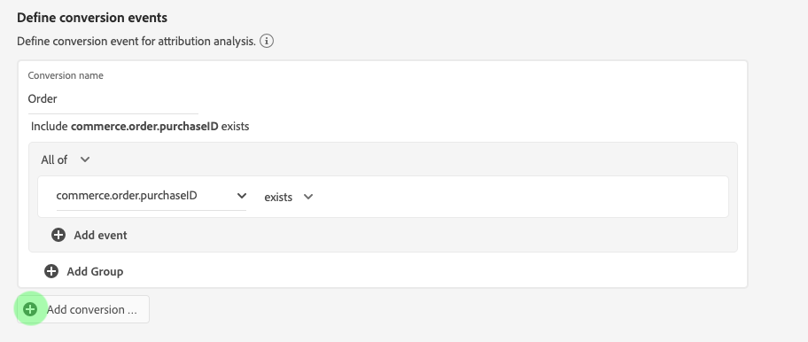

# Handleiding Attribution AI UI

Attribution AI, als onderdeel van Intelligente Diensten is een multi-channel, algoritmische attributiedienst die de invloed en de stijgende invloed van klanteninteractie tegen gespecificeerde resultaten berekent. Met Attribution AI kunnen marketeers marketing- en advertentieuitgaven meten en optimaliseren door inzicht te krijgen in de impact van elke individuele interactie van de klant in elke fase van de reis van de klant.

Dit document fungeert als richtlijn voor interactie met Attribution AI in de gebruikersinterface Intelligente services.

## Een instantie maken

In de [!DNL Adobe Experience Platform] UI, selecteer **[!UICONTROL Services]** in de linkernavigatie. De **[!UICONTROL Services]** browser verschijnt en toont beschikbare Adobe intelligente diensten. Selecteer in de container voor Attribution AI de optie **[!UICONTROL Open]**.

De de dienstpagina van de Attribution AI verschijnt. Deze pagina bevat een overzicht van de service-instanties van Attribution AI en informatie over deze instanties, zoals de naam van de instantie, conversiegebeurtenissen, hoe vaak de instantie wordt uitgevoerd en de status van de laatste update.

U kunt de **[!UICONTROL Total conversion events scored]** metrisch die in de bodem-juiste kant van wordt gevestigd **[!UICONTROL Create instance]** container. Deze metrisch spoor het totale aantal omzettingsgebeurtenissen door Attribution AI voor het huidige kalenderjaar met inbegrip van alle zandbakmilieu&#39;s en om het even welke geschrapte de dienstinstanties worden gemeten die.

De instanties van de dienst kunnen worden uitgegeven, worden gekloond, en worden geschrapt door de controles op de rechterkant van UI te gebruiken. Als u deze besturingselementen wilt weergeven, selecteert u een instantie uit uw bestaande **[!UICONTROL Service instances]**. De besturingselementen bevatten de volgende informatie:

- **[!UICONTROL Edit]**: Selecteren **[!UICONTROL Edit]** staat u toe om een bestaande de dienstinstantie te wijzigen. U kunt de naam, beschrijving, status en scores van de instantie bewerken.
- **[!UICONTROL Clone]**: Selecteren **[!UICONTROL Clone]** Hiermee wordt de geselecteerde service-instantie gekopieerd. Vervolgens kunt u de workflow wijzigen om kleine tweaks te maken en deze een nieuwe naam te geven.
- **[!UICONTROL Delete]**: U kunt een de dienstinstantie met inbegrip van om het even welke historische looppas schrappen.
- **[!UICONTROL Data source]**: Een koppeling naar de gegevensset die wordt gebruikt. Als meer dan één dataset door Attribution AI wordt gebruikt, &quot;Veelvoud&quot;die door het aantal datasets wordt gevolgd wordt getoond. Als u de hyperlink selecteert, wordt de voorvertoning van de datasets weergegeven.
- **[!UICONTROL Last run details]**: Dit wordt alleen weergegeven wanneer een run mislukt. Hier wordt informatie weergegeven over waarom de uitvoering is mislukt, zoals foutcodes.

- **[!UICONTROL Conversion events]**: Een kort overzicht van de conversiegebeurtenissen die voor deze instantie zijn geconfigureerd.
- **[!UICONTROL Lookback window]**: Het tijdframe dat u hebt gedefinieerd, geeft aan hoeveel dagen voor de conversiegebeurtenis de aanraakpunten worden opgenomen.
- **[!UICONTROL Touchpoints]**: Een lijst met alle aanraakpunten die u tijdens het maken van deze instantie hebt gedefinieerd.

Selecteren **[!UICONTROL Create instance]** om te beginnen.

Vervolgens wordt de instellingspagina voor Attribution AI weergegeven waar u een naam en een optionele beschrijving voor de serviceversie kunt opgeven.

## Gegevens selecteren {#select-data}

<!-- https://www.adobe.com/go/aai-select-data -->

Door ontwerp, kan Attribution AI Adobe Analytics, de gebeurtenis van de Ervaring, en de gegevens van de Gebeurtenis van de Consumentenervaring gebruiken om attributiescore te berekenen. Wanneer het selecteren van een dataset slechts degenen die met Attribution AI compatibel zijn worden vermeld. Als u een gegevensset wilt selecteren, selecteert u de **+**) naast de naam van de gegevensset of schakelt u het selectievakje in om meerdere gegevenssets tegelijk toe te voegen. U kunt de onderzoeksoptie ook gebruiken om de datasets snel te vinden u in geinteresseerd bent.

Nadat u de gegevenssets hebt geselecteerd die u wilt gebruiken, selecteert u de **[!UICONTROL Add]** knoop om de datasets aan de ruit van de datasetvoorproef toe te voegen.

Het infopictogram selecteren  naast een dataset opent de dataset voorproefpopover.

De voorproef van de dataset bevat gegevens zoals de laatste updatetijd, bronschema, en een voorproef van de eerste tien kolommen.

### Volledige gegevensset {#dataset-completeness}

<!-- https://www.adobe.com/go/aai-dataset-completeness -->

In de voorproef van de dataset is een het percentagewaarde van de volledigheid van de dataset. Deze waarde verstrekt een snelle momentopname van hoeveel kolommen in uw dataset leeg/ongeldig zijn. Als een dataset veel ontbrekende waarden bevat en deze waarden elders worden vastgelegd, wordt u ten zeerste aangeraden de dataset met de ontbrekende waarden op te nemen.

>[!NOTE]
>
>De volledigheid van de gegevensset wordt berekend met behulp van het maximale trainingsvenster voor Attribution AI (één jaar). Dit betekent dat gegevens die meer dan een jaar oud zijn niet in aanmerking worden genomen bij het weergeven van de volledigheidswaarde van de gegevensset.

### Een identiteit selecteren {#identity}

Opdat veelvoudige datasets zich aan elkaar aansluiten, moet u een identiteitstype (dat ook als &quot;identiteitsnamespace&quot;wordt bekend) en een identiteitswaarde binnen die namespace selecteren. Als u meer dan één gebied als identiteit binnen uw schema onder zelfde namespace hebt toegewezen, verschijnen alle toegewezen identiteitswaarden in het identiteitsdrop-down die door namespace zoals wordt voorafgegaan `EMAIL (personalEmail.address)` of `EMAIL (workEmail.address)`.

>[!IMPORTANT]
>
>Het zelfde identiteitstype (namespace) moet voor elke dataset worden gebruikt u selecteert. Een groen vinkje verschijnt naast het identiteitstype binnen de identiteitskolom erop wijst dat datasets compatibel zijn. Wanneer u bijvoorbeeld de naamruimte Telefoon gebruikt en `mobilePhone.number` als herkenningsteken, moeten alle herkenningstekens voor de resterende datasets de Telefoon bevatten en gebruiken namespace.

Als u een identiteit wilt selecteren, selecteert u de onderstreepte waarde in de kolom Identiteit. De keuzelijst Selecteer een identiteit wordt weergegeven.

Als er meer dan één identiteit beschikbaar is binnen een naamruimte, selecteert u het juiste identiteitsveld voor uw gebruik. Er zijn bijvoorbeeld twee e-mailidentiteiten beschikbaar binnen de naamruimte van de e-mail, een werk en persoonlijke e-mail. Afhankelijk van het gebruiksgeval, zal een persoonlijke e-mail eerder worden ingevuld en nuttiger in individuele voorspellingen zijn. Dit betekent dat u `EMAIL (personalEmail.address)` als uw identiteit.

>[!NOTE]
>
> Als er geen geldig identiteitstype (naamruimte) bestaat voor een gegevensset, moet u een primaire identiteit instellen en deze toewijzen aan een naamruimte voor identiteit met behulp van de [schema-editor](../../xdm/schema/composition.md#identity). Ga voor meer informatie over naamruimten en identiteiten naar de [Naamruimten identiteitsservice](../../identity-service/namespaces.md) documentatie.

## Media kanaal en campagnevelden toewijzen {#aai-mapping}

<!-- https://www.adobe.com/go/aai-mapping -->

Nadat u klaar bent met het selecteren en toevoegen van datasets, **Kaart** wordt weergegeven. Attribution AI vereist dat u het het kanaalgebied van Media voor elke dataset in kaart brengt u in de vorige stap selecteerde. Dit is omdat zonder de het kanaalafbeelding van Media tussen datasets, de inzichten die uit Attribution AI worden afgeleid niet behoorlijk kunnen tonen makend de inzichten pagina moeilijk te interpreteren. Hoewel alleen het Media-kanaal vereist is, wordt u ten zeerste aangeraden een aantal optionele velden zoals Media-actie, Campagnenaam, Campagnegroep en Campagne-tag toe te wijzen. Hierdoor kan de Attribution AI meer inzicht krijgen en optimale resultaten behalen.

## Gebeurtenissen definiëren {#define-events}

<!-- https://www.adobe.com/go/aai-define-events -->

Er zijn drie verschillende typen invoergegevens die worden gebruikt voor het definiëren van gebeurtenissen:

- **Conversiegebeurtenissen:** Zakelijke doelstellingen die het effect van marketingactiviteiten identificeren, zoals e-commerceorders, aankopen in winkel en websitebezoeken.
- **Venster Opzoeken:** Verstrekt een tijdkader erop wijst die hoeveel dagen vóór de conversiegebeurtenis aanraakpunten zouden moeten worden omvat.
- **Aanraakpunten:** marketinggebeurtenissen op het niveau van de ontvanger, individu of cookie die worden gebruikt om de numerieke of op inkomsten gebaseerde impact van conversies te evalueren.

### Conversiegebeurtenissen definiëren {#define-conversion-events}

Als u een conversiegebeurtenis wilt definiëren, moet u de gebeurtenis een naam geven en het gebeurtenistype selecteren door de optie **Veldnaam invoeren** vervolgkeuzemenu.

Zodra een gebeurtenis wordt geselecteerd, verschijnt een nieuw drop-down aan zijn recht. Het tweede vervolgkeuzemenu wordt gebruikt om verdere context aan uw gebeurtenis door het gebruik van verrichtingen te verstrekken. Voor deze conversiegebeurtenis wordt de standaardbewerking *exists* wordt gebruikt.

>[!NOTE]
>
>Een tekenreeks onder uw *conversienaam* wordt bijgewerkt terwijl u de gebeurtenis definieert.

De **[!UICONTROL Add event]** en **[!UICONTROL Add Group]** de knoppen worden gebruikt om uw conversie verder te definiëren. Afhankelijk van de conversie die u definieert, moet u mogelijk de opdracht **[!UICONTROL Add event]** en **[!UICONTROL Add group]** knoppen voor verdere context.

Selecteren **[!UICONTROL Add event]** maakt aanvullende velden die met dezelfde methode als hierboven beschreven kunnen worden ingevuld. Hiermee voegt u een AND-instructie toe aan de tekenreeksdefinitie onder de conversienaam. Selecteer **x** om een toegevoegde gebeurtenis te verwijderen.

Selecteren **[!UICONTROL Add Group]** Hiermee kunt u extra velden maken die los staan van het origineel. Met toevoeging van groepen, blauw *en* wordt weergegeven. Selecteren **en** geeft een optie om de parameter te veranderen om &quot;Of&quot;te bevatten. &quot;Of&quot; wordt gebruikt om meerdere succesvolle conversiepaden te definiëren. &quot;En&quot; breidt het conversiepad uit om aanvullende voorwaarden op te nemen.

Als u meerdere conversies nodig hebt, selecteert u **Conversie toevoegen** om een nieuwe conversiekaart te maken. U kunt het bovenstaande proces herhalen om meerdere conversies te definiëren.

### Opzoekvenster definiëren {#lookback-window}

Nadat u de conversie hebt gedefinieerd, moet u het terugzoekvenster bevestigen. Geef met de pijltoetsen of door de standaardwaarde (56) te selecteren op hoeveel dagen vóór de conversiegebeurtenis u aanraakpunten wilt opnemen. Aanraakpunten worden gedefinieerd in de volgende stap.

### Aanraakpunten definiëren

Het definiëren van aanraakpunten volgt een workflow die vergelijkbaar is met [conversies definiëren](#define-conversion-events). Aanvankelijk moet u uw touchpoint noemen en een touchpoint waarde van selecteren *Veldnaam invoeren* vervolgkeuzemenu. Als deze optie is geselecteerd, wordt het vervolgkeuzemenu met de standaardwaarde &quot;exists&quot; weergegeven. Selecteer het vervolgkeuzemenu om een lijst met operatoren weer te geven.

Voor dit aanraakpunt selecteert u **equals**.

Nadat een operator voor een aanraakpunt is geselecteerd, *Veldwaarde invoeren* beschikbaar gesteld. De vervolgkeuzemenu&#39;s voor *Veldwaarde invoeren* vullen op basis van de eerder geselecteerde operator en aanraakpuntwaarde. Als een waarde niet in de vervolgkeuzelijst wordt gevuld, kunt u die waarde handmatig invoeren. Selecteer het vervolgkeuzemenu en selecteer **KLIKKEN**.

>[!NOTE]
>
>Aan de operatoren &quot;bestaat&quot; en &quot;niet bestaat&quot; zijn geen veldwaarden gekoppeld.

De **Gebeurtenis toevoegen** en **Groep toevoegen** de knoppen worden gebruikt om uw aanraakpunt verder te definiëren. Vanwege de complexe aard van de omringende aanraakpunten is het niet ongebruikelijk om voor één aanraakpunt meerdere gebeurtenissen en groepen te hebben.

Wanneer geselecteerd, **Gebeurtenis toevoegen** Hiermee kunt u extra velden toevoegen. Selecteer de **x** om een toegevoegde gebeurtenis te verwijderen.

Selecteren **Groep toevoegen** kunt u extra velden maken die los staan van het origineel. Met toevoeging van groepen, blauw *en* wordt weergegeven. Selecteren **en** om de parameter te wijzigen, wordt de nieuwe parameter &quot;Of&quot;gebruikt om veelvoudige succesvolle wegen te bepalen. Dit specifieke aanraakpunt heeft slechts één succesvol pad, dus &quot;Of&quot; is niet nodig.

>[!NOTE]
>
>De tekenreeks onder gebruiken *Naam aanraakpunt* voor een kort overzicht van uw aanraakpunt. De tekenreeks komt overeen met de naam van het aanraakpunt.

U kunt aanvullende aanraakpunten toevoegen door **Aanraakpunt toevoegen** en het bovenstaande proces herhalen.

Wanneer u alle benodigde aanraakpunten hebt gedefinieerd, bladert u omhoog en selecteert u **Volgende** in de rechterbovenhoek om door te gaan naar de laatste stap.

## Geavanceerde instellingen voor training en scores

De laatste pagina in Attribution AI is de **[!UICONTROL Advanced]** pagina die wordt gebruikt voor het instellen van training en scoring.

### Training plannen

Met de *Schema*, kunt u een dag en tijd van de week selecteren die u wilt scoren.

Het vervolgkeuzemenu onder selecteren *Scorefrequentie* om tussen dagelijkse, wekelijkse en maandelijkse scoring te selecteren. Selecteer vervolgens de dagen van de week waarop u de scoring wilt toepassen. U kunt meerdere dagen selecteren. Als u dezelfde dag opnieuw selecteert, wordt de selectie opgeheven.

Selecteer het klokpictogram om de tijd van de dag te wijzigen waarop u wilt scoren. Voer in de nieuwe overlay die wordt weergegeven de tijd in van de dag die u wilt scoren. Selecteer buiten de bedekking om deze te sluiten.

>[!NOTE]
>
>Het kan tot 24 uur duren voor elk scoringsproces wordt voltooid.

### Aanvullende kolommen met scoregegevens (optioneel)

Door gebrek, wordt een score dataset gecreeerd voor elke de dienstinstantie in een standaardschema. U kunt desgewenst extra kolommen toevoegen op basis van uw Conversion-gebeurtenis en aanraakpuntconfiguraties aan de uitvoer van de scoredataset. Begin door kolommen te selecteren uit uw inputdataset, kunt u hen dan slepen en laten vallen om de orde te veranderen door de linkermuisknoop over het hamburgerpictogram te onderdrukken.

### Regionaal modelleren (optioneel) {#region-based-modeling-optional}

Het gedrag van uw klanten kan per land en geografische regio aanzienlijk verschillen. Voor globale ondernemingen, die op land-gebaseerde of op regio-gebaseerde modellen gebruiken kan attributienauwkeurigheid verhogen. Elk toegevoegd gebied leidt tot een nieuw model met de gegevens van dat gebied.

Als u een nieuw gebied wilt definiëren, selecteert u eerst **[!UICONTROL Add region]**. Geef in de container die wordt weergegeven een naam voor het gebied op. Slechts één waarde (&quot;placeContext.geo.countryCode&quot;) wordt gevuld vanuit het deelvenster **[!UICONTROL Enter Field Name]** vervolgkeuzelijst. Selecteer deze waarde.

Selecteer vervolgens een operator.

Typ ten slotte de landcode in het dialoogvenster **[!UICONTROL Enter Field Value]** vervolgkeuzelijst.

>[!NOTE]
>
>Landcodes zijn twee tekens lang. Hier vindt u een volledige lijst [ISO 3166-1 alpha-2](https://datahub.io/core/country-list).

### Trainingsvenster {#training-window}

Om ervoor te zorgen dat u het meest nauwkeurige model mogelijk krijgt, is het belangrijk om uw model te trainen met historische gegevens die uw zaken vertegenwoordigen. Standaard wordt het model getraind met twee kwartalen (zes maanden) aan conversiegebeurtenisgegevens. Selecteer het vervolgkeuzemenu om de standaardinstelling te wijzigen. U kunt kiezen om met één tot vier kwart van gegevens (3-12 maanden) te trainen.

>[!NOTE]
>
>Een korter trainingsvenster is gevoeliger voor recente trends, terwijl een langer trainingsvenster een robuuster model creëert en minder gevoelig is voor recente trends.

Als u uw trainingsvenster hebt geselecteerd, selecteert u **[!UICONTROL Finish]** in de rechterbovenhoek. Laat de gegevens enige tijd verwerken. Na voltooiing, lijkt een popover dialoog bevestigend dat de instantie opstelling volledig is. Selecteren **[!UICONTROL Ok]** om naar de **[!UICONTROL Service instances]** pagina waar u uw de dienstinstantie kunt zien.

## Volgende stappen

Door deze zelfstudie te volgen, hebt u met succes een de dienstinstantie in Attribution AI gecreeerd. Nadat de scoring van de instantie is voltooid (maximaal 24 uur toestaan), kunt u [Attribution AI-inzichten ontdekken](./discover-insights.md). Als u de resultaten van uw scores wilt downloaden, gaat u bovendien naar de [scores downloaden](./download-scores.md) documentatie.

## Aanvullende bronnen

In de volgende video wordt een end-to-end workflow beschreven voor het maken van een nieuwe instantie in Attribution AI.

>[!VIDEO](https://video.tv.adobe.com/v/32668?learn=on&quality=12)
