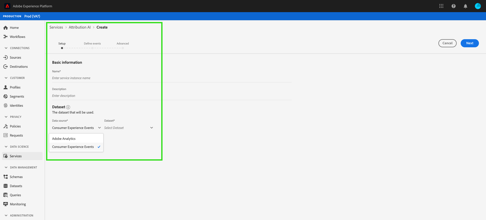

# gebruikershandleiding voor Attributie AI

Attribution AI, als onderdeel van Intelligent Services is een meerkanaals, algoritmische attributiedienst die de invloed en incrementele impact van klanteninteractie tegen gespecificeerde resultaten berekent. Met Attribution AI kunnen marketers marketing- en advertentiekosten meten en optimaliseren door de impact van elke afzonderlijke interactie van de klant in elke fase van de reizen van de klant te begrijpen.

Dit document fungeert als richtlijn voor interactie met Attribution AI in de Intelligent Services-gebruikersinterface.

## Een instantie maken

Klik in de [!DNL Adobe Experience Platform] gebruikersinterface op **Services** in de linkernavigatie. De browser *Services* wordt weergegeven met beschikbare intelligente Adobe-services. Klik in de container voor Kenmerken AI op **Openen**.

De servicepagina Kenmerk AI wordt weergegeven. Deze pagina bevat een overzicht van de service-instanties van Attribution AI en geeft informatie over deze instanties, zoals de naam van de instantie, conversiegebeurtenissen, hoe vaak de instantie wordt uitgevoerd en de status van de laatste update. Klik op **Instantie** maken om te beginnen.

Daarna, verschijnt de opstellingspagina voor Attributie AI, waar u basisinformatie kunt verstrekken en een dataset voor de instantie specificeren.

### De instantie een naam geven

Geef onder *Basisinformatie* een naam en een optionele beschrijving op voor uw serviceexemplaar.

### Een gegevensset selecteren

Nadat u de basisgegevens hebt ingevuld, klikt u op de vervolgkeuzelijst Gegevensset **selecteren** om de gegevensset te selecteren. De dataset wordt gebruikt om het model te trainen en de verdere gegevens te scoren het produceert. Wanneer het selecteren van een dataset van dropdown selecteur, slechts degenen die met Attributie AI compatibel zijn en met het schema van de Gegevens van de Ervaring in overeenstemming zijn (XDM) zijn vermeld. Nadat u een gegevensset hebt gekozen, klikt u op **Volgende** in de rechterbovenhoek om door te gaan naar de pagina met gedefinieerde gebeurtenissen.

## Gebeurtenissen definiëren

Er zijn drie verschillende typen invoergegevens die worden gebruikt voor het definiëren van gebeurtenissen:

- **Conversiegebeurtenissen:** Zakelijke doelstellingen die het effect van marketingactiviteiten identificeren, zoals e-commerceorders, aankopen in winkel en websitebezoeken.
- **Venster Opzoeken:** Verstrekt een tijdkader erop wijst die hoeveel dagen vóór de conversiegebeurtenis aanraakpunten zouden moeten worden omvat.
- **Aanraakpunten:** marketinggebeurtenissen op het niveau van de ontvanger, individu of cookie die worden gebruikt om de numerieke of op inkomsten gebaseerde impact van conversies te evalueren.

### Conversiegebeurtenissen definiëren {#define-conversion-events}

Als u een conversiegebeurtenis wilt definiëren, moet u de gebeurtenis een naam geven en het gebeurtenistype selecteren door op het vervolgkeuzemenu Veldnaam **** invoeren te klikken.

Zodra een gebeurtenis wordt geselecteerd, verschijnt een nieuw drop-down aan zijn recht. Het tweede vervolgkeuzemenu wordt gebruikt om verdere context aan uw gebeurtenis door het gebruik van verrichtingen te verstrekken. Voor deze conversiegebeurtenis *bestaat* de standaardbewerking.

>[!NOTE] Een tekenreeks onder de naam *van de* conversie wordt bijgewerkt terwijl u de gebeurtenis definieert.

De knoppen *Gebeurtenis* toevoegen en Groep ** toevoegen worden gebruikt om de conversie verder te definiëren. Afhankelijk van de conversie die u definieert, moet u mogelijk de knoppen Gebeurtenis ** toevoegen en Groep ** toevoegen gebruiken om verdere context te bieden.

Als u op Gebeurtenis **** toevoegen klikt, worden aanvullende velden gemaakt die met dezelfde methode kunnen worden ingevuld als hierboven is beschreven. Hiermee voegt u een *AND* -instructie toe aan de tekenreeksdefinitie onder de *conversienaam*. Klik op de **x** om een toegevoegde gebeurtenis te verwijderen.

Als u op Groep **** toevoegen klikt, kunt u extra velden maken die los staan van het origineel. Met de toevoeging van groepen wordt een blauwe *en-* knop weergegeven. Klik op **en** om de parameter te wijzigen in &#39;&#39;Of&#39;&#39;. &quot;Of&quot; wordt gebruikt om meerdere succesvolle conversiepaden te definiëren. &quot;En&quot; breidt het conversiepad uit om aanvullende voorwaarden op te nemen.

Als u meerdere conversies nodig hebt, klikt u op Conversie **** toevoegen om een nieuwe conversiekaart te maken. U kunt het bovenstaande proces herhalen om meerdere conversies te definiëren.

### Opzoekvenster definiëren

Nadat u de conversie hebt gedefinieerd, moet u het terugzoekvenster bevestigen. Geef met de pijltoetsen of door op de standaardwaarde (56) te klikken op hoeveel dagen vóór de conversiegebeurtenis u aanraakpunten wilt opnemen. Aanraakpunten worden gedefinieerd in de volgende stap.

### Aanraakpunten definiëren

Het definiëren van aanraakpunten volgt een vergelijkbare workflow als het [definiëren van conversies](#define-conversion-events). Aanvankelijk moet u uw aanraakpunt een naam geven en een aanraakpuntwaarde selecteren in het vervolgkeuzemenu *Veldnaam* invoeren. Als deze optie is geselecteerd, wordt het vervolgkeuzemenu met de standaardwaarde &quot;exists&quot; weergegeven. Klik op het vervolgkeuzemenu om een lijst met operatoren weer te geven.

Voor dit aanraakpunt selecteert u **gelijk aan**.

Nadat een operator voor een aanraakpunt is geselecteerd, wordt *Veldwaarde* invoeren beschikbaar gesteld. De vervolgkeuzemenu&#39;s voor *Veldwaarde* invoeren vullen op basis van de operator en de aanraakpuntwaarde die u eerder hebt geselecteerd. Als een waarde niet in de vervolgkeuzelijst wordt gevuld, kunt u die waarde handmatig invoeren. Klik op het vervolgkeuzemenu en selecteer **KLIKKEN**.

>[!NOTE] Aan de operatoren &quot;bestaat&quot; en &quot;niet bestaat&quot; zijn geen veldwaarden gekoppeld.

De *Add gebeurtenis* en de *Add knopen van de Groep* worden gebruikt om uw touchpoint verder te bepalen. Vanwege de complexe aard van de omringende aanraakpunten is het niet ongebruikelijk om voor één aanraakpunt meerdere gebeurtenissen en groepen te hebben.

Als u op Gebeurtenis **** toevoegen klikt, kunnen extra velden worden toegevoegd. Klik op de **x** om een toegevoegde gebeurtenis te verwijderen.

Als u op Groep **** toevoegen klikt, kunt u extra velden maken die los staan van het origineel. Met de toevoeging van groepen wordt een blauwe *en-* knop weergegeven. Klik **en** om de parameter te veranderen, wordt de nieuwe parameter &quot;of&quot;gebruikt om veelvoudige succesvolle wegen te bepalen. Dit specifieke aanraakpunt heeft slechts één succesvol pad, dus &quot;Of&quot; is niet nodig.

>[!NOTE] Gebruik de tekenreeks onder de naam *van het* aanraakpunt voor een snel overzicht van uw aanraakpunt. De tekenreeks komt overeen met de naam van het aanraakpunt.

U kunt aanvullende aanraakpunten toevoegen door op **Aanraakpunt** toevoegen te klikken en het bovenstaande proces te herhalen.

Als u alle benodigde aanraakpunten hebt gedefinieerd, schuift u omhoog en klikt u op **Volgende** in de rechterbovenhoek om door te gaan naar de laatste stap.

## Geavanceerde instellingen voor training en scores

De laatste pagina in Attribution AI is de *geavanceerde* pagina die wordt gebruikt voor het instellen van training en scoring.

### Training plannen

Met het *schema* kunt u een dag en tijd van de week selecteren die u wilt scoren.

Klik op het vervolgkeuzemenu onder *Muziekfrequentie* om een score tussen dag, week en maand te kiezen. Selecteer vervolgens de dagen van de week waarop u de scoring wilt toepassen. U kunt meerdere dagen selecteren. Klik nogmaals op een dag om deze te deselecteren.

Klik op het klokpictogram om de tijd van de dag te wijzigen die u wilt scoren. Voer in de nieuwe overlay die wordt weergegeven de tijd in van de dag die u wilt scoren. Klik buiten de bedekking om deze te sluiten.

>[!NOTE] Het kan tot 24 uur duren voor elk scoringsproces wordt voltooid.

### Regionaal modelleren (optioneel) {#region-based-modeling-optional}

Het gedrag van uw klanten kan per land en geografische regio aanzienlijk verschillen. Voor globale ondernemingen, die op land-gebaseerde of op regio-gebaseerde modellen gebruiken kan attributienauwkeurigheid verhogen. Elk toegevoegd gebied leidt tot een nieuw model met de gegevens van dat gebied.

Als u een nieuw gebied wilt definiëren, klikt u eerst op Gebied **** toevoegen. Geef in de container die wordt weergegeven een naam voor het gebied op. Slechts één waarde (&quot;placeContext.geo.countryCode&quot;) wordt gevuld vanuit het vervolgkeuzemenu Veldnaam ** invoeren. Selecteer deze waarde.

Selecteer vervolgens een operator.

Typ ten slotte de landcode in het vervolgkeuzemenu *Veldwaarde* invoeren.

>[!NOTE] Landcodes zijn twee tekens lang. Een volledige lijst vindt u hier in [ISO 3166-1 alpha-2](https://datahub.io/core/country-list).

### Trainingsvenster

Om ervoor te zorgen dat u het meest nauwkeurige model mogelijk krijgt, is het belangrijk om uw model te trainen met historische gegevens die uw zaken vertegenwoordigen. Standaard wordt het model getraind met twee kwartalen (zes maanden) gegevens. Selecteer het vervolgkeuzemenu om de standaardinstelling te wijzigen. U kunt kiezen om met één tot vier kwart van gegevens (3-12 maanden) te trainen.

>[!NOTE] Een korter trainingsvenster is gevoeliger voor recente trends, terwijl een langer trainingsvenster een robuuster model creëert en minder gevoelig is voor recente trends.

Als u uw trainingsvenster hebt geselecteerd, klikt u op **Voltooien** in de rechterbovenhoek. Laat de gegevens enige tijd verwerken. Na voltooiing, lijkt een popover dialoog bevestigend dat de instantie opstelling volledig is. Klik op **OK** om te worden omgeleid naar de pagina met *Service-instanties* waar u uw serviceexemplaar kunt zien.

## Volgende stappen

Aan de hand van deze zelfstudie hebt u een service-instantie gemaakt in Attribution AI. Zodra de instantie het scoren heeft voltooid (maximaal 24 uur toestaan), bent u klaar om de Inzichten van Attribution AI te [ontdekken](./discover-insights.md). Als u de resultaten van uw scores wilt downloaden, gaat u ook naar de documentatie over het [downloaden van onbewerkte scores](./download-scores.md) .

## Aanvullende bronnen

In de volgende video wordt een end-to-end workflow beschreven voor het maken van een nieuwe instantie in Attribution AI.

>[!VIDEO](https://video.tv.adobe.com/v/32668?learn=on&quality=12)