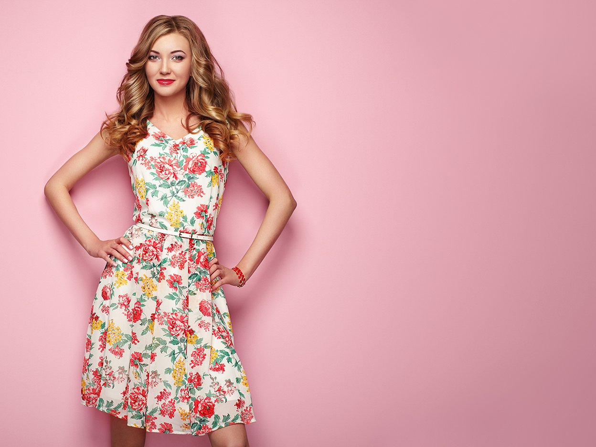

# Visuele gelijkenis

>[!NOTE]
>
>[!DNL Content and Commerce AI] is in bèta. De documentatie kan worden gewijzigd.

Wanneer u een afbeelding krijgt met de visuele gelijkenis, worden in de catalogus automatisch visueel vergelijkbare afbeeldingen gevonden.

De volgende afbeelding is gebruikt in de voorbeeldaanvraag die in dit document wordt weergegeven:



**API-indeling**

```http
POST /services/v1/predict
```

**Verzoek**

In het volgende verzoek worden visueel vergelijkbare afbeeldingen uit een catalogus opgehaald op basis van de invoerparameters die in de lading zijn opgegeven. Zie de tabel onder de voorbeeldlading voor meer informatie over de getoonde inputparameters.

>[!CAUTION]
>
>`analyzer_id` bepaalt welke  [!DNL Sensei Content Framework] wordt gebruikt. Controleer of u de juiste `analyzer_id` hebt voordat u uw verzoek indient. Neem contact op met het AI beta-team van Content and Commerce om uw `analyzer_id` voor deze service te ontvangen.

```SHELL
curl -i -X POST https://sensei.adobe.io/services/v1/predict \
  -H 'Authorization: Bearer $API_TOKEN' \
  -H 'Content-Type: multipart/form-data' \
  -H 'cache-control: no-cache,no-cache' \
  -H 'x-api-key: $API_KEY' \
  -F file=@test_image.jpg \
  -F 'contentAnalyzerRequests={
   "enable_diagnostics":"true",
   "requests":[
     {
         "analyzer_id": "Feature:cintel-deep-product-search:Service-316a8cf750c6440396061c8f73a7a585",
         "parameters": {
          "application-id": "1234", 
          "content-type": "inline", 
          "encoding": "jpeg", 
          "threshold": "0", 
          "top-N": "0", 
          "custom": {}, 
          "data": [{
            "content-id": "0987", 
            "content": "inline-image", 
            "content-type": "inline", 
            "encoding": "jpeg", 
            "threshold": "0", 
            "top-N": "0", 
            "historic-metadata": [], 
            "custom": {}
            }]
          }
      }
    ]
}'
```

| Eigenschap | Beschrijving | Verplicht |
| --- | --- | --- |
| `analyzer_id` | De [!DNL Sensei] service-id waarin uw verzoek is geïmplementeerd. Deze id bepaalt welke van [!DNL Sensei Content Frameworks] worden gebruikt. Neem voor aangepaste services contact op met het AI-team voor Inhoud en Handel om een aangepaste id in te stellen. | Ja |
| `application-id` | De id van de toepassing die u hebt gemaakt. | Ja |
| `data` | Een array die een JSON-object bevat met elk object in de array die een afbeelding vertegenwoordigt. Elke parameter die als onderdeel van deze array wordt doorgegeven, overschrijft de algemene parameters die buiten de array `data` zijn opgegeven. Alle overige eigenschappen die hieronder in deze tabel worden beschreven, kunnen worden overschreven vanuit `data`. | Ja |
| `content-id` | De unieke id voor het gegevenselement dat in de reactie wordt geretourneerd. Als dit niet wordt overgegaan, wordt een auto-geproduceerde identiteitskaart toegewezen. | Nee |
| `content` | De inhoud die door de visuele gelijkenisdienst moet worden geanalyseerd. Als de afbeelding deel uitmaakt van de hoofdtekst van het verzoek, gebruikt u `-F file=@<filename>` in de opdracht Krullen om de afbeelding door te geven, zodat deze parameter een lege tekenreeks blijft. <br> Als de afbeelding een bestand is op S3, geeft u de ondertekende URL door. Wanneer de inhoud deel uitmaakt van de aanvraaginstantie, mag de lijst met gegevenselementen slechts één object bevatten. Wanneer meerdere objecten worden doorgegeven, wordt alleen het eerste object verwerkt. | Ja |
| `content-type` | Gebruikt om erop te wijzen of de input deel van het verzoeklichaam of een ondertekende url voor een S3 emmertje uitmaakt. De standaardwaarde voor deze eigenschap is `inline`. | Nee |
| `encoding` | De bestandsindeling van de invoerafbeelding. Momenteel kunnen alleen JPEG- en PNG-afbeeldingen worden verwerkt. De standaardwaarde voor deze eigenschap is `jpeg`. | Nee |
| `threshold` | De drempel van de score (0 tot en met 1) waarboven de resultaten moeten worden geretourneerd. Gebruik de waarde `0` om alle resultaten te retourneren. De standaardwaarde voor deze eigenschap is `0`. | Nee |
| `top-N` | Het aantal resultaten dat moet worden geretourneerd (mag geen negatief geheel getal zijn). Gebruik de waarde `0` om alle resultaten te retourneren. Wanneer gebruikt in combinatie met `threshold`, is het aantal teruggekeerde resultaten het laagste van één van beide vastgestelde grenzen. De standaardwaarde voor deze eigenschap is `0`. | Nee |
| `custom` | Aangepaste parameters die moeten worden doorgegeven. | Nee |
| `historic-metadata` | Een array waarvan metagegevens kunnen worden doorgegeven. | Nee |

**Antwoord**

Een geslaagde reactie retourneert een `response`-array die een `feature_value` en `feature_name` bevat voor elk van de visueel vergelijkbare afbeeldingen in de catalogus.

De volgende visueel vergelijkbare afbeeldingen zijn geretourneerd in de onderstaande voorbeeldreactie:


```json
{
  "status": 200,
  "content_id": "test_image.jpg",
  "cas_responses": [
    {
      "status": 200,
      "analyzer_id": "Feature:cintel-deep-product-search:Service-316a8cf750c6440396061c8f73a7a585",
      "content_id": "test_image.jpg",
      "result": {
        "response_type": "feature",
        "response": [
          {
            "feature_value": [
              {
                "feature_value": "678",
                "feature_name": "G34WS945.F1"
              },
              {
                "feature_value": "678",
                "feature_name": "1431RDM JANELLE RAW JACKE"
              },
              {
                "feature_value": "657",
                "feature_name": "GF4045877841 CARLA FLR"
              },
              {
                "feature_name": "1707-686-SGU PATCH XYZ",
                "feature_value": "657"
              },
              {
                "feature_name": "5495MJT AJA BLK",
                "feature_value": "646"
              },
              {
                "feature_name": "IDEAL",
                "feature_value": "645"
              },
              {
                "feature_value": "644",
                "feature_name": "HCAJRA439 CALI JEAN"
              },
              {
                "feature_name": "KT279RK-ONL",
                "feature_value": "644"
              },
              {
                "feature_name": "SP190404-ELLIS",
                "feature_value": "642"
              },
              {
                "feature_name": "GF4174848718 KENDALL DIS",
                "feature_value": "640"
              }
            ],
            "feature_name": "visual_similarity"
          }
        ]
      }
    }
  ],
  "error": []
}
```
