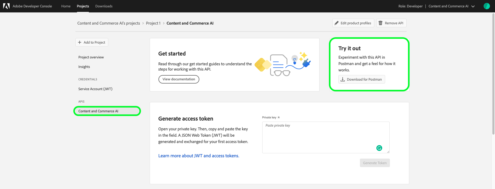
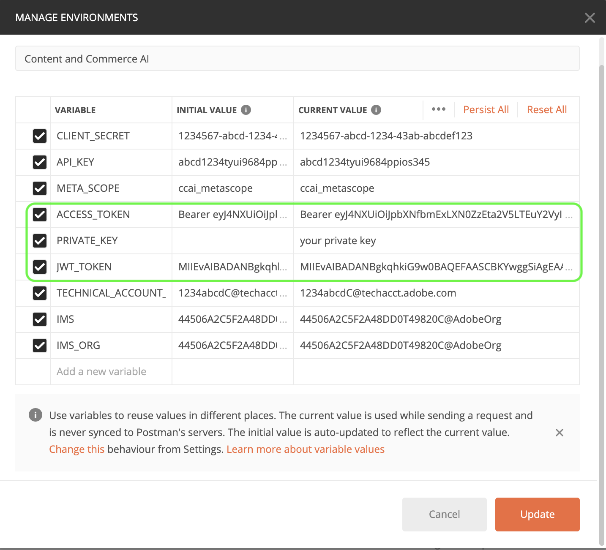

# Aan de slag met Content and Commerce AI

>[!NOTE]
>
>AI van de Inhoud en van de Handel is in bèta. De documentatie kan worden gewijzigd.

[!DNL Content and Commerce AI] gebruikt Adobe I/O API&#39;s. Als u aanroepen wilt uitvoeren naar Adobe I/O API&#39;s en de I/O Console-integratie, moet u eerst de [verificatiezelfstudie](https://www.adobe.com/go/platform-api-authentication-en) voltooien.

Wanneer u echter de stap **API toevoegen** doorloopt, bevindt de API zich onder Experience Cloud in plaats van Adobe Experience Platform, zoals in de volgende schermafbeelding wordt getoond:

Als u de zelfstudie over verificatie voltooit, krijgt u de waarden voor elk van de vereiste headers in alle Adobe I/O API-aanroepen, zoals hieronder wordt getoond:

- `Authorization: Bearer {ACCESS_TOKEN}`
- `x-api-key: {API_KEY}`
- `x-gw-ims-org-id: {IMS_ORG}`

## Een postmanomgeving maken (optioneel)

Nadat u uw project en API hebt ingesteld in de Adobe Developer Console, kunt u een omgevingsbestand voor Postman downloaden. Onder **[!UICONTROL APIs]** de linkerspoor van uw project, selecteer **[!UICONTROL Inhoud en Handel AI]**. Er wordt een nieuw tabblad geopend met een kaart met het label &quot;[!DNL Try it out]&quot;. Selecteer **Download voor Postman** om een JSON-bestand te downloaden dat wordt gebruikt om uw postmanomgeving te configureren.

Nadat u het bestand hebt gedownload, opent u Postman en selecteert u het **tandwielpictogram** rechtsboven om het dialoogvenster **omgevingen beheren** te openen.

Selecteer vervolgens **Importeren** in het dialoogvenster **Omgevingen beheren**.

U wordt omgeleid en gevraagd om een omgevingsbestand van uw computer te selecteren. Selecteer het JSON-bestand dat u eerder hebt gedownload en selecteer **Open** om de omgeving te laden.

U wordt omgeleid terug naar *Manage milieu&#39;s* tabel met een nieuwe omgevingsnaam bevolkt. Selecteer de omgevingsnaam om de variabelen in Postman weer te geven en te bewerken. U moet nog manueel `JWT_TOKEN` en `ACCESS_TOKEN` bevolken. Deze waarden hadden moeten worden verkregen tijdens het voltooien van de [zelfstudie voor verificatie](https://www.adobe.com/go/platform-api-authentication-en).

Nadat de variabelen zijn voltooid, moeten ze er ongeveer als volgt uitzien: Selecteer **Update** om het instellen van uw omgeving te voltooien.

U kunt nu de omgeving selecteren in het vervolgkeuzemenu rechtsboven in het scherm en opgeslagen waarden automatisch vullen. U bewerkt gewoon de waarden op elk gewenst moment opnieuw om al uw API-aanroepen bij te werken.

Zie het artikel Medium op [Using Postman for JWT authentication on Adobe I/O](https://medium.com/adobetech/using-postman-for-jwt-authentication-on-adobe-i-o-7573428ffe7f) voor meer informatie over het werken met Adobe I/O API&#39;s met Postman.

## API-voorbeeldaanroepen lezen

Deze gids verstrekt voorbeeld API vraag om aan te tonen hoe te om uw verzoeken te formatteren. Dit zijn paden, vereiste kopteksten en correct opgemaakte ladingen voor aanvragen. Voorbeeld-JSON die wordt geretourneerd in API-reacties, wordt ook verschaft. Voor informatie over de overeenkomsten die in documentatie voor steekproefAPI vraag worden gebruikt, zie de sectie over [hoe te om voorbeeld API vraag](../../landing/troubleshooting.md) in de het oplossen van problemengids van de Experience Platform te lezen.

## Volgende stappen {#next-steps}

Zodra u al uw geloofsbrieven hebt, bent u klaar aan opstelling een douanearbeider voor [!DNL Content and Commerce AI]. De volgende documenten helpen bij het begrijpen van het uitbreidingsframework en de omgeving.

Om meer over het Kader van de Rekbaarheid te leren, begin door [inleiding aan rekbaarheid](https://docs.adobe.com/content/help/en/asset-compute/using/extend/understand-extensibility.html) document te lezen. In dit document worden de voorwaarden en de inrichtingsvereisten beschreven.

Als u meer wilt weten over het instellen van een omgeving voor [!DNL Content and Commerce AI], begint u met het lezen van de handleiding voor het instellen van een ontwikkelomgeving](https://docs.adobe.com/content/help/en/asset-compute/using/extend/setup-environment.html). [ Dit document bevat instellingsinstructies waarmee u de service Asset compute kunt ontwikkelen.