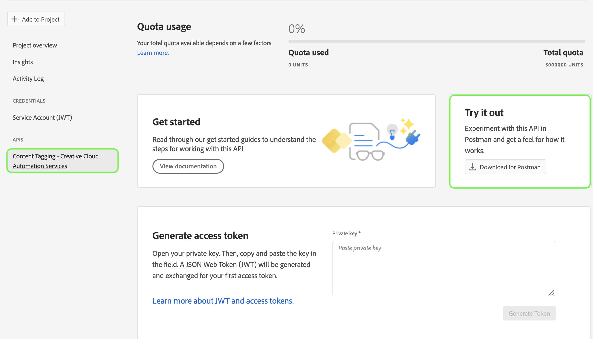

# Aan de slag met Inhoud taggen

[!DNL Content tagging] gebruikt Adobe I/O API&#39;s. Om vraag aan Adobe I/O APIs en de I/O Integratie van de Console te maken, moet u het [&#x200B; authentificatieleerprogramma &#x200B;](https://www.adobe.com/go/platform-api-authentication-en) eerst voltooien.

Nochtans, wanneer u aan **toevoegt API** stap, wordt API gevestigd onder Creative Cloud in plaats van Adobe Experience Platform, zoals aangetoond in het volgende screenshot:

Het voltooien van het authentificatieleerprogramma verstrekt de waarden voor elk van de vereiste kopballen in alle Adobe I/O API vraag, zoals hieronder getoond:

- `Authorization: Bearer {ACCESS_TOKEN}`
- `x-api-key: {API_KEY}`
- `x-gw-ims-org-id: {ORG_ID}`

## Een Postman-omgeving maken (optioneel)

Nadat u uw project en API in Adobe Developer Console hebt ingesteld, kunt u een omgevingsbestand voor Postman downloaden. Selecteer **[!UICONTROL Content tagging]** onder **[!UICONTROL APIs]** de linkertrack van uw project. Er wordt een nieuw tabblad geopend met een kaart met het label &quot;[!DNL Try it out]&quot;. Selecteer **Download voor Postman** om een JSON- dossier te downloaden dat wordt gebruikt om uw postmanmilieu te vormen.

Zodra u het dossier hebt gedownload, open Postman en selecteer het **tandwielpictogram** in het hoogste recht om **te openen beheren milieu** dialoog.

Daarna, uitgezochte **Invoer** van binnen **beheert milieu&#39;s** dialoog.

U wordt omgeleid en gevraagd om een omgevingsbestand van uw computer te selecteren. Selecteer het JSON dossier u vroeger, dan uitgezochte **Open** downloadde om het milieu te laden.

U wordt opnieuw gericht terug naar *beheert milieu&#39;s* lusje met een nieuwe bevolkte omgevingsnaam. Selecteer de omgevingsnaam om de variabelen in Postman weer te geven en te bewerken. U moet de `JWT_TOKEN` en `ACCESS_TOKEN` nog steeds handmatig vullen. Deze waarden zouden terwijl de voltooiing van het [&#x200B; authentificatieleerprogramma &#x200B;](https://www.adobe.com/go/platform-api-authentication-en) moeten zijn verkregen.

Nadat de variabelen zijn voltooid, moeten ze er ongeveer zo uitzien als de onderstaande screenshot. Selecteer **Update** om vestiging uw milieu te beëindigen.

U kunt nu de omgeving selecteren in het vervolgkeuzemenu rechtsboven in het scherm en opgeslagen waarden automatisch vullen. U bewerkt gewoon de waarden op elk gewenst moment opnieuw om al uw API-aanroepen bij te werken.

Voor meer informatie bij het werken met Adobe I/O APIs die Postman gebruiken, zie de post van Medium op [&#x200B; gebruikend Postman voor authentificatie JWT op Adobe I/O &#x200B;](https://medium.com/adobetech/using-postman-for-jwt-authentication-on-adobe-i-o-7573428ffe7f).

## API-voorbeeldaanroepen lezen

Deze gids verstrekt voorbeeld API vraag om aan te tonen hoe te om uw verzoeken te formatteren. Dit zijn paden, vereiste kopteksten en correct opgemaakte ladingen voor aanvragen. Voorbeeld-JSON die wordt geretourneerd in API-reacties, wordt ook verschaft. Voor informatie over de overeenkomsten die in documentatie voor steekproef API vraag worden gebruikt, zie de sectie op [&#x200B; hoe te om voorbeeld API vraag &#x200B;](../../landing/troubleshooting.md) in de het oplossen van problemengids van het Experience Platform te lezen.

## Volgende stappen {#next-steps}

Zodra u al uw referenties hebt, kunt u een aangepaste worker instellen voor [!DNL Content tagging] . De volgende documenten helpen bij het begrijpen van het uitbreidingsframework en de omgeving.

Meer over het Kader van de Rekbaarheid leren, begin door de [&#x200B; inleiding aan rekbaarheid &#x200B;](https://experienceleague.adobe.com/docs/asset-compute/using/extend/understand-extensibility.html?lang=nl-NL) document te lezen. In dit document worden de voorwaarden en de inrichtingsvereisten beschreven.

Om meer over vestiging te leren een milieu voor [!DNL Content tagging], begin door de gids voor [&#x200B; te lezen vestiging een ontwikkelaarmilieu &#x200B;](https://experienceleague.adobe.com/docs/asset-compute/using/extend/setup-environment.html?lang=nl-NL). Dit document bevat instellingsinstructies waarmee u de service Asset compute kunt ontwikkelen.
