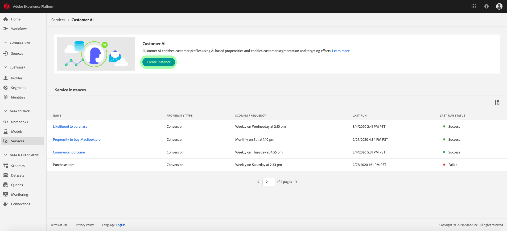

# Handleiding voor AI-gebruikers van klant

De AI van de klant, als deel van de Intelligente Diensten staat u toe om de scores van de douanedichtheid te produceren zonder het moeten zich over machine het leren ongerust maken.

Deze handleiding behandelt de stappen voor het werken met Customer AI. De stappen worden verstrekt voor de volgende onderwerpen:

* [Een instantie configureren](#configure-an-instance)
* [Maak klantsegmenten met voorspelde scores](#create-customer-segments-with-predicted-scores)

Daarnaast bevat de bijlage bij deze zelfstudie informatie over de [uitvoer van AI](#customer-ai-output-data)van de Klant.

## Een instantie configureren

Intelligente services bieden de AI van de Klant als een eenvoudig te gebruiken Adobe Sensei-service die voor verschillende gebruiksgevallen kan worden geconfigureerd. De volgende secties bevatten stappen voor het configureren van een exemplaar van Customer AI.

### Instellen van instantie

Klik in de interface Platform op **Services** in de linkernavigatie. De browser **Services** verschijnt en geeft alle beschikbare services weer die tot uw beschikking staan. Klik in de container voor Customer AI op **Openen**.

In het *AI* -scherm van de Klant worden alle bestaande AI-exemplaren van de Klant weergegeven. Klik op **Instantie** maken.

De workflow voor het maken van instanties wordt weergegeven, te beginnen bij de stap *Setup* .

Hieronder vindt u belangrijke informatie over waarden die u aan het exemplaar moet doorgeven:

* De naam van het exemplaar wordt gebruikt op alle plaatsen waar de AI-score van de Klant wordt weergegeven. Daarom moeten namen beschrijven wat de voorspellingsscores bijvoorbeeld vertegenwoordigen, &quot;Likeliability to cancel magazine subscription&quot;.

* Het type van aandrijving bepaalt de intentie van de score en metrische polariteit. U kunt **Churn** of **Conversie** kiezen. Zie de notitie onder [scoresamenvatting](./discover-insights.md#scoring-summary) in het document met ontdekkingsinzichten voor meer informatie over hoe het type neiging uw instantie beïnvloedt.

* De gegevensbron is waar het gegeven wordt gevestigd. Dataset is de gegevensset die wordt gebruikt om scores te voorspellen. Door ontwerp gebruikt de AI van de Klant gegevens van de Gebeurtenis van de Ervaring van de Consumenten om volheidsscores te berekenen. Wanneer u een gegevensset selecteert in de keuzelijst, worden alleen gegevenssets weergegeven die compatibel zijn met AI van de klant.

* Standaard worden voor alle profielen densiteitsscores gegenereerd, tenzij een in aanmerking komende populatie is opgegeven. U kunt een in aanmerking komende populatie opgeven door voorwaarden te definiëren voor het opnemen of uitsluiten van profielen op basis van gebeurtenissen.

Geef de vereiste waarden op en klik op **Volgende**.

### Een doel definiëren

De stap *Definiëren van doel* verschijnt en biedt een interactieve omgeving waarin u visueel een doel kunt definiëren. Een doel bestaat uit een of meer gebeurtenissen, waarbij het voorkomen van elke gebeurtenis is gebaseerd op de voorwaarde die deze bevat. Het doel van een AI-instantie van een klant is na te gaan of het waarschijnlijk is dat het doel binnen een bepaald tijdsbestek wordt bereikt.

Klik op Veldnaam **** invoeren en selecteer een veld in de vervolgkeuzelijst. Klik op de tweede invoer en selecteer een component voor de voorwaarde van de gebeurtenis. Geef vervolgens de doelwaarde op om de gebeurtenis te voltooien. Aanvullende gebeurtenissen kunnen worden geconfigureerd door op de gebeurtenis **** Toevoegen te klikken. Voltooi ten slotte het doel door een voorspeld tijdkader in aantal dagen toe te passen en klik vervolgens op **Volgende**.

### Een schema configureren *(optioneel)*

De *geavanceerde* stap wordt weergegeven. Deze facultatieve stap staat u toe om een programma te vormen om voorspellingslooppas te automatiseren, voorspellingsuitsluitingen te bepalen om bepaalde gebeurtenissen te filtreren, of **Afwerking** te klikken als niets nodig is.

Opstelling een het scoren programma door de het *Scoreren Frequentie* te vormen. De geautomatiseerde predikings kunnen worden gepland om of wekelijks of maandelijks te lopen.

Onder de planningsconfiguratie, hebt u de capaciteit om voorspellingsuitsluitingen te bepalen om gebeurtenissen te verhinderen die aan bepaalde voorwaarden worden geëvalueerd wanneer het produceren van scores. Deze functie kan worden gebruikt om irrelevante gegevensinvoer uit te filteren.

Als u bepaalde gebeurtenissen wilt uitsluiten, klikt u op Uitsluiting **** toevoegen en definieert u de gebeurtenis op dezelfde manier als waarop het doel wordt gedefinieerd. Als u een uitsluiting wilt verwijderen, klikt u op de ovalen (**...**) rechtsboven in de gebeurteniscontainer en klikt u vervolgens op Container **** verwijderen.

Sluit gebeurtenissen indien nodig uit en klik op **Voltooien** om de instantie te maken.

Als de instantie met succes wordt gecreeerd, wordt een voorspelling onmiddellijk teweeggebracht en de verdere looppas volgens uw bepaald programma uitvoeren.

>[!NOTE] Afhankelijk van de grootte van de invoergegevens kan het voltooien van de voorspelling 24 uur duren.

Door deze sectie te volgen, hebt u een geval van AI van de Klant gevormd en een voorspellingslooppas werd uitgevoerd. Als de uitvoering is voltooid, worden profielen met scorelijsten automatisch met voorspelde scores gevuld. Wacht tot 24 uur voordat u doorgaat naar de volgende sectie van deze zelfstudie.

## Maak klantsegmenten met voorspelde scores

Wanneer een voorspelling is voltooid, worden voorspelde scores voor de dichtheid automatisch verbruikt door profielen. Door profielen te verrijken met AI-scores van de Klant, kunnen klantsegmenten worden gemaakt om een publiek te zoeken op basis van hun populatiescore. Deze sectie verstrekt stappen voor het creëren van segmenten gebruikend de Bouwer van het Segment. Voor een robuustere zelfstudie over het maken van segmenten raadpleegt u de gebruikershandleiding [van](../../segmentation/tutorials/create-a-segment.md)Segment Builder.

>[!IMPORTANT] Om deze methode te gebruiken, moet het Profiel van de Klant in real time voor de dataset worden toegelaten.

In Platform UI, klik **Segmenten** in de linkernavigatie, en klik dan **Create segment**.

De *Segment Builder* wordt weergegeven. Klik in de linkerkolom *Velden* en onder het tabblad *Kenmerken* op de map **XDM Individueel profiel** en klik vervolgens op de map met de naamruimte van uw organisatie. De map met de naam **Customer AI** bevat de resultaten van voorspellingen en krijgt de naam van de instantie waartoe de scores behoren. Klik op een instantiemap om de resultaten van de gewenste instantie te openen.

Bevestigd in het centrum van de Bouwer van het Segment, sleep en laat vallen de attributen van de **Score** op het canvas *van de* regelbouwer om een regel te bepalen.

Geef een naam voor het segment op onder de eigenschappenkolom *Segment aan de rechterkant* .

Klik boven de linkerkolom *Velden* op het **tandwielpictogram** en selecteer een beleid **voor** samenvoegen. Klik op **Opslaan** om het segment te maken.

## Volgende stappen

Door deze zelfstudie te volgen, hebt u met succes een geval van AI van de Klant gevormd, produceerde eigenschapscores, en gevonden publiek dat op hun aandrijvingsscores wordt gebaseerd gebruikend de Bouwer van het Segment. U kunt uw publiek nu richten door hen aan bestemmingen te activeren. Zie het [bestemmingsoverzicht](https://docs.adobe.com/content/help/en/experience-platform/rtcdp/destinations/destinations-overview.html) voor meer informatie.

## Aanhangsel

In het volgende gedeelte wordt aanvullende informatie gegeven over de uitvoer van AI van de Klant.

### AI-uitvoergegevens van klant

De AI van de Klant produceert verscheidene attributen voor individuele profielen die als verkiesbaar worden beschouwd. Deze waarden worden verbruikt door het Profiel van de Klant in real time dat kan worden gebruikt om segmenten tot stand te brengen en te bepalen. In de onderstaande tabel worden de verschillende kenmerken beschreven die in de uitvoer van AI van de Klant zijn aangetroffen:

| Kenmerk | Beschrijving |
| ----- | ----------- |
| Score | De relatieve waarschijnlijkheid voor een klant om het voorspelde doel binnen het bepaalde tijdkader te bereiken. Deze waarde moet niet worden beschouwd als een waarschijnlijkheidspercentage, maar veeleer als de waarschijnlijkheid dat een individu vergeleken wordt met de totale populatie. Deze score varieert van 0 tot 100. |
| Waarschijnlijkheid | Deze eigenschap is de ware waarschijnlijkheid van een profiel voor het bereiken van het voorspelde doel binnen het bepaalde tijdkader. Bij het vergelijken van outputs over verschillende doelstellingen, wordt geadviseerd dat u waarschijnlijkheid over percentiel of score overweegt. Bij het bepalen van de gemiddelde waarschijnlijkheid in de in aanmerking komende populatie moet altijd rekening worden gehouden met de waarschijnlijkheid, aangezien de waarschijnlijkheid aan de onderkant ligt voor gebeurtenissen die niet vaak voorkomen. Waarden voor de waarschijnlijkheid liggen tussen 0 en 1. |
| Percentage | Deze waarde biedt informatie over de prestaties van een profiel ten opzichte van andere profielen met een vergelijkbare score. Een profiel met een percentielrang van 99 voor churn geeft bijvoorbeeld aan dat het risico op churning groter is dan 99% van alle andere profielen die zijn gescaureerd. De percentages variëren van 1 tot 100. |
| Type volheid | Het geselecteerde type buigzaamheid. |
| Score-datum | De datum waarop de scoring heeft plaatsgevonden. |
| Influentiële factoren | Voorspelde redenen waarom een profiel waarschijnlijk wordt omgezet of afgekapt. Factoren bestaan uit de volgende kenmerken:<ul><li>Code: Het profiel of gedragskenmerk dat de voorspelde score van een profiel positief beïnvloedt. </li><li>Waarde: De waarde van het profiel of gedragskenmerk.</li><li>Belangrijk: Hiermee wordt het gewicht van het profiel of gedragskenmerk op de voorspelde score aangegeven (laag, gemiddeld, hoog)</li></ul> |