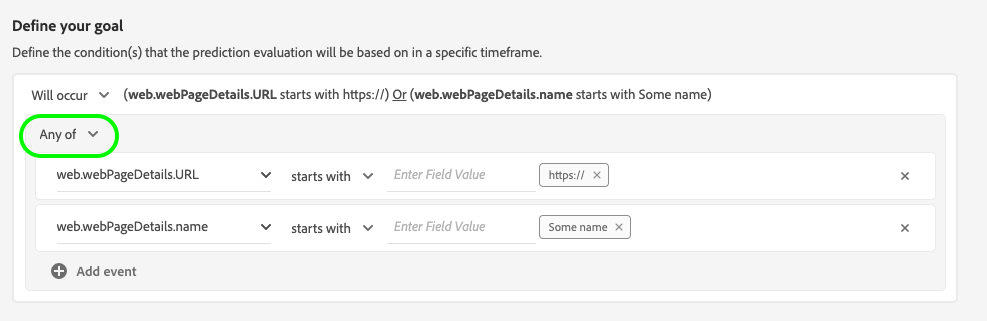

# Een Customer AI-instantie configureren

De AI van de klant, als deel van de Intelligente Diensten staat u toe om de scores van de douanedichtheid te produceren zonder het moeten zich over machine het leren ongerust maken.

Intelligente services bieden de AI van de Klant als een eenvoudig te gebruiken Adobe Sensei-service die voor verschillende gebruiksgevallen kan worden geconfigureerd. De volgende secties bevatten stappen voor het configureren van een exemplaar van Customer AI.

## Instellen van de instantie {#set-up-your-instance}

Selecteer **[!UICONTROL Services]** in de linkernavigatie in de interface van het Platform. De browser **[!UICONTROL Services]** wordt weergegeven en geeft alle beschikbare services weer die tot uw beschikking staan. Selecteer **[!UICONTROL Open]** in de container voor AI van de Klant.

De interface **Klanteninterface** wordt weergegeven en geeft al uw servicematerialen weer.

- U kunt **[!UICONTROL Total profiles scored]** metrisch vinden in de bodem-juiste kant van de **[!UICONTROL Create instance]** container wordt gevestigd die. Deze metrische waarde houdt het totale aantal profielen bij dat door de AI van de Klant voor het lopende kalenderjaar wordt genoteerd, met inbegrip van alle zandbakmilieu&#39;s en om het even welke geschrapte de dienstinstanties.

De instanties van de dienst kunnen worden uitgegeven, worden gekloond, en worden geschrapt door de controles op de rechterkant van UI te gebruiken. Om deze controles te tonen, selecteer een geval van uw bestaande **[!UICONTROL Service instances]**. De besturingselementen bevatten het volgende:

- **[!UICONTROL Edit]**: Als u  **[!UICONTROL Edit]** deze optie selecteert, kunt u een bestaande service-instantie wijzigen. U kunt de naam, de beschrijving en de scorefrequentie van de instantie bewerken.
- **[!UICONTROL Clone]**: Als u  **[!UICONTROL Clone]** deze optie selecteert, wordt de momenteel geselecteerde service-instantie-instelling gekopieerd. Vervolgens kunt u de workflow wijzigen om kleine tweaks te maken en deze een nieuwe naam te geven.
- **[!UICONTROL Delete]**: U kunt een de dienstinstantie met inbegrip van om het even welke historische looppas schrappen.
- **[!UICONTROL Data source]**: Een koppeling naar de gegevensset die door dit exemplaar wordt gebruikt.
- **[!UICONTROL Last run details]**: Dit wordt alleen weergegeven wanneer een run mislukt. Hier wordt informatie weergegeven over waarom de uitvoering is mislukt, zoals foutcodes.
- **[!UICONTROL Score definition]**: Een snel overzicht van het doel u voor deze instantie vormde.

Selecteer **[!UICONTROL Create instance]** om een nieuwe instantie te maken.

De workflow voor het maken van instanties wordt weergegeven, te beginnen bij de stap **[!UICONTROL Setup]**.

Hieronder vindt u belangrijke informatie over waarden die u aan het exemplaar moet doorgeven:

- De naam van het exemplaar wordt gebruikt op alle plaatsen waar de AI van de Klant scores worden getoond. Daarom moeten namen beschrijven wat de voorspellingsscores bijvoorbeeld vertegenwoordigen, &quot;Likeliability to cancel magazine subscription&quot;.

- Het type van aandrijving bepaalt de intentie van de score en metrische polariteit. U kunt **[!UICONTROL Churn]** of **[!UICONTROL Conversion]** kiezen. Zie de notitie onder [overzicht van de scores](./discover-insights.md#scoring-summary) in het document met ontdekkingsinzichten voor meer informatie over hoe het type van de neiging uw instantie beïnvloedt.

- De gegevensbron is waar het gegeven wordt gevestigd. Dataset is de gegevensset die wordt gebruikt om scores te voorspellen. Door ontwerp gebruikt Customer AI de gegevens Consumer Experience Event, Adobe Analytics en Adobe Audience Manager om de eigenschapscores te berekenen. Wanneer u een gegevensset selecteert in de keuzelijst, worden alleen gegevenssets weergegeven die compatibel zijn met AI van de klant.

- Standaard worden voor alle profielen densiteitsscores gegenereerd, tenzij een in aanmerking komende populatie is opgegeven. U kunt een in aanmerking komende populatie opgeven door voorwaarden te definiëren voor het opnemen of uitsluiten van profielen op basis van gebeurtenissen.

Geef de vereiste waarden op en selecteer **[!UICONTROL Next]**.

### Een doel definiëren {#define-a-goal}

De stap **[!UICONTROL Define goal]** wordt weergegeven en biedt een interactieve omgeving waarin u visueel een voorspellingsdoel kunt definiëren. Een doel bestaat uit een of meer gebeurtenissen, waarbij het voorkomen van elke gebeurtenis is gebaseerd op de voorwaarde die deze bevat. Het doel van een AI-instantie van een klant is na te gaan of het waarschijnlijk is dat het doel binnen een bepaald tijdsbestek wordt bereikt.

Als u een doel wilt maken, selecteert u **[!UICONTROL Enter Field Name]** en selecteert u een veld in de vervolgkeuzelijst. Selecteer de tweede invoer en selecteer een clausule voor de voorwaarde van de gebeurtenis, dan verstrek de doelwaarde om de gebeurtenis te voltooien. Aanvullende gebeurtenissen kunnen worden geconfigureerd door **[!UICONTROL Add event]** te selecteren. Voltooi ten slotte het doel door een voorspeld tijdkader in aantal dagen toe te passen en selecteer **[!UICONTROL Next]**.

#### Wordt uitgevoerd en wordt niet uitgevoerd

Bij het definiëren van uw doel kunt u **[!UICONTROL Will occur]** of **[!UICONTROL Will not occur]** selecteren. Als u **[!UICONTROL Will occur]** selecteert, moet aan de gebeurtenisvoorwaarden die u definieert worden voldaan voordat de gebeurtenisgegevens van een klant worden opgenomen in de gebruikersinterface voor inzichten.

Als u bijvoorbeeld een app wilt instellen om te voorspellen of een klant een aankoop zal doen, kunt u **[!UICONTROL Will occur]** gevolgd door **[!UICONTROL All of]** selecteren en vervolgens **commerce.purchase.id** en **exists** als operator invoeren.

Er kunnen zich echter gevallen voordoen waarin u wilt voorspellen of een gebeurtenis zich niet binnen een bepaald tijdsbestek zal voordoen. Om een doel met deze optie te vormen, selecteer **[!UICONTROL Will not occur]** van top-level dropdown.

Als u bijvoorbeeld wilt voorspellen welke klanten zich minder engageren en de aanmeldingspagina van uw account de volgende maand niet meer bezoeken. Selecteer **[!UICONTROL Will not occur]** gevolgd door **[!UICONTROL All of]** en typ **web.webInteraction.URL** en **[!UICONTROL equals]** als operator met **account-login** als waarde.

#### Alle

In sommige gevallen wilt u misschien voorspellen of een combinatie van gebeurtenissen zal plaatsvinden en in andere gevallen wilt u mogelijk voorspellen hoe een gebeurtenis zich uit een vooraf gedefinieerde set voordoet. Als u wilt voorspellen of een klant een combinatie van gebeurtenissen zal hebben, selecteert u de optie **[!UICONTROL All of]** in de vervolgkeuzelijst op het tweede niveau op de pagina **[!UICONTROL Define Goal]**.

U kunt bijvoorbeeld voorspellen of een klant een bepaald product koopt. Dit voorspellingsdoel wordt bepaald door twee voorwaarden: a `commerce.order.purchaseID` **bestaat** en `productListItems.SKU` **is gelijk aan** een bepaalde specifieke waarde.

Om te voorspellen of een klant om het even welke gebeurtenis van een bepaalde reeks zal hebben, kunt u de **[!UICONTROL Any of]** optie gebruiken.

U kunt bijvoorbeeld voorspellen of een klant een bepaalde URL of een webpagina met een bepaalde naam bezoekt. Dit voorspellingsdoel wordt bepaald door twee voorwaarden: `web.webPageDetails.URL` **begint met** een bepaalde waarde en `web.webPageDetails.name` **begint met** een bepaalde waarde.

### Een schema *(optioneel)* {#configure-a-schedule} configureren

De stap **[!UICONTROL Advanced]** wordt weergegeven. Deze facultatieve stap staat u toe om een programma te vormen om voorspellingslooppas te automatiseren, voorspellingsuitsluitingen te bepalen om bepaalde gebeurtenissen te filtreren, of **[!UICONTROL Finish]** te selecteren als niets nodig is.

Opstelling een het scoren programma door **[!UICONTROL Scoring Frequency]** te vormen. De geautomatiseerde predikings kunnen worden gepland om of wekelijks of maandelijks te lopen.

Onder de planningsconfiguratie, hebt u de capaciteit om voorspellingsuitsluitingen te bepalen om gebeurtenissen te verhinderen die aan bepaalde voorwaarden worden geëvalueerd wanneer het produceren van scores. Deze functie kan worden gebruikt om irrelevante gegevensinvoer uit te filteren.

Als u bepaalde gebeurtenissen wilt uitsluiten, selecteert u **[!UICONTROL Add exclusion]** en definieert u de gebeurtenis op dezelfde manier als waarop het doel wordt gedefinieerd. Als u een uitsluiting wilt verwijderen, selecteert u de ellipsen (**[!UICONTROL ...]**) rechtsboven in de gebeurteniscontainer en selecteert u **[!UICONTROL Remove Container]**.

Sluit gebeurtenissen indien nodig uit en selecteer **[!UICONTROL Finish]** om de instantie te maken.

Als de instantie met succes wordt gecreeerd, wordt een voorspelling onmiddellijk teweeggebracht en de verdere looppas volgens uw bepaald programma uitvoeren.

>[!NOTE]
>
>Afhankelijk van de grootte van de invoergegevens kan het voltooien van de voorspelling 24 uur duren.

Door deze sectie te volgen, hebt u een geval van AI van de Klant gevormd en een voorspellingslooppas werd uitgevoerd. Als de uitvoering is voltooid, worden profielen met scorelijsten automatisch met voorspelde scores gevuld. Wacht tot 24 uur voordat u doorgaat naar de volgende sectie van deze zelfstudie.

## Volgende stappen {#next-steps}

Door deze zelfstudie te volgen, hebt u met succes een exemplaar van de AI van de Klant en geproduceerde bezitsscores gevormd. U kunt er nu voor kiezen om de Segment Builder te gebruiken om klantsegmenten met voorspelde scores te maken](./create-segment.md) of [inzichten met Customer AI](./discover-insights.md) te ontdekken.[

## Aanvullende bronnen

De volgende video is ontworpen ter ondersteuning van uw begrip van de configuratieworkflow voor AI van de klant. Daarnaast worden aanbevolen procedures en praktijkvoorbeelden gegeven.

>[!VIDEO](https://video.tv.adobe.com/v/32665?learn=on&quality=12)
