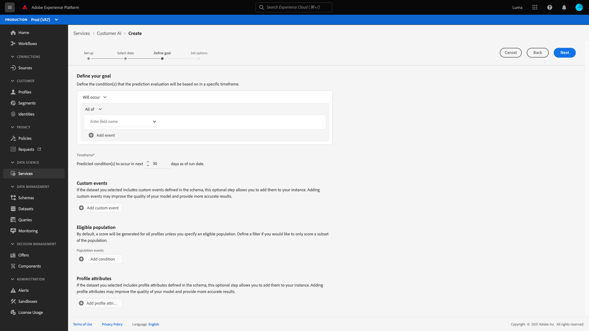
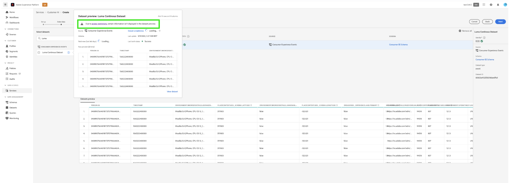

# Een Customer AI-instantie configureren

AI van de klant, als deel van AI/de Diensten van ML laat u toe om de scores van de douanedichtheid te produceren zonder het moeten zich over machine het leren ongerust maken.

AI/ML-services bieden Klantenservice aan als een eenvoudig te gebruiken Adobe Sensei-service die voor verschillende gebruiksgevallen kan worden geconfigureerd. De volgende secties bevatten stappen voor het configureren van een exemplaar van Customer AI.

## Een instantie maken {#set-up-your-instance}

Selecteer in de gebruikersinterface van het Platform de optie **[!UICONTROL Services]** in de linkernavigatie. De **[!UICONTROL Services]** wordt weergegeven en geeft alle beschikbare services weer. Selecteer in de container voor AI van de Klant **[!UICONTROL Open]**.

De **Customer AI** De gebruikersinterface wordt weergegeven en alle servicematerialen worden weergegeven.

- U kunt de **[!UICONTROL Total profiles scored]** metrisch die in de bodem-juiste kant van wordt gevestigd **[!UICONTROL Create instance]** container. Deze metrische waarde houdt het totale aantal profielen bij dat door de AI van de Klant voor het lopende kalenderjaar wordt genoteerd, met inbegrip van alle zandbakmilieu&#39;s en om het even welke geschrapte de dienstinstanties.

De instanties van de dienst kunnen worden uitgegeven, worden gekloond, en worden geschrapt door de controles op de rechterkant van UI te gebruiken. Als u deze besturingselementen wilt weergeven, selecteert u een instantie uit uw bestaande **[!UICONTROL Service instances]**. De besturingselementen bevatten het volgende:

- **[!UICONTROL Edit]**: Selecteren **[!UICONTROL Edit]** staat u toe om een bestaande de dienstinstantie te wijzigen. U kunt de naam, de beschrijving en de scorefrequentie van de instantie bewerken.
- **[!UICONTROL Clone]**: Selecteren **[!UICONTROL Clone]** Kopieert momenteel geselecteerde de opstelling van de de dienstinstantie. Vervolgens kunt u de workflow wijzigen om kleine tweaks te maken en deze een nieuwe naam te geven.
- **[!UICONTROL Delete]**: U kunt een de dienstinstantie met inbegrip van om het even welke historische looppas schrappen.
- **[!UICONTROL Data source]**: Een koppeling naar de gegevensset die door dit exemplaar wordt gebruikt. Als de veelvoudige datasets worden gebruikt, opent het selecteren van de hyperlinktekst de datasetvoorproefpopover.
- **[!UICONTROL Last run details]**: Dit wordt alleen weergegeven wanneer een run mislukt. Hier wordt informatie weergegeven over waarom de uitvoering is mislukt, zoals foutcodes.
- **[!UICONTROL Score definition]**: Een snel overzicht van het doel u voor deze instantie vormde.

Als u een nieuwe instantie wilt maken, selecteert u **[!UICONTROL Create instance]**.

## Instellen

De workflow voor het maken van instanties wordt weergegeven, te beginnen bij het **[!UICONTROL Set up]** stap.

Hieronder vindt u belangrijke informatie over waarden die u aan het exemplaar moet doorgeven:

- **[!UICONTROL Name]:** De naam van het exemplaar wordt gebruikt op alle plaatsen waar de AI van de Klant scores worden getoond. Namen moeten daarom beschrijven wat de voorspellingsscores vertegenwoordigen. Bijvoorbeeld &#39;Waarschijnlijkheid om tijdschriftabonnement te annuleren&#39;.

- **[!UICONTROL Description]:** Een beschrijving die aangeeft wat u probeert te voorspellen.

- **[!UICONTROL Propensity type]:** Het type van aandrijving bepaalt de intentie van de score en metrische polariteit. U kunt **[!UICONTROL Churn]** of **[!UICONTROL Conversion]**. Zie de opmerking onder [overzicht van scores](./discover-insights.md#scoring-summary) in het ontdekkende document van Inzichten voor meer informatie over hoe het type van Bevoegdheid uw geval beïnvloedt.

Geef de vereiste waarden op en selecteer vervolgens **[!UICONTROL Next]** om door te gaan.

## Gegevens selecteren {#select-data}

Door het ontwerp gebruikt de AI van de Klant Adobe Analytics, Adobe Audience Manager, Experience Events in het algemeen, en Consumer Experience Event-gegevens om de eigenschapscores te berekenen. Bij het selecteren van een gegevensset worden alleen gegevenssets weergegeven die compatibel zijn met Customer AI. Als u een gegevensset wilt selecteren, selecteert u de **+**) naast de naam van de gegevensset of schakelt u het selectievakje in om meerdere gegevenssets tegelijk toe te voegen. Gebruik de onderzoeksoptie om de datasets snel te vinden u in geinteresseerd bent.

Nadat u de gegevenssets hebt geselecteerd die u wilt gebruiken, selecteert u de **[!UICONTROL Add]** knoop om de datasets aan de ruit van de datasetvoorproef toe te voegen.

Het infopictogram selecteren  naast de dataset opent de dataset voorproefpopover.

De voorproef van de dataset bevat gegevens zoals de laatste updatetijd, bronschema, en een voorproef van de eerste tien kolommen.

### Volledige gegevensset {#dataset-completeness}

De voorvertoning van de gegevensset bevat een percentage voor volledigheid van de gegevensset. Deze waarde verstrekt een snelle momentopname van hoeveel kolommen in uw dataset leeg/ongeldig zijn. Als een dataset veel ontbrekende waarden bevat en deze waarden elders worden vastgelegd, wordt u ten zeerste aangeraden de dataset met de ontbrekende waarden op te nemen. In dit voorbeeld is de persoon-id leeg, maar de persoon-id wordt vastgelegd in een aparte gegevensset die kan worden opgenomen.

>[!NOTE]
>
>De volledigheid van de gegevensset wordt berekend aan de hand van het maximale trainingsvenster voor de AI van de Klant (één jaar). Dit betekent dat gegevens die meer dan een jaar oud zijn, niet in aanmerking worden genomen bij het weergeven van de volledigheidswaarde van de gegevensset.

### Een identiteit selecteren {#identity}

U kunt zich nu bij veelvoudige datasets aan elkaar aansluiten die op de identiteitskaart (gebied) worden gebaseerd. U moet een identiteitstype (ook wel een naamruimte genoemd) en een identiteitswaarde binnen die naamruimte selecteren. Als u meer dan één gebied als identiteit binnen uw schema onder zelfde namespace hebt toegewezen, verschijnen alle toegewezen identiteitswaarden in het identiteitsdrop-down die door namespace zoals wordt voorafgegaan `EMAIL (personalEmail.address)` of `EMAIL (workEmail.address)`.

[zelfde naamruimte selecteren](../images/user-guide/cai-identity-map.png)

>[!IMPORTANT]
>
>Het zelfde identiteitstype (namespace) moet voor elke dataset worden gebruikt u selecteert. Een groen vinkje verschijnt naast het identiteitstype binnen de identiteitskolom erop wijst dat datasets compatibel zijn. Wanneer u bijvoorbeeld de naamruimte Telefoon gebruikt en `mobilePhone.number` als herkenningsteken, moeten alle herkenningstekens voor de resterende datasets de Telefoon bevatten en gebruiken namespace.

Als u een identiteit wilt selecteren, selecteert u de onderstreepte waarde in de kolom Identiteit. De keuzelijst Selecteer een identiteit wordt weergegeven.

<!--  -->
[zelfde naamruimte selecteren](../images/user-guide/cai-identity-namespace.png)

Als er meer dan één identiteit beschikbaar is binnen een naamruimte, selecteert u het juiste identiteitsveld voor uw gebruik. Er zijn bijvoorbeeld twee e-mailidentiteiten beschikbaar binnen de naamruimte van de e-mail, een werk en persoonlijke e-mail. Afhankelijk van het gebruiksgeval, zal een persoonlijke e-mail eerder worden ingevuld en nuttiger in individuele voorspellingen zijn. Dit betekent dat `EMAIL (personalEmail.address)` wordt geselecteerd als de identiteit.

>[!NOTE]
>
> Als er geen geldig identiteitstype (naamruimte) bestaat voor een gegevensset, moet u een primaire identiteit instellen en deze toewijzen aan een naamruimte voor identiteit met behulp van de [schema-editor](../../../xdm/schema/composition.md#identity). Ga voor meer informatie over naamruimten en identiteiten naar de [Naamruimten identiteitsservice](../../../identity-service/namespaces.md) documentatie.

## Doel definiëren {#define-a-goal}

<!-- https://www.adobe.com/go/cai-define-a-goal -->

De **[!UICONTROL Define goal]** De stap verschijnt en het verstrekt een interactieve milieu voor u om visueel een vooruitgangsdoel te bepalen. Een doel bestaat uit een of meer gebeurtenissen, waarbij het voorkomen van elke gebeurtenis is gebaseerd op de voorwaarde die deze bevat. Het doel van een AI-instantie van een klant is na te gaan of het waarschijnlijk is dat het doel binnen een bepaald tijdsbestek wordt bereikt.

Als u een doel wilt maken, selecteert u **[!UICONTROL Enter Field Name]** en gevolgd door een veld uit de vervolgkeuzelijst. Selecteer de tweede invoer, een clausule voor de voorwaarde van de gebeurtenis, dan naar keuze verstrekken de doelwaarde om de gebeurtenis te voltooien. Aanvullende gebeurtenissen kunnen worden geconfigureerd door **[!UICONTROL Add event]**. Voltooi ten slotte het doel door een voorspelling in een aantal dagen toe te passen en selecteer **[!UICONTROL Next]**.

<!--  -->

### Wordt uitgevoerd en wordt niet uitgevoerd

Bij het definiëren van uw doel kunt u **[!UICONTROL Will occur]** of **[!UICONTROL Will not occur]**. Selecteren **[!UICONTROL Will occur]** betekent dat aan de gebeurtenisvoorwaarden die u definieert, moet worden voldaan voordat de gebeurtenisgegevens van een klant in de gebruikersinterface voor inzichten kunnen worden opgenomen.

Als u bijvoorbeeld een app wilt instellen om te voorspellen of een klant een aankoop zal doen, kunt u **[!UICONTROL Will occur]** gevolgd door **[!UICONTROL All of]** en vervolgens voert u **commerce.purchase.id** (of een soortgelijk veld) en **[!UICONTROL exists]** als de operator.

<!--  -->

Er kunnen zich echter gevallen voordoen waarin u wilt voorspellen of een gebeurtenis zich niet binnen een bepaald tijdsbestek zal voordoen. Om een doel met deze optie te vormen, selecteer **[!UICONTROL Will not occur]** in het bovenste vervolgkeuzemenu.

Als u bijvoorbeeld wilt voorspellen welke klanten zich minder engageren en de aanmeldingspagina van uw account de volgende maand niet meer bezoeken. Selecteren **[!UICONTROL Will not occur]** gevolgd door **[!UICONTROL All of]** en vervolgens voert u **web.webInteraction.URL** (of een soortgelijk veld) en **[!UICONTROL equals]** als de exploitant met **accountaanmelding** als de waarde.

### Alle

In sommige gevallen wilt u misschien voorspellen of een combinatie van gebeurtenissen zal plaatsvinden en in andere gevallen wilt u mogelijk voorspellen hoe een gebeurtenis zich uit een vooraf gedefinieerde set voordoet. Om te voorspellen of een klant een combinatie van gebeurtenissen zal hebben, selecteer **[!UICONTROL All of]** in de vervolgkeuzelijst op het tweede niveau **[!UICONTROL Define Goal]** pagina.

U kunt bijvoorbeeld voorspellen of een klant een bepaald product koopt. Dit voorspellingsdoel wordt bepaald door twee voorwaarden: a `commerce.order.purchaseID` **exists** en de `productListItems.SKU` **equals** een bepaalde specifieke waarde.

Om te voorspellen of een klant om het even welke gebeurtenis van een bepaalde reeks zal hebben, kunt u gebruiken **[!UICONTROL Any of]** optie.

U kunt bijvoorbeeld voorspellen of een klant een bepaalde URL of een webpagina met een bepaalde naam bezoekt. Dit voorspellingsdoel wordt bepaald door twee voorwaarden: `web.webPageDetails.URL` **begint met** een bepaalde waarde en `web.webPageDetails.name` **begint met** een bepaalde waarde.

### In aanmerking komende populatie *(optioneel)*

Standaard worden voor alle profielen densiteitsscores gegenereerd, tenzij een in aanmerking komende populatie is opgegeven. U kunt een in aanmerking komende populatie opgeven door voorwaarden te definiëren voor het opnemen of uitsluiten van profielen op basis van gebeurtenissen.

### Aangepaste gebeurtenissen (*optioneel*) {#custom-events}

Als u aanvullende informatie hebt naast de [standaardgebeurtenisvelden](../input-output.md#standard-events) die door de AI van de Klant worden gebruikt om eigenschapscores te genereren, wordt een optie voor aangepaste gebeurtenissen geboden. Met deze optie kunt u aanvullende gebeurtenissen toevoegen die u van belang acht. Hierdoor kan de kwaliteit van het model verbeteren en kunnen nauwkeurigere resultaten worden verkregen. Als de dataset u selecteerde douanegebeurtenissen omvat die in uw schema worden bepaald, kunt u hen aan uw instantie toevoegen.

>[!NOTE]
>
> Ga voor een uitgebreide uitleg over de gevolgen van aangepaste gebeurtenissen voor de resultaten van beoordelingen door de Klant AI naar de [Aangepast gebeurtenisvoorbeeld](#custom-event) sectie.

Als u een aangepaste gebeurtenis wilt toevoegen, selecteert u **[!UICONTROL Add custom event]**. Voer vervolgens een aangepaste naam voor de gebeurtenis in en wijs deze toe aan het gebeurtenisveld in uw schema. Aangepaste gebeurtenisnamen worden weergegeven in plaats van de veldwaarde wanneer wordt gekeken naar invloedrijke factoren en andere inzichten. Dit betekent dat de naam van de aangepaste gebeurtenis wordt gebruikt in plaats van de id/waarde van de gebeurtenis. Voor meer informatie over hoe de gebeurtenissen van de douane worden getoond, zie [voorbeeldsectie voor aangepaste gebeurtenissen](#custom-event). Deze extra aangepaste gebeurtenissen worden door de AI van de Klant gebruikt om de kwaliteit van uw model te verbeteren en nauwkeurigere resultaten te bieden.

Selecteer vervolgens de operator die u wilt gebruiken in de vervolgkeuzelijst met beschikbare operatoren. Alleen operatoren die compatibel zijn met de gebeurtenis worden weergegeven.

Voer ten slotte de veldwaarde(n) in als de geselecteerde operator er een nodig heeft. In dit voorbeeld hoeven we alleen maar te kijken of er een hotel- of restaurantreservering bestaat. Als we echter nauwkeuriger willen zijn, kunnen we de equals-operator gebruiken en een exacte waarde invoeren in de value prompt.

Selecteer **[!UICONTROL Next]** rechtsboven om door te gaan.

### Aangepaste profielkenmerken (*optioneel*)

U kunt belangrijke gegevenssetvelden voor profielen definiëren (met tijdstempels) in uw gegevens naast de gegevens [standaardgebeurtenisvelden](../input-output.md#standard-events) door de AI van de Klant worden gebruikt om eigenschapscores te genereren. Met deze optie kunt u aanvullende profielkenmerken toevoegen die u van belang acht. Hierdoor kan de kwaliteit van het model worden verbeterd en kunnen de resultaten nauwkeuriger worden weergegeven. Bovendien kunnen door het toevoegen van kenmerken voor aangepaste profielen AI van de Klant beter laten zien hoe bepaalde profielen in een eigenschapssemmer zijn terechtgekomen.

>[!NOTE]
>
>Het toevoegen van een attribuut van het Aangepast Profiel volgt het zelfde werkschema zoals het toevoegen van een douanegebeurtenis. Net als aangepaste gebeurtenissen hebben kenmerken van aangepaste profielen hetzelfde effect op de score van uw model. Ga voor een uitgebreide uitleg naar de [Aangepast gebeurtenisvoorbeeld](#custom-event) sectie.

#### Profielkenmerken selecteren in de opname van Profiel exporteren

U kunt er ook voor kiezen om profielkenmerken op te nemen uit de dagelijkse geëxporteerde momentopname van profiel. Deze kenmerken worden gesynchroniseerd met het exporteren van de profielmomentopname en geven de laatst beschikbare waarde weer.

>[!WARNING]
>
> Zorg ervoor dat u geen profielkenmerk selecteert dat wordt bijgewerkt als resultaat van het voorspellingsdoel of dat sterk is gecorreleerd met het voorspellingsdoel. Dit veroorzaakt gegevenslekkage en overmaat van het model. Een voorbeeld van een dergelijk kenmerk is `total_purchases_in_the_last_3_months` dat de conversie van aankopen voorspelt.

>[!NOTE]
>
>Ondersteuning voor het gebruik van profielkenmerken van de UPS-momentopname-export is op verzoek beschikbaar in de gebruikersinterface.

### Een voorbeeld van een aangepaste gebeurtenis toevoegen {#custom-event}

In het volgende voorbeeld worden een aangepast gebeurtenis- en profielkenmerk toegevoegd aan een Customer AI-instantie. Het doel van de AI-instantie van de klant is te voorspellen hoe waarschijnlijk het is dat een klant in de komende 60 dagen een ander Luma-product zal kopen. Doorgaans zijn productgegevens gekoppeld aan een SKU van het product. In dit geval is de SKU `prd1013`. Nadat het AI-model van de Klant is opgeleid/gecodeerd, kan deze SKU worden gekoppeld aan een gebeurtenis en worden weergegeven als een invloedrijke factor voor een aandrijfsegment.

De AI van de klant past automatisch eigenschapgeneratie zoals &quot;Dagen toe aangezien&quot;of &quot;Aantal&quot;tegen douanegebeurtenissen zoals **Aankoop bekijken**. Als deze gebeurtenis werd beschouwd als een invloedrijke factor voor de reden waarom klanten een hoge, gemiddelde of lage propensiteit hebben, geeft de AI deze als `Days since prd1013 purchase` of `Count of prd1013 purchase`. Door deze gebeurtenis als een aangepaste gebeurtenis te maken, kunt u de gebeurtenis een nieuwe naam geven, waardoor de resultaten veel beter leesbaar worden. Bijvoorbeeld, `Days since Watch purchase`. Daarnaast gebruikt de AI van de Klant deze gebeurtenis in zijn training en scoring, zelfs als de gebeurtenis geen standaardgebeurtenis is. Dit betekent dat u meerdere gebeurtenissen kunt toevoegen die volgens u van invloed kunnen zijn en uw model verder kunt aanpassen door gegevens zoals reserveringen, bezoekerslogboeken en andere gebeurtenissen op te nemen. Door deze gegevenspunten toe te voegen, vergroot u de nauwkeurigheid en nauwkeurigheid van uw AI-model van de klant.

## Opties instellen

De vastgestelde optiesstap staat u toe om een programma te vormen om voorspellingslooppas te automatiseren, voorspellingsuitsluitingen te bepalen om bepaalde gebeurtenissen te filtreren, en knevel **[!UICONTROL Profile]** aan/uit.

### Een schema configureren *(optioneel)* {#configure-a-schedule}

Om opstelling een het scoren programma, begin door te vormen **[!UICONTROL Scoring Frequency]**. De geautomatiseerde predikings kunnen worden gepland om of wekelijks of maandelijks te lopen.

### Uitsluitingen op voorspelling *(optioneel)*

Als uw dataset kolommen bevatte die als testgegevens werden toegevoegd, kunt u die kolom of gebeurtenis aan een uitsluitingslijst toevoegen door te selecteren **[!UICONTROL Add Exclusion]** gevolgd door het veld in te voeren dat u wilt uitsluiten. Zo voorkomt u dat gebeurtenissen die aan bepaalde voorwaarden voldoen, worden geëvalueerd wanneer u scores genereert. Deze functie kan worden gebruikt om irrelevante gegevensinvoer of -promoties uit te filteren.

Selecteer **[!UICONTROL Add exclusion]** en definieert u de gebeurtenis. Als u een uitsluiting wilt verwijderen, selecteert u de ovalen (**[!UICONTROL ...]**) rechtsboven in de gebeurteniscontainer en selecteert u **[!UICONTROL Remove Container]**.

### Schakelen tussen profielen

Met de schakeloptie Profiel kan de Klant-AI de resultaten van de scoring exporteren naar het realtime profiel van de Klant. Als u deze schakeloptie uitschakelt, worden de resultaten van de modelscoring niet toegevoegd aan Profiel. De resultaten van AI-scoring van de klant zijn nog steeds beschikbaar met deze functie uitgeschakeld.

Wanneer u voor het eerst een AI van de Klant gebruikt, kunt u deze functie uitschakelen totdat u tevreden bent met de resultaten van de modeluitvoer. Dit verhindert u veelvoudige het scoren datasets aan uw Profielen van de Klant te uploaden terwijl het verfijnen van uw model. Als u klaar bent met het kalibreren van het model, kunt u het model klonen met de opdracht [kloonoptie](#set-up-your-instance) van de **Service-instanties** pagina. Op deze manier kunt u een kopie van uw model maken en het profiel in- en uitschakelen.

Als u het scoreschema hebt ingesteld, zijn de voorspellingsuitsluitingen opgenomen en de profielschakelaar op de gewenste positie hebt ingesteld, selecteert u **[!UICONTROL Finish]** in de rechterbovenhoek om uw exemplaar van de Klant AI te creëren.

Als de instantie met succes wordt gecreeerd, wordt een voorspelling onmiddellijk teweeggebracht en de verdere looppas volgens uw bepaald programma uitvoeren.

>[!NOTE]
>
>Afhankelijk van de grootte van de invoergegevens kan het voltooien van de voorspelling 24 uur duren.

Door deze sectie te volgen, hebt u een geval van AI van de Klant gevormd en een voorspelling in werking gesteld. Als de profielschakeloptie is ingeschakeld, worden profielen met ingesneden inzichten automatisch met voorspelde scores gevuld. Wacht tot 24 uur voordat u doorgaat naar de volgende sectie van deze zelfstudie.

### Op kenmerken gebaseerd toegangsbeheer

>[!IMPORTANT]
>
>Toegangsbeheer op basis van kenmerken is momenteel alleen beschikbaar in een beperkte versie.

[Op kenmerken gebaseerd toegangsbeheer](../../../access-control/abac/overview.md) is een mogelijkheid van Adobe Experience Platform die beheerders in staat stelt de toegang tot specifieke objecten en/of mogelijkheden te beheren op basis van kenmerken. Kenmerken kunnen metagegevens zijn die aan een object worden toegevoegd, zoals een label dat aan een schemaveld of -segment wordt toegevoegd. Een beheerder bepaalt toegangsbeleid dat attributen omvat om de toestemmingen van de gebruikerstoegang te beheren.

Met deze functionaliteit kunt u XDM-schemavelden (Experience Data Model) labelen met labels die bereik voor organisatie of gegevensgebruik definiëren. Parallel hieraan kunnen beheerders de gebruikers- en rolbeheerinterface gebruiken om toegangsbeleid te definiëren rondom XDM-schemavelden en de toegang die gebruikers of groepen gebruikers (interne, externe of externe gebruikers) krijgen beter te beheren. Bovendien, op attribuut-gebaseerde toegangsbeheer staat beheerders toe om toegang tot specifieke segmenten te beheren.

Via attribuut-gebaseerde toegangscontrole, kunnen de beheerders van uw organisatie gebruikers&#39; toegang tot zowel gevoelige persoonlijke gegevens (SPD) als persoonlijk identificeerbare informatie (PII) over alle werkschema&#39;s en middelen van het Platform controleren. Beheerders kunnen gebruikersrollen definiëren die alleen toegang hebben tot specifieke velden en gegevens die overeenkomen met die velden.

Als gevolg van attribuut-gebaseerde toegangscontrole, zouden sommige gebieden en functionaliteiten toegang beperkt hebben en niet voor bepaalde de dienstinstanties van AI van de Klant onbeschikbaar zijn. Voorbeelden zijn Identiteit, Score Definition en Klonen.

Bovenaan in de AI-werkruimte van de klant **pagina met inzichten**, merk op dat de details in de zijbalk, de score, de identiteit, en de profielattributen allen &quot;Toegang Beperkt tonen.&quot;

<!-- If you select datasets with restricted schemas on the **[!UICONTROL Create instance workflow]** page, a warning sign appears next to the dataset name with the message: [!UICONTROL Restricted information is excluded].

 -->

Wanneer u datasets met beperkt schema op voorproef **[!UICONTROL Create instance workflow]** pagina, lijkt een waarschuwing u te laten weten dat [!UICONTROL Due to access restrictions, certain information isn't displayed in the dataset preview.]

Nadat u een instantie met beperkte informatie hebt gemaakt, gaat u verder naar **[!UICONTROL Define goal]** stap, wordt een waarschuwing getoond bij de bovenkant: [!UICONTROL Due to access restrictions, certain information isn't displayed in the configuration.]

## Volgende stappen {#next-steps}

Door deze zelfstudie te volgen, hebt u met succes een exemplaar van de AI van de Klant en geproduceerde bezitsscores gevormd. U kunt er nu voor kiezen om de Segment Builder te gebruiken voor [klantsegmenten met voorspelde scores maken](./create-segment.md) of [inzichten met Customer AI ontdekken](./discover-insights.md).

## Aanvullende bronnen

De volgende video is ontworpen ter ondersteuning van uw begrip van de configuratieworkflow voor AI van de klant. Daarnaast worden aanbevolen procedures en praktijkvoorbeelden gegeven.

>[!IMPORTANT]
>
> De volgende video is verouderd. Raadpleeg de documentatie voor de meest actuele informatie.

>[!VIDEO](https://video.tv.adobe.com/v/32665?learn=on&quality=12)
