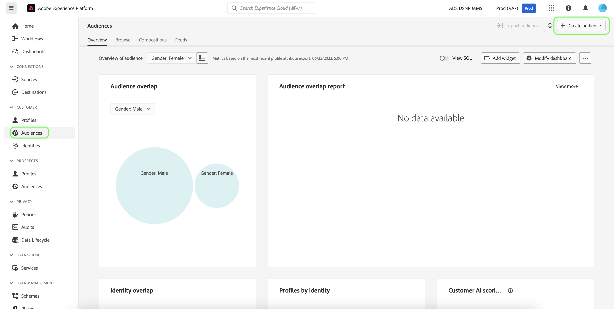

# Maak klantsegmenten met voorspelde scores

Wanneer een voorspelling is voltooid, worden voorspelde scores voor de dichtheid automatisch verbruikt door Profielen. Door profielen te verrijken met AI-scores van de Klant, kunnen klantsegmenten worden gemaakt om een publiek te zoeken op basis van hun populatiescore. Deze sectie verstrekt stappen voor het creëren van segmenten gebruikend de Bouwer van het Segment. Voor een robuustere zelfstudie bij het creëren van segmenten, gelieve de [&#x200B; gebruikersgids van de Bouwer van het Segment &#x200B;](../../../segmentation/ui/segment-builder.md) te zien.

>[!IMPORTANT]
>
>Om deze methode te gebruiken, moet het Profiel van de Klant in real time voor de dataset worden toegelaten.

Klik in de gebruikersinterface van Experience Platform op **[!UICONTROL Segments]** in de linkernavigatie en klik vervolgens op **[!UICONTROL Create segment]** .

De **Bouwer van het Segment** verschijnt. Klik in de linkerkolom **[!UICONTROL Fields]** en onder de tab **[!UICONTROL Attributes]** op de map met de naam **[!UICONTROL XDM Individual Profile]** en klik vervolgens op de map met de naamruimte van uw organisatie. De map met de naam **[!UICONTROL Customer AI]** bevat de resultaten van voorspelling en krijgt een naam na de instantie waartoe de scores behoren. Klik op een instantiemap om de resultaten van de gewenste instantie te openen.

Bevestigd in het centrum van de Bouwer van het Segment, sleep en laat vallen de **[!UICONTROL Score]** attributen op het *canvas van de regelbouwer* om een regel te bepalen.

Onder de rechtse *eigenschappen van het Segment* kolom, verstrek een naam voor het segment.

Boven de linkerhand *kolom van Gebieden*, klik het **tandwiel** pictogram en selecteer het beleid van de a *Fusie* van drop-down. Klik op **[!UICONTROL Save]** om het segment te maken.

## Volgende stappen

Door deze zelfstudie te volgen, hebt u een publiek gevonden dat is gebaseerd op hun populiteitsscores met de Segment Builder. U kunt uw publiek nu richten door hen aan bestemmingen te activeren. Zie het [&#x200B; overzicht van bestemmingen &#x200B;](../../../destinations/home.md) voor meer informatie.
