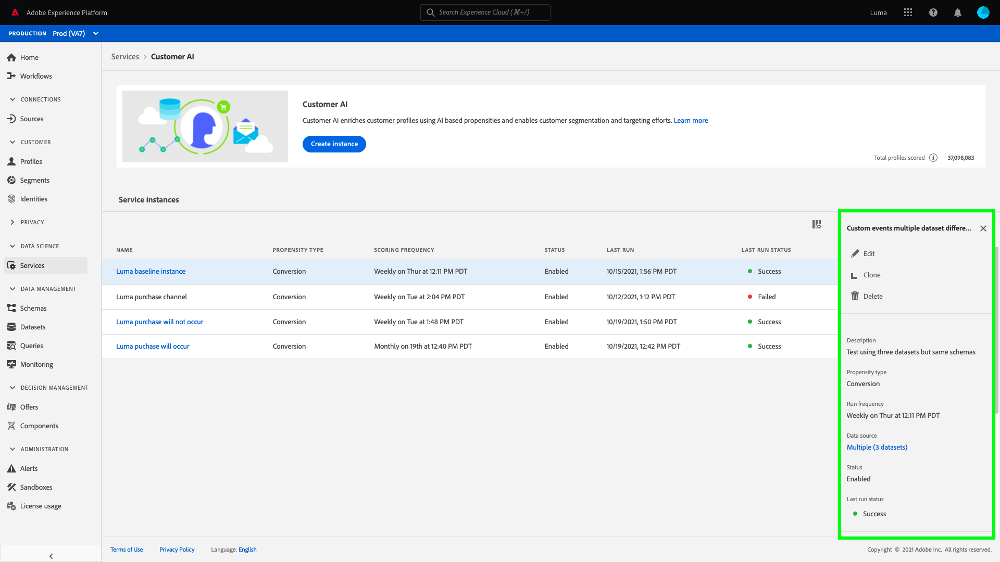

# Inzichten met Customer AI ontdekken

Klantenservice AI biedt marketers de mogelijkheid om Adobe Sensei te gebruiken om te anticiperen op wat uw klanten de volgende actie zullen gaan ondernemen. AI van de Klant wordt gebruikt om aangepaste eigenschapscores zoals kurn en omzetting voor individuele profielen op schaal te produceren. Dit wordt verwezenlijkt zonder het moeten de bedrijfsbehoeften aan een machine het leren probleem omzetten, het kiezen van een algoritme, een opleiding, of plaatsing.

Dit document fungeert als hulpmiddel bij de interactie met de inzichten van serviceversies in de Intelligent Services Customer AI-gebruikersinterface.

## Aan de slag

Om inzichten voor Klant AI te gebruiken, moet u een de dienstinstantie hebben met een succesvolle looppasstatus beschikbaar. Als u een nieuwe service-instantie wilt maken, gaat u naar [Een Customer AI-instantie configureren](./configure.md). Als u onlangs een de dienstinstantie creeerde en het nog opleidt en het scoring, gelieve 24 uren voor het te beëindigen loopt.

## Overzicht van serviceexemplaar

Klik in de gebruikersinterface [!DNL Adobe Experience Platform] op **[!UICONTROL Services]** in de linkernavigatie. De browser *Services* wordt weergegeven en geeft de beschikbare Intelligente services weer. Klik in de container voor Customer AI op **[!UICONTROL Open]**.

De de dienstpagina van AI van de Klant verschijnt. Deze pagina bevat een overzicht van de service-instanties van de AI van de Klant en geeft informatie over deze instanties, zoals de naam van het exemplaar, het type van de Propensiteit, hoe vaak het exemplaar wordt uitgevoerd en de status van de laatste update.

>[!NOTE]
>
>Slechts hebben de de dienstinstanties die succesvolle het scoren looppas hebben voltooid inzicht.

Klik op de naam van een service-instantie om te beginnen.

Vervolgens wordt de pagina met inzichten voor die service-instantie weergegeven, waarin u de gegevens kunt visualiseren. De visualisaties en wat u kunt doen met de gegevens worden in deze handleiding gedetailleerder uitgelegd.

### Details van serviceinstantie

Er zijn twee manieren om de details van de de dienstinstantie te bekijken: van het dashboard of in de service-instantie.

Om een overzicht van de details van de de dienstinstantie binnen het dashboard te bekijken, selecteer een container van de de dienstinstantie, vermijdend de hyperlink die aan de naam in bijlage is. Dit opent een rechterspoor dat extra details verstrekt. De besturingselementen bevatten het volgende:

- **[!UICONTROL Bewerken]**: Als u  **** Bewerken selecteert, kunt u een bestaande service-instantie wijzigen. U kunt de naam, de beschrijving en de scorefrequentie van de instantie bewerken.
- **[!UICONTROL Klonen]**: Als u  **** Clonecopies selecteert, wordt de momenteel geselecteerde service-instantie ingesteld. Vervolgens kunt u de workflow wijzigen om kleine tweaks te maken en deze een nieuwe naam te geven.
- **[!UICONTROL Verwijderen]**: U kunt een de dienstinstantie, met inbegrip van om het even welke historische looppas schrappen.
- **[!UICONTROL Gegevensbron]**: Een koppeling naar de gegevensset die door dit exemplaar wordt gebruikt.
- **[!UICONTROL Uitvoerfrequentie]**: Hoe vaak en wanneer een scoring wordt uitgevoerd.
- **[!UICONTROL Score-definitie]**: Een snel overzicht van het doel u voor deze instantie vormde.

>[!NOTE]
>
>Als een scoring mislukt, wordt een foutbericht weergegeven. Het foutbericht wordt weergegeven onder **Laatste run details** in de rechterrail die alleen zichtbaar is voor mislukte uitvoering.

De tweede manier om extra details voor een de dienstinstantie te bekijken wordt gevestigd binnen de inzichten pagina. U kunt **[!UICONTROL Meer weergeven]** in de rechterbovenhoek klikken om een vervolgkeuzelijst te vullen. De details worden vermeld zoals de score, toen het werd gecreeerd, en het type van dichtheid. Voor meer informatie over om het even welke vermelde eigenschappen, te bezoeken [Vormend een instantie van AI van de Klant](./configure.md).

### Een instantie bewerken

Als u een instantie wilt bewerken, klikt u op **[!UICONTROL Bewerken]** in de navigatie rechtsboven.

Het dialoogvenster Bewerken wordt weergegeven. In dit dialoogvenster kunt u de naam, beschrijving, status en scorefrequentie van de instantie bewerken. Als u uw wijzigingen wilt bevestigen en het dialoogvenster wilt sluiten, selecteert u **[!UICONTROL Opslaan]** in de rechterbenedenhoek.

### Meer handelingen

De **[!UICONTROL Meer acties]** knoop wordt gevestigd in de top-juiste navigatie naast **[!UICONTROL Edit]**. Als u op **[!UICONTROL Meer handelingen]** klikt, wordt een vervolgkeuzelijst geopend waarmee u een van de volgende bewerkingen kunt selecteren:

- **[!UICONTROL Klonen]**: Als u Clonecopies selecteert, wordt de service-instantie ingesteld.  **** Vervolgens kunt u de workflow wijzigen om kleine tweaks te maken en deze een nieuwe naam te geven.
- **[!UICONTROL Verwijderen]**: Hiermee wordt de instantie verwijderd.
- **[!UICONTROL Toegangscores]**: Als u  **[!UICONTROL Access-]** scoresopent een dialoogvenster met een koppeling naar de  [downloadscores voor de ](./download-scores.md) zelfstudie van de Klant, wordt in het dialoogvenster ook de id van de dataset weergegeven die is vereist voor het uitvoeren van API-aanroepen.
- **[!UICONTROL Runtimegeschiedenis]** weergeven: Er wordt een dialoogvenster weergegeven met een lijst van alle scores die zijn gekoppeld aan de service-instantie.

## Scoresamenvatting {#scoring-summary}

In het overzicht met de scores wordt het totale aantal profielen weergegeven met een score en worden de profielen ingedeeld in emmers met een hoge, gemiddelde en lage dichtheid. De dichtheidsemmers worden bepaald op basis van het score-bereik, laag is minder dan 24, gemiddeld 25 tot 74 en hoog is boven 74. Elk emmertje heeft een kleur die overeenkomt met de legenda.

>[!NOTE]
>
>Als het een conversiesnelheidsscore is, worden de hoge scores groen en de lage scores rood weergegeven. Als je de eigenheid van de kroon voorspelt, wordt deze gespiegeld, dan zijn de hoge scores rood en zijn de lage scores groen. Het gemiddelde emmertje blijft geel ongeacht welk aandrijvingstype u kiest.

U kunt over om het even welke kleur op de ring houden om extra informatie, zoals een percentage en totaal aantal profielen te bekijken die tot een emmertje behoren.

## Verdeling van scores

De **[!UICONTROL Verdeling van Scores]** kaart geeft u een visuele samenvatting van de populatie die op de score wordt gebaseerd. De kleuren die u in [!UICONTROL Distributie van Scores] kaart ziet vertegenwoordigen het type van geproduceerde aandrijvingsscore. Als u de muis boven een van de scoringdistributies houdt, wordt het exacte aantal dat bij die distributie hoort, weergegeven.

## Influentiële factoren

Voor elk scoreemmertje, wordt een kaart geproduceerd die de hoogste 10 invloedrijke factoren voor dat emmertje toont. De invloedrijke factoren geven u extra details over waarom uw klanten tot diverse punthaken behoren.

### Influentiefactor-drilldowns

Als u de gegevens boven een van de invloedrijke factoren houdt, worden de gegevens verder uitgesplitst. U krijgt een overzicht van de redenen waarom bepaalde profielen tot een eigenschapsemmer behoren. Afhankelijk van de factor, kunt u aantal, categorische, of booleaanse waarden worden gegeven. In het onderstaande voorbeeld worden categorische waarden per regio weergegeven.

Bovendien, gebruikend boor-downs, kunt u een distributiefactor vergelijken als het in twee of meer aandrijvingsemmers voorkomt en specifiekere segmenten tot stand brengen met deze waarden. In het volgende voorbeeld wordt het eerste gebruiksgeval geïllustreerd:

U ziet dat profielen met een lage conversiemogelijkheid waarschijnlijk geen recent bezoek hebben gebracht aan de webpagina&#39;s van adobe.com. De factor &quot;Dagen sinds laatste webVisit&quot; heeft slechts een dekking van 8%, vergeleken met 26% in profielen met gemiddelde neiging. Met deze getallen kunt u de verdeling binnen elk emmertje voor de factor vergelijken. Deze informatie kan worden gebruikt om te concluderen dat de recentie in webbezoek niet zo invloedrijk is in het emmertje met lage dichtheid als in het emmer met gemiddelde dichtheid.

### Een segment maken

Als u de knop **[!UICONTROL Segment maken]** in een van de emmers selecteert voor lage, gemiddelde en hoge dichtheid, wordt u omgeleid naar de segmentbuilder.

>[!NOTE]
>
>De **[!UICONTROL Create Segment]** knoop is slechts beschikbaar als het Profiel van de Klant in real time voor de dataset wordt toegelaten. Voor meer informatie over hoe te om het Profiel van de Klant in real time toe te laten, bezoek [Overzicht van het Profiel van de Klant in real time](../../../rtcdp/overview.md).

De segmentbouwer wordt gebruikt om een segment te bepalen. Als u **[!UICONTROL Segment maken]** op de pagina Inzichten selecteert, wordt de geselecteerde informatie over emmers automatisch door de Klant-AI aan het segment toegevoegd. Als u het maken van het segment wilt voltooien, vult u gewoon de *Naam*- en *Beschrijving*-containers in die zich in de rechterrail van de gebruikersinterface van de segmentbuilder bevinden. Nadat u het segment een naam en een beschrijving hebt gegeven, klik **[!UICONTROL sparen]** in het hoogste recht.

>[!NOTE]
>
>Aangezien de eigenschapscores naar het individuele profiel worden geschreven, zijn ze net als andere profielkenmerken beschikbaar in de Segment Builder. Wanneer u aan de segmentbouwer navigeert om nieuwe segmenten tot stand te brengen kunt u alle diverse bezitsscores onder uw namespaceKlant AI zien.

Om uw nieuw segment in Platform UI te bekijken, klik **[!UICONTROL Segmenten]** in de linkernavigatie. De **[!UICONTROL Browse]** pagina verschijnt en toont alle beschikbare segmenten.

## Volgende stappen

In dit document worden de inzichten geschetst die door een AI-serviceexemplaar van een klant worden verschaft. U kunt nu doorgaan met de zelfstudie over het downloaden van scores in AI](./download-scores.md) van de klant of door de andere [Adobe Intelligente services](../../home.md)-hulplijnen bladeren die worden aangeboden.[

## Aanvullende bronnen

In de volgende video wordt beschreven hoe u de uitvoer van de modellen en invloedrijke factoren kunt bekijken aan de hand van Customer AI.

>[!VIDEO](https://video.tv.adobe.com/v/32666?learn=on&quality=12)