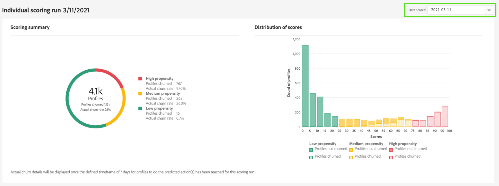

# Inzichten met Customer AI ontdekken

Klantenservice AI biedt marketers de mogelijkheid om Adobe Sensei te gebruiken om te anticiperen op wat uw klanten de volgende actie zullen gaan ondernemen. Klant-AI wordt gebruikt om aangepaste eigenschapscores zoals churn en conversie voor individuele profielen op schaal te genereren. Dit wordt verwezenlijkt zonder het moeten de bedrijfsbehoeften aan een machine het leren probleem omzetten, het kiezen van een algoritme, een opleiding, of plaatsing.

Dit document fungeert als hulpmiddel bij de interactie met de inzichten van serviceversies in de Intelligent Services Customer AI-gebruikersinterface.

## Aan de slag

Om inzichten voor Klant AI te gebruiken, moet u een de dienstinstantie hebben met een succesvolle looppasstatus beschikbaar. Om een nieuwe de dienstinstantie tot stand te brengen bezoek [&#x200B; Vormend een instantie van de Klant AI &#x200B;](./configure.md). Als u onlangs een de dienstinstantie creeerde en het nog opleidt en het scoring, gelieve 24 uren voor het te beëindigen loopt.

## Overzicht van serviceexemplaar

Selecteer in de gebruikersinterface van [!DNL Adobe Experience Platform] de optie **[!UICONTROL Services]** in de linkernavigatie. De *browser van de Diensten* verschijnt en toont beschikbare Intelligente Diensten. Selecteer **[!UICONTROL Open]** in de container voor AI van klant.

De de dienstpagina van AI van de Klant verschijnt. Deze pagina bevat een overzicht van de service-instanties van de AI van de Klant en geeft informatie over deze instanties, zoals de naam van het exemplaar, het type van de Propensiteit, hoe vaak het exemplaar wordt uitgevoerd en de status van de laatste update.

>[!NOTE]
>
>Slechts hebben de de dienstinstanties die succesvolle het scoren looppas hebben voltooid inzicht.

Selecteer de naam van een service-instantie om te beginnen.

Vervolgens wordt de pagina met inzichten voor die service-instantie weergegeven met de optie om **[!UICONTROL Latest scores]** of **[!UICONTROL Performance summary]** te selecteren. Het standaardtabblad **[!UICONTROL Latest scores]** biedt visualisaties van uw gegevens. De visualisaties en wat u kunt doen met de gegevens worden in deze handleiding gedetailleerder uitgelegd.

Op het tabblad **[!UICONTROL Performance summary]** worden de werkelijke churn- of conversiesnelheden voor elk eigenschapemmertje weergegeven. Om meer te leren, zie de sectie over [&#x200B; samenvattingsmetriek van prestaties &#x200B;](#performance-metrics).

## Details van serviceinstantie

Er zijn twee manieren om de details van de de dienstinstantie te bekijken: van het dashboard of binnen de de dienstinstantie.

### Service-exemplaar dashboard

Om een overzicht van de details van de de dienstinstantie binnen het dashboard te bekijken, selecteer een container van de de dienstinstantie, vermijdend de hyperlink die aan de naam in bijlage is. Dit opent een rechterspoor dat extra details verstrekt. De besturingselementen bevatten het volgende:

- **[!UICONTROL Edit]**: als u **[!UICONTROL Edit]** selecteert, kunt u een bestaande service-instantie wijzigen. U kunt de naam, de beschrijving en de scorefrequentie van de instantie bewerken.
- **[!UICONTROL Clone]**: als u **[!UICONTROL Clone]** selecteert, wordt de momenteel geselecteerde service-instantie gekopieerd. Vervolgens kunt u de workflow wijzigen om kleine tweaks te maken en deze een nieuwe naam te geven.
- **[!UICONTROL Delete]**: U kunt een de dienstinstantie, met inbegrip van om het even welke historische looppas schrappen.
- **[!UICONTROL Data source]**: Een koppeling naar de gegevensset die door dit exemplaar wordt gebruikt.
- **[!UICONTROL Run Frequency]**: Hoe vaak wordt een scoring uitgevoerd en wanneer.
- **[!UICONTROL Score definition]**: Een kort overzicht van het doel dat u voor deze instantie hebt geconfigureerd.

>[!NOTE]
>
>Als een scoring mislukt, wordt een foutbericht weergegeven. Het foutenbericht wordt vermeld onder **Laatste looppas details** in het juiste spoor dat slechts zichtbaar aan ontbroken looppas is.

### Meer inzichten weergeven vervolgkeuzelijst

De tweede manier om extra details voor een de dienstinstantie te bekijken wordt gevestigd binnen de inzichten pagina. Selecteer **[!UICONTROL Show more]** rechtsboven om een vervolgkeuzelijst te vullen. De details zijn vermeld zoals de scoredefinitie, toen het werd gecreeerd, het aandrijvingstype, en de gebruikte datasets. Voor meer informatie over om het even welke vermelde eigenschappen, gelieve te bezoeken [&#x200B; Vormend een instantie van de Klant AI &#x200B;](./configure.md).

### Voorvertoning van AI-gegevensset van klant

Als de AI van de Klant meer dan één dataset gebruikt, wordt een hyperlink met het label **[!UICONTROL Multiple]** gevolgd door het aantal datasets tussen haakjes `()` verstrekt.

Als u de koppeling met meerdere gegevenssets selecteert, wordt de voorvertoning van de AI-gegevensset van de klant geopend. Elke kleur in de voorvertoning vertegenwoordigt een gegevensset zoals deze wordt weergegeven door de kleurtoets links van de kolommen in de gegevensset. In dit voorbeeld, kunt u zien dat slechts **Dataset 1** de `PROP1` kolom bevat.

### Een instantie bewerken

Als u een instantie wilt bewerken, selecteert u **[!UICONTROL Edit]** in de navigatie rechtsboven.

Het dialoogvenster Bewerken wordt weergegeven. In dit dialoogvenster kunt u de naam, beschrijving, status en scorefrequentie van de instantie bewerken. Als u de wijzigingen wilt bevestigen en het dialoogvenster wilt sluiten, selecteert u **[!UICONTROL Save]** in de rechterbenedenhoek.

### Meer acties

De knop **[!UICONTROL More actions]** bevindt zich in de navigatie rechtsboven naast **[!UICONTROL Edit]** . Als u **[!UICONTROL More actions]** selecteert, wordt een vervolgkeuzelijst geopend waarin u een van de volgende bewerkingen kunt selecteren:

- **[!UICONTROL Clone]**: als u **[!UICONTROL Clone]** selecteert, wordt de service-instantie gekopieerd. Vervolgens kunt u de workflow wijzigen om kleine tweaks te maken en deze een nieuwe naam te geven.
- **[!UICONTROL Delete]** : hiermee verwijdert u de instantie.
- **[!UICONTROL Access scores]**: Het selecteren **[!UICONTROL Access scores]** opent een dialoog die een verbinding verstrekt aan [&#x200B; downloadend scores voor Klant AI &#x200B;](./download-scores.md) leerprogramma, verstrekt de dialoog ook dataset identiteitskaart die voor het maken van API vraag wordt vereist.
- **[!UICONTROL View run history]**: Er wordt een dialoogvenster weergegeven met een lijst van alle scores die zijn gekoppeld aan de service-instantie.

## Overzicht van scores {#scoring-summary}

In het overzicht met de scores wordt het totale aantal profielen weergegeven met een score en worden de profielen ingedeeld in emmers met een hoge, gemiddelde en lage dichtheid. De dichtheidsemmers worden bepaald op basis van het score-bereik, laag is minder dan 24, gemiddeld 25 tot 74 en hoog is boven 74. Elk emmertje heeft een kleur die overeenkomt met de legenda.

>[!NOTE]
>
>Als het een conversiesnelheidsscore is, worden de hoge scores groen en de lage scores rood weergegeven. Als je de eigenheid van de kroon voorspelt, wordt deze gespiegeld, dan zijn de hoge scores rood en zijn de lage scores groen. Het gemiddelde emmertje blijft geel ongeacht welk aandrijvingstype u kiest.

U kunt over om het even welke kleur op de ring houden om extra informatie, zoals een percentage en totaal aantal profielen te bekijken die tot een emmertje behoren.

## Verdeling van scores

De **[!UICONTROL Distribution of Scores]** -kaart geeft u een visuele samenvatting van de populatie op basis van de score. De kleuren die u in de [!UICONTROL Distribution of Scores] -kaart ziet, vertegenwoordigen het type van de gegenereerde densiteitsscore. Als u de muis boven een van de scoringdistributies houdt, wordt het exacte aantal dat bij die distributie hoort, weergegeven.

## Influentiële factoren

Voor elk scoreemmertje, wordt een kaart geproduceerd die de hoogste 10 invloedrijke factoren voor dat emmertje toont. De invloedrijke factoren geven u extra details over waarom uw klanten tot diverse punthaken behoren.

### Influentiefactor-drilldowns

Als u de gegevens boven een van de invloedrijke factoren houdt, worden de gegevens verder uitgesplitst. U krijgt een overzicht van de redenen waarom bepaalde profielen tot een eigenschapsemmer behoren. Afhankelijk van de factor, kunt u aantal, categorische, of booleaanse waarden worden gegeven. In het onderstaande voorbeeld worden categorische waarden per regio weergegeven.

Bovendien, gebruikend boor-downs, kunt u een distributiefactor vergelijken als het in twee of meer aandrijvingsemmers voorkomt en specifiekere segmenten tot stand brengen met deze waarden. In het volgende voorbeeld wordt het eerste gebruiksgeval geïllustreerd:

U ziet dat profielen met een lage conversiesnelheid waarschijnlijk geen recent bezoek hebben gebracht aan de adobe.com-webpagina&#39;s. De factor &quot;Dagen sinds laatste webVisit&quot; heeft slechts een dekking van 8%, vergeleken met 26% in profielen met gemiddelde neiging. Met deze getallen kunt u de verdeling binnen elk emmertje voor de factor vergelijken. Deze informatie kan worden gebruikt om te concluderen dat de recentie in webbezoek niet zo invloedrijk is in het emmertje met lage dichtheid als in het emmer met gemiddelde dichtheid.

### Een segment maken

Als u de knop **[!UICONTROL Create Segment]** in een van de emmers selecteert voor lage, gemiddelde en hoge dichtheid, wordt u omgeleid naar de segmentbuilder.

>[!NOTE]
>
>De knop **[!UICONTROL Create Segment]** is alleen beschikbaar als Real-Time klantprofiel is ingeschakeld voor de gegevensset. Voor meer informatie over hoe te om het Profiel van de Klant in real time toe te laten, bezoek het [&#x200B; overzicht van het Profiel van de Klant in real time &#x200B;](../../../rtcdp/overview.md).

De segmentbouwer wordt gebruikt om een segment te bepalen. Als u **[!UICONTROL Create Segment]** selecteert op de pagina Insights, voegt de AI van de Klant automatisch de geselecteerde emmers-informatie toe aan het segment. Om uw segment te beëindigen, vul eenvoudig de **Naam** en **Beschrijving** containers in die in de juiste spoorlijn van het gebruikersinterface van de segmentbouwer worden gevestigd. Nadat u het segment een naam en een beschrijving hebt gegeven, selecteert u **[!UICONTROL Save]** rechtsboven.

>[!NOTE]
>
>Aangezien de eigenschapscores naar het individuele profiel worden geschreven, zijn ze net als andere profielkenmerken beschikbaar in de Segment Builder. Wanneer u aan de segmentbouwer navigeert om nieuwe segmenten tot stand te brengen kunt u alle diverse bezitsscores onder uw namespaceKlant AI zien.

Als u het nieuwe segment wilt weergeven in de gebruikersinterface van Experience Platform, selecteert u **[!UICONTROL Segments]** in de linkernavigatie. De pagina **[!UICONTROL Browse]** wordt weergegeven en alle beschikbare segmenten worden weergegeven.

## Historische prestaties {#historical-performance}

Op het tabblad **[!UICONTROL Performance summary]** worden de werkelijke churn- of conversiesnelheden weergegeven, gescheiden in elk van de door de AI van de Klant gescoorde eigenschapsegmenten.

In eerste instantie worden alleen de verwachte snelheden (stippellijnen) weergegeven. De verwachte tarieven worden getoond wanneer een het scoren looppas niet is voorgekomen en de gegevens nog niet beschikbaar zijn. Zodra een resultaatvenster echter voorbij is, wordt het verwachte tarief vervangen door een werkelijk tarief (stevige lijn).

Als u de muis boven de regels houdt, worden de datum en de werkelijke/verwachte frequentie voor die dag in dat emmertje weergegeven.

U kunt het tijdkader filteren voor de verwachte en daadwerkelijke tarieven die worden getoond. Selecteer het **kalenderpictogram**  dan selecteren een nieuwe datumwaaier. De resultaten in elk van de emmers worden bijgewerkt om binnen het nieuwe datumbereik weer te geven.

### Afzonderlijke scores

In de onderste helft van de tab **[!UICONTROL Performance summary]** worden de resultaten voor elke afzonderlijke score weergegeven. Selecteer de vervolgkeuzedatum rechtsboven om de resultaten voor een andere scoring te bekijken.

Afhankelijk van het feit of u een tekenreeks of conversie voorspelt, wordt in de grafiek [!UICONTROL Distribution of Scores] de verdeling weergegeven van profielen die in elke stap zijn geselecteerd/omgezet en die niet zijn ingechurd/niet zijn omgezet.

## Modelevaluatie {#model-evaluation}

Naast het volgen van de voorspelde en daadwerkelijke resultaten in tijd op het Historische lusje van Prestaties, hebben de marketers nog meer transparantie over modelkwaliteit met het Modellusje van de Evaluatie. Met de diagrammen Lift en Gains kunt u de verschillen bepalen bij het gebruik van een voorspellend model in plaats van een willekeurige keuze. Bovendien kunt u bepalen hoeveel positieve resultaten bij elke score worden vastgelegd. Dit is nuttig voor segmentatie en voor het in overeenstemming brengen van rendement van investering met marketing acties.

### Liftdiagram

De liftgrafiek meet de verbetering van het gebruik van een voorspellend model in plaats van een willekeurige gerichtheid.

Tot de indicatoren voor kwaliteitsmodellen behoren:

- De hoge waarden van de lift in de eerste paar deciles. Dit betekent dat het model goed is in het identificeren van de gebruikers met de hoogste neiging om de actie van belang te ondernemen.
- Waarden voor aflopende lift. Dit betekent dat klanten met hogere scores meer geneigd zijn om de actie van interesse te ondernemen dan mensen met lagere scores.

### Winstgrafiek

Het cumulatieve winstschema meet het percentage positieve resultaten dat wordt bereikt door scores boven een bepaalde drempel te richten. Na het sorteren van de klanten door middel van een prioriteitsscore van hoog naar laag, wordt de populatie opgesplitst in tientallen groepen van gelijke grootte. Een perfect model zou alle positieve resultaten in het hoogste score deciles vangen. Een basismethode voor willekeurige doelwitten legt positieve resultaten vast in verhouding tot de grootte van de groep - 30% van de gebruikers zou 30% van de resultaten vastleggen.

Tot de indicatoren voor kwaliteitsmodellen behoren:

- De cumulatieve winsten naderen snel 100%.
- De cumulatieve winstcurve voor het model ligt dichter bij de linkerbovenhoek van het diagram.
- De cumulatieve winstgrafiek kan worden gebruikt om de score te bepalen voor segmentatie en het richten. Als het model bijvoorbeeld 70% van de positieve resultaten in de eerste 2 score deciles vastlegt, wordt verwacht dat gebruikers met PercentileScore > 80 ongeveer 70% van de positieve resultaten zullen vastleggen.

### AUC (Gebied onder de curve)

De AUC weerspiegelt de sterkte van de verhouding tussen de rangschikking door score en het voorkomen van het voorspelde doel. Een **AUC** van 0.5 betekent het model niet beter dan een willekeurige gissing is. Een **AUC** van 1 betekent het model kan perfect voorspellen wie de relevante actie zal nemen.

## Volgende stappen

In dit document worden de inzichten geschetst die door een AI-serviceexemplaar van een klant worden verschaft. U kunt nu aan het leerprogramma op [&#x200B; downloaden scores in Klant AI &#x200B;](./download-scores.md) voortzetten of de andere [&#x200B; Intelligente Diensten van Adobe &#x200B;](../../home.md) gidsen doorbladeren die worden aangeboden.

## Aanvullende bronnen

In de volgende video wordt beschreven hoe u de uitvoer van de modellen en invloedrijke factoren kunt bekijken aan de hand van de AI van de klant.

>[!VIDEO](https://video.tv.adobe.com/v/32666?learn=on&quality=12)
