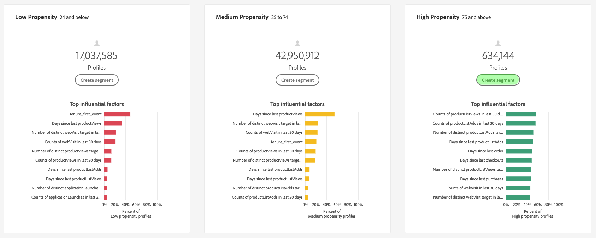

# Informatie over inzichten met Customer AI

Klantenservice AI biedt marketers de mogelijkheid om Adobe Sensei te gebruiken om te anticiperen op wat de volgende actie van uw klanten zal zijn. AI van de Klant wordt gebruikt om aangepaste eigenschapscores zoals kurn en omzetting voor individuele profielen op schaal te produceren. Dit wordt verwezenlijkt zonder het moeten de bedrijfsbehoeften aan een machine het leren probleem omzetten, het kiezen van een algoritme, een opleiding, of plaatsing.

Dit document fungeert als hulpmiddel bij de interactie met de inzichten van serviceversies in de Intelligent Services Customer AI-gebruikersinterface.

## Aan de slag

Om inzichten voor Klant AI te gebruiken, moet u een de dienstinstantie hebben met een succesvolle looppasstatus beschikbaar. Ga naar [Een Customer AI-instantie](./configure.md)configureren om een nieuwe service-instantie te maken. Als u onlangs een de dienstinstantie creeerde en het nog opleidt en het scoring, gelieve 24 uren voor het te beëindigen loopt.

## Overzicht van serviceexemplaar

Klik in de [!DNL Adobe Experience Platform] gebruikersinterface op **[!UICONTROL Services]** in de linkernavigatie. De browser van de *Diensten* verschijnt en toont beschikbare Intelligente Diensten. Klik in de container voor Customer AI op **[!UICONTROL Openen]**.

De de dienstpagina van AI van de Klant verschijnt. Deze pagina bevat een overzicht van de service-instanties van de AI van de Klant en geeft informatie over deze instanties, zoals de naam van het exemplaar, het type van de Propensiteit, hoe vaak het exemplaar wordt uitgevoerd en de status van de laatste update.

>[!NOTE] Slechts hebben de de dienstinstanties die succesvolle het scoren looppas hebben voltooid inzicht.

Klik op de naam van een service-instantie om te beginnen.

Vervolgens wordt de pagina met inzichten voor die service-instantie weergegeven, waarin u de gegevens kunt visualiseren. De visualisaties en wat u kunt doen met de gegevens worden in deze handleiding gedetailleerder uitgelegd.

### Details van serviceinstantie

Er zijn twee manieren om de details van de de dienstinstantie te bekijken, eerste is van het dashboard en tweede van binnen de de dienstinstantie.

Als u details wilt weergeven vanuit het dashboard, klikt u op een servicecontainer waarbij de hyperlink die aan de naam is gekoppeld, wordt vermeden. Hierdoor wordt een rechterspoor geopend dat aanvullende details biedt zoals de beschrijving, de scorefrequentie, het voorspellingsdoel en de in aanmerking komende bevolking. Daarnaast kunt u desgewenst het exemplaar bewerken en verwijderen door op **[!UICONTROL Bewerken]** of **[!UICONTROL Verwijderen]** te klikken.

>[!NOTE] Als een scoring mislukt, wordt een foutbericht weergegeven. Het foutbericht wordt weergegeven onder *Laatste run details* in de rechterrail die alleen zichtbaar is voor mislukte run.

De tweede manier om extra details voor een de dienstinstantie te bekijken wordt gevestigd binnen de inzichten pagina. U kunt op Meer **** tonen rechtsboven klikken om een vervolgkeuzelijst te vullen. De details worden vermeld zoals de score, toen het werd gecreeerd, en het type van dichtheid. Voor meer informatie over om het even welke vermelde eigenschappen, gelieve te bezoeken het [Vormen van een Instantie](./configure.md)van de Klant AI.

### Een instantie bewerken

Als u een instantie wilt bewerken, klikt u op **[!UICONTROL Bewerken]** in de navigatie rechtsboven.

Het dialoogvenster Bewerken wordt geopend, waarin u de *beschrijving* en *scorefrequentie* van de instantie kunt bewerken. Klik in de rechterbenedenhoek op **[!UICONTROL Bewerken]** om de wijzigingen te bevestigen en het dialoogvenster te sluiten.

### Meer handelingen

De knop **[!UICONTROL Meer handelingen]** bevindt zich in de navigatie rechtsboven naast **[!UICONTROL Bewerken]**. Klik op **[!UICONTROL Meer handelingen]** om een vervolgkeuzelijst te openen waarin u een van de volgende bewerkingen kunt selecteren:

- **[!UICONTROL Verwijderen]**: Hiermee wordt de instantie verwijderd.
- **[!UICONTROL Toegangscores]**: Als u op *Toegangsscores* klikt, wordt een dialoogvenster geopend met een koppeling naar de [downloadscores voor de zelfstudie van Customer AI](./download-scores.md) . Het dialoogvenster bevat ook de id van de gegevensset die is vereist voor het uitvoeren van API-aanroepen.
- **[!UICONTROL Runtimegeschiedenis]** weergeven: Er wordt een dialoogvenster weergegeven met een lijst van alle scores die zijn gekoppeld aan de service-instantie.

## Scoreoverzicht {#scoring-summary}

Scoreoverzicht geeft het totale aantal profielen weer dat wordt gescoord en categoriseert deze in emmers met een hoge, gemiddelde en lage dichtheid. De dichtheidsemmers worden bepaald op basis van het score-bereik, laag is minder dan 24, gemiddeld 25 tot 74 en hoog is boven 74. Elk emmertje heeft een kleur die overeenkomt met de legenda.

>[!NOTE] Als het een conversiesnelheidsscore is, worden de hoge scores groen en de lage scores rood weergegeven. Als je de eigenheid van de kroon voorspelt, wordt deze gespiegeld, dan zijn de hoge scores rood en zijn de lage scores groen. Het gemiddelde emmertje blijft geel ongeacht welk aandrijvingstype u kiest.

## Verdeling van scores

De *Verspreiding van Scores* kaart geeft u een visuele samenvatting van de bevolking die op de score wordt gebaseerd. De kleuren die u in de *Verdeling van Scores* kaart ziet vertegenwoordigen het type van geproduceerde aandrijvingsscore.

## Influentiële factoren

Voor elk scoreemmertje, wordt een kaart geproduceerd die de hoogste 10 invloedrijke factoren voor dat emmertje toont. De invloedrijke factoren geven u extra details over waarom uw klanten tot diverse punthaken behoren.

### Een segment maken

Als u klikt op de knop Segment **** maken in een van de emmers voor Laag, Normaal en Hoog, wordt u omgeleid naar de segmentbuilder.

>[!NOTE]
>De **[!UICONTROL Create knoop van het Segment]** is slechts beschikbaar als het Profiel van de Klant in real time voor de dataset wordt toegelaten. Voor meer informatie over hoe te om het Profiel van de Klant in real time toe te laten, bezoek het overzicht [van het Profiel van de Klant in](../../../rtcdp/overview.md)real time.

De segmentbouwer wordt gebruikt om een segment te bepalen. Als u Segment **** maken selecteert op de pagina Insights, wordt automatisch de geselecteerde buckets-informatie toegevoegd aan het segment. Als u klaar bent met het maken van uw segment, vult u gewoon de containers *Name* en *Description* in die zich in de rechterrail van de gebruikersinterface van de segmentbuilder bevinden. Nadat u een naam en een beschrijving voor het segment hebt gegeven, klikt u rechtsboven op **[!UICONTROL Opslaan]** .

>!![NOTE] Aangezien de eigenschapscores naar het individuele profiel worden geschreven, zijn ze net als andere profielkenmerken beschikbaar in de Segment Builder. Wanneer u aan de segmentbouwer navigeert om nieuwe segmenten tot stand te brengen kunt u alle diverse bezitsscores onder uw namespaceKlant AI zien.

Klik op **[!UICONTROL Segmenten]** in de linkernavigatie om het nieuwe segment in de interface van het platform weer te geven. De pagina *Bladeren* wordt weergegeven met alle beschikbare segmenten.

## Volgende stappen

In dit document worden de inzichten geschetst die door een AI-serviceexemplaar van een klant worden verschaft. U kunt nu doorgaan met de zelfstudie over het [downloaden van scores in Customer AI](./download-scores.md) of door de andere gidsen van [Adobe Intelligent Services](../../home.md) bladeren die worden aangeboden.

## Aanvullende bronnen

In de volgende video wordt beschreven hoe u de uitvoer van de modellen en invloedrijke factoren kunt bekijken aan de hand van Customer AI.

>[!VIDEO](https://video.tv.adobe.com/v/32666?learn=on&quality=12)