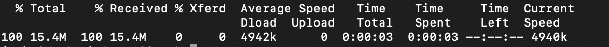

# Muziek downloaden in AI van klant

Dit document fungeert als richtlijn voor het downloaden van scores voor AI-bestanden van de Klant.

## Aan de slag

Met AI van de klant kunt u scores downloaden in de bestandsindeling van het pakket. Deze zelfstudie vereist dat u het downloaden van de sectie voor AI-scores van klanten hebt gelezen en voltooid in de gids Aan de [slag](../getting-started.md) .

Daarnaast moet u een service-instantie met een geslaagde status hebben om toegang te krijgen tot scores voor de AIR-service. Als u een nieuwe service-instantie wilt maken, gaat u naar [Een Customer AI-instantie](./configure.md)configureren. Als u onlangs een de dienstinstantie creeerde en het nog opleidt en het scoring, gelieve 24 uren voor het te beëindigen loopt.

Er zijn momenteel twee manieren om AI-scores van klanten te downloaden:

1. Als u de scores op het individuele niveau wilt downloaden en/of geen In real time toegelaten Profiel van de Klant wilt hebben, begin door te navigeren aan het [vinden van uw dataset identiteitskaart](#dataset-id).
2. Als u Profiel hebt ingeschakeld en segmenten wilt downloaden die u hebt geconfigureerd met Customer AI, navigeert u om een segment te [downloaden dat is geconfigureerd met Customer AI](#segment).

## Uw gegevensset-id zoeken {#dataset-id}

Klik in uw serviceexemplaar voor AI-inzichten van Klant op het vervolgkeuzemenu *Meer handelingen* rechtsboven in de navigatie rechtsboven en selecteer **[!UICONTROL Access scores]**.


Er wordt een nieuw dialoogvenster weergegeven met een koppeling naar de documentatie van downloadscores en de id van de gegevensset voor uw huidige instantie. Kopieer de id van de gegevensset naar het klembord en ga verder met de volgende stap.


## Batch-id ophalen {#retrieve-your-batch-id}

Gebruikend uw dataset identiteitskaart van de vorige stap, moet u een vraag aan de Catalogus API maken om een partijidentiteitskaart terug te winnen. Voor deze API-aanroep worden extra queryparameters gebruikt om één batch te retourneren in plaats van een lijst met batches die tot uw organisatie behoren. Voor meer informatie over de types van vraagparameters beschikbaar, bezoek de gids bij het [filtreren van de gegevens van de Catalogus gebruikend vraagparameters](../../../catalog/api/filter-data.md).

**API-indeling**

```http
GET /batches?&dataSet={DATASET_ID}&orderBy=desc:created&limit=1
```

| Parameter | Beschrijving |
| --------- | ----------- |
| `{DATASET_ID}` | De dataset-id beschikbaar in het dialoogvenster &quot;Toegangsscores&quot;. |

**Verzoek**

```shell
curl -X GET 'https://platform.adobe.io/data/foundation/catalog/batches?dataSet=5cd9146b31dae914b75f654f&orderBy=desc:created&limit=1' \
  -H 'Authorization: Bearer {ACCESS_TOKEN}' \
  -H 'x-api-key: {API_KEY}' \
  -H 'x-gw-ims-org-id: {IMS_ORG}' \
  -H 'x-sandbox-name: {SANDBOX_NAME}'
```

**Antwoord**

Een geslaagde reactie retourneert een payload die een ID-object van de muziekbatch bevat. In dit voorbeeld is het object `5e602f67c2f39715a87f46b1`.

Binnen het ID-object voor de muziekbatch is een `relatedObjects` array. Deze array bevat twee objecten. Het eerste object heeft de `type` waarde &#39;batch&#39; en bevat ook een id. In het onderstaande voorbeeldantwoord is de batch-id `035e2520-5e69-11ea-b624-51evfeba55d1`. Kopieer de batch-id die u wilt gebruiken in de volgende API-aanroep.

```json
{   
    "5e602f67c2f39715a87f46b1": {
        "imsOrg": "{IMS_ORG}",
        "relatedObjects": [
            {
                "id": "5c01a91863540e14cd3d0432",
                "type": "dataSet"
            },
            {
                "id": "035e2520-5e69-11ea-b624-51evfeba55d1",
                "type": "batch"
            }
        ],
        "status": "success",
        "metrics": {
            "recordsRead": 46721830,
            "recordsWritten": 46721830,
            "avgNumExecutorsPerTask": 33,
            "startTime": 1583362385336,
            "inputSizeInKb": 10242034,
            "endTime": 1583363197517
        },
        "errors": [],
        "created": 1550791457173,
        "createdClient": "{CLIENT_CREATED}",
        "createdUser": "{CREATED_BY}",
        "updatedUser": "{CREATED_BY}",
        "updated": 1550792060301,
        "version": "1.0.116"
    }
}
```

## De volgende API-aanroep ophalen met uw batch-id {#retrieve-the-next-api-call-with-your-batch-id}

Als je eenmaal een batch-id hebt, kun je een nieuwe GET aanvraag indienen bij `/batches`. De aanvraag retourneert een koppeling die wordt gebruikt als de volgende API-aanvraag.

**API-indeling**

```http
GET batches/{BATCH_ID}/files
```

| Parameter | Beschrijving |
| --------- | ----------- |
| `{BATCH_ID}` | De batch-id die in de vorige stap is opgehaald, [haalt uw batch-id](#retrieve-your-batch-id)op. |

**Verzoek**

Voer de volgende aanvraag uit met uw eigen batch-id.

```shell
curl -X GET 'https://platform.adobe.io/data/foundation/export/batches/035e2520-5e69-11ea-b624-51evfeba55d1/files' \
  -H 'Authorization: Bearer {ACCESS_TOKEN}' \
  -H 'x-api-key: {API_KEY}' \
  -H 'x-gw-ims-org-id: {IMS_ORG}' \
  -H 'x-sandbox-name: {SANDBOX_NAME}'
```

**Antwoord**

Een geslaagde reactie retourneert een lading die een `_links` object bevat. Binnen het `_links` object bevindt zich een element `href` met een nieuwe API-aanroep als waarde. Kopieer deze waarde om door te gaan naar de volgende stap.

```json
{
    "data": [
        {
            "dataSetFileId": "035e2520-5e69-11ea-b624-51ecfeba55d0-1",
            "dataSetViewId": "5e3b2fe3fe4b9f18a8b7a3db",
            "version": "1.0.0",
            "created": "1583361894479",
            "updated": "1583361894479",
            "isValid": false,
            "_links": {
                "self": {
                    "href": "https://platform.adobe.io:443/data/foundation/export/files/035e2520-5e69-11ea-b624-51ecfeba55d0-1"
                }
            }
        }
    ],
    "_page": {
        "limit": 100,
        "count": 1
    }
}
```

## Bestanden ophalen {#retrieving-your-files}

Gebruikend de `href` waarde u in de vorige stap als API vraag kreeg, doe een nieuw GET verzoek om uw dossierfolder terug te winnen.

**API-indeling**

```http
GET files/{DATASETFILE_ID}
```

| Parameter | Beschrijving |
| --------- | ----------- |
| `{DATASETFILE_ID}` | De id dataSetFile wordt geretourneerd in de `href` waarde van de [vorige stap](#retrieve-the-next-api-call-with-your-batch-id). Het is ook toegankelijk in de `data` array onder het objecttype `dataSetFileId`. |

**Verzoek**

```shell
curl -X GET 'https://platform.adobe.io:443/data/foundation/export/files/035e2520-5e69-11ea-b624-51ecfeba55d0-1' \
  -H 'Authorization: Bearer {ACCESS_TOKEN}' \
  -H 'x-api-key: {API_KEY}' \
  -H 'x-gw-ims-org-id: {IMS_ORG}' \
  -H 'x-sandbox-name: {SANDBOX_NAME}'
```

**Antwoord**

De reactie bevat een gegevensarray die één item kan hebben, of een lijst met bestanden die tot die map behoren. Het onderstaande voorbeeld bevat een lijst met bestanden en is gecondenseerd voor leesbaarheid. In dit scenario moet u de URL van elk bestand volgen om toegang te krijgen tot het bestand.

```json
{
    "data": [
        {
            "name": "part-00000-tid-7597930103898538622-a25f1890-efa9-40eb-a2cb-1b378e93d582-528-1-c000.snappy.parquet",
            "length": "16214531",
            "_links": {
                "self": {
                    "href": "https://platform.adobe.io:443/data/foundation/export/files/035e2520-5e69-11ea-b624-51ecfeba55d0-1?path=part-00000-tid-7597930103898538622-a25f1890-efa9-40eb-a2cb-1b378e93d582-528-1-c000.snappy.parquet"
                }
            }
        },
        {
            "name": "...",
            "length": "16235375",
            "_links": {
                "self": {
                    "href": "..."
                }
            }
        }
    ],
    "_page": {
        "limit": 100,
        "count": 100
    },
    "_links": {
        "next": {
            "href": "..."
        },
        "page": {
            "href": "...",
            "templated": true
        }
    }
}
```

| Parameter | Beschrijving |
| --------- | ----------- |
| `_links.self.href` | De GET aanvraag-URL waarmee een bestand in uw map wordt gedownload. |


Kopieer de `href` waarde voor elk bestandsobject in de `data` array en ga vervolgens verder met de volgende stap.

## Bestandsgegevens downloaden

Als u uw bestandsgegevens wilt downloaden, vraagt u GET de `"href"` waarde aan die u hebt gekopieerd in de vorige stap [bij het ophalen van uw bestanden](#retrieving-your-files).

>[!NOTE] Als u dit verzoek direct in bevellijn doet, zou u kunnen worden ertoe aangezet om een output na uw verzoekkopballen toe te voegen. Het volgende aanvraagvoorbeeld gebruikt `--output {FILENAME.FILETYPE}`.

**API-indeling**

```http
GET files/{DATASETFILE_ID}?path={FILE_NAME}
```

| Parameter | Beschrijving |
| --------- | ----------- |
| `{DATASETFILE_ID}` | De id dataSetFile wordt geretourneerd in de `href` waarde van een [vorige stap](#retrieve-the-next-api-call-with-your-batch-id). |
| `{FILE_NAME}` | De naam van het bestand. |

**Verzoek**

```shell
curl -X GET 'https://platform.adobe.io:443/data/foundation/export/files/035e2520-5e69-11ea-b624-51ecfeba55d0-1?path=part-00000-tid-7597930103898538622-a25f1890-efa9-40eb-a2cb-1b378e93d582-528-1-c000.snappy.parquet' \
  -H 'Authorization: Bearer {ACCESS_TOKEN}' \
  -H 'x-api-key: {API_KEY}' \
  -H 'x-gw-ims-org-id: {IMS_ORG}' \
  -H 'x-sandbox-name: {SANDBOX_NAME}' \
  -O 'filename.parquet'
```

>[!TIP] Zorg ervoor dat u zich in de juiste map of map bevindt waarnaar u het bestand wilt opslaan voordat u de aanvraag GET uitvoert.

**Antwoord**

Het antwoord downloadt het bestand dat u in de huidige map hebt aangevraagd. In dit voorbeeld is de bestandsnaam &quot;filename.parquet&quot;.



## Een segment downloaden dat is geconfigureerd met Customer AI {#segment}

Een andere manier om uw score te downloaden is door uw publiek naar een dataset te exporteren. Nadat een segmentatietaak met succes is voltooid (de waarde van het `status` attribuut is &quot;SUCCEEDED&quot;), kunt u uw publiek naar een dataset uitvoeren waar het kan worden betreden en worden gehandeld. Ga voor meer informatie over segmentatie naar het [segmentatieoverzicht](../../../segmentation/home.md).

>[!IMPORTANT] Om deze methode van het uitvoeren te gebruiken, moet het Profiel van de Klant in real time voor de dataset worden toegelaten.

De [uitvoer een segmentsectie](../../../segmentation/tutorials/evaluate-a-segment.md) in de gids van de segmentevaluatie behandelt de vereiste stappen om een publieksdataset uit te voeren. In de handleiding worden de volgende voorbeelden geschetst en gegeven:

- **Een doelgegevensset maken:** Creeer de dataset om publieksleden te houden.
- **Profielen voor het publiek genereren in de gegevensset:** Vul de dataset met Individuele Profielen XDM die op de resultaten van een segmentbaan worden gebaseerd.
- **Voortgang export controleren:** Controleer de huidige voortgang van het exportproces.
- **Lees de publieksgegevens:** Haal de resulterende afzonderlijke XDM-profielen op die de leden van uw publiek vertegenwoordigen.

## Volgende stappen

In dit document worden de stappen beschreven die zijn vereist voor het downloaden van AI-scores van de klant. U kunt nu door de andere [Intelligente Diensten](../../home.md) en gidsen blijven bladeren die worden aangeboden.
