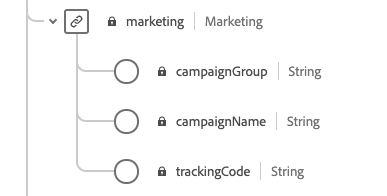

# Gegevens voorbereiden voor gebruik in intelligente services

Om de Intelligente Diensten inzichten van uw marketing gebeurtenisgegevens te ontdekken, moeten de gegevens semantisch worden verrijkt en in een standaardstructuur worden gehandhaafd. Intelligente services hefboomwerkervaringsgegevensmodel (XDM) om dit te bereiken. Specifiek, moeten alle datasets die in de Intelligente Diensten worden gebruikt met het schema van XDM van **Consumer ExperienceEvent (CEE)** in overeenstemming zijn.

Dit document verstrekt algemene begeleiding bij het in kaart brengen van uw marketing gebeurtenisgegevens van veelvoudige kanalen aan dit schema, schetsend informatie over belangrijke gebieden binnen het schema om u te helpen bepalen hoe te om uw gegevens aan zijn structuur effectief in kaart te brengen.

## Het CEE-schema

Het schema Consumer ExperienceEvent beschrijft het gedrag van een individu aangezien het betrekking heeft op digitale marketing gebeurtenissen (web of mobiel) evenals online of off-line handelsactiviteit. Het gebruik van dit schema wordt vereist voor de Intelligente Diensten wegens zijn semantisch duidelijk bepaalde gebieden (kolommen), vermijdend om het even welke onbekende namen die anders de gegevens minder duidelijk zouden maken.

De intelligente Diensten gebruiken verscheidene zeer belangrijke gebieden binnen dit schema om inzichten van uw marketing gebeurtenisgegevens te produceren, die allen op het wortelniveau kunnen worden gevonden en worden uitgebreid om hun vereiste subfields te tonen.


Net als alle XDM-schema&#39;s is de CEE-mix uitbreidbaar. Met andere woorden, extra velden kunnen worden toegevoegd aan de CEE-mix en verschillende variaties kunnen indien nodig worden opgenomen in meerdere schema&#39;s.

Een volledig voorbeeld van de mix vindt u in de [openbare XDM-opslagplaats](https://github.com/adobe/xdm/blob/797cf4930d5a80799a095256302675b1362c9a15/docs/reference/context/experienceevent-consumer.schema.md)en moet worden gebruikt als referentie voor de belangrijkste velden die in de sectie hieronder worden beschreven.

## Hoofdvelden

In de onderstaande secties worden de belangrijkste velden in de CEE-mix gemarkeerd die moeten worden gebruikt om intelligente services nuttige inzichten te laten genereren, waaronder beschrijvingen en koppelingen naar referentiedocumentatie voor meer voorbeelden.

### xdm:kanaal

Dit gebied vertegenwoordigt het marketing kanaal met betrekking tot ExperienceEvent. Het veld bevat informatie over het kanaaltype, het mediatype en het locatietype. **Dit veld _moet_worden opgegeven voordat Attribution AI kan werken met uw gegevens**.


**Voorbeeldschema**

```json
{
  "@id": "https://ns.adobe.com/xdm/channels/facebook-feed",
  "@type": "https://ns.adobe.com/xdm/channel-types/social",
  "xdm:mediaType": "earned",
  "xdm:mediaAction": "clicks"
}
```

Voor volledige informatie over elk van de vereiste subvelden voor `xdm:channel`, gelieve te verwijzen naar het schema [van het](https://github.com/adobe/xdm/blob/797cf4930d5a80799a095256302675b1362c9a15/docs/reference/channels/channel.schema.md) ervaringskanaal. Zie de [tabel hieronder](#example-channels)voor een aantal voorbeeldtoewijzingen.

#### Voorbeeldkanaaltoewijzingen {#example-channels}

In de volgende tabel staan enkele voorbeelden van marketingkanalen die zijn toegewezen aan het `xdm:channel` schema:

| Kanaal | `@type` | `mediaType` | `mediaAction` |
| --- | --- | --- | --- |
| Betaalde zoekopdracht | https:/<span>/ns.adobe.com/xdm/channel-types/search | betaald | klikken |
| Sociaal - Marketing | https:/<span>/ns.adobe.com/xdm/channel-types/social | verdiend | klikken |
| Weergave | https:/<span>/ns.adobe.com/xdm/channel-types/display | betaald | klikken |
| E-mail | https:/<span>/ns.adobe.com/xdm/channel-types/email | betaald | klikken |
| Interne referentie | https:/<span>/ns.adobe.com/xdm/channel-types/direct | eigendom | klikken |
| WeergaveThrough weergeven | https:/<span>/ns.adobe.com/xdm/channel-types/display | betaald | indrukken |
| Omleiding QR-code | https:/<span>/ns.adobe.com/xdm/channel-types/direct | eigendom | klikken |
| Mobiel | https:/<span>/ns.adobe.com/xdm/channel-types/mobile | eigendom | klikken |

### xdm:productListItems

Dit veld is een array van items die producten vertegenwoordigen die door een klant zijn geselecteerd, waaronder de SKU, naam, prijs en hoeveelheid van het product.


**Voorbeeldschema**

```json
[
  {
    "xdm:SKU": "1002352692",
    "xdm:name": "24-Watt 8-Light Chrome Integrated LED Bath Light",
    "xdm:currencyCode": "USD",
    "xdm:quantity": 1,
    "xdm:priceTotal": 159.45
  },
  {
    "xdm:SKU": "3398033623",
    "xdm:name": "16ft RGB LED Strips",
    "xdm:currencyCode": "USD",
    "xdm:quantity": 1,
    "xdm:priceTotal": 79.99
  }
]
```

Voor volledige informatie over elk van de vereiste subvelden voor `xdm:productListItems`, gelieve te verwijzen naar het schema [van](https://github.com/adobe/xdm/blob/797cf4930d5a80799a095256302675b1362c9a15/docs/reference/context/experienceevent-commerce.schema.md) handelsdetails.

### xdm:handel

Dit veld bevat handelspecifieke informatie over de ExperienceEvent, waaronder het inkoopordernummer en betalingsgegevens.


**Voorbeeldschema**

```json
{
    "xdm:order": {
      "xdm:purchaseID": "a8g784hjq1mnp3",
      "xdm:purchaseOrderNumber": "123456",
      "xdm:payments": [
        {
          "xdm:transactionID": "transactid-a111",
          "xdm:paymentAmount": 59,
          "xdm:paymentType": "credit_card",
          "xdm:currencyCode": "USD"
        },
        {
          "xdm:transactionId": "transactid-a222",
          "xdm:paymentAmount": 100,
          "xdm:paymentType": "gift_card",
          "xdm:currencyCode": "USD"
        }
      ],
      "xdm:currencyCode": "USD",
      "xdm:priceTotal": 159
    },
    "xdm:purchases": {
      "xdm:value": 1
    }
  }
```

Voor volledige informatie over elk van de vereiste subvelden voor `xdm:commerce`, gelieve te verwijzen naar het schema [van](https://github.com/adobe/xdm/blob/797cf4930d5a80799a095256302675b1362c9a15/docs/reference/context/experienceevent-commerce.schema.md) handelsdetails.

### xdm:web

In dit veld worden de webdetails weergegeven die betrekking hebben op de ExperienceEvent, zoals de interactie, paginagegevens en de referentie.


**Voorbeeldschema**

```json
{
  "xdm:webPageDetails": {
    "xdm:siteSection": "Shopping Cart",
    "xdm:server": "example.com",
    "xdm:name": "Purchase Confirmation",
    "xdm:URL": "https://www.example.com/orderConf",
    "xdm:errorPage": false,
    "xdm:homePage": false,
    "xdm:pageViews": {
      "xdm:value": 1
    }
  },
  "xdm:webReferrer": {
    "xdm:URL": "https://www.example.com/checkout",
    "xdm:referrerType": "internal"
  }
}
```

Voor volledige informatie over elk van de vereiste subvelden voor `xdm:productListItems`, raadpleegt u de specificatie van het schema [voor](https://github.com/adobe/xdm/blob/797cf4930d5a80799a095256302675b1362c9a15/docs/reference/context/experienceevent-web.schema.md) ExperienceEvent-webdetails.

### xdm:marketing

Dit veld bevat informatie over marketingactiviteiten die actief zijn met het aanraakpunt.



**Voorbeeldschema**

```json
{
  "xdm:trackingCode": "marketingcampaign111",
  "xdm:campaignGroup": "50%_DISCOUNT",
  "xdm:campaignName": "50%_DISCOUNT_USA"
}
```

Voor volledige informatie over elk van de vereiste subvelden voor `xdm:productListItems`, gelieve te verwijzen naar de specificatie van het [marketingdossier](https://github.com/adobe/xdm/blob/797cf4930d5a80799a095256302675b1362c9a15/docs/reference/context/marketing.schema.md) .

## Gegevens toewijzen en opnemen

Zodra u hebt bepaald of uw gegevens van de marketinggebeurtenissen aan het CEE schema kunnen worden in kaart gebracht, kunt u het proces beginnen om uw gegevens in de Intelligente Diensten te brengen. Neem contact op met de Adobe Consulting Services om u te helpen uw gegevens toe te wijzen aan het schema en deze in te voeren in de service.

Als u een abonnement op het Adobe Experience Platform hebt en u de gegevens zelf wilt toewijzen en invoeren, volgt u de stappen in de onderstaande sectie.

### Adobe Experience Platform gebruiken

>[!NOTE] Voor de onderstaande stappen is een abonnement op Experience Platform vereist. Als u geen toegang hebt tot Platform, gaat u verder met de [volgende sectie](#next-steps) voor stappen.

In deze sectie wordt de workflow beschreven voor het toewijzen en invoeren van gegevens in het Experience Platform voor gebruik in Intelligente services, inclusief koppelingen naar zelfstudies voor gedetailleerde stappen.

#### Een CEE-schema en gegevensset maken

Wanneer u klaar bent om uw gegevens voor opname voor te bereiden, is de eerste stap een nieuw schema te creëren XDM dat de CEE mengeling gebruikt. De volgende zelfstudies lopen door het proces om een nieuw schema in UI of API tot stand te brengen:

* [Een schema maken in de gebruikersinterface](../xdm/tutorials/create-schema-ui.md)
* [Een schema maken in de API](../xdm/tutorials/create-schema-api.md)

>[!IMPORTANT] De bovenstaande zelfstudies volgen een algemene workflow voor het maken van een schema. Wanneer u een klasse voor het schema kiest, moet u de **klasse** XDM ExperienceEvent gebruiken. Nadat u deze klasse hebt gekozen, kunt u de CEE-mix aan het schema toevoegen.

Nadat u de CEE-mix aan het schema hebt toegevoegd, kunt u desgewenst andere combinaties toevoegen voor extra velden in uw gegevens.

Zodra u het schema hebt gecreeerd en bewaard, kunt u een nieuwe dataset tot stand brengen die op dat schema wordt gebaseerd. De volgende zelfstudies lopen door het proces om een nieuwe dataset in UI of API tot stand te brengen:

* [Creeer een dataset in UI](../catalog/datasets/user-guide.md#create) (volg het werkschema voor het gebruiken van een bestaand schema)
* [Een gegevensset maken in de API](../catalog/datasets/create.md)

#### Gegevens toewijzen en opnemen

Na het creëren van een CEE schema en dataset, kunt u beginnen uw gegevenslijsten aan het schema in kaart te brengen en die gegevens in Platform in te voeren. Zie de zelfstudie over het [toewijzen van een CSV-bestand aan een XDM-schema](../ingestion/tutorials/map-a-csv-file.md) voor stappen over het uitvoeren van dit bestand in de gebruikersinterface. Zodra een dataset is bevolkt, kan de zelfde dataset worden gebruikt om extra gegevensdossiers in te voeren.

## Volgende stappen {#next-steps}

Dit document bevat algemene richtlijnen voor het voorbereiden van uw gegevens voor gebruik in Intelligente services. Neem contact op met de Technische Ondersteuning van Adobe als u extra advies nodig hebt op basis van uw gebruikscase.

Zodra u met succes een dataset met uw gegevens van de klantenervaring hebt bevolkt, kunt u de Intelligente Diensten gebruiken om inzichten te produceren. Raadpleeg de volgende documenten om aan de slag te gaan:

* [Overzicht AI-kenmerken](./attribution-ai/overview.md)
* [AI-overzicht van klant](./customer-ai/overview.md)
