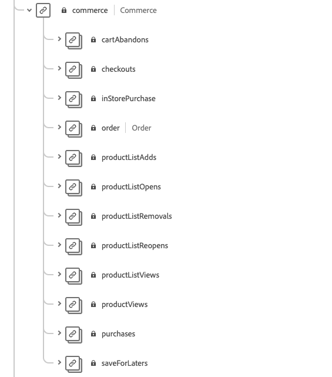

# Gegevens voorbereiden voor gebruik in [!DNL Intelligent Services]

Om [!DNL Intelligent Services] om inzichten van uw marketing gebeurtenisgegevens te ontdekken, moeten de gegevens semantisch worden verrijkt en in een standaardstructuur worden gehandhaafd. [!DNL Intelligent Services] hefboomeffect [!DNL Experience Data Model] (XDM) schema&#39;s om dit te bereiken. Specifiek, alle datasets die in worden gebruikt [!DNL Intelligent Services] moet in overeenstemming zijn met het XDM-schema Consumer ExperienceEvent (CEE) of de Adobe Analytics-connector gebruiken. Daarnaast ondersteunt de AI van de Klant de Adobe Audience Manager-aansluiting.

Dit document verstrekt algemene begeleiding bij het in kaart brengen van uw gegevens van marketinggebeurtenissen van veelvoudige kanalen aan het CEE schema, schetsend informatie over belangrijke gebieden binnen het schema om u te helpen bepalen hoe te om uw gegevens aan zijn structuur effectief in kaart te brengen. Als u van plan bent Adobe Analytics-gegevens te gebruiken, raadpleegt u de sectie voor [Adobe Analytics-gegevensvoorbereiding](#analytics-data). Als u van plan bent Adobe Audience Manager-gegevens te gebruiken (alleen Customer AI), raadpleegt u de sectie voor [Adobe Poortbeheer, gegevensvoorbereiding](#AAM-data).

## Gegevensvereisten

[!DNL Intelligent Services] verschillende hoeveelheden historische gegevens vereisen, afhankelijk van het doel dat u maakt. De gegevens waarop u zich voorbereidt, zijn altijd **alles** [!DNL Intelligent Services] moet zowel positieve als negatieve cliëntreizen/evenementen omvatten. Het hebben van zowel negatieve als positieve gebeurtenissen verbetert modelprecisie en nauwkeurigheid.

Als u bijvoorbeeld de AI van de Klant gebruikt om de neiging te voorspellen om een product te kopen, heeft het model voor AI van de Klant zowel voorbeelden van succesvolle aankoopwegen als voorbeelden van mislukte wegen nodig. Dit komt omdat de AI van de Klant tijdens modeltraining probeert te begrijpen welke gebeurtenissen en reizen tot een aankoop leiden. Dit omvat ook de acties die zijn ondernomen door klanten die geen goederen hebben gekocht, zoals een persoon die zijn reis heeft stopgezet door een artikel aan het winkelwagentje toe te voegen. Deze klanten kunnen echter op vergelijkbare wijze te werk gaan. Klantenservice kan echter inzichten verschaffen en de belangrijkste verschillen en factoren die tot een hogere prioriteitsscore leiden, opruimen. Op dezelfde manier vereist Attribution AI zowel soorten gebeurtenissen als reizen om metriek zoals touchpoint doeltreffendheid, hoogste omzettingswegen, en onderverdelingen door touchpoint positie te tonen.

Ga voor meer voorbeelden en informatie over historische gegevensvereisten naar de [Customer AI](./customer-ai/input-output.md#data-requirements) of [Attribution AI](./attribution-ai/input-output.md#data-requirements) sectie historische gegevensvereisten in de input / output documentatie.

### Richtlijnen voor het koppelen van gegevens

U wordt aangeraden de gebeurtenissen van een gebruiker zo veel mogelijk aan te sluiten op een gemeenschappelijke id. U hebt bijvoorbeeld gebruikersgegevens met &quot;id1&quot; voor 10 gebeurtenissen. Later heeft dezelfde gebruiker de cookie-id verwijderd en wordt deze als &quot;id2&quot; opgenomen bij de volgende 20 gebeurtenissen. Als u weet dat id1 en id2 aan de zelfde gebruiker beantwoorden, is de beste praktijk om alle 30 gebeurtenissen met gemeenschappelijke identiteitskaart te hechten.

Als dit niet mogelijk is, moet u elke set gebeurtenissen als een andere gebruiker behandelen wanneer u uw modelinvoergegevens maakt. Dit zorgt voor de beste resultaten tijdens modeltraining en scoring.

## Overzicht van workflow

Het voorbereidingsproces is afhankelijk van het feit of uw gegevens in Adobe Experience Platform of extern worden opgeslagen. Deze sectie vat de noodzakelijke stappen samen u, gegeven één van beide scenario&#39;s moet nemen.

### Externe gegevensvoorbereiding

Als uw gegevens buiten het Experience Platform worden opgeslagen, moet u uw gegevens aan de vereiste en relevante gebieden in kaart brengen [Consumer ExperienceEvent-schema](#cee-schema). Dit schema kan worden aangevuld met aangepaste veldgroepen om uw klantgegevens beter vast te leggen. Zodra in kaart gebracht, kunt u een dataset tot stand brengen gebruikend uw schema Consumer ExperienceEvent en [gegevens opnemen naar Platform](../ingestion/home.md). De CEE dataset kan dan worden geselecteerd wanneer het vormen van een [!DNL Intelligent Service].

Afhankelijk van de [!DNL Intelligent Service] Als u wilt gebruiken, zijn mogelijk verschillende velden vereist. Houd er rekening mee dat u het beste gegevens aan een veld kunt toevoegen als u over de beschikbare gegevens beschikt. Ga voor meer informatie over de vereiste velden naar [Attribution AI](./attribution-ai/input-output.md) of [Customer AI](./customer-ai/input-output.md) invoer-/uitvoerhulplijn.

### Adobe Analytics-gegevensvoorbereiding {#analytics-data}

AI en Attribution AI bieden native ondersteuning voor Adobe Analytics-gegevens. Als u Adobe Analytics-gegevens wilt gebruiken, volgt u de stappen in de documentatie om een [Bronconnector voor analyse](../sources/tutorials/ui/create/adobe-applications/analytics.md).

Zodra de bronschakelaar uw gegevens in Experience Platform stroomt, kunt u Adobe Analytics als gegevensbron selecteren die door een dataset tijdens uw instantieconfiguratie wordt gevolgd. Alle vereiste groepen van schemagebieden en individuele gebieden worden automatisch gecreeerd tijdens de verbindingsopstelling. U te hoeven niet om (Extraheren, Transformeren, Lading) de datasets in het formaat te ETL.

Als u de gegevens die door de Adobe Analytics-bronconnector naar Adobe Experience Platform worden geleid, vergelijkt met Adobe Analytics-gegevens, kunnen er verschillen optreden. De verbinding van de Bron van Analytics zou rijen tijdens de transformatie aan een schema van de Gegevens van de Ervaring kunnen laten vallen van het Model (XDM). Er kunnen meerdere redenen zijn waarom de hele rij ongeschikt is voor transformatie, zoals ontbrekende tijdstempels, ontbrekende ID&#39;s, ongeldige id&#39;s of id&#39;s van grote personen, ongeldige analytische waarden en meer.

Raadpleeg de documentatie voor meer informatie en voorbeelden [vergelijking van Adobe Analytics- en Customer Journey Analytics-gegevens](https://www.adobe.com/go/compare-aa-data-to-cja-data). Dit artikel is ontworpen om u te helpen voor die verschillen diagnostiseren en op te lossen zodat u en uw team Adobe Experience Platform-gegevens voor Intelligente services kunnen gebruiken zonder dat dit wordt belemmerd door zorgen over gegevensintegriteit.

In de Diensten van de Vraag van Adobe Experience Platform, stel de volgende Totale Verslagen tussen begin en eind timestamp door channel.typeAtSource vraag in werking om de telling door marketing kanalen te vinden.

```SELECT channel.typeAtSource as typeAtSource,
       Count(_id) AS Records 
FROM  df_hotel
WHERE timestamp>=from_utc_timestamp('2021-05-15','UTC')
        AND timestamp<from_utc_timestamp('2022-01-10','UTC')
        AND timestamp IS NOT NULL
        AND enduserids._experience.aaid.id IS NOT NULL
GROUP BY channel.typeAtSource
```

>[!IMPORTANT]
>
>De Adobe Analytics-connector duurt maximaal vier weken om gegevens te herstellen. Als u onlangs opstelling een verbinding zou moeten verifiëren u dat de dataset de minimumlengte van gegevens heeft die voor Klant of Attribution AI wordt vereist. Controleer de historische gegevenssecties in [Customer AI](./customer-ai/input-output.md#data-requirements) of [Attribution AI](./attribution-ai/input-output.md#data-requirements)en controleer of u voldoende gegevens hebt voor uw voorspellingsdoel.

### Adobe Audience Manager-gegevensvoorbereiding (alleen voor AI van klant) {#AAM-data}

Adobe Audience Manager-gegevens worden native door de klant ondersteund. Als u gegevens van Audience Managers wilt gebruiken, volgt u de stappen in de documentatie om een [Audience Manager-bronaansluiting](../sources/tutorials/ui/create/adobe-applications/audience-manager.md).

Zodra de bronschakelaar uw gegevens in Experience Platform stroomt, kunt u Adobe Audience Manager als gegevensbron selecteren die door een dataset tijdens uw configuratie van AI van de Klant wordt gevolgd. Alle groepen van schemagebieden en individuele gebieden worden automatisch gecreeerd tijdens de verbindingsopstelling. U te hoeven niet om (Extraheren, Transformeren, Lading) de datasets in het formaat te ETL.

>[!IMPORTANT]
>
>Als u onlangs opstelling een schakelaar zou moeten verifiëren u dat de dataset de minimumlengte van vereiste gegevens heeft. Controleer het gedeelte met historische gegevens in het dialoogvenster [input/output documentatie](./customer-ai/input-output.md) voor de AI van de Klant, en verifieer u genoeg gegevens voor uw vooruitgangsdoel hebt.

### [!DNL Experience Platform] gegevensvoorbereiding

Als uw gegevens al zijn opgeslagen in [!DNL Platform] en niet streaming via de Adobe Analytics- of Adobe Audience Manager-bronconnectors (alleen voor Customer AI), voert u de onderstaande stappen uit. Het wordt nog geadviseerd u het CEE schema begrijpt.

1. De structuur van de [Consumer ExperienceEvent-schema](#cee-schema) en bepalen of uw gegevens kunnen worden toegewezen aan de velden.
2. Contact opnemen met Adobe Consulting Services om u te helpen uw gegevens toe te wijzen aan het schema en deze in te voeren [!DNL Intelligent Services], of [de stappen in deze handleiding volgen](#mapping) als u de gegevens zelf wilt toewijzen.

## Het CEE-schema {#cee-schema}

Het schema Consumer ExperienceEvent beschrijft het gedrag van een individu aangezien het betrekking heeft op digitale marketing gebeurtenissen (web of mobiel) evenals online of off-line handelsactiviteit. Het gebruik van dit schema is vereist voor [!DNL Intelligent Services] vanwege de semantisch duidelijk gedefinieerde velden (kolommen), waarbij onbekende namen worden vermeden die de gegevens anders minder duidelijk zouden maken.

Het CEE-schema legt, net als alle XDM ExperienceEvent-schema&#39;s, de op tijdreeksen gebaseerde status van het systeem vast wanneer een gebeurtenis (of set gebeurtenissen) plaatsvond, inclusief het tijdstip en de identiteit van het betreffende onderwerp. De gebeurtenissen van de ervaring zijn feitenverslagen van wat voorkwam, en zo zijn zij onveranderlijk en vertegenwoordigen wat gebeurde zonder samenvoeging of interpretatie.

[!DNL Intelligent Services] Gebruik verscheidene zeer belangrijke gebieden binnen dit schema om inzichten van uw marketing gebeurtenisgegevens te produceren, die allen op het wortelniveau kunnen worden gevonden en worden uitgebreid om hun vereiste subfields te tonen.


Net als alle XDM-schema&#39;s is de veldgroep van het CEE-schema uitbreidbaar. Met andere woorden, er kunnen extra velden worden toegevoegd aan de CEE-veldgroep en indien nodig kunnen verschillende variaties in meerdere schema&#39;s worden opgenomen.

Een volledig voorbeeld van de veldgroep vindt u in het dialoogvenster [openbare XDM-opslagplaats](https://github.com/adobe/xdm/blob/797cf4930d5a80799a095256302675b1362c9a15/docs/reference/context/experienceevent-consumer.schema.md). Daarnaast kunt u het volgende weergeven en kopiëren [JSON-bestand](https://github.com/AdobeDocs/experience-platform.en/blob/master/help/intelligent-services/assets/CEE_XDM_sample_rows.json) voor een voorbeeld van hoe de gegevens kunnen worden gestructureerd om aan het CEE schema te voldoen. Verwijs naar beide voorbeelden aangezien u over de belangrijkste gebieden leert die in de sectie worden geschetst hieronder, om te bepalen hoe u uw eigen gegevens aan het schema kunt in kaart brengen.

## Hoofdvelden

Er zijn verscheidene zeer belangrijke gebieden binnen de CEE gebiedsgroep die zouden moeten worden gebruikt om [!DNL Intelligent Services] nuttige inzichten te genereren. In deze sectie worden het gebruiksgeval en de verwachte gegevens voor deze velden beschreven en vindt u koppelingen naar de documentatie bij naslagwerken voor meer voorbeelden.

### Verplichte velden

Hoewel het gebruik van alle sleutelvelden sterk wordt aanbevolen, zijn er twee velden die **vereist** om [!DNL Intelligent Services] werken:

* [Een primair identiteitsveld](#identity)
* [xdm:tijdstempel](#timestamp)
* [xdm:kanaal](#channel) (alleen verplicht voor Attribution AI)

#### Primaire identiteit {#identity}

Een van de velden in uw schema moet zijn ingesteld als primair identiteitsveld, waardoor [!DNL Intelligent Services] om elk geval van tijdreeksgegevens aan een individuele persoon te verbinden.

U moet bepalen welk veld het beste kan worden gebruikt als primaire identiteit op basis van de bron en de aard van uw gegevens. Een identiteitsveld moet een **naamruimte identity** Dit geeft het type identiteitsgegevens aan dat het veld als waarde verwacht. Voorbeelden van geldige naamruimtewaarden zijn:

>[!NOTE]
>
>De Experience Cloud-id (ECID) wordt ook wel MCID genoemd en wordt nog steeds gebruikt in naamruimten.

* &quot;email&quot;
* &quot;phone&quot;
* &quot;mcid&quot; (voor Adobe Audience Manager-id&#39;s)
* &quot;aid&quot; (voor Adobe Analytics-id&#39;s)

Als u onzeker bent welk gebied u als primaire identiteit zou moeten gebruiken, contacteer de Consulting Diensten van de Adobe om de beste oplossing te bepalen. Als er geen primaire identiteit is ingesteld, gebruikt de toepassing Intelligente service het volgende standaardgedrag:

| Standaard | Attribution AI | Customer AI |
| --- | --- | --- |
| Identiteitskolom | `endUserIDs._experience.aaid.id` | `endUserIDs._experience.mcid.id` |
| Naamruimte | AAID | ECID |

Als u een primaire identiteit wilt instellen, navigeert u vanuit het menu **[!UICONTROL Schemas]** en selecteer de hyperlink naar de schemanaam om het dialoogvenster **[!DNL Schema Editor]**.


Navigeer vervolgens naar het veld dat u als primaire identiteit wilt gebruiken en selecteer het. De **[!UICONTROL Field properties]** wordt geopend voor dat veld.


In de **[!UICONTROL Field properties]** schuift u omlaag totdat u de **[!UICONTROL Identity]** selectievakje. Nadat u het selectievakje hebt ingeschakeld, kunt u de geselecteerde identiteit instellen als de **[!UICONTROL Primary identity]** wordt weergegeven. Selecteer dit vak ook.


Vervolgens moet u een **[!UICONTROL Identity namespace]** in de lijst met vooraf gedefinieerde naamruimten in het vervolgkeuzemenu. In dit voorbeeld wordt de ECID-naamruimte geselecteerd sinds een Adobe Audience Manager-id `mcid.id` wordt gebruikt. Selecteren **[!UICONTROL Apply]** om de updates te bevestigen selecteert u **[!UICONTROL Save]** in de rechterbovenhoek om de wijzigingen in het schema op te slaan.


#### xdm:tijdstempel {#timestamp}

Dit veld vertegenwoordigt de datum waarop de gebeurtenis heeft plaatsgevonden. Deze waarde moet worden opgegeven als een tekenreeks, volgens de ISO 8601-standaard.

#### xdm:kanaal {#channel}

>[!NOTE]
>
>Dit veld is alleen verplicht bij gebruik van Attribution AI.

Dit gebied vertegenwoordigt het marketing kanaal met betrekking tot ExperienceEvent. Het veld bevat informatie over het kanaaltype, het mediatype en het locatietype.


**Voorbeeldschema**

```json
{
  "@id": "https://ns.adobe.com/xdm/channels/facebook-feed",
  "@type": "https://ns.adobe.com/xdm/channel-types/social",
  "xdm:mediaType": "earned",
  "xdm:mediaAction": "clicks"
}
```

Voor volledige informatie over elk van de vereiste subvelden voor `xdm:channel`, gelieve de [ervaringskanaalschema](https://github.com/adobe/xdm/blob/797cf4930d5a80799a095256302675b1362c9a15/docs/reference/channels/channel.schema.md) specificatie. Voor sommige voorbeeldafbeeldingen raadpleegt u de [tabel hieronder](#example-channels).

#### Voorbeeldkanaaltoewijzingen {#example-channels}

In de volgende tabel staan enkele voorbeelden van marketingkanalen die zijn toegewezen aan de `xdm:channel` schema:

| Kanaal | `@type` | `mediaType` | `mediaAction` |
| --- | --- | --- | --- |
| Betaalde zoekopdracht | https:/<span>/ns.adobe.com/xdm/channel-types/search | betaald | klikken |
| Sociaal - Marketing | https:/<span>/ns.adobe.com/xdm/channel-types/social | verdiend | klikken |
| Weergave | https:/<span>/ns.adobe.com/xdm/channel-types/display | betaald | klikken |
| Email | https:/<span>/ns.adobe.com/xdm/channel-types/email | betaald | klikken |
| Interne referentie | https:/<span>/ns.adobe.com/xdm/channel-types/direct | eigendom | klikken |
| WeergaveThrough weergeven | https:/<span>/ns.adobe.com/xdm/channel-types/display | betaald | indrukken |
| Omleiding QR-code | https:/<span>/ns.adobe.com/xdm/channel-types/direct | eigendom | klikken |
| Mobile | https:/<span>/ns.adobe.com/xdm/channel-types/mobile | eigendom | klikken |

### Aanbevolen velden

De overige belangrijke velden worden in deze sectie beschreven. Deze velden zijn niet noodzakelijk vereist voor [!DNL Intelligent Services] om te kunnen werken , wordt ten zeerste aanbevolen om zoveel mogelijk van deze documenten te gebruiken om rijkere inzichten te krijgen .

#### xdm:productListItems

Dit veld is een array van items die producten vertegenwoordigen die door een klant zijn geselecteerd, waaronder de SKU, naam, prijs en hoeveelheid van het product.


**Voorbeeldschema**

```json
[
  {
    "xdm:SKU": "1002352692",
    "xdm:name": "24-Watt 8-Light Chrome Integrated LED Bath Light",
    "xdm:currencyCode": "USD",
    "xdm:quantity": 1,
    "xdm:priceTotal": 159.45
  },
  {
    "xdm:SKU": "3398033623",
    "xdm:name": "16ft RGB LED Strips",
    "xdm:currencyCode": "USD",
    "xdm:quantity": 1,
    "xdm:priceTotal": 79.99
  }
]
```

Voor volledige informatie over elk van de vereiste subvelden voor `xdm:productListItems`, gelieve de [schema handelsdetails](https://github.com/adobe/xdm/blob/797cf4930d5a80799a095256302675b1362c9a15/docs/reference/context/experienceevent-commerce.schema.md) specificatie.

#### xdm:handel

Dit veld bevat handelspecifieke informatie over de ExperienceEvent, waaronder het inkoopordernummer en betalingsgegevens.



**Voorbeeldschema**

```json
{
    "xdm:order": {
      "xdm:purchaseID": "a8g784hjq1mnp3",
      "xdm:purchaseOrderNumber": "123456",
      "xdm:payments": [
        {
          "xdm:transactionID": "transactid-a111",
          "xdm:paymentAmount": 59,
          "xdm:paymentType": "credit_card",
          "xdm:currencyCode": "USD"
        },
        {
          "xdm:transactionId": "transactid-a222",
          "xdm:paymentAmount": 100,
          "xdm:paymentType": "gift_card",
          "xdm:currencyCode": "USD"
        }
      ],
      "xdm:currencyCode": "USD",
      "xdm:priceTotal": 159
    },
    "xdm:purchases": {
      "xdm:value": 1
    }
  }
```

Voor volledige informatie over elk van de vereiste subvelden voor `xdm:commerce`, gelieve de [schema handelsdetails](https://github.com/adobe/xdm/blob/797cf4930d5a80799a095256302675b1362c9a15/docs/reference/context/experienceevent-commerce.schema.md) specificatie.

#### xdm:web

In dit veld worden de webdetails weergegeven die betrekking hebben op de ExperienceEvent, zoals de interactie, paginagegevens en de referentie.


**Voorbeeldschema**

```json
{
  "xdm:webPageDetails": {
    "xdm:siteSection": "Shopping Cart",
    "xdm:server": "example.com",
    "xdm:name": "Purchase Confirmation",
    "xdm:URL": "https://www.example.com/orderConf",
    "xdm:errorPage": false,
    "xdm:homePage": false,
    "xdm:pageViews": {
      "xdm:value": 1
    }
  },
  "xdm:webReferrer": {
    "xdm:URL": "https://www.example.com/checkout",
    "xdm:referrerType": "internal"
  }
}
```

Voor volledige informatie over elk van de vereiste subvelden voor `xdm:productListItems`, gelieve de [ExperienceEvent-webdetailschema](https://github.com/adobe/xdm/blob/797cf4930d5a80799a095256302675b1362c9a15/docs/reference/context/experienceevent-web.schema.md) specificatie.

#### xdm:marketing

Dit veld bevat informatie over marketingactiviteiten die actief zijn met het aanraakpunt.


**Voorbeeldschema**

```json
{
  "xdm:trackingCode": "marketingcampaign111",
  "xdm:campaignGroup": "50%_DISCOUNT",
  "xdm:campaignName": "50%_DISCOUNT_USA"
}
```

Voor volledige informatie over elk van de vereiste subvelden voor `xdm:productListItems`, gelieve de [marketingsechma](https://github.com/adobe/xdm/blob/797cf4930d5a80799a095256302675b1362c9a15/docs/reference/context/marketing.schema.md) specificatie.

## Gegevens toewijzen en opnemen {#mapping}

Zodra u hebt bepaald of uw gegevens van de marketinggebeurtenissen aan het CEE schema kunnen in kaart worden gebracht, is de volgende stap te bepalen welke gegevens u in moet brengen [!DNL Intelligent Services]. Alle historische gegevens gebruikt in [!DNL Intelligent Services] moet binnen de minimumperiode van vier maanden gegevens vallen, plus het aantal dagen dat als terugzoekperiode wordt bedoeld.

Nadat het beslissen van de waaier van gegevens u wilt verzenden, contacteer de Raadplegende Diensten van de Adobe om uw gegevens aan het schema in kaart te brengen en het in de dienst in te voeren.

Als u een [!DNL Adobe Experience Platform] Voer de stappen uit die in de onderstaande sectie worden beschreven, en voer uw abonnement en de gegevens zelf in.

### Adobe Experience Platform gebruiken

>[!NOTE]
>
>Voor de onderstaande stappen is een abonnement op Experience Platform vereist. Als u geen toegang hebt tot Platform, gaat u verder met de [volgende stappen](#next-steps) sectie.

In deze sectie wordt de workflow beschreven voor het toewijzen en opnemen van gegevens in Experience Platform voor gebruik in [!DNL Intelligent Services], inclusief koppelingen naar zelfstudies voor gedetailleerde stappen.

#### Een CEE-schema en gegevensset maken

Wanneer u klaar bent om uw gegevens voor opname voor te bereiden, moet de eerste stap een nieuw XDM schema tot stand brengen dat de CEE gebiedsgroep aanwendt. De volgende zelfstudies lopen door het proces om een nieuw schema in UI of API tot stand te brengen:

* [Een schema maken in de gebruikersinterface](../xdm/tutorials/create-schema-ui.md)
* [Een schema maken in de API](../xdm/tutorials/create-schema-api.md)

>[!IMPORTANT]
>
>De bovenstaande zelfstudies volgen een algemene workflow voor het maken van een schema. Wanneer u een klasse voor het schema kiest, moet u de opdracht **XDM ExperienceEvent, klasse**. Zodra deze klasse is gekozen, kunt u de CEE gebiedsgroep aan het schema dan toevoegen.

Nadat u de CEE-veldgroep aan het schema hebt toegevoegd, kunt u desgewenst andere veldgroepen toevoegen voor extra velden in uw gegevens.

Zodra u het schema hebt gecreeerd en bewaard, kunt u een nieuwe dataset tot stand brengen die op dat schema wordt gebaseerd. De volgende zelfstudies lopen door het proces om een nieuwe dataset in UI of API tot stand te brengen:

* [Creeer een dataset in UI](../catalog/datasets/user-guide.md#create) (Volg de workflow voor het gebruik van een bestaand schema)
* [Een gegevensset maken in de API](../catalog/datasets/create.md)

Nadat de dataset wordt gecreeerd, kunt u het in Platform UI binnen vinden **[!UICONTROL Datasets]** werkruimte.


#### Identiteitsvelden toevoegen aan de gegevensset

Als u gegevens plaatst van [!DNL Adobe Audience Manager], [!DNL Adobe Analytics]of een andere externe bron, dan kunt u een schemaveld instellen als een identiteitsveld. Als u een schemaveld wilt instellen als een identiteitsveld, bekijkt u de sectie over het instellen van identiteitsvelden in het dialoogvenster [UI-zelfstudie](../xdm/tutorials/create-schema-ui.md#identity-field) of [API-zelfstudie](../xdm/tutorials/create-schema-api.md#define-an-identity-descriptor) voor het maken van een schema.

Als u gegevens uit een lokaal CSV-bestand opneemt, kunt u verdergaan met de volgende sectie [toewijzen en opnemen van gegevens](#ingest).

#### Gegevens toewijzen en opnemen {#ingest}

Na het creëren van een CEE schema en dataset, kunt u beginnen uw gegevenslijsten aan het schema in kaart te brengen en die gegevens in Platform in te voeren. Zie de zelfstudie aan [een CSV-bestand toewijzen aan een XDM-schema](../ingestion/tutorials/map-a-csv-file.md) voor stappen op hoe te om dit in UI uit te voeren. U kunt het volgende gebruiken [JSON-voorbeeldbestand](https://github.com/AdobeDocs/experience-platform.en/blob/master/help/intelligent-services/assets/CEE_XDM_sample_rows.json) om het innameproces te testen voordat u uw eigen gegevens gebruikt.

Zodra een dataset is bevolkt, kan de zelfde dataset worden gebruikt om extra gegevensdossiers in te voeren.

Als uw gegevens zijn opgeslagen in een ondersteunde toepassing van derden, kunt u ook een [bronaansluiting](../sources/home.md) om uw gegevens over marketinggebeurtenissen in te voeren [!DNL Platform] in real time.

## Volgende stappen {#next-steps}

Dit document bevat algemene richtlijnen voor het voorbereiden van uw gegevens voor gebruik in [!DNL Intelligent Services]. Neem contact op met de Adobe Consulting Support als u extra advies nodig hebt op basis van uw gebruikscase.

Zodra u met succes een dataset met uw gegevens van de klantenervaring hebt bevolkt, kunt u gebruiken [!DNL Intelligent Services] om inzichten te genereren. Raadpleeg de volgende documenten om aan de slag te gaan:

* [Overzicht van Attribution AI](./attribution-ai/overview.md)
* [AI-overzicht van klant](./customer-ai/overview.md)
