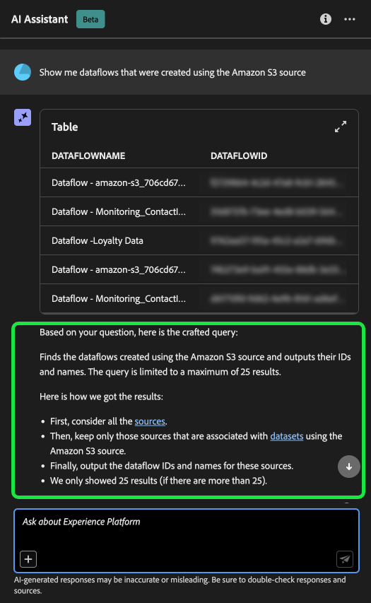

# AI Assistant voor Adobe Experience Platform

>[!NOTE]
>
>AI Assistant voor Adobe Experience Platform is momenteel in bèta. De functie en documentatie kunnen worden gewijzigd.

AI Assistant is een interface-functie waarmee u door Adobe Experience Platform en Real-time Customer Data Platform kunt navigeren en inzicht kunt krijgen in concepten en gebruiksgegevens van uw objecten.

U kunt AI Assistant opvragen voor informatie zoals:

* Richtlijnen voor het uitvoeren van taken die verband houden met gegevens en publiek.
* Statussen en metriek van de bestaande gegevensobjecten in uw organisatie.
* Gebruik voorbeelden van hoofdletters en nuances om uw gegevensobjecten beter te begrijpen, zoals kenmerken, publiek, dataflows, datasets, bestemmingen, schema&#39;s en bronnen.

Lees de onderstaande handleiding voor meer informatie over het gebruik van AI Assistant voor het navigeren naar en begrijpen van uw Experience Platform- en Real-Time CDP-workflows.

>[!BEGINSHADEBOX]

**Hoe werkt AI Assistant?**

De Medewerker van AI antwoordt op uw voorgelegde vragen door een gegevensbestand te vragen en dan gegevens van het gegevensbestand in een leesbaar antwoord te vertalen.

Deze interne vertegenwoordiging van onderliggende gegevens is ook genoemd geworden KennisGrafiek - een uitvoerig Web van concepten, gegevens, en meta-gegevens voor een bepaald antwoord.

De Kennisgrafiek bestaat uit subgrafieken waarnaar wordt verwezen wanneer query&#39;s worden verzonden:

* Gebruikersgegevens van de klant.
* Gebruikersgegevens van de klant in verschillende meta-winkels.
* Documentatie Experience League.

Er zijn twee klassen vragen om te overwegen alvorens AI Medewerker te vragen:

* **Conceptvragen**: Concept-vragen gaan over Adobe-concepten met betrekking tot gegevens of publiek. Voorbeelden van vragen over concepten zijn:
   * Wat is het verschil tussen partij en het stromen segmentatie?
   * Zijn er industriële gegevensmodellen en hoe gebruik ik deze?
   * Wanneer wordt Real-Time CDP het beste voorgeschreven?
* **Gebruiksvragen**: De vragen van het gebruik zijn over de gegevensvoorwerpen binnen uw organisatie. Enkele voorbeelden van gebruiksvragen zijn:
   * Hoeveel datasets heb ik?
   * Hoeveel schemakenmerken zijn nooit gebruikt?
   * Welk publiek is geactiveerd?

>[!ENDSHADEBOX]

## Doelstellingen die u kunt verwezenlijken met AI Assistant {#objectives}

U kunt AI Assistant gebruiken voor doelstellingen zoals:

| Doelstelling | Beschrijving | Voorbeeld |
| --- | --- | --- |
| Leerconcepten en doorlopende workflows | <ul><li>Als beginnende gebruiker, kunt u AI Medewerker gebruiken om de concepten van Real-Time CDP en van Adobe Journey Optimizer te leren en aan boord aan producten en eigenschappen te zijn die u niet vertrouwd met bent.</li><li>Als ervaren gebruiker, kunt u AI Medewerker gebruiken om een randgeval op te lossen dat uw werkschema kan blokkeren. | <ul><li>Hoe kan ik een dashboard instellen in Journey Analytics?</li><li>Vertel me wat gebruiksgevallen voor Real-Time CDP.</li></ul> |
| Problemen oplossen | Met AI Assistant leert u hoe u fouten in de basisbeginselen die u in uw workflow tegenkomt, kunt opsporen. | <ul><li>Wat is deze fout? {ERROR_MESSAGE} bedoel?</li><li>Waarom kan ik het publiek met de naam &quot;Luma: Email Audience&quot; niet verwijderen?</li></ul> |
| Zandbakhygiëne | Met AI Assistant kunt u eventuele duplicaten of ongebruikte objecten identificeren, zodat u de sandbox op efficiënte wijze kunt onderhouden. | <ul><li>Kan je me een publiek laten zien dat vergelijkbaar is?</li><li>Zijn er regelingen die geen bijbehorende dataset hebben?</li></ul> |
| Waardeanalyse | Met AI Assistant kunt u de meest gebruikte gegevensobjecten identificeren en prestatie-indicatoren beoordelen of de meest waardevolle gegevensobjecten vinden. | <ul><li>Hoeveel profielen bevinden zich in de segmentdefinitie &quot;Luma: Email Audience&quot;?</li><li>Wanneer werd het publiek geactiveerd aan de bestemming van het publiek van het Experience Cloud?</li></ul> |
| Zoeken | De Medewerker van AI van het gebruik om gesteunde voorwerpen van het Experience Platform zoals publiek, datasets, bestemmingen, schema&#39;s, en bronnen te vinden. | <ul><li>Maak een lijst van de soorten publiek die &quot;Luma&quot;in de naam bevatten die in het laatste kwartaal werden gecreeerd.</li><li>Welke kenmerken bevinden zich in het XDM-schema &quot;Luma: Custom Actions&quot;?</li></ul> |
| Effectanalyse | Met AI Assistant kunt u gegevensobjecten identificeren die in bepaalde workflows zijn gebruikt, zodat u het effect van wijzigingen kunt beoordelen. | <ul><li>Welk publiek gebruikt `homeAddress.city` in het schema &quot;Luma: PersonProfiles&quot;?</li><li>Welke datasets zijn `consents.marketing.push.val` profielkenmerk opgeslagen in?</li></ul> |

## De Hulp van AI van de toegang in de UI van het Experience Platform

Als u AI Assistant wilt starten, selecteert u de optie **[!UICONTROL AI Assistant icon]** in de bovenste koptekst van de gebruikersinterface van het Experience Platform.

De interface AI Assistant wordt weergegeven en bevat direct informatie die u nodig hebt om aan de slag te gaan. U kunt de opties gebruiken die onder [!UICONTROL Ideas to get started] om vragen en bevelen zoals te beantwoorden:

* [!UICONTROL Which of my audiences are activated?]
* [!UICONTROL What is a schema?]
* [!UICONTROL Tell me some common use cases for Real-Time CDP]

## Handleiding voor AI Assistant-gebruikersinterface

>[!NOTE]
>
>De volgende workflow is een voorbeeld waarin het proces voor het maken van een ervaringsgebeurtenisschema wordt gebruikt om te laten zien hoe u AI Assistant kunt gebruiken wanneer u de gebruikersinterface van het Experience Platform gebruikt.

Overweeg een gebruiksgeval waarin u een **Apparaathandel in gebeurtenisschema**. Tijdens het proces van het creëren van het gebeurtenisschema, komt u tegen `eventType` veld. &quot;Op dit punt kunt u de workflow afsluiten en verwijzen naar de [grondbeginselen van een schemacompositie](../xdm/schema/composition.md) documentatie, of u kunt AI Medewerker gebruiken om antwoorden op uw vragen terug te winnen en extra middelen door de documentatiekoppelingen te vinden die door AI Medewerker worden aanbevolen.&quot;

Om te beginnen voert u uw vraag in het tekstvak in. In het onderstaande voorbeeld wordt de vraag gesteld aan AI Assistant: &quot;**Wat is het eventType-veld in een ExperienceEvent-schema?**&quot;

AI Assistant zoekt vervolgens naar zijn kennisbasis en berekent een antwoord. AI Assistant retourneert na enkele ogenblikken een antwoord en verwante suggesties die u kunt gebruiken als follow-upaanwijzingen.

Nadat u een reactie hebt ontvangen van AI Assistant, kunt u een aantal opties selecteren om te bepalen hoe u wilt doorgaan.

### AI Assistant-functies {#features}

In deze sectie worden de verschillende functies van AI Assistant beschreven die u kunt gebruiken tijdens uw workflows op het Experience Platform.

<!-- 
### Save your query {#save-your-query}

+++Select to view an example of how to save a query

To save your query, select the bookmark icon beside your question.

To access your saved queries, select the bookmark icon below the input box, then select the query you would like to run.

+++ -->

### Gegevens in uw sandbox weergeven {#view-data-in-your-sandbox}

Afhankelijk van uw query biedt AI Assistant aanvullende informatie over de gegevens in uw sandbox. Als u wilt zien hoe de reactie op uw query op uw specifieke sandbox wordt toegepast, selecteert u **[!UICONTROL In your sandbox].**

Wanneer u gegevens met betrekking tot uw sandbox weergeeft, kan AI Assistant directe koppelingen bevatten naar specifieke UI-pagina&#39;s waarop de gevraagde gegevens worden weergegeven.

+++Selecteren om voorbeeld weer te geven

In dit voorbeeld retourneert AI Assistant aanvullende informatie over de bestaande XDM-schema&#39;s in uw sandbox, inclusief het totale aantal en de vijf meest gebruikte velden.

+++

### citaten weergeven {#view-citations}

U kunt antwoorden verifiëren die door AI Assistant aan u zijn geretourneerd door citaten te bekijken die beschikbaar zijn bij elk antwoord.

++ + selecteren om een voorbeeld te bekijken van hoe te om bronnen te tonen

Als u citaties wilt weergeven en de reactie van AI Assistant wilt valideren, selecteert u **[!UICONTROL Show sources]**.

AI Assistant werkt de interface bij en biedt koppelingen naar documentatie die de eerste reactie bevestigen. Wanneer citaties zijn ingeschakeld, werkt AI Assistant het antwoord bij en worden voetnoten opgenomen om de specifieke delen van het antwoord aan te geven die naar de opgegeven documentatie verwijzen.

U kunt ook de query&#39;s gebruiken die in AI Assistant zijn opgenomen **[!UICONTROL Related suggestions]** om onderwerpen met betrekking tot uw originele vraag verder te onderzoeken.

+++

### Gebruiksgegevens en visualisatie {#usage-data-and-visualization}

AI Assistant moet zich in een actieve sandbox bevinden om voldoende te kunnen reageren op een vraag over uw gebruiksgegevens.

+++Selecteer om een voorbeeld van vragen van gebruiksgegevens en gegevensvisualisatie te bekijken

In het onderstaande voorbeeld wordt aan AI Assistant de volgende query gevraagd: **&quot;Geef me de gegevensstromen weer die zijn gemaakt met de Amazon S3-bron&quot;** AI Assistant reageert vervolgens met een tabel waarin uw gegevens en de bijbehorende id&#39;s worden vermeld. Als u de hele tabel met gegevens wilt weergeven, selecteert u het pictogram voor uitvouwen rechtsboven.

Er wordt een uitgebreide weergave van de tabel weergegeven, zodat u een uitgebreidere lijst met gegevensstromen krijgt op basis van de parameters van de query.

Als een vraag over gebruiksgegevens wordt weergegeven, geeft AI Assistant een uitleg van de manier waarop het antwoord is berekend. In het onderstaande voorbeeld beschrijft AI Assistant de stappen die zijn uitgevoerd om de gegevensstromen te identificeren die zijn gemaakt met de [!DNL Amazon S3] bron.

U kunt filters en wijzigingen aan uw vragen ook verstrekken, en u kunt AI Medewerker opdragen om zijn bevindingen terug te geven die op de filters worden gebaseerd die u omvat. Bijvoorbeeld, kunt u AI Medewerker vragen om u een trend van de telling van segmentdefinities in de orde van hun gecreeerde datum te tonen, segmentdefinities met nul totale profielen te verwijderen, en maandnamen in plaats van gehelen te gebruiken wanneer het tonen van de gegevens.

+++

### Automatisch aanvullen gebruiken {#use-auto-complete}

Met de functie Automatisch aanvullen kunt u een lijst met gegevensobjecten ontvangen die in uw sandbox staan. De aanbevelingen van Autocomplete zijn beschikbaar voor de volgende domeinen: publiek, schema&#39;s, datasets, bronnen, en bestemmingen.

+++Select om een voorbeeld van automatisch aanvullen te bekijken

U kunt de functie voor automatisch aanvullen gebruiken door het plusteken (**`+`**) in uw zoekopdracht. U kunt ook het plusteken (**`+`**) onder aan het tekstinvoervak. Er wordt een venster weergegeven met een lijst met aanbevolen gegevensobjecten uit uw sandbox.

+++

### Meerdere keren gebruiken {#use-multi-turn}

U kunt de multi-boommogelijkheden van AI Medewerker gebruiken om een natuurlijker gesprek tijdens uw ervaring te hebben. AI Assistant kan vervolgvragen beantwoorden. die context kan worden afgeleid uit een eerdere interactie.

+++Selecteren om een voorbeeld van meerdere keren te bekijken

In het onderstaande voorbeeld wordt AI Assistant eerst gevraagd naar het totale aantal gegevensstromen en wordt vervolgens gevraagd de 10 meest recente gegevensstromen weer te geven.

+++

## Feedback geven {#feedback}

U kunt feedback over uw ervaringen met AI Assistant opgeven met de opties die bij het antwoord worden geleverd.

Als u feedback wilt opgeven, selecteert u duimen omhoog, duimen omlaag of een markering nadat u een reactie van de AI-assistent hebt ontvangen. Vervolgens voert u uw feedback in het opgegeven tekstvak in.

+++Selecteren om meer voorbeelden weer te geven

>[!BEGINTABS]

>[!TAB Stompelen omhoog]

Selecteer het pictogram van duim op om feedback te geven over wat goed met uw ervaring met de AI Assistant is gegaan.

>[!TAB Miniatuur omlaag]

Selecteer het pictogram met de miniaturen omlaag om feedback te geven over de verbeteringen die u kunt aanbrengen op basis van uw ervaring met de AI Assistant. Tijdens deze stap kunt u ook specifieke opmerkingen maken over uw ervaring. De feedback in de opmerkingen wordt dagelijks bekeken.

>[!TAB Markering]

Selecteer het vlagpictogram om verdere rapporten over uw ervaring te verstrekken gebruikend de Medewerker AI.

>[!ENDTABS]

+++

## Documentatie {#documentation}

Momenteel geldt de documentatie-index voor Adobe Experience Platform (Real-Time CDP en Soorten publiek). De index wordt periodiek bijgewerkt.

Het documentatiemodel wordt opgeleid op Experience Platform (Real-Time CDP en Soorten publiek). Vragen die buiten Adobe Experience Platform vallen, zoals vragen over andere producten van de Adobe, zoals Adobe Target en de Creative Cloud-suite, kunnen niet worden beantwoord.

## Gebruiksgegevens {#usage-date}

U kunt ook vragen stellen aan AI Assistant over uw gebruiksgegevens in de volgende domeinen:

* Attributen
* Soorten publiek
* Gegevensstromen
* Gegevenssets
* Doelen _(Vragen over accounts en sommige vragen over gegevensstroom kunnen op dit moment niet worden beantwoord.)_
* Schemas _(Op dit moment kunnen vragen met betrekking tot veldgroepen niet worden beantwoord.)_
* Bronnen _(Op dit moment kunnen vragen over de rekeningen niet worden beantwoord.)_

Voor vragen van gebruiksgegevens, kunnen de antwoorden niet op de huidige staat van UI wijzen. De gegevens die deze vragen ondersteunen, worden om de 24 uur bijgewerkt. Zo worden wijzigingen die gebruikers overdag aanbrengen in Real-Time CDP gesynchroniseerd met de gegevensopslag &#39;s nachts, waarna ze &#39;s ochtends beschikbaar komen voor vragen van gebruikers. Daarnaast moet u zich aanmelden bij een sandbox voor informatie over specifieke gegevens die betrekking hebben op objecten, zoals soorten publiek, schema&#39;s, datasets, kenmerken en doelen.

### Voorbeeldvragen over gebruiksgegevens {#example-usage-data-questions}

+++Selecteren om een lijst met vragen over gebruiksgegevens te bekijken

Lees de onderstaande tabel voor voorbeelden van vragen over gebruiksgegevens en de bijbehorende gebruiksgevallen:

| Type vraag | Hoofdletters gebruiken | Voorbeelden |
| --- | --- | --- | 
| Gegevensverbinding | Gebruik van een of meerdere objecten bijhouden over andere Experience Platforms | <ul><li>Welke datasets gebruiken het schema &quot;ACME&quot;?</li><li>Hoeveel datasets zijn opgenomen gebruikend het zelfde schema?</li><li>Welke datasets zijn gebruikt in geactiveerd publiek?</li><li>Maak een lijst van de schema&#39;s die attributen hebben die in geactiveerd publiek worden gebruikt.</li><li>Toon me het publiek dat aan &quot;Doel ACME&quot;wordt geactiveerd en meer dan 1000 profielen heeft.</li><li>Toon me de attributen die in de geactiveerde doelgroepen worden gebruikt die na jan 2023 zijn gewijzigd.</li><li>Wat worden de datasets via &quot;ACME Amazon S3&quot;bron opgenomen?</li><li>Welke gegevensstromen worden geassocieerd met &quot;ACME Loyalty Dataflow&quot;?</li><li>Geef een overzicht van de schema&#39;s die betrekking hebben op geactiveerd publiek en die in het afgelopen jaar zijn gemaakt.</li></ul> |
| Distributie en aggregaties | Op samenvattingen gebaseerde vragen over het gebruik van Experience Platforms-objecten | <ul><li>Wat is het percentage van het actieve publiek?</li><li>Hoeveel velden worden in segmentatie gebruikt?</li><li>Welk publiek wordt geactiveerd aan het meeste aantal bestemmingen?</li><li>Duplicaat publiek weergeven.</li><li>Toon me het publiek dat aan &quot;Doel ACME&quot;wordt geactiveerd en rangschikt hen door profielgrootte.</li><li>Wat is het percentage van het publiek dat niet is geactiveerd, maar meer dan 100 profielen heeft. Laat me hun namen zien.</li><li>Maak een lijst van de 3 bronschakelaars die gegevens in mijn datasets opnemen.</li><li>Geef me de bovenste 5 kenmerken weer die bij actiepunten worden gebruikt, afhankelijk van het aantal dat ze voorkomen.</li></ul> |
| Object opzoeken | Haal een Experience Platform-object of de eigenschappen ervan op of open het object. | <ul><li>Welke datasets hebben geen schema verbonden aan hen</li><li>De kenmerken weergeven die worden gebruikt voor &quot;ACME Audience&quot;?</li><li>Geef me de lijst van schema&#39;s die profiel toegelaten zijn maar niet sinds hun verwezenlijking zijn gewijzigd.</li><li>Welk publiek is de afgelopen week gewijzigd?</li><li>Geef mij een overzicht van de doelgroepen die dezelfde segmentdefinities hebben en de datum waarop ze zijn gemaakt.</li><li>Welke datasets toegelaten profiel zijn en ook omvatten hoeveel publiek van elke dataset is gecreeerd.</li><li>Welke bronrekeningen worden geassocieerd met dataset XYZ?</li><li>Toon me de segmentdefinitie en wijzigingsdatum van &quot;ACME Publiek&quot;.</li></ul> |
| Objectvergelijking | Dubbele doelgroepen identificeren. | <ul><li>Vermeld op basis van hun segmentdefinitie de soorten publiek die duplicaten zijn.</li><li>Welke dubbele soorten publiek worden geactiveerd aan &quot;ACME Doelen&quot;.</li></ul> |

+++

## Uw vragen formuleren {#phrasing-your-questions}

U moet uw vragen duidelijk en in de context tot AI Assistant richten om zo accuraat mogelijk te kunnen antwoorden. Raadpleeg de volgende tips voor het stellen van een duidelijke vraag met betrekking tot de context:

* Geef uw taak en/of vraag beknopt weer.
* Vermijd dubbelzinnige taal of te complexe syntaxis om het begrip te vergemakkelijken.
* Een relevante context bieden met betrekking tot uw taak en/of vraag als context kan AI Assistant helpen meer relevante reacties te genereren.

Lees de onderstaande tabel voor meer informatie over aanbevolen procedures bij het stellen van vragen aan AI Assistant:

| Do | Voorbeeld |
| --- | --- |
| <ul><li>Wees specifiek voor het object of de informatie die u wilt ophalen of analyseren.</li><li>Plaats uw gegevensobjectnamen tussen aanhalingstekens. Als u slechts een deel van de objecten naam kent, kunt u dat ook specificeren in de vraag.</li><li>Gebruiken [object automatisch aanvullen](./ui-guide.md#use-auto-complete) om AI Assistant te helpen de context van uw query beter te begrijpen.</li></ul> | <ul><li>Welke datasets gebruiken het &quot;Luma - Loyalty&quot;schema?</li><li>Toon me de geactiveerde segmenten die &quot;Luma&quot;in hun naam hebben. Rang ze op het aantal profielen.</li></ul> |
| <ul><li>Vermijd dubbelzinnigheid en gebruik duidelijke taal</li><li>Gebruik nauwkeurige terminologie om betere duidelijkheid in uw vraag te verzekeren.</li><li>Wanneer u vragen stelt over Adobe Experience Platform, probeert u specifieke terminologie voor Experience Platform te gebruiken om de relevantie van antwoorden te verbeteren.</li></ul> | <ul><li>Hoeveel profielen heb ik in &quot;ACME Audience&quot;.</li><li>Toon me de hoogste 5 attributen XDM die in geactiveerd publiek worden gebruikt.</li></ul> |
| <ul><li>Geef context op of geef criteria op om de resultaten te filteren.</li><li>Gebruik filtercriteria in de vragen om het volume van gegevens in de reactie te beperken.</li></ul> | <ul><li>Toon me publiek dat niet geactiveerd is en meer dan zes maanden geleden is gecreëerd en nooit gewijzigd is.</li><li>Toon me publiek geactiveerd aan &quot;Doel ACME&quot;en heeft meer dan 10000 profielen.</li></ul> |

{style="table-layout:auto"}

| Niet doen | Voorbeeld |
| --- | --- |
| Gebruik een vage of dubbelzinnige taal. | <ul><li>Geef me informatie over datasets.</li><li>Hoeveel gebruikers heb ik in &quot;ACME Audience&quot;?</li><li>Segmenten tonen.</li><li>Lijstkenmerken.</li></ul> |
| Voer onvolledige verzoeken in. | &quot;Luma - Loyalty Dataset&quot; |
| Kennis aannemen zonder context. | <ul><li>Soorten publiek in de laatste zes maanden.</li><li>Bouw een vraag voor me.</li></ul> |
| U kunt te complexe query&#39;s opmaken. | Verstrek een uitvoerige analyse van gegevenslijn over alle voorwerpen en hun gebiedsdelen. |
| Criteria of parameters weglaten. | Toon me gegevenssets. |

{style="table-layout:auto"}

## Aanvullende informatie {#additional-information}

Raadpleeg deze sectie voor meer informatie over de AI Assistant voor Experience Platform.

### Voorzorgsmaatregelen en beperkingen {#caveats-and-limitations}

In de volgende sectie worden de huidige bedenkingen en beperkingen beschreven die moeten worden meegenomen bij het gebruik van AI Assistant.

#### Beperkte kleine praatjes

U kunt kleine gesprekken voeren met de AI Assistant, maar deze mogelijkheid is momenteel beperkt.

#### Capaciteitsvragen

De AI-assistent kan een onjuiste indruk geven van wat hij kan doen. De volgende typen vragen kunnen onjuist worden beantwoord:

| Voorbeeldvraag | Opmerking |
| --- | --- |
| &quot;Kunt u vragen beantwoorden op {ENTITY}?&quot; | Zolang de AI-assistent in zijn index een enkele pagina kan vinden die naar een bepaalde entiteit verwijst, zal hij ja antwoorden. |
| &quot;Weet je **x** taal?&quot; | De AI Assistant ondersteunt momenteel alleen Engels, maar kan &quot;ja&quot; antwoorden omdat het onderliggende model het ondersteunt. |
| &quot;Kan je...?&quot; | De AI-assistent kan ja antwoorden, ook al is dat niet het geval. |

## Veelgestelde vragen {#faq}

Hieronder volgt een lijst met antwoorden op veelgestelde vragen over AI Assistant.

### Wordt de informatie van AI Assistant in real-time verstrekt?

De gegevens in de antwoorden van AI Assistant worden dagelijks bijgewerkt. Dit betekent dat de gegevens in reacties tot 24 uur ouder kunnen zijn dan de gegevens die u op het gebruikersinterface van het Experience Platform, op het tijdstip van de reactie kunt zien.

### Welke toepassingen van de Adobe steunt AI Hulp?

AI Assistant biedt ondersteuning voor vragen over Adobe Experience Platform-, Real-time Customer Data Platform- en Adobe Journey Optimizer-concepten. Voor vragen over gegevensgebruik ondersteunt AI Assistant momenteel alleen Real-Time CDP-gegevensobjecten.

### Wat zijn de mogelijkheden van AI Assistant?

De Medewerker van AI kan vragen van het begrip van de Adobe behandelen en kan vragen met betrekking tot het gebruik van de voorwerpen van het Experience Platform beantwoorden. (Bijvoorbeeld, &quot;Hoeveel publiek wordt geactiveerd?&quot;).

### Kan AI Assistant informatie geven over profielgegevens?

Nee. AI Assistant heeft geen toegang tot gegevens op profielniveau.

### Worden mijn persoonlijke gegevens gebruikt in de trainingsgegevens van AI Assistant?

AI Assistant gebruikt geen persoonlijke gegevens voor opleidingsdoeleinden. Geef geen persoonlijke gegevens over uzelf (inclusief uw naam of contactgegevens) of andere partijen bij AI Assistant op.