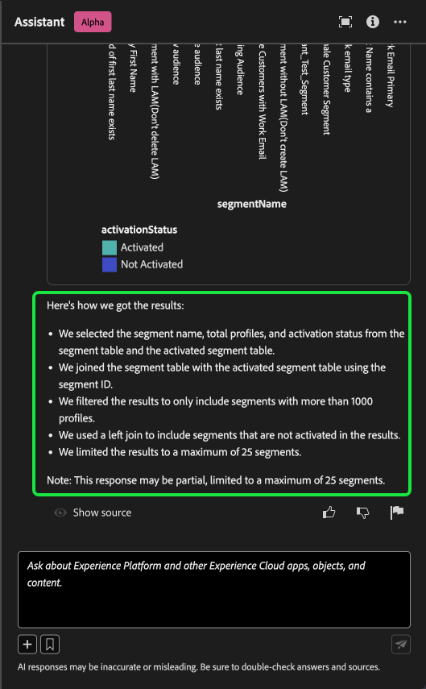

# AI Assistant voor Adobe Experience Platform

>[!NOTE]
>
>AI Assistant voor Adobe Experience Platform is momenteel in bèta. De functie en documentatie kunnen worden gewijzigd.

AI Assistant is een interface-functie waarmee u door Adobe Experience Platform en Real-time Customer Data Platform kunt navigeren en inzicht kunt krijgen in concepten en gebruiksgegevens van uw objecten.

U kunt AI Assistant opvragen voor informatie zoals:

* Richtlijnen voor het uitvoeren van taken die verband houden met gegevens en publiek.
* Statussen en metriek van de bestaande gegevensobjecten in uw organisatie.
* Gebruik voorbeelden van hoofdletters en nuances om uw gegevensobjecten beter te begrijpen, zoals kenmerken, publiek, dataflows, datasets, bestemmingen, schema&#39;s en bronnen.

Lees de onderstaande handleiding voor meer informatie over het gebruik van AI Assistant voor het navigeren naar en begrijpen van uw Experience Platform- en Real-Time CDP-workflows.

>[!BEGINSHADEBOX]

**Hoe werkt AI Assistant?**

De Medewerker van AI antwoordt op uw voorgelegde vragen door een gegevensbestand te vragen en dan gegevens van het gegevensbestand in een leesbaar antwoord te vertalen.

Deze interne vertegenwoordiging van onderliggende gegevens is ook genoemd geworden KennisGrafiek - een uitvoerig Web van concepten, gegevens, en meta-gegevens voor een bepaald antwoord.

De Kennisgrafiek bestaat uit subgrafieken waarnaar wordt verwezen wanneer query&#39;s worden verzonden:

* Gebruikersgegevens van de klant.
* Gebruikersgegevens van de klant in verschillende meta-winkels.
* Documentatie Experience League.

Er zijn twee klassen vragen om te overwegen alvorens AI Medewerker te vragen:

* **Conceptvragen**: Concept-vragen gaan over Adobe-concepten met betrekking tot gegevens of publiek. Voorbeelden van vragen over concepten zijn:
   * Wat is het verschil tussen partij en het stromen segmentatie?
   * Zijn er industriële gegevensmodellen en hoe gebruik ik deze?
   * Wanneer wordt Real-Time CDP het beste voorgeschreven?
* **Gebruiksvragen**: De vragen van het gebruik zijn over de gegevensvoorwerpen binnen uw organisatie. Enkele voorbeelden van gebruiksvragen zijn:
   * Hoeveel datasets heb ik?
   * Hoeveel schemakenmerken zijn nooit gebruikt?
   * Welk publiek is geactiveerd?

>[!ENDSHADEBOX]

## Doelstellingen die u kunt verwezenlijken met AI Assistant

U kunt AI Assistant gebruiken voor doelstellingen zoals:

| Doelstelling | Beschrijving | Voorbeeld |
| --- | --- | --- |
| Leerconcepten en doorlopende workflows | <ul><li>Als beginnende gebruiker, kunt u AI Medewerker gebruiken om de concepten van Real-Time CDP en van Adobe Journey Optimizer te leren en aan boord aan producten en eigenschappen te zijn die u niet vertrouwd met bent.</li><li>Als ervaren gebruiker, kunt u AI Medewerker gebruiken om een randgeval op te lossen dat uw werkschema kan blokkeren. | <ul><li>Hoe kan ik een dashboard instellen in Journey Analytics?</li><li>Vertel me wat gebruiksgevallen voor Real-Time CDP.</li></ul> |
| Problemen oplossen | Met AI Assistant leert u hoe u fouten in de basisbeginselen die u in uw workflow tegenkomt, kunt opsporen. | <ul><li>Wat is deze fout? {ERROR_MESSAGE} bedoel?</li><li>Waarom kan ik het publiek met de naam &quot;Luma: Email Audience&quot; niet verwijderen?</li></ul> |
| Zandbakhygiëne | Met AI Assistant kunt u eventuele duplicaten of ongebruikte objecten identificeren, zodat u de sandbox op efficiënte wijze kunt onderhouden. | <ul><li>Kan je me een publiek laten zien dat vergelijkbaar is?</li><li>Zijn er regelingen die geen bijbehorende dataset hebben?</li></ul> |
| Waardeanalyse | Met AI Assistant kunt u de meest gebruikte gegevensobjecten identificeren en prestatie-indicatoren beoordelen of de meest waardevolle gegevensobjecten vinden. | <ul><li>Hoeveel profielen bevinden zich in de segmentdefinitie &quot;Luma: Email Audience&quot;?</li><li>Wanneer werd het publiek geactiveerd aan de bestemming van het publiek van het Experience Cloud?</li></ul> |
| Zoeken | De Medewerker van AI van het gebruik om gesteunde voorwerpen van het Experience Platform zoals publiek, datasets, bestemmingen, schema&#39;s, en bronnen te vinden. | <ul><li>Maak een lijst van de soorten publiek die &quot;Luma&quot;in de naam bevatten die in het laatste kwartaal werden gecreeerd.</li><li>Welke kenmerken bevinden zich in het XDM-schema &quot;Luma: Custom Actions&quot;?</li></ul> |
| Effectanalyse | Met AI Assistant kunt u gegevensobjecten identificeren die in bepaalde workflows zijn gebruikt, zodat u het effect van wijzigingen kunt beoordelen. | <ul><li>Welk publiek gebruikt `homeAddress.city` in het schema &quot;Luma: PersonProfiles&quot;?</li><li>Welke datasets zijn `consents.marketing.push.val` profielkenmerk opgeslagen in?</li></ul> |

## De Hulp van AI van de toegang in de UI van het Experience Platform

Als u AI Assistant wilt starten, selecteert u de optie **[!UICONTROL AI Assistant icon]** in de bovenste koptekst van de gebruikersinterface van het Experience Platform.

De interface AI Assistant wordt weergegeven en bevat direct informatie die u nodig hebt om aan de slag te gaan. U kunt de opties gebruiken die onder [!UICONTROL Ideas to get started] om vragen en bevelen zoals te beantwoorden:

* [!UICONTROL Which of my audiences are activated?]
* [!UICONTROL What is a schema?]
* [!UICONTROL Tell me some common use cases for Real-Time CDP]

Als u met AI Assistant wilt werken, gebruikt u het invoervak om query&#39;s of opdrachten te typen. U kunt ook de opdracht (**`+`**) gebruiken om de functie Automatisch aanvullen en het bladwijzerpictogram te gebruiken voor toegang tot uw query&#39;s en opdrachten met bladwijzer.

## Voorbeeld van hoofdletters/kleine letters gebruiken: gebruik AI Assistant om het maken van het schema te versnellen

>[!NOTE]
>
>De volgende workflow is een voorbeeld waarin het proces voor het maken van een ervaringsgebeurtenisschema wordt gebruikt om te laten zien hoe u AI Assistant kunt gebruiken wanneer u de gebruikersinterface van het Experience Platform gebruikt.

Overweeg een gebruiksgeval waarin u een **Apparaathandel in gebeurtenisschema**. Tijdens het proces van het creëren van het gebeurtenisschema, komt u tegen `eventType` veld. &quot;Op dit punt kunt u de workflow afsluiten en verwijzen naar de [grondbeginselen van een schemacompositie](../xdm/schema/composition.md) documentatie, of u kunt AI Medewerker gebruiken om antwoorden op uw vragen terug te winnen en extra middelen door de documentatiekoppelingen te vinden die door AI Medewerker worden aanbevolen.&quot;

Om te beginnen voert u uw vraag in het tekstvak in. In het onderstaande voorbeeld wordt de vraag gesteld aan AI Assistant: &quot;**Wat is het eventType-veld in een ExperienceEvent-schema?**&quot;

AI Assistant zoekt vervolgens naar zijn kennisbasis en berekent een antwoord. AI Assistant retourneert na enkele ogenblikken een antwoord en verwante suggesties die u kunt gebruiken als follow-upaanwijzingen.

Nadat u een reactie hebt ontvangen van AI Assistant, kunt u een aantal opties selecteren om te bepalen hoe u wilt doorgaan.

### Uw query opslaan {#save-your-query}

+++Selecteren om een voorbeeld te bekijken van hoe u een query opslaat

Als u de query wilt opslaan, selecteert u het bladwijzerpictogram naast uw vraag.

Als u de opgeslagen query wilt openen, selecteert u het bladwijzerpictogram onder het invoervak en selecteert u de query die u wilt uitvoeren.

+++

### Gegevens in uw sandbox weergeven {#view-data-in-your-sandbox}

+++Selecteren om voorbeeld weer te geven

Afhankelijk van uw query biedt AI Assistant aanvullende informatie over de gegevens in uw sandbox. Als u wilt zien hoe de reactie op uw query op uw sandbox wordt toegepast, selecteert u **[!UICONTROL In your sandbox].**

Tijdens deze stap kan AI Assistant rechtstreekse koppelingen naar de UI-pagina&#39;s van bepaalde objecten in kwestie maken. In het onderstaande voorbeeld biedt AI Assistant directe koppelingen naar de [!UICONTROL Schemas] en [!UICONTROL Segments] UI-pagina&#39;s.

+++

### Het antwoord controleren {#verify-the-response}

++ + selecteren om een voorbeeld te bekijken van hoe te om bronnen te tonen

Als u citaties wilt weergeven en de reactie van AI Assistant wilt valideren, selecteert u **[!UICONTROL Show sources]**. AI Assistant biedt koppelingen naar documentatie die het antwoord van de assistent bevestigt. U kunt ook de query&#39;s gebruiken die in AI Assistant zijn opgenomen [!UICONTROL Related suggestions] om onderwerpen met betrekking tot uw originele vraag verder te onderzoeken.

+++

### Gegevensgebruik en visualisatie {#data-usage-and-visualization}

+++Selecteren om een voorbeeld weer te geven van vragen over gegevensgebruik en gegevensvisualisatie

AI Assistant kan alleen reageren op een query over gegevensgebruik binnen uw organisatie als u zich in een actieve sandbox bevindt.

In het onderstaande voorbeeld krijgt AI Assistant de volgende query: **&quot;Geef me segmentdefinities weer met meer dan 1000 profielen en neem de activeringsstatus op.&quot;** De Medewerker van AI antwoordt dan met een grafiek die uw segment en profielgegevens visualiseert.

U kunt de muisaanwijzer op een afzonderlijke balk plaatsen om specifieke gegevens weer te geven. U kunt ook het pictogram voor vergroten selecteren voor een grotere weergave van het diagram.

Er wordt een uitgebreide weergave van de visualisatie weergegeven. U kunt de uitgevouwen modaal gebruiken om uw gegevens verder te inspecteren en is vooral nuttig wanneer visualisatie met een groot aantal kolommen terugkeert.

Als een vraag over gegevensgebruik wordt gesteld, geeft AI Assistant een uitleg van de manier waarop het antwoord is berekend. In het onderstaande voorbeeld geeft AI Assistant een overzicht van de stappen die zijn genomen om segmentdefinities weer te geven met meer dan 1000 profielen en hun respectieve activeringsstatus.

U kunt filters en wijzigingen aan uw vragen ook verstrekken, en u kunt AI Medewerker opdragen om zijn bevindingen terug te geven die op de filters worden gebaseerd die u omvat. Bijvoorbeeld, kunt u AI Medewerker vragen om u een trend van de definities van het tellingssegment in de orde van hun gecreeerde datum te tonen, segmentdefinities met nul totale profielen te verwijderen, en maandnamen in plaats van gehelen te gebruiken wanneer het tonen van de gegevens.

+++

### Automatisch aanvullen gebruiken {#use-auto-complete}

+++Select om een voorbeeld van automatisch aanvullen te bekijken

Met de functie Automatisch aanvullen kunt u een lijst met gegevensobjecten ontvangen die in uw sandbox staan. De aanbevelingen van Autocomplete zijn beschikbaar voor de volgende domeinen: publiek, schema&#39;s, datasets, bronnen, en bestemmingen.

U kunt de functie voor automatisch aanvullen gebruiken door het plusteken (**`+`**) in uw zoekopdracht. U kunt ook het plusteken (**`+`**) onder aan het tekstinvoervak. Er wordt een venster weergegeven met een lijst met aanbevolen gegevensobjecten uit uw sandbox.

Selecteer vervolgens het gegevensobject waarop u een query wilt uitvoeren om uw vraag te voltooien en verzend uw vraag.

+++

### Meerdere keren gebruiken {#use-multi-turn}

+++Selecteren om een voorbeeld van meerdere keren te bekijken

U kunt de multi-boommogelijkheden van AI Medewerker gebruiken om een natuurlijker gesprek tijdens uw ervaring te hebben. AI Assistant kan vervolgvragen beantwoorden. die context kan worden afgeleid uit een eerdere interactie.

In het onderstaande voorbeeld wordt AI Assistant gevraagd naar het totale aantal gegevensstromen in de huidige organisatie.

Vervolgens ontvangt AI Assistant een ander vervolgverzoek. Deze keer reageert AI Assistant door de gegevensstromen weer te geven die momenteel in uw organisatie bestaan.

+++

## Documentatie {#documentation}

Momenteel geldt de documentatie-index voor Adobe Experience Platform (Real-Time CDP en Soorten publiek). De index wordt periodiek bijgewerkt.

Het documentatiemodel wordt opgeleid op Experience Platform (Real-Time CDP en Soorten publiek). Vragen die buiten Adobe Experience Platform vallen, zoals vragen over andere producten van de Adobe, zoals Adobe Target en de Creative Cloud-suite, kunnen niet worden beantwoord.

## Gegevensgebruik {#data-usage}

U kunt ook vragen stellen aan AI Assistant over uw gegevensgebruik in de volgende domeinen:

* Attributen
* Doelgroepen
* Gegevensstromen
* Gegevenssets
* Doelen _(Vragen over accounts en sommige vragen over gegevensstroom kunnen op dit moment niet worden beantwoord.)_
* Schemas _(Op dit moment kunnen vragen met betrekking tot veldgroepen niet worden beantwoord.)_
* Bronnen _(Op dit moment kunnen vragen over de rekeningen niet worden beantwoord.)_

Voor vragen van gebruiksgegevens, kunnen de antwoorden niet op de huidige staat van UI wijzen. De gegevens die deze vragen ondersteunen, worden om de 24 uur bijgewerkt. Zo worden wijzigingen die gebruikers overdag aanbrengen in Real-Time CDP gesynchroniseerd met de gegevensopslag &#39;s nachts, waarna ze &#39;s ochtends beschikbaar komen voor vragen van gebruikers. Mogelijk moet u uw vragen opmaken als: &quot;Wanneer was het publiek met de titel {TITLE} gemaakt?&quot; in plaats van &quot;Wanneer was het {TITLE} publiek gemaakt?&quot;

U moet zich aanmelden bij een sandbox om informatie te krijgen over specifieke gegevens die betrekking hebben op objecten, zoals soorten publiek, schema&#39;s, datasets, kenmerken en doelen.

### Voorbeeldvragen over gegevensgebruik {#example-data-usage-questions}

+++Selecteren om een lijst met voorbeelden van vragen over gegevensgebruik weer te geven

| Type vraag | Beschrijving | Voorbeelden |
| --- | --- | --- | 
| Gegevensverbinding | Gebruik van een of meerdere objecten bijhouden over andere Experience Platforms | <ul><li>Welke gegevensset(s) gebruiken {SCHEMA_NAME} schema?</li><li>Hoeveel datasets zijn opgenomen gebruikend het zelfde schema?</li><li>Welke datasets zijn gebruikt in geactiveerd publiek?</li><li>Maak een lijst van de schema&#39;s die attributen hebben die in geactiveerd publiek worden gebruikt.</li><li>Toon me het publiek dat wordt geactiveerd aan {DESTINATION_ACCOUNT_NAME} en hebben meer dan 1000 profielen.</li><li>Toon me de attributen die in de geactiveerde doelgroepen worden gebruikt die na jan 2023 zijn gewijzigd.</li><li>Wat zijn de datasets die via worden opgenomen {SOURCE_NAME}?</li><li>Aan welke gegevensstromen is gekoppeld {DATAFLOW_NAME}</li><li>Geef een overzicht van de schema&#39;s die betrekking hebben op geactiveerd publiek en die in het afgelopen jaar zijn gemaakt.</li></ul> |
| Distributie en aggregaties | Op samenvattingen gebaseerde vragen over het gebruik van Experience Platforms-objecten | <ul><li>Wat is het percentage van het actieve publiek?</li><li>Hoeveel velden worden in segmentatie gebruikt?</li><li>Welk publiek wordt geactiveerd aan het meeste aantal bestemmingen?</li><li>Duplicaat publiek weergeven.</li><li>Toon me het publiek geactiveerd aan {DESTINATION_ACCOUNT_NAME} en rangschikken op profielgrootte.</li><li>Wat is het percentage van het publiek dat niet is geactiveerd, maar meer dan 100 profielen heeft. Laat me hun namen zien.</li><li>Maak een lijst van de 3 bronschakelaars die gegevens in mijn datasets opnemen.</li><li>Geef me de bovenste 5 kenmerken weer die bij actiepunten worden gebruikt, afhankelijk van het aantal dat ze voorkomen.</li></ul> |
| Object opzoeken | Haal een Experience Platform-object of de eigenschappen ervan op of open het object. | <ul><li>Welke datasets hebben geen schema verbonden aan hen</li><li>De kenmerken weergeven die worden gebruikt voor {AUDIENCE_NAME}?</li><li>Geef me de lijst van schema&#39;s die profiel toegelaten zijn maar niet sinds hun verwezenlijking zijn gewijzigd.</li><li>Welk publiek is de afgelopen week gewijzigd?</li><li>Geef mij een overzicht van de doelgroepen die dezelfde segmentdefinities hebben en de datum waarop ze zijn gemaakt.</li><li>Welke datasets toegelaten profiel zijn en ook omvatten hoeveel publiek van elke dataset is gecreeerd.</li><li>Welke bronrekeningen worden geassocieerd met dataset XYZ?</li><li>De segmentdefinitie en wijzigingsdatum weergeven van {AUDIENCE_NAME}.</li></ul> |

+++

## Feedback geven {#feedback}

>[!BEGINSHADEBOX]

**Je feedback is aangevraagd**

Tijdens deze Alpha wordt u gevraagd feedback te geven over de reacties die u ontvangt van de AI Assistant. Alle reacties en ingediende feedback worden gecontroleerd om de AI Assistant-ervaring te blijven verbeteren.

Als u feedback wilt geven, selecteert u duimen omhoog of duimen omlaag na ontvangst van een reactie van de AI Assistant en voert u uw feedback in het tekstvak in. Selecteer vervolgens **[!UICONTROL Submit feedback]** om te verzenden.

>[!ENDSHADEBOX]

+++Feedback geven

>[!BEGINTABS]

>[!TAB Stompelen omhoog]

Selecteer het pictogram van duim op om feedback te geven over wat goed met uw ervaring met de AI Assistant is gegaan.

>[!TAB Miniatuur omlaag]

Selecteer het pictogram met de miniaturen omlaag om feedback te geven over de verbeteringen die u kunt aanbrengen op basis van uw ervaring met de AI Assistant. Tijdens deze stap kunt u ook specifieke opmerkingen maken over uw ervaring. De feedback in de opmerkingen wordt dagelijks bekeken.

>[!TAB Markering]

Selecteer het vlagpictogram om verdere rapporten over uw ervaring te verstrekken gebruikend de Medewerker AI.

>[!ENDTABS]

+++

## Aanvullende informatie {#additional-information}

Raadpleeg deze sectie voor meer informatie over de AI Assistant voor Experience Platform.

### Voorzorgsmaatregelen en beperkingen {#caveats-and-limitations}

In de volgende sectie worden de huidige bedenkingen en beperkingen beschreven die moeten worden meegenomen bij het gebruik van AI Assistant.

#### Beperkte kleine praatjes

U kunt kleine gesprekken voeren met de AI Assistant, maar deze mogelijkheid is momenteel beperkt.

#### Capaciteitsvragen

De AI-assistent kan een onjuiste indruk geven van wat hij kan doen. De volgende typen vragen kunnen onjuist worden beantwoord:

| Voorbeeldvraag | Opmerking |
| --- | --- |
| &quot;Kunt u vragen beantwoorden op {ENTITY}?&quot; | Zolang de AI-assistent in zijn index een enkele pagina kan vinden die naar een bepaalde entiteit verwijst, zal hij ja antwoorden. |
| &quot;Weet je **x** taal?&quot; | De AI Assistant ondersteunt momenteel alleen Engels, maar kan &quot;ja&quot; antwoorden omdat het onderliggende model het ondersteunt. |
| &quot;Kan je...?&quot; | De AI-assistent kan ja antwoorden, ook al is dat niet het geval. |

### Tips {#tips}

In de volgende sectie worden enkele tips en tijdelijke oplossingen beschreven waarmee u rekening kunt houden wanneer u AI Assistant gebruikt.

#### De vragen kunnen met de verkeerde informatiebron worden beantwoord

Soms kan een vraag over uw gebruiksgegevens resulteren in een antwoord op basis van de documentatie. Dit komt omdat de AI-assistent uw vraag verkeerd kan doorsturen naar de verkeerde informatiebron. U kunt dit voorkomen door:

* Herhaal uw vraag om meer SQL-achtige taal te gebruiken
* Expliciet het roepen van de informatiebron aan gebruik.

Lees de onderstaande tabel voor voorbeelden:

| Onjuiste vraag | Goede vraag | Notities |
| --- | --- | --- |
| Wat is mijn grootste publiek? | Wat is mijn grootste publiek? Gegevens gebruiken. | Vertel de AI Assistant expliciet dat het antwoord moet zijn gebaseerd op gegevens. |
| Wat is mijn grootste publiek? | Maak een lijst van mijn grootste publiek. | Er zijn gevallen waarin een &quot;wat...&quot;-vraag kan worden verward met een documentatiegebaseerde vraag. Het gebruik van een opdracht als &quot;list&quot; is een sterkere indicator die u een vraag stelt met gegevens in context. |
| Hoeveel datasets heb ik? | Tel mijn datasets. | De oorspronkelijke vraag werkt voor het publiek, maar werkt mogelijk niet met gegevenssets. |
