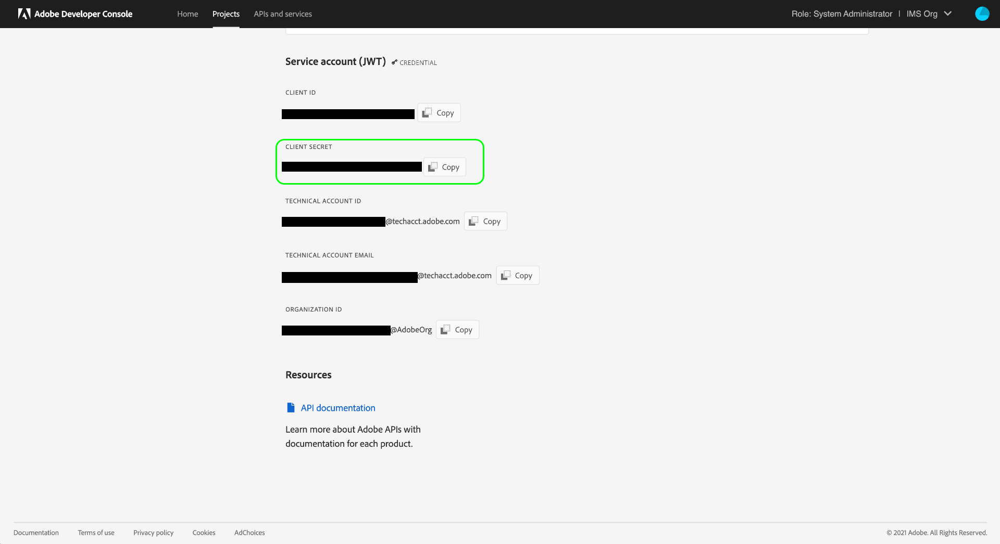

# Experience Platform-API&#39;s verifiëren en openen

Dit document biedt een stapsgewijze zelfstudie voor het verkrijgen van toegang tot een Adobe Experience Platform-ontwikkelaarsaccount om aanroepen uit te voeren naar Experience Platform-API&#39;s. Aan het einde van deze zelfstudie hebt u de volgende gegevens gegenereerd of verzameld die als headers zijn vereist voor alle API-aanroepen van het platform:

* `{ACCESS_TOKEN}`
* `{API_KEY}`
* `{ORG_ID}`

>[!TIP]
>
>Naast de drie bovenstaande referenties, vereisen veel platform-API&#39;s ook een geldig `{SANDBOX_NAME}` dat als header moet worden opgegeven. Zie het [ zandbakenoverzicht ](../sandboxes/home.md) voor meer informatie over zandbakken en het [ zandbakbeheereindpunt ](/help/sandboxes/api/sandboxes.md#list) documentatie voor informatie over het van een lijst maken van de zandbakken beschikbaar aan uw organisatie.

Om de veiligheid van uw toepassingen en gebruikers te handhaven, moeten alle verzoeken aan Experience Platform APIs worden voor authentiek verklaard en worden gemachtigd gebruikend normen zoals OAuth.

In deze zelfstudie wordt uitgelegd hoe u de vereiste referenties kunt verzamelen voor het verifiëren van API-aanroepen van het platform, zoals hieronder in het stroomschema wordt beschreven. U kunt de meeste vereiste geloofsbrieven in eerste éénmalige opstelling verzamelen. Het toegangstoken, echter, moet om de 24 uur worden verfrist.


## Vereisten {#prerequisites}

Om met succes vraag aan Experience Platform APIs te maken, moet u het volgende hebben:

* Een organisatie met toegang tot Adobe Experience Platform.
* Een beheerder van de Admin Console die u als ontwikkelaar en gebruiker voor een productprofiel kan toevoegen.
* Een systeembeheerder van het Experience Platform die u de noodzakelijke attribuut gebaseerde toegangscontroles kan verlenen om gelezen uit te voeren of verrichtingen op verschillende delen van Experience Platform door APIs te schrijven.

U moet ook over een Adobe ID beschikken om deze zelfstudie te voltooien. Als u geen Adobe ID hebt, kunt u er een maken door de volgende stappen uit te voeren:

1. Ga naar [ Adobe Developer Console ](https://console.adobe.io).
2. Selecteer **[!UICONTROL Create a new account]**.
3. Voltooi het aanmeldingsproces.

## De ontwikkelaar van de winst en gebruikerstoegang voor Experience Platform {#gain-developer-user-access}

Voordat u integratie op Adobe Developer Console kunt maken, moet uw account ontwikkelings- en gebruikersmachtigingen hebben voor een productprofiel voor een Experience Platform in Adobe Admin Console.

### Toegang voor ontwikkelaars verkrijgen {#gain-developer-access}

Neem contact op met een [!DNL Admin Console] beheerder in uw organisatie om u als ontwikkelaar toe te voegen aan een productprofiel van een Experience Platform met behulp van [[!DNL Admin Console] ](https://adminconsole.adobe.com/) . Zie de [!DNL Admin Console] documentatie voor specifieke instructies op hoe te [ ontwikkelaarstoegang voor productprofielen ](https://helpx.adobe.com/enterprise/admin-guide.html/enterprise/using/manage-developers.ug.html) beheren.

Zodra u als ontwikkelaar wordt toegewezen, kunt u beginnen integraties in [ Adobe Developer Console ](https://www.adobe.com/go/devs_console_ui) tot stand te brengen. Deze integratie vormt een pijplijn van externe apps en services naar Adobe-API&#39;s.

### Toegang tot gebruikers verkrijgen {#gain-user-access}

Uw [!DNL Admin Console] -beheerder moet u ook als gebruiker toevoegen aan hetzelfde productprofiel. Met gebruikerstoegang, kunt u in UI het resultaat van de API verrichtingen zien die u uitvoert.

Zie de gids op [ het leiden gebruikersgroepen in  [!DNL Admin Console] ](https://helpx.adobe.com/enterprise/admin-guide.html/enterprise/using/user-groups.ug.html) voor meer informatie.

## Een API-sleutel (client-id) en organisatie-id genereren {#generate-credentials}

>[!NOTE]
>
>Als u dit document van de [ Privacy Service API gids ](../privacy-service/api/getting-started.md) volgt, kunt u aan die gids nu terugkeren om de toegangsgeloofsbrieven te produceren uniek aan [!DNL Privacy Service].

Nadat u ontwikkelaars en gebruikers via [!DNL Admin Console] toegang hebt verleend tot Platform, bestaat de volgende stap uit het genereren van uw `{ORG_ID}` - en `{API_KEY}` -referenties in Adobe Developer Console. Deze geloofsbrieven moeten slechts eenmaal worden geproduceerd en kunnen in toekomstige vraag van Platform API worden opnieuw gebruikt.

>[!TIP]
>
>In plaats van naar Developer Console te gaan, kunt u alle verificatiereferenties die u nodig hebt om met platform-API&#39;s te werken, rechtstreeks ophalen via de API-documentatiepagina&#39;s voor naslagwerken. [ las meer ](#get-credentials-functionality) over de functionaliteit.

### Experience Platform toevoegen aan een project {#add-platform-to-project}

Ga naar [ Adobe Developer Console ](https://www.adobe.com/go/devs_console_ui) en teken binnen met uw Adobe ID. Daarna, volg de stappen die in het leerprogramma worden geschetst op [ creërend een leeg project ](https://developer.adobe.com/developer-console/docs/guides/projects/projects-empty/) in de documentatie van Adobe Developer Console.

Wanneer u een nieuw project hebt gemaakt, selecteert u **[!UICONTROL Add API]** op het **[!UICONTROL Project Overview]** -scherm.

>[!TIP]
>
>Als u provisioned voor verscheidene organisaties bent, gebruik de organisatieselecteur in de hogere juiste hoek van de interface om ervoor te zorgen dat u in de organisatie bent u nodig hebt.


Het scherm **[!UICONTROL Add an API]** wordt weergegeven. Selecteer het productpictogram voor Adobe Experience Platform en kies vervolgens **[!UICONTROL Experience Platform API]** voordat u **[!UICONTROL Next]** selecteert.


>[!TIP]
>
>Selecteer de **[!UICONTROL View docs]** optie om in een afzonderlijk browser venster aan de volledige [ Experience Platform API verwijzingsdocumentatie ](https://developer.adobe.com/experience-platform-apis/) te navigeren.

### Selecteer het verificatietype [!UICONTROL OAuth Server-to-Server] {#select-oauth-server-to-server}

Selecteer vervolgens het verificatietype [!UICONTROL OAuth Server-to-Server] dat u wilt gebruiken voor het genereren van toegangstokens en het openen van de Experience Platform-API.

>[!IMPORTANT]
>
>De methode **[!UICONTROL OAuth Server-to-Server]** is de enige ondersteunde methode voor het genereren van tokens die vooruit gaat. De eerder ondersteunde **[!UICONTROL Service Account (JWT)]** -methode is vervangen en kan niet worden geselecteerd voor nieuwe integraties. Hoewel bestaande integratie met behulp van de JWT-verificatiemethode tot 1 januari 2025 blijft werken, wordt in de Adobe ten zeerste aanbevolen dat u voor die datum bestaande integratie naar de nieuwe [!UICONTROL OAuth Server-to-Server] -methode migreert. Krijg meer informatie in de sectie [!BADGE  Afgekeurd ]{type=negative}[ produceer een Token van het Web JSON (JWT) ](#jwt).


### Selecteer de productprofielen voor uw integratie {#select-product-profiles}

Selecteer **[!UICONTROL AEP-Default-All-Users]** in het **[!UICONTROL Configure API]** -scherm.

<!--
Your integration's service account will gain access to granular features through the product profiles selected here.

-->

>[!IMPORTANT]
>
Om toegang tot bepaalde eigenschappen in Platform te krijgen, hebt u ook een systeembeheerder nodig om u de noodzakelijke op attribuut-gebaseerde toegangsbeheertoestemmingen te verlenen. Lees meer in de sectie [ krijgt de noodzakelijke op attributen-gebaseerde toegangsbeheertoestemmingen ](#get-abac-permissions).


Selecteer **[!UICONTROL Save configured API]** wanneer u klaar bent.

In de onderstaande videozelfstudie vindt u een analyse van de hierboven beschreven stappen voor het instellen van integratie met de Experience Platform-API:

>[!VIDEO](https://video.tv.adobe.com/v/28832/?learn=on)

### Referenties verzamelen {#gather-credentials}

Zodra API aan het project is toegevoegd, **[!UICONTROL Experience Platform API]** toont de pagina voor het project de volgende geloofsbrieven die in alle vraag aan Experience Platform APIs worden vereist:


* `{API_KEY}` ([!UICONTROL Client ID])
* `{ORG_ID}` ([!UICONTROL Organization ID])

<!--


<!--

In addition to the above credentials, you also need the generated **[!UICONTROL Client Secret]** for a future step. Select **[!UICONTROL Retrieve client secret]** to reveal the value, and then copy it for later use.



-->

## Een toegangstoken genereren {#generate-access-token}

De volgende stap bestaat uit het genereren van een `{ACCESS_TOKEN}` -referentie voor gebruik in API-aanroepen van het platform. In tegenstelling tot de waarden voor `{API_KEY}` en `{ORG_ID}` , moet om de 24 uur een nieuw token worden gegenereerd om door te gaan met het gebruik van platform-API&#39;s. Selecteer **[!UICONTROL Generate access token]**, zoals hieronder wordt weergegeven.

 te produceren

>[!TIP]
>
U kunt ook een Postman-omgeving en -verzameling gebruiken om toegangstokens te genereren. Voor meer informatie, lees de sectie over [ gebruikend Postman om API vraag ](#use-postman) voor authentiek te verklaren en te testen.

## Verificatiegegevens rechtstreeks in de API-naslagdocumentatie maken en ophalen {#get-credentials-functionality}

Vanaf de release van november 2024 van Experience Platform kunt u referenties ophalen om de Experience Platform-API&#39;s rechtstreeks vanaf de API-referentiepagina&#39;s te gebruiken, zonder dat u naar [!UICONTROL Developer Console] hoeft te gaan. Bekijk het voorbeeld hieronder van de [ Dienst API van de Stroom - de pagina van Doelen ](https://developer.adobe.com/experience-platform-apis/references/destinations/).


Als u referenties wilt ophalen om Platform API&#39;s aan te roepen, navigeert u naar een willekeurige API-referentiepagina voor Experience Platforms en selecteert u **[!UICONTROL Sign in]** boven aan de pagina. Meld u aan met uw **[!UICONTROL Personal Account]** of **[!UICONTROL Company or School Account]** .

Nadat u zich hebt aangemeld, selecteert u **[!UICONTROL Create new credential]** om een nieuwe set referenties te maken voor toegang tot API&#39;s van het platform.


Gebruik vervolgens de keuzelijst om het venster met referenties te openen, een toegangstoken te genereren en uw API-sleutel en organisatie-id op te halen. Kopieer de referenties naar de blokken [**[!UICONTROL Try it]**](/help/release-notes/2024/may-2024.md#interactive-api-documentation) op de API-referentiepagina&#39;s om te gaan werken met platform-API&#39;s.


>[!TIP]
>
Het top-of-page geloofsblok blijft getoond aangezien u tussen verschillende eindpuntpagina&#39;s in de Experience Platform API verwijzingsdocumentatie navigeert.

## [!BADGE  Vervangen ] {type=negative} produceer een Symbolisch van het Web JSON (JWT) {#jwt}

>[!WARNING]
>
De JWT-methode voor het genereren van toegangstokens is afgekeurd. Alle nieuwe integraties moeten worden gecreeerd gebruikend de [ Server-aan-Server authentificatiemethode ](#select-oauth-server-to-server). Adobe vereist ook dat u uw bestaande integraties aan de methode OAuth vóór 1 Januari, 2025 voor uw integraties om verder te werken migreert. Lees de volgende belangrijke documentatie:
> 
* [ gids van de Migratie voor uw toepassingen van JWT aan OAuth ](https://developer.adobe.com/developer-console/docs/guides/authentication/ServerToServerAuthentication/migration/)
* [ gids van de Implementatie voor nieuwe en oude toepassingen met OAuth ](https://developer.adobe.com/developer-console/docs/guides/authentication/ServerToServerAuthentication/implementation/)
* [ Voordelen om de Server-aan-Server geloofsbrieven te gebruiken OAuth methode ](https://developer.adobe.com/developer-console/docs/guides/authentication/ServerToServerAuthentication/migration/#why-oauth-server-to-server-credentials)

+++ Vervangen gegevens weergeven

De volgende stap bestaat uit het genereren van een JSON Web Token (JWT) op basis van uw accountgegevens. Deze waarde wordt gebruikt om uw `{ACCESS_TOKEN}` referentie te genereren voor gebruik in API-aanroepen van het platform, die elke 24 uur opnieuw moet worden gegenereerd.

>[!IMPORTANT]
>
In deze zelfstudie wordt beschreven hoe u een JWT kunt genereren in Developer Console. Deze generatiemethode mag echter alleen voor test- en evaluatiedoeleinden worden gebruikt.
>
Voor normaal gebruik moet de JWT automatisch worden gegenereerd. Voor meer informatie over hoe te om JWTs programmatically te produceren, zie de [ gids van de de authentificatieauthentificatie van de de dienstrekening ](https://www.adobe.io/developer-console/docs/guides/authentication/JWT/) op Adobe Developer.

Selecteer **[!UICONTROL Service Account (JWT)]** in de linkernavigatie en selecteer vervolgens **[!UICONTROL Generate JWT]** .


Plak in het tekstvak onder **[!UICONTROL Generate custom JWT]** de inhoud van de persoonlijke sleutel die u eerder hebt gegenereerd toen u de platform-API aan uw serviceaccount toevoegde. Selecteer vervolgens **[!UICONTROL Generate Token]** .


De pagina wordt bijgewerkt om de gegenereerde JWT weer te geven, samen met een voorbeeld-URL-opdracht waarmee u een toegangstoken kunt genereren. In deze zelfstudie selecteert u **[!UICONTROL Copy]** naast **[!UICONTROL Generated JWT]** om de token naar het klembord te kopiëren.


**produceer een toegangstoken**

Nadat u een JWT hebt gegenereerd, kunt u deze in een API-aanroep gebruiken om de `{ACCESS_TOKEN}` -aanroep te genereren. In tegenstelling tot de waarden voor `{API_KEY}` en `{ORG_ID}` , moet om de 24 uur een nieuw token worden gegenereerd om door te gaan met het gebruik van platform-API&#39;s.

**Verzoek**

Het volgende verzoek genereert een nieuwe `{ACCESS_TOKEN}` op basis van de referenties die in de payload zijn opgegeven. Dit eindpunt accepteert alleen formuliergegevens als nuttige last en daarom moet het een `Content-Type` header van `multipart/form-data` krijgen.

```shell
curl -X POST https://ims-na1.adobelogin.com/ims/exchange/jwt \
  -H 'Content-Type: multipart/form-data' \
  -F 'client_id={API_KEY}' \
  -F 'client_secret={SECRET}' \
  -F 'jwt_token={JWT}'
```

| Eigenschap | Beschrijving |
| --- | --- |
| `{API_KEY}` | `{API_KEY}` ([!UICONTROL Client ID]) die u in a [ vorige stap ](#api-ims-secret) terugwende. |
| `{SECRET}` | Het cliëntgeheim dat u in a [ vorige stap ](#api-ims-secret) terughaalde. |
| `{JWT}` | JWT die u in a [ vorige stap ](#jwt) produceerde. |

>[!NOTE]
>
U kunt dezelfde API-sleutel, clientgeheim en JWT gebruiken om een nieuw toegangstoken voor elke sessie te genereren. Hierdoor kunt u het genereren van toegangstoken in uw toepassingen automatiseren.

**Reactie**

```json
{
  "token_type": "bearer",
  "access_token": "{ACCESS_TOKEN}",
  "expires_in": 86399992
}
```

| Eigenschap | Beschrijving |
| --- | --- |
| `token_type` | Het type of token dat wordt geretourneerd. Voor toegangstokens is deze waarde altijd `bearer` . |
| `access_token` | De gegenereerde `{ACCESS_TOKEN}` . Deze waarde, voorafgegaan door het woord `Bearer` , is vereist als de `Authentication` -header voor alle API-aanroepen van Platform. |
| `expires_in` | Het aantal milliseconden dat resteert tot het toegangstoken verloopt. Zodra deze waarde 0 bereikt, moet een nieuw toegangstoken worden geproduceerd om het blijven gebruiken van Platform APIs. |

+++

## Toegangsreferenties testen {#test-credentials}

Nadat u alle drie vereiste gegevens hebt verzameld (toegangstoken, API-sleutel en organisatie-id), kunt u de volgende API-aanroep proberen te maken. Deze vraag maakt een lijst van alle standaard [!DNL Experience Data Model] (XDM) klassen beschikbaar aan uw organisatie. De invoer en voert de vraag in [ Postman ](#use-postman) uit.

>[!BEGINSHADEBOX]

**Verzoek**

```SHELL
curl -X GET https://platform.adobe.io/data/foundation/schemaregistry/global/classes \
  -H 'Accept: application/vnd.adobe.xed-id+json' \
  -H 'Authorization: Bearer {{ACCESS_TOKEN}}' \
  -H 'x-api-key: {{API_KEY}}' \
  -H 'x-gw-ims-org-id: {{ORG_ID}}'
```

**Reactie**

Als uw reactie vergelijkbaar is met de hieronder weergegeven reactie, zijn uw gegevens geldig en werken ze. (Deze reactie is afgebroken voor de ruimte.)

```JSON
{
  "results": [
    {
        "title": "XDM ExperienceEvent",
        "$id": "https://ns.adobe.com/xdm/context/experienceevent",
        "meta:altId": "_xdm.context.experienceevent",
        "version": "1"
    },
    {
        "title": "XDM Individual Profile",
        "$id": "https://ns.adobe.com/xdm/context/profile",
        "meta:altId": "_xdm.context.profile",
        "version": "1"
    }
  ]
}
```

>[!ENDSHADEBOX]

>[!IMPORTANT]
>
Terwijl de vraag hierboven volstaat om uw toegangsgeloofsbrieven te testen, ben zich ervan bewust dat u niet tot verscheidene middelen zult kunnen toegang hebben of wijzigen zonder het hebben van de juiste op attribuut-gebaseerde toegangsbeheertoestemmingen. Lees meer in **krijgt de noodzakelijke op attributen-gebaseerde toestemmingen van de toegangscontrole** hieronder sectie.

## Krijg de noodzakelijke op attributen-gebaseerde toegangsbeheertoestemmingen {#get-abac-permissions}

Om tot verscheidene middelen binnen Experience Platform toegang te hebben of te wijzigen, moet u de aangewezen toestemmingen van de toegangscontrole hebben. De beheerders van het systeem kunnen u de [ toestemmingen verlenen u ](/help/access-control/ui/permissions.md) nodig hebt. Krijg meer informatie in de sectie over [ het leiden API geloofsbrieven voor een rol ](/help/access-control/abac/ui/permissions.md#manage-api-credentials-for-role).

De gedetailleerde informatie over hoe een systeembeheerder de vereiste toestemmingen kan verlenen om tot de middelen van het Platform via API toegang te hebben is ook beschikbaar in de videozelfstudie hieronder:

>[!VIDEO](https://video.tv.adobe.com/v/28832/?learn=on&t=159)

## Postman gebruiken om API-aanroepen te verifiëren en te testen {#use-postman}

[ Postman ](https://www.postman.com/) is een populair hulpmiddel dat ontwikkelaars toestaat om RESTful APIs te onderzoeken en te testen. U kunt Experience Platform Postman-verzamelingen en -omgevingen gebruiken om uw werk met Experience Platform-API&#39;s te versnellen. Lees meer over [ het gebruiken van Postman in Experience Platform ](/help/landing/postman.md) en het worden begonnen met inzamelingen en milieu&#39;s.

Gedetailleerde informatie over het gebruik van Postman met verzamelingen Experience Platforms en omgevingen is ook beschikbaar in de onderstaande videozelfstudies:

**Download en voer een milieu van Postman in om met Experience Platform APIs te gebruiken**

>[!VIDEO](https://video.tv.adobe.com/v/28832/?learn=on&t=106)

**Gebruik een inzameling van Postman om toegangstokens** te produceren

Download de [ inzameling van Postman van de Dienst van Identity Management ](https://github.com/adobe/experience-platform-postman-samples/tree/master/apis/ims?lang=nl) en bekijk de video hieronder om te leren hoe te om toegangstokens te produceren.

>[!VIDEO](https://video.tv.adobe.com/v/29698/?learn=on)

**de inzamelingen van Postman van het Experience Platform API van de Download en interactie met APIs**

>[!VIDEO](https://video.tv.adobe.com/v/29704/?learn=on)

<!--
This [Medium post](https://medium.com/adobetech/using-postman-for-jwt-authentication-on-adobe-i-o-7573428ffe7f) describes how you can set up Postman to automatically perform JWT authentication and use it to consume Platform APIs.
-->

## Systeembeheerders: toegangsbeheer voor ontwikkelaars en API&#39;s verlenen met machtigingen voor Experience Platforms {#grant-developer-and-api-access-control}

>[!NOTE]
>
Alleen systeembeheerders kunnen API-referenties weergeven en beheren in Machtigingen.

Voordat u integratie op Adobe Developer Console kunt maken, moet uw account ontwikkelings- en gebruikersmachtigingen hebben voor een productprofiel voor een Experience Platform in Adobe Admin Console.

### Ontwikkelaars toevoegen aan productprofiel {#add-developers-to-product-profile}

Ga naar [[!DNL Admin Console] ](https://adminconsole.adobe.com/) en meld u aan met uw Adobe ID.

Selecteer **[!UICONTROL Products]** en selecteer vervolgens **[!UICONTROL Adobe Experience Platform]** in de lijst met producten.


Selecteer op het tabblad **[!UICONTROL Product Profiles]** de optie **[!UICONTROL AEP-Default-All-Users]** . U kunt ook de zoekbalk gebruiken om het productprofiel te zoeken door de naam in te voeren.


Selecteer de tab **[!UICONTROL Developers]** en selecteer vervolgens **[!UICONTROL Add Developer]** .

 toe

Voer de naam **[!UICONTROL Email or username]** van de ontwikkelaar in. Een geldige [!UICONTROL Email or username] geeft de details van de ontwikkelaar weer. Selecteer **[!UICONTROL Save]**.


De ontwikkelaar is toegevoegd en wordt weergegeven op het tabblad [!UICONTROL Developers] .

 worden vermeld

<!--

Commenting out this part since it duplicates information from the section Add Experience Platform to a project

### Set up an API

A developer can add and configure an API within a project in the Adobe Developer Console.

Select your project, then select **[!UICONTROL Add API]**.


In the **[!UICONTROL Add an API]** dialog box select **[!UICONTROL Adobe Experience Platform]**, then select **[!UICONTROL Experience Platform API]**.


In the **[!UICONTROL Configure API]** screen, select **[!UICONTROL AEP-Default-All-Users]**.

-->

### API aan een rol toewijzen

Een systeembeheerder kan APIs aan rollen in het Experience Platform UI toewijzen.

Selecteer **[!UICONTROL Permissions]** en de rol waaraan u de API wilt toevoegen. Selecteer de tab **[!UICONTROL API credentials]** en selecteer vervolgens **[!UICONTROL Add API credentials]** .


Selecteer de API die u aan de rol wilt toevoegen en selecteer vervolgens **[!UICONTROL Save]** .


U wordt teruggestuurd naar het tabblad [!UICONTROL API credentials] , waar de zojuist toegevoegde API wordt weergegeven.


## Aanvullende bronnen {#additional-resources}

Raadpleeg de aanvullende bronnen die hieronder zijn gekoppeld voor meer hulp bij het starten met Experience Platform-API&#39;s

* [ verifieer en toegang Experience Platform APIs ](https://experienceleague.adobe.com/docs/platform-learn/tutorials/platform-api-authentication.html?lang=nl) videoleerprogramma&#39;s pagina
* [ de Inzameling van Postman van de Dienst van Identity Management ](https://github.com/adobe/experience-platform-postman-samples/tree/master/apis/ims?lang=nl) voor het produceren van toegangstokens
* [ Experience Platform API de Verzamelingen van Postman ](https://github.com/adobe/experience-platform-postman-samples/tree/master/apis/experience-platform)

## Volgende stappen {#next-steps}

Door dit document te lezen, hebt u uw toegangsreferenties voor platform-API&#39;s verzameld en getest. U kunt nu samen met de voorbeeld API vraag volgen die door de [ documentatie ](../landing/documentation/overview.md) wordt verstrekt.

Naast de verificatiewaarden die u hebt verzameld in deze zelfstudie, vereisen veel platform-API&#39;s ook een geldige `{SANDBOX_NAME}` die als header moet worden verschaft. Zie het [sandboxoverzicht](../sandboxes/home.md) voor meer informatie.