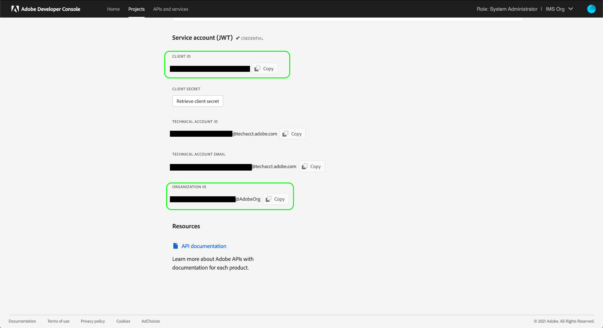

# Experience Platform-API&#39;s verifiëren en openen

Dit document biedt een stapsgewijze zelfstudie voor het verkrijgen van toegang tot een Adobe Experience Platform-ontwikkelaarsaccount om aanroepen uit te voeren naar Experience Platform-API&#39;s. Aan het eind van dit leerprogramma, zult u de volgende geloofsbrieven hebben geproduceerd of verzameld die als kopballen in alle Platform API vraag worden vereist:

* `{ACCESS_TOKEN}`
* `{API_KEY}`
* `{ORG_ID}`

>[!TIP]
>
>Naast de drie bovenstaande referenties is voor veel Platform-API&#39;s ook een geldige `{SANDBOX_NAME}` te verstrekken als koptekst. Zie de [sandboxen, overzicht](../sandboxes/home.md) voor meer informatie over sandboxen en de [sandboxbeheereindpunt](/help/sandboxes/api/sandboxes.md#list) documentatie voor informatie over het vermelden van de zandbakken beschikbaar aan uw organisatie.

Om de veiligheid van uw toepassingen en gebruikers te handhaven, moeten alle verzoeken aan Experience Platform APIs worden voor authentiek verklaard en worden gemachtigd gebruikend normen zoals OAuth.

In deze zelfstudie wordt uitgelegd hoe u de vereiste gegevens verzamelt voor het verifiëren van API-aanroepen van Platforms, zoals in het onderstaande stroomschema wordt beschreven. U kunt de meeste vereiste geloofsbrieven in eerste éénmalige opstelling verzamelen. Het toegangstoken, echter, moet om de 24 uur worden verfrist.


## Vereisten {#prerequisites}

Om met succes vraag aan Experience Platform APIs te maken, moet u het volgende hebben:

* Een organisatie met toegang tot Adobe Experience Platform.
* Een beheerder van de Admin Console die u als ontwikkelaar en gebruiker voor een productprofiel kan toevoegen.

U moet ook over een Adobe ID beschikken om deze zelfstudie te voltooien. Als u geen Adobe ID hebt, kunt u er een maken door de volgende stappen uit te voeren:

1. Ga naar [Adobe Developer Console](https://console.adobe.io).
2. Selecteer **[!UICONTROL Create a new account]**.
3. Voltooi het aanmeldingsproces.

## Verbeter ontwikkelaar en gebruikerstoegang voor Experience Platform {#gain-developer-user-access}

Voordat u integratie in Adobe Developer Console maakt, moet uw account ontwikkelings- en gebruikersmachtigingen hebben voor een productprofiel voor een Experience Platform in Adobe Admin Console.

### Toegang voor ontwikkelaars verkrijgen {#gain-developer-access}

Contact opnemen met [!DNL Admin Console] beheerder in uw organisatie om u als ontwikkelaar aan een het productprofiel van het Experience Platform toe te voegen gebruikend [[!DNL Admin Console]](https://adminconsole.adobe.com/). Zie de [!DNL Admin Console] documentatie voor specifieke instructies over hoe te [toegang voor ontwikkelaars beheren voor productprofielen](https://helpx.adobe.com/enterprise/admin-guide.html/enterprise/using/manage-developers.ug.html).

Als u eenmaal als ontwikkelaar bent toegewezen, kunt u beginnen met het maken van integratie in [Adobe Developer Console](https://www.adobe.com/go/devs_console_ui). Deze integratie vormt een pijplijn van externe apps en services naar Adobe-API&#39;s.

### Toegang tot gebruikers verkrijgen {#gain-user-access}

Uw [!DNL Admin Console] beheerder moet u ook als gebruiker toevoegen aan hetzelfde productprofiel. Zie de handleiding op [gebruikersgroepen beheren in [!DNL Admin Console]](https://helpx.adobe.com/enterprise/admin-guide.html/enterprise/using/user-groups.ug.html) voor meer informatie .

## Een API-sleutel (client-id) en organisatie-id genereren {#generate-credentials}

>[!NOTE]
>
>Als u dit document volgt vanuit de [Handleiding Privacy Service-API](../privacy-service/api/getting-started.md), kunt u nu terugkeren naar die gids om de toegangsgeloofsbrieven te produceren uniek aan [!DNL Privacy Service].

Nadat u ontwikkelaars en gebruikers toegang tot Platform hebt gegeven door [!DNL Admin Console]De volgende stap bestaat uit het genereren van uw `{ORG_ID}` en `{API_KEY}` referenties in Adobe Developer Console. Deze geloofsbrieven moeten slechts eenmaal worden geproduceerd en kunnen in toekomstige Platform API vraag worden opnieuw gebruikt.

### Experience Platform toevoegen aan een project {#add-platform-to-project}

Ga naar [Adobe Developer Console](https://www.adobe.com/go/devs_console_ui) en meld u aan met uw Adobe ID. Voer vervolgens de stappen uit die in de zelfstudie worden beschreven [een leeg project maken](https://developer.adobe.com/developer-console/docs/guides/projects/projects-empty/) in de Adobe Developer Console-documentatie.

Als u een nieuw project hebt gemaakt, selecteert u **[!UICONTROL Add API]** op de **[!UICONTROL Project Overview]** scherm.


De **[!UICONTROL Add an API]** wordt weergegeven. Selecteer het productpictogram voor Adobe Experience Platform en kies **[!UICONTROL Experience Platform API]** voordat u selecteert **[!UICONTROL Next]**.


>[!TIP]
>
>Selecteer **[!UICONTROL View docs]** om in een afzonderlijk browservenster naar het volledige venster te navigeren [API-naslagdocumentatie voor Experience Platform](https://developer.adobe.com/experience-platform-apis/).

### Selecteer het verificatietype OAuth Server-to-Server {#select-oauth-server-to-server}

Selecteer vervolgens het verificatietype dat u wilt maken voor het genereren van toegangstokens en voor toegang tot de Experience Platform-API.

>[!IMPORTANT]
>
>Selecteer **[!UICONTROL OAuth Server-to-Server]** de enige methode die wordt ondersteund om verder te gaan. De **[!UICONTROL Service Account (JWT)]** methode is afgekeurd. Terwijl de integratie die de authentificatiemethode JWT gebruikt tot 1 Januari, 2025 zal blijven werken, adviseert Adobe sterk dat u bestaande integratie aan de nieuwe server-aan-server methode OAuth vóór die datum migreert. Meer informatie ophalen in de sectie [!BADGE Vervangen]{type=negative}[Een JSON-webtoken (JWT) genereren](#jwt).


### Selecteer de productprofielen voor uw integratie {#select-product-profiles}

Selecteer vervolgens de productprofielen die op uw integratie moeten worden toegepast.
Via de hier geselecteerde productprofielen krijgt het serviceaccount van uw integratie toegang tot korrelfuncties.

Merk op dat om toegang tot bepaalde eigenschappen in Platform te krijgen, u ook een systeembeheerder nodig hebt om u de noodzakelijke op Attributen-Gebaseerde toegangsbeheertoestemmingen te verlenen. Meer informatie in de sectie [Krijg de noodzakelijke op attributen-gebaseerde toegangsbeheertoestemmingen](#get-abac-permissions).

>[!TIP]
>
Neem contact op met de systeembeheerder als u een bepaald productprofiel wilt zien. Systeembeheerders kunnen API-referenties weergeven en beheren in de weergave Machtigingen. Raadpleeg de sectie voor meer informatie [Ontwikkelaars toevoegen aan productprofiel](#add-developers-to-product-profile).


Selecteren **[!UICONTROL Save configured API]** wanneer u klaar bent.

In de onderstaande videozelfstudie vindt u een analyse van de hierboven beschreven stappen voor het instellen van integratie met de Experience Platform-API:

>[!VIDEO](https://video.tv.adobe.com/v/28832/?learn=on)

### Referenties verzamelen {#gather-credentials}

Zodra API aan het project is toegevoegd, **[!UICONTROL Experience Platform API]** De pagina voor het project toont de volgende geloofsbrieven die in alle vraag aan Experience Platform APIs worden vereist:


* `{API_KEY}` ([!UICONTROL Client ID])
* `{ORG_ID}` ([!UICONTROL Organization ID])

<!--



<!--

In addition to the above credentials, you also need the generated **[!UICONTROL Client Secret]** for a future step. Select **[!UICONTROL Retrieve client secret]** to reveal the value, and then copy it for later use.


-->

## Een toegangstoken genereren {#generate-access-token}

De volgende stap bestaat uit het genereren van een `{ACCESS_TOKEN}` referentie voor gebruik in Platform API vraag. In tegenstelling tot de waarden voor `{API_KEY}` en `{ORG_ID}`moet om de 24 uur een nieuw token worden gegenereerd om Platform API&#39;s te kunnen blijven gebruiken. Selecteren **[!UICONTROL Generate access token]**, zoals hieronder weergegeven.


>[!TIP]
>
U kunt ook een Postman-omgeving en -verzameling gebruiken om toegangstokens te genereren. Lees voor meer informatie de sectie over [het gebruiken van Postman om API vraag voor authentiek te verklaren en te testen](#use-postman).

## [!BADGE Vervangen]{type=negative} Een JSON-webtoken (JWT) genereren {#jwt}

>[!WARNING]
>
De JWT-methode voor het genereren van toegangstokens is afgekeurd. Alle nieuwe integraties moeten worden gecreëerd met behulp van de [OAuth Server-aan-Server authentificatiemethode](#select-oauth-server-to-server). Adobe raadt u ook aan uw bestaande integratie te migreren naar de methode OAuth. Lees de volgende belangrijke documentatie:
> 
* [Migratiehandleiding voor uw toepassingen van JWT naar OAuth](https://developer.adobe.com/developer-console/docs/guides/authentication/ServerToServerAuthentication/migration/)
* [Implementatiehandleiding voor nieuwe en oude toepassingen met OAuth](https://developer.adobe.com/developer-console/docs/guides/authentication/ServerToServerAuthentication/implementation/)
* [Voordelen om de server-aan-server van OAuth methode van geloofsbrieven te gebruiken](https://developer.adobe.com/developer-console/docs/guides/authentication/ServerToServerAuthentication/migration/#why-oauth-server-to-server-credentials)

+++ Vervangen gegevens weergeven

De volgende stap bestaat uit het genereren van een JSON Web Token (JWT) op basis van uw accountgegevens. Deze waarde wordt gebruikt om uw `{ACCESS_TOKEN}` referentie voor gebruik in Platform API vraag, die om de 24 uur opnieuw moet worden geproduceerd.

>[!IMPORTANT]
>
In deze zelfstudie wordt in de onderstaande stappen beschreven hoe u een JWT kunt genereren in de Developer Console. Deze generatiemethode mag echter alleen voor test- en evaluatiedoeleinden worden gebruikt.
>
Voor normaal gebruik moet de JWT automatisch worden gegenereerd. Voor meer informatie over hoe te om JWTs programmatically te produceren, zie [servicerekeningautorisatiehandleiding](https://www.adobe.io/developer-console/docs/guides/authentication/JWT/) op Adobe Developer.

Selecteren **[!UICONTROL Service Account (JWT)]** in de linkernavigatie selecteert u vervolgens **[!UICONTROL Generate JWT]**.


In het tekstvak onder **[!UICONTROL Generate custom JWT]** plakken, plakt u de inhoud van de persoonlijke sleutel die u eerder hebt gegenereerd toen u de Platform-API aan uw serviceaccount toevoegde. Selecteer vervolgens **[!UICONTROL Generate Token]**.


De pagina wordt bijgewerkt om de gegenereerde JWT weer te geven, samen met een voorbeeld-URL-opdracht waarmee u een toegangstoken kunt genereren. In deze zelfstudie selecteert u **[!UICONTROL Copy]** naast **[!UICONTROL Generated JWT]** om het token naar het klembord te kopiëren.


**Een toegangstoken genereren**

Nadat u een JWT hebt gegenereerd, kunt u deze gebruiken in een API-aanroep om uw `{ACCESS_TOKEN}`. In tegenstelling tot de waarden voor `{API_KEY}` en `{ORG_ID}`moet om de 24 uur een nieuw token worden gegenereerd om Platform API&#39;s te kunnen blijven gebruiken.

**Verzoek**

Met de volgende aanvraag wordt een nieuwe `{ACCESS_TOKEN}` op basis van de gegevens die in de payload zijn opgegeven. Dit eindpunt keurt vormgegevens slechts als zijn lading goed, en daarom moet het worden gegeven `Content-Type` header van `multipart/form-data`.

```shell
curl -X POST https://ims-na1.adobelogin.com/ims/exchange/jwt \
  -H 'Content-Type: multipart/form-data' \
  -F 'client_id={API_KEY}' \
  -F 'client_secret={SECRET}' \
  -F 'jwt_token={JWT}'
```

| Eigenschap | Beschrijving |
| --- | --- |
| `{API_KEY}` | De `{API_KEY}` ([!UICONTROL Client ID]) die u hebt opgehaald in een [vorige stap](#api-ims-secret). |
| `{SECRET}` | Het clientgeheim dat u hebt opgehaald in een [vorige stap](#api-ims-secret). |
| `{JWT}` | De JWT die u in een [vorige stap](#jwt). |

>[!NOTE]
>
U kunt dezelfde API-sleutel, clientgeheim en JWT gebruiken om een nieuw toegangstoken voor elke sessie te genereren. Hierdoor kunt u het genereren van toegangstoken in uw toepassingen automatiseren.

**Antwoord**

```json
{
  "token_type": "bearer",
  "access_token": "{ACCESS_TOKEN}",
  "expires_in": 86399992
}
```

| Eigenschap | Beschrijving |
| --- | --- |
| `token_type` | Het type token dat wordt geretourneerd. Deze waarde is altijd voor toegangstokens `bearer`. |
| `access_token` | De gegenereerde `{ACCESS_TOKEN}`. Deze waarde, voorafgegaan door het woord `Bearer`is vereist als de `Authentication` header voor alle Platform API-aanroepen. |
| `expires_in` | Het aantal milliseconden dat resteert tot het toegangstoken verloopt. Zodra deze waarde 0 bereikt, moet een nieuw toegangstoken worden geproduceerd om Platform APIs te blijven gebruiken. |

+++

## Toegangsreferenties testen {#test-credentials}

Nadat u alle drie vereiste gegevens hebt verzameld (toegangstoken, API-sleutel en organisatie-id), kunt u de volgende API-aanroep proberen te maken. Deze vraag maakt een lijst van alle norm [!DNL Experience Data Model] (XDM) klassen beschikbaar aan uw organisatie. De invoer en voert de vraag binnen uit [Postman](#use-postman).

>[!BEGINSHADEBOX]

**Verzoek**

```SHELL
curl -X GET https://platform.adobe.io/data/foundation/schemaregistry/global/classes \
  -H 'Accept: application/vnd.adobe.xed-id+json' \
  -H 'Authorization: Bearer {{ACCESS_TOKEN}}' \
  -H 'x-api-key: {{API_KEY}}' \
  -H 'x-gw-ims-org-id: {{ORG_ID}}'
```

**Antwoord**

Als uw reactie vergelijkbaar is met de hieronder weergegeven reactie, zijn uw gegevens geldig en werken ze. (Deze reactie is afgebroken voor de ruimte.)

```JSON
{
  "results": [
    {
        "title": "XDM ExperienceEvent",
        "$id": "https://ns.adobe.com/xdm/context/experienceevent",
        "meta:altId": "_xdm.context.experienceevent",
        "version": "1"
    },
    {
        "title": "XDM Individual Profile",
        "$id": "https://ns.adobe.com/xdm/context/profile",
        "meta:altId": "_xdm.context.profile",
        "version": "1"
    }
  ]
}
```

>[!ENDSHADEBOX]

>[!IMPORTANT]
>
Terwijl de vraag hierboven volstaat om uw toegangsgeloofsbrieven te testen, ben zich ervan bewust dat u niet tot verscheidene middelen zult kunnen toegang hebben of wijzigen zonder het hebben van de juiste op Attributen-Gebaseerde toegangsbeheertoestemmingen. Lees meer in de [Krijg de noodzakelijke op attributen-gebaseerde toegangsbeheertoestemmingen](#get-abac-permissions) sectie.

## Krijg de noodzakelijke op attributen-gebaseerde toegangsbeheertoestemmingen {#get-abac-permissions}

Om tot verscheidene middelen binnen Experience Platform toegang te hebben of te wijzigen, moet u de aangewezen toestemmingen van de toegangscontrole hebben. Systeembeheerders kunnen u de [machtigingen die u nodig hebt](/help/access-control/ui/permissions.md). Meer informatie vindt u in de sectie over [het beheren van API geloofsbrieven voor een rol](/help/access-control/abac/ui/permissions.md#manage-api-credentials-for-role).

De gedetailleerde informatie over hoe een systeembeheerder de vereiste toestemmingen kan verlenen om tot de middelen van het Platform via API toegang te hebben is ook beschikbaar in de videozelfstudie hieronder:

>[!VIDEO](https://video.tv.adobe.com/v/28832/?learn=on&t=159)

## Postman gebruiken om API-aanroepen te verifiëren en te testen {#use-postman}

[Postman](https://www.postman.com/) is een populair hulpmiddel dat ontwikkelaars toestaat om RESTful APIs te onderzoeken en te testen. U kunt Experience Platform Postman-verzamelingen en -omgevingen gebruiken om uw werk met Experience Platform-API&#39;s te versnellen. Meer informatie over [Postman gebruiken in Experience Platform](/help/landing/postman.md) en aan de slag gaan met verzamelingen en omgevingen.

Gedetailleerde informatie over het gebruik van Postman met verzamelingen Experience Platforms en omgevingen is ook beschikbaar in de onderstaande videozelfstudies:

**Een Postman-omgeving downloaden en importeren voor gebruik met Experience Platform-API&#39;s**

>[!VIDEO](https://video.tv.adobe.com/v/28832/?learn=on&t=106)

**Een Postman-verzameling gebruiken om toegangstokens te genereren**

Download de [Identity Management Service Postman-collectie](https://github.com/adobe/experience-platform-postman-samples/tree/master/apis/ims?lang=nl) en bekijk de video hieronder om te leren hoe te om toegangstokens te produceren.

>[!VIDEO](https://video.tv.adobe.com/v/29698/?learn=on)

**Postman-verzamelingen voor Experience Platform-API downloaden en communiceren met de API&#39;s**

>[!VIDEO](https://video.tv.adobe.com/v/29704/?learn=on)

<!--
This [Medium post](https://medium.com/adobetech/using-postman-for-jwt-authentication-on-adobe-i-o-7573428ffe7f) describes how you can set up Postman to automatically perform JWT authentication and use it to consume Platform APIs.
-->

## Systeembeheerders: De ontwikkelaar van de subsidie en API toegangsbeheer met Experience Platform toestemmingen {#grant-developer-and-api-access-control}

>[!NOTE]
>
Alleen systeembeheerders kunnen API-referenties weergeven en beheren in Machtigingen.

Voordat u integratie in Adobe Developer Console maakt, moet uw account ontwikkelings- en gebruikersmachtigingen hebben voor een productprofiel voor een Experience Platform in Adobe Admin Console.

### Ontwikkelaars toevoegen aan productprofiel {#add-developers-to-product-profile}

Ga naar [[!DNL Admin Console]](https://adminconsole.adobe.com/) en meld u aan met uw Adobe ID.

Selecteren **[!UICONTROL Products]** selecteert u vervolgens **[!UICONTROL Adobe Experience Platform]** in de lijst van producten.


Selecteer op het tabblad **[!UICONTROL Product Profiles]** de optie **[!UICONTROL AEP-Default-All-Users]**. U kunt ook de zoekbalk gebruiken om het productprofiel te zoeken door de naam in te voeren.


Selecteer **[!UICONTROL Developers]** tab, dan selecteren **[!UICONTROL Add Developer]**.


Voer de **[!UICONTROL Email or username]**. Een geldige [!UICONTROL Email or username] geeft de ontwikkelaardetails weer. Selecteer **[!UICONTROL Save]**.


De ontwikkelaar is toegevoegd en wordt weergegeven op het tabblad [!UICONTROL Developers] tab.


### Een API instellen

Een ontwikkelaar kan een API toevoegen en configureren binnen een project in de Adobe Developer-console.

Selecteer uw project en selecteer vervolgens **[!UICONTROL Add API]**.


In de **[!UICONTROL Add an API]** dialoogvenster selecteren **[!UICONTROL Adobe Experience Platform]** selecteert u vervolgens **[!UICONTROL Experience Platform API]**.


In de **[!UICONTROL Configure API]** scherm, selecteren **[!UICONTROL AEP-Default-All-Users]**.

### API aan een rol toewijzen

Een systeembeheerder kan APIs aan rollen in het Experience Platform UI toewijzen.

Selecteren **[!UICONTROL Permissions]** en de rol waaraan u de API wilt toevoegen. Selecteer **[!UICONTROL API credentials]** tab, dan selecteren **[!UICONTROL Add API credentials]**.


Selecteer de API die u aan de rol wilt toevoegen en selecteer **[!UICONTROL Save]**.


U bent teruggekeerd aan [!UICONTROL API credentials] , waarin de nieuw toegevoegde API wordt weergegeven.


## Aanvullende bronnen {#additional-resources}

Raadpleeg de aanvullende bronnen die hieronder zijn gekoppeld voor meer hulp bij het starten met Experience Platform-API&#39;s

* [API&#39;s van Experience Platforms verifiëren en openen](https://experienceleague.adobe.com/docs/platform-learn/tutorials/platform-api-authentication.html?lang=nl) pagina met videozelfstudies
* [Identity Management Service Postman Collection](https://github.com/adobe/experience-platform-postman-samples/tree/master/apis/ims?lang=nl) voor het genereren van toegangstokens
* [Experience Platform API Postman-verzamelingen](https://github.com/adobe/experience-platform-postman-samples/tree/master/apis/experience-platform)

## Volgende stappen {#next-steps}

Door dit document te lezen, hebt u uw toegangsreferenties voor Platform-API&#39;s verzameld en getest. U kunt nu de voorbeeld-API-aanroepen volgen die via de [documentatie](../landing/documentation/overview.md).

Naast de authentificatiewaarden u in dit leerprogramma hebt verzameld, vereisen vele Platform APIs ook een geldig `{SANDBOX_NAME}` te verstrekken als koptekst. Zie het [sandboxoverzicht](../sandboxes/home.md) voor meer informatie.