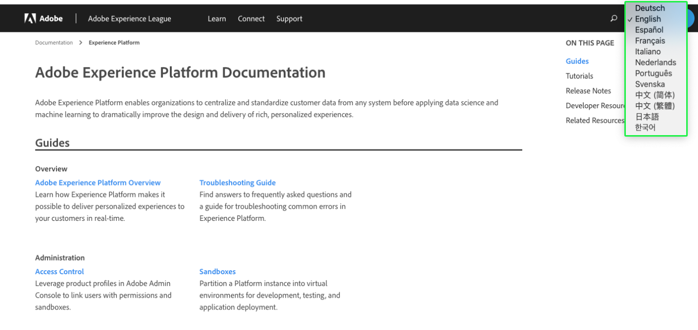

# Taalondersteuning voor documentatie over Experience Platforms

De documentatie van Adobe Experience Platform is beschikbaar in veelvoudige talen.

Als u de taal wilt wijzigen waarin de documentatie wordt weergegeven, selecteert u het taalpictogram in de bovenste navigatie.

Wanneer het taaldrop-down opent, kies de taal waarin u de documentatie wilt bekijken.

