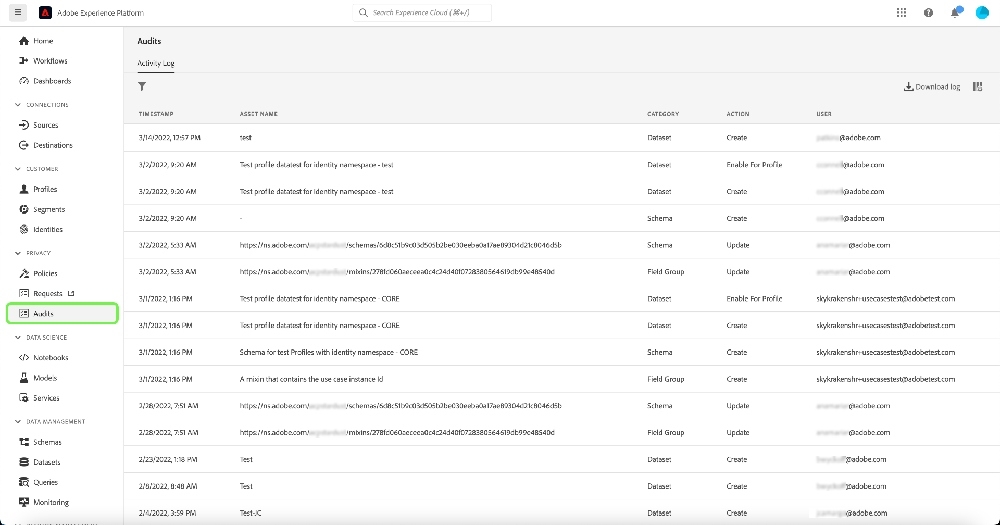

# Controlelogboeken {#audit-logs}

>[!CONTEXTUALHELP]
>id="platform_audits_privacyconsole_actions"
>title="Bovenste handelingen"
>abstract="Deze widget geeft de belangrijkste soorten acties weer die binnen de geselecteerde tijdlijn in het Experience Platform zijn uitgevoerd. Selecteer **Audits** in de linkernavigatie."

>[!CONTEXTUALHELP]
>id="platform_audits_privacyconsole_users"
>title="Bovenste gebruikers"
>abstract="Deze widget geeft de gebruikers weer die de meeste handelingen in het Experience Platform binnen de geselecteerde tijdlijn hebben uitgevoerd. Selecteer **Audits** in de linkernavigatie."

Om de transparantie en zichtbaarheid van de in het systeem uitgevoerde activiteiten te vergroten, kunt u in Adobe Experience Platform gebruikersactiviteiten voor verschillende services en mogelijkheden controleren in de vorm van &quot;auditlogs&quot;. Deze logboeken vormen een auditspoor dat met het oplossen van problemenkwesties op Platform kan helpen, en uw zaken helpen effectief aan het beleid en de regelgevende vereisten van het collectieve gegevensbeheer voldoen.

In wezen vertelt een controlelogboek **wie** uitgevoerd **wat** actie, en **wanneer**. Elke actie die in een logboek wordt geregistreerd bevat meta-gegevens die op het actietype, datum en tijd, e-mailidentiteitskaart van de gebruiker die de actie, en extra attributen relevant voor het actietype uitvoerde.

Dit document behandelt controlelogboeken in Platform, met inbegrip van hoe te om hen in UI of API te bekijken en te beheren.

## Gebeurtenistypen die zijn vastgelegd in auditlogboeken {#category}

In de volgende tabel wordt aangegeven op welke acties de middelen in de auditlogboeken worden vastgelegd:

| Resource | Acties |
| --- | --- |
| [Toegangsbeheerbeleid (op kenmerken gebaseerd toegangsbeheer)](../../../access-control/home.md) | <ul><li>Maken</li><li>Bijwerken</li><li>Verwijderen</li></ul> |
| [Account (Adobe)](../../../sources/connectors/tutorials/ui/../../../tutorials/ui/update.md) | <ul><li>Maken</li><li>Bijwerken</li><li>Verwijderen</li></ul> |
| [Controlelogboeken](../../../landing/governance-privacy-security/audit-logs/overview.md) | <ul><li>Exporteren</li></ul> |
| [Klasse](../../../xdm/schema/composition.md#class) | <ul><li>Maken</li><li>Bijwerken</li><li>Verwijderen</li></ul> |
| [Berekend kenmerk](../../../profile/computed-attributes/overview.md) | <ul><li>Maken</li><li>Bijwerken</li><li>Verwijderen</li></ul> |
| [Gegevensset](../../../catalog/datasets/overview.md) | <ul><li>Maken</li><li>Bijwerken</li><li>Verwijderen</li><li>Inschakelen voor [Klantprofiel in realtime](../../../profile/home.md)</li><li>Uitschakelen voor profiel</li><li>Gegevens toevoegen</li><li>Batch verwijderen</li></ul> |
| [Datatypen](../../../xdm/schema/composition.md#data-type) | <ul><li>Maken</li><li>Bijwerken</li><li>Verwijderen</li></ul> |
| [Bestemming](../../../destinations/home.md) | <ul><li>Maken</li><li>Bijwerken</li><li>Verwijderen</li><li>Inschakelen</li><li>Uitschakelen</li><li>Gegevensset activeren</li><li>Gegevensset verwijderen</li><li>Profiel activeren</li><li>Profiel verwijderen</li></ul> |
| [Veldgroep](../../../xdm/schema/composition.md#field-group) | <ul><li>Maken</li><li>Bijwerken</li><li>Verwijderen</li></ul> |
| [Identiteitsgrafiek](../../../identity-service/ui/identity-graph-viewer.md) | <ul><li>Weergave</li></ul> |
| [Naamruimte identiteit](../../../identity-service/ui/identity-graph-viewer.md) | <ul><li>Maken</li><li>Bijwerken</li></ul> |
| [Samenvoegbeleid](../../../profile/merge-policies/overview.md) | <ul><li>Maken</li><li>Bijwerken</li><li>Verwijderen</li></ul> |
| [Productprofiel](../../../access-control/home.md) | <ul><li>Maken</li><li>Bijwerken</li><li>Verwijderen</li></ul> |
| [Query](../../../query-service/ui/overview.md) | <ul><li>Uitvoeren</li></ul> |
| [Zoekopdrachtsjabloon](../../../query-service/ui/overview.md) | <ul><li>Maken</li><li>Bijwerken</li><li>Verwijderen</li></ul> |
| [Rol (op attributen gebaseerd toegangsbeheer)](../../../access-control/home.md) | <ul><li>Maken</li><li>Bijwerken</li><li>Verwijderen</li><li>Gebruiker toevoegen</li><li>Gebruiker verwijderen</li></ul> |
| [Sandbox](../../../sandboxes/home.md) | <ul><li>Maken</li><li>Bijwerken</li><li>Herstellen</li><li>Verwijderen</li></ul> |
| [Geplande query](../../../query-service/ui/overview.md) | <ul><li>Maken</li><li>Bijwerken</li><li>Verwijderen</li></ul> |
| [Schema](../../../xdm/schema/composition.md) | <ul><li>Maken</li><li>Bijwerken</li><li>Verwijderen</li><li>Inschakelen voor profiel</li></ul> |
| [Segment](../../../segmentation/home.md) | <ul><li>Maken</li><li>Verwijderen</li><li>Segment activeren</li><li>Segment verwijderen</li></ul> |
| [Gegevensstroom bron](../../../sources/connectors/tutorials/ui/../../../tutorials/ui/update.md) | <ul><li>Maken</li><li>Bijwerken</li><li>Verwijderen</li><li>Inschakelen</li><li>Uitschakelen</li><li>Dataset activeren</li><li>Gegevensset verwijderen</li><li>Profiel activeren</li><li>Profiel verwijderen</li></ul> |
| [Werkorder](../../../hygiene/home.md) | <ul><li>Maken</li></ul> |

## Toegang tot auditlogboeken

Wanneer de eigenschap voor uw organisatie wordt toegelaten, worden de controlelogboeken automatisch verzameld aangezien de activiteit voorkomt. U te hoeven niet om logboekinzameling manueel toe te laten.

Als u controlelogboeken wilt weergeven en exporteren, moet u beschikken over **[!UICONTROL View User Activity Log]** toegangsbeheermachtiging verleend (gevonden onder [!UICONTROL Data Governance] categorie). Raadpleeg voor meer informatie over het beheren van individuele machtigingen voor functies van Platforms de [toegangsbeheerdocumentatie](../../../access-control/home.md).

## Het beheren van controlelogboeken in UI

U kunt controlelogboeken voor verschillende eigenschappen van het Experience Platform binnen bekijken **[!UICONTROL Audits]** in de gebruikersinterface van het Platform. De werkruimte bevat een lijst met opgenomen logbestanden, die standaard van de meest recente naar de minst recente logbestanden worden gesorteerd.

Auditlogboeken worden 365 dagen bewaard waarna ze uit het systeem worden verwijderd. Daarom kun je slechts 365 dagen teruggaan. Als u gegevens van meer dan 365 dagen vereist, zou u logboeken bij een regelmatige kast moeten uitvoeren om aan uw interne beleidsvereisten te voldoen.

Selecteer een gebeurtenis in de lijst om de details in de rechtertrack weer te geven.

### Controllerlogboeken filteren

>[!NOTE]
>
>Aangezien dit een nieuwe eigenschap is, gaan de getoonde gegevens slechts terug tot maart 2022. Afhankelijk van de geselecteerde bron kunnen eerdere gegevens beschikbaar zijn vanaf januari 2022.

Selecteer het trechter-pictogram () om een lijst met filterbesturingselementen weer te geven om de resultaten te beperken. Alleen de laatste 1000 records worden weergegeven, ongeacht de verschillende geselecteerde filters.

De volgende filters zijn beschikbaar voor controlegebeurtenissen in UI:

| Filter | Beschrijving |
| --- | --- |
| [!UICONTROL Category] | Gebruik het vervolgkeuzemenu om de weergegeven resultaten te filteren op [categorie](#category). |
| [!UICONTROL Action] | Filteren op handeling. Alleen op dit moment [!UICONTROL Create] en [!UICONTROL Delete] acties kunnen worden gefilterd. |
| [!UICONTROL User] | Voer de volledige gebruikersnaam in (bijvoorbeeld `johndoe@acme.com`) om te filteren op gebruiker. |
| [!UICONTROL Status] | Filteren op de vraag of de handeling is toegestaan (voltooid) of geweigerd vanwege een gebrek aan [toegangsbeheer](../../../access-control/home.md) machtigingen. |
| [!UICONTROL Date] | Selecteer een begindatum en/of een einddatum om een datumbereik te definiëren waarop de resultaten moeten worden gefilterd. De gegevens kunnen met een raadplegingsperiode van 90 dagen worden uitgevoerd (bijvoorbeeld, 2021-12-15 aan 2022-03-15). Dit kan per gebeurtenistype verschillen. |

Als u een filter wilt verwijderen, selecteert u de X op het vulpictogram voor het desbetreffende filter of selecteert u **[!UICONTROL Clear all]** om alle filters te verwijderen.

### Controleverslagen exporteren

Selecteer **[!UICONTROL Download log]**.

Selecteer in het dialoogvenster dat wordt weergegeven de gewenste indeling (een van de **[!UICONTROL CSV]** of **[!UICONTROL JSON]**), selecteert u vervolgens **[!UICONTROL Download]**. De browser downloadt het gegenereerde bestand en slaat het op uw computer op.

## Controlelogbestanden beheren in de API

Alle acties die u in UI kunt uitvoeren kunnen ook worden gedaan gebruikend API vraag. Zie de [API-naslagdocument](https://www.adobe.io/experience-platform-apis/references/audit-query/) voor meer informatie .

## Controlelogbestanden voor Adobe Admin Console beheren

Raadpleeg het volgende voor meer informatie over het beheren van auditlogs voor activiteiten in Adobe Admin Console [document](https://helpx.adobe.com/enterprise/using/audit-logs.html).

## Volgende stappen en extra bronnen

Deze gids besprak hoe te om controlelogboeken in Experience Platform te beheren. Raadpleeg de documentatie over voor meer informatie over hoe u de activiteiten van Platforms kunt controleren. [Waarnembaarheidsinzichten](../../../observability/home.md) en [controle gegevensinvoer](../../../ingestion/quality/monitor-data-ingestion.md).

Bekijk de volgende video om uw inzicht in auditlogs in Experience Platform te versterken:

>[!VIDEO](https://video.tv.adobe.com/v/341450?quality=12&learn=on)
