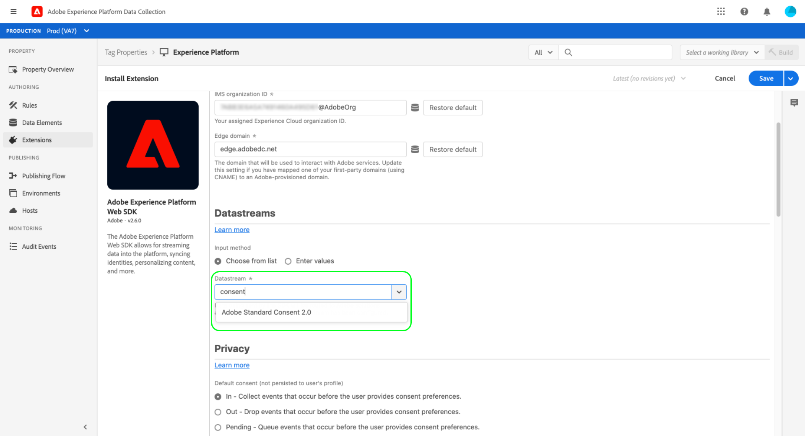

# Integreer het Web SDK van het Platform om de gegevens van de klantentoestemming te verwerken gebruikend de Adobe 2.0 norm

Met de Adobe Experience Platform Web SDK kunt u de door CMP&#39;s (Consent Management Platforms) gegenereerde toestemmingssignalen van klanten ophalen en deze naar Adobe Experience Platform verzenden wanneer er een gebeurtenis plaatsvindt waarbij de toestemming wordt gewijzigd.

**De SDK interface niet met CMP&#39;s uit het vak**. Het is aan u om te bepalen hoe te om SDK in uw website te integreren, naar toestemmingsveranderingen in CMP te luisteren, en het aangewezen bevel te roepen. Dit document biedt algemene richtlijnen voor het integreren van uw CMP met de Web SDK van het Platform.

## Vereisten

In deze zelfstudie wordt ervan uitgegaan dat u al hebt bepaald hoe u gegevens over machtigingen binnen uw CMP kunt genereren en een gegevensset hebt gemaakt met machtigingsvelden die zijn ingeschakeld voor Real-time klantprofiel. Voor meer informatie over deze stappen, zie het overzicht over [toestemmingsverwerking in Experience Platform](./overview.md) alvorens aan deze gids terug te keren.

Bovendien is voor deze handleiding een goed begrip nodig van Adobe Experience Platform Launch-extensies en de manier waarop deze in webtoepassingen worden geïnstalleerd. Raadpleeg de volgende documentatie voor meer informatie:

* [Overzicht van platform launch](https://experienceleague.adobe.com/docs/launch/using/home.html)
* [Snelstartgids](https://experienceleague.adobe.com/docs/launch/using/get-started/quick-start.html)
* [Overzicht van publicatie](https://experienceleague.adobe.com/docs/launch/using/publish/overview.html)

## Een randconfiguratie instellen

SDK kan alleen gegevens naar Experience Platform verzenden als u een bestaande randconfiguratie voor Platform hebt ingesteld in Adobe Experience Platform Launch. Bovendien [!UICONTROL Profile Dataset] moet u voor de configuratie selecteren gestandaardiseerde toestemmingsgebieden bevatten.

Nadat u een nieuwe configuratie hebt gemaakt of een bestaande configuratie hebt geselecteerd die u wilt bewerken, selecteert u de schakelknop naast **[!UICONTROL Adobe Experience Platform]**. Gebruik vervolgens de hieronder vermelde waarden om het formulier in te vullen.


| Edge-configuratieveld | Value |
| --- | --- |
| [!UICONTROL Sandbox] | De naam van het Platform [sandbox](../../../../sandboxes/home.md) dat de vereiste streamingverbinding en datasets bevat om de randconfiguratie in te stellen. |
| [!UICONTROL Streaming Inlet] | Een geldige streamingverbinding voor Experience Platform. Zie de zelfstudie over [het maken van een streamingverbinding](../../../../ingestion/tutorials/create-streaming-connection-ui.md) als u geen bestaande streamingingang hebt. |
| [!UICONTROL Event Dataset] | Een [!DNL XDM ExperienceEvent] dataset die u bij het verzenden van gebeurtenisgegevens naar het gebruiken van SDK van plan bent. Terwijl u een gebeurtenisdataset moet verstrekken om een configuratie van de randconfiguratie van het Platform tot stand te brengen, gelieve te merken op dat het verzenden van toestemmingsgegevens direct via gebeurtenissen momenteel niet wordt gesteund. |
| [!UICONTROL Profile Dataset] | De [!DNL Profile]-ingeschakelde dataset met de gebieden van de klantentoestemming die u eerder creeerde. |

Wanneer gebeëindigd, selecteer **[!UICONTROL Save]** bij de bodem van het scherm en ga na om het even welke extra herinneringen verder om de configuratie te voltooien.


## Installeer en vorm de uitbreiding van SDK van het Web van het Platform

Zodra u een randconfiguratie zoals die in de vorige sectie wordt beschreven hebt gecreeerd, moet u de uitbreiding van SDK van het Web van het Platform dan vormen die u uiteindelijk op uw plaats zult opstellen. Als de SDK-extensie niet op de eigenschap Platform launch is geïnstalleerd, selecteert u **[!UICONTROL Extensions]** in de linkernavigatie, gevolgd door het tabblad **[!UICONTROL Catalog]**. Selecteer vervolgens **[!UICONTROL Install]** onder de extensie SDK van Platform in de lijst met beschikbare extensies.


Wanneer het vormen van SDK, onder **[!UICONTROL Edge Configurations]**, selecteer de configuratie u in de vorige stap creeerde.



Selecteer **[!UICONTROL Save]** om de extensie te installeren.

### Een gegevenselement maken om de standaardtoestemming in te stellen

Als de SDK-extensie is geïnstalleerd, kunt u een gegevenselement maken dat de waarde (`collect.val`) voor de standaardtoestemming voor gegevensverzameling voor uw gebruikers vertegenwoordigt. Dit kan nuttig zijn als u verschillende standaardwaarden afhankelijk van de gebruiker wilt hebben, zoals `pending` voor gebruikers in de Europese Unie en `in` voor gebruikers in Noord-Amerika.

In dit geval kunt u het volgende implementeren om standaardtoestemming in te stellen op basis van het gebied van de gebruiker:

1. Bepaal het gebied van de gebruiker op de Webserver.
1. Geef vóór de scripttag Platform launch (code insluiten) op de webpagina een aparte scripttag weer die een variabele `adobeDefaultConsent` instelt op basis van het gebied van de gebruiker.
1. Stel een gegevenselement in dat de JavaScript-variabele `adobeDefaultConsent` gebruikt en gebruik dit gegevenselement als de standaardwaarde voor de toestemming voor de gebruiker.

Als het gebied van de gebruiker door CMP wordt bepaald, kunt u de volgende stappen in plaats daarvan gebruiken:

1. Verwerk de gebeurtenis &quot;CMP geladen&quot; op de pagina.
1. In de gebeurtenismanager, plaats een `adobeDefaultConsent` variabele die op het gebied van de gebruiker wordt gebaseerd, en laad dan het de bibliotheekmanuscript van de Platform launch gebruikend JavaScript.
1. Stel een gegevenselement in dat de JavaScript-variabele `adobeDefaultConsent` gebruikt en gebruik dit gegevenselement als de standaardwaarde voor de toestemming voor de gebruiker.

Als u een gegevenselement wilt maken in de gebruikersinterface van de Platform launch, selecteert u **[!UICONTROL Data Elements]** in de linkernavigatie en selecteert u **[!UICONTROL Add Data Element]** om naar het dialoogvenster voor het maken van gegevenselementen te navigeren.

Van hier, moet u een [!UICONTROL JavaScript Variable] gegevenselement tot stand brengen dat op `adobeDefaultConsent` wordt gebaseerd. Selecteer **[!UICONTROL Save]** wanneer gebeëindigd.


Zodra het gegevenselement wordt gecreeerd, navigeer terug naar de de uitbreidingsconfig-pagina van SDK van het Web. Selecteer [!UICONTROL Privacy] onder de sectie **[!UICONTROL Provided by data element]** en gebruik het dialoogvenster dat verschijnt om het gegevenselement voor de standaardtoestemming te selecteren dat u eerder hebt gemaakt.


### De extensie op uw website implementeren

Nadat u de extensie hebt geconfigureerd, kunt u deze integreren in uw website. Raadpleeg de [publicatiegids](https://experienceleague.adobe.com/docs/launch/using/publish/overview.html) in de documentatie van de Platform launch voor gedetailleerde informatie over hoe te om uw bijgewerkte bibliotheek op te stellen bouwt.

## Opdrachten voor wijzigen van toestemming maken

Nadat u de SDK-extensie hebt geïntegreerd in uw website, kunt u de opdracht `setConsent` van Web SDK van Platform gebruiken om gegevens met toestemming naar het Platform te verzenden.

Er zijn twee scenario&#39;s waarin `setConsent` op uw plaats zou moeten worden geroepen:

1. Wanneer toestemming op de pagina wordt geladen (met andere woorden op elke pagina die wordt geladen)
1. Als onderdeel van een CMP-haak of gebeurtenislistener die wijzigingen in toestemmingsinstellingen detecteert

>[!NOTE]
>
>Voor een inleiding aan de gemeenschappelijke syntaxis voor de bevelen van SDK van het Platform, zie het document op [uitvoerend bevelen](../../../../edge/fundamentals/executing-commands.md).

De opdracht `setConsent` verwacht twee argumenten:

1. Een tekenreeks die het opdrachttype aangeeft (in dit geval `"setConsent"`)
1. Een object payload dat één eigenschap van het type array bevat: `consent`. De `consent`-array moet ten minste één object bevatten dat de vereiste toestemmingsvelden voor de Adobe-standaard bevat.

De vereiste toestemmingsgebieden voor de norm van Adobe worden getoond in het volgende voorbeeld `setConsent` vraag:

```js
alloy("setConsent", {
  consent: [{
    standard: "Adobe",
    version: "2.0",
    value: {
      collect: {
        val: "y"
      },
      share: {
        val: "y"
      },
      personalize: {
        content: {
          val: "y"
        }
      },
      metadata: {
        time: "2020-10-12T15:52:25+00:00"
      }
    }
  }]
});
```

| Payload, eigenschap | Beschrijving |
| --- | --- |
| `standard` | De gebruikte toestemmingsnorm. Voor de standaard Adobe moet deze waarde worden ingesteld op `Adobe`. |
| `version` | Het versienummer van de toestemmingsnorm die onder `standard` wordt vermeld. Deze waarde moet worden ingesteld op `2.0` voor verwerking van toestemming volgens de Adobe-standaard. |
| `value` | De bijgewerkte toestemmingsinformatie van de klant, die als voorwerp XDM wordt verstrekt die aan de structuur van de profiel-Toegelaten de toestemmingsgebieden van de dataset in overeenstemming is. |

>[!NOTE]
>
>Als u andere toestemmingsnormen samen met `Adobe` (zoals `IAB TCF`) gebruikt, kunt u extra voorwerpen aan `consent` serie voor elke norm toevoegen. Elk object moet geschikte waarden voor `standard`, `version` en `value` bevatten voor de toestemmingsstandaard die ze vertegenwoordigen.

In het volgende JavaScript ziet u een voorbeeld van een functie die de voorkeurswijzigingen voor toestemming op een website verwerkt. Deze functie kan worden gebruikt als callback in een gebeurtenislistener of een CMP-haak:

```js
var setConsent = function () {

  // Retrieve the current consent data.
  var categories = getConsentData();

  // If the script is running on a consent change, generate a new timestamp.
  // If the script is running on page load, set the timestamp to when the consent values last changed.
  var now = new Date();
  var collectedAt = consentChanged ? now.toISOString() : categories.collectedAt;

  //  Map the consent values and timestamp to XDM
  var consentXDM = {
    collect: {
      val: categories.collect !== -1 ? "y" : "n"
    },
    personalize: {
      content: {
        val: categories.personalizeContent !== -1 ? "y" : "n"
      }
    },
    share: {
      val: categories.share !== -1 ? "y" : "n"
    },
    metadata: {
      time: collectedAt
    }
  };

  // Pass the XDM object to the Platform Web SDK
  alloy("setConsent", {
    consent: [{
      standard: "Adobe",
      version: "2.0",
      value: consentXDM
    }]
  });
});
```

## Reacties in SDK verwerken

Alle [!DNL Platform SDK] bevelen keren beloftes terug die erop wijzen of de vraag slaagde of ontbrak. U kunt deze reacties vervolgens gebruiken voor extra logica, zoals het weergeven van bevestigingsberichten aan de klant. Zie de sectie over [het behandelen van succes of mislukking](../../../../edge/fundamentals/executing-commands.md#handling-success-or-failure) in de gids bij het uitvoeren van bevelen SDK voor specifieke voorbeelden.

## Volgende stappen

Door deze gids te volgen, hebt u de uitbreiding van SDK van het Web van het Platform gevormd om toestemmingsgegevens naar Experience Platform te verzenden. U kunt nu terugkeren naar het overzicht van de toestemmingsverwerking voor stappen op hoe te om [uw implementatie te testen](./overview.md#test-implementation).