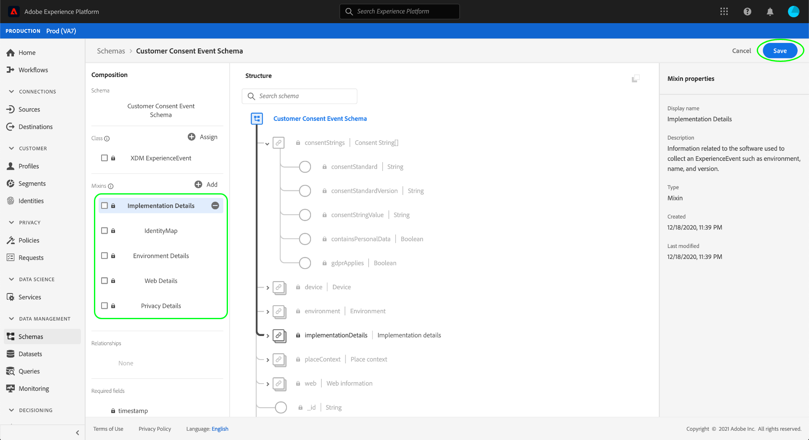
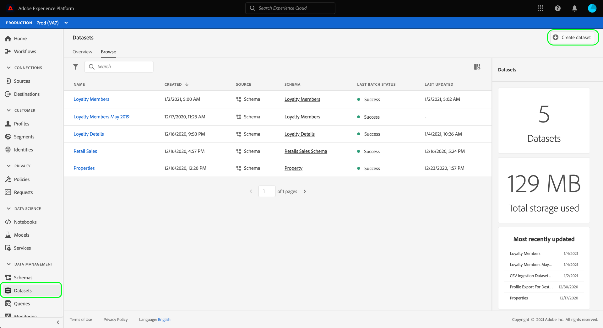
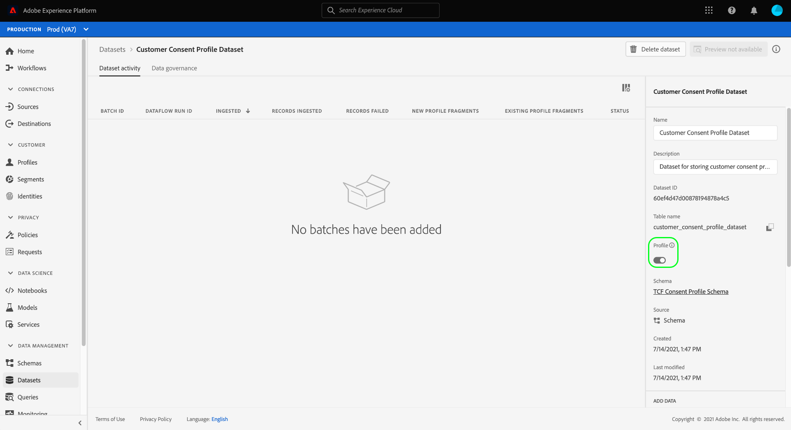

# Gegevenssets maken voor het vastleggen van gegevens met IAB TCF 2.0-toestemming

Adobe Experience Platform kan gegevens over toestemming van klanten verwerken in overeenstemming met IAB [!DNL Transparency & Consent Framework] (TCF) 2.0, dan moeten die gegevens worden verzonden naar gegevenssets waarvan de schema&#39;s TCF 2.0 toestemmingsvelden bevatten.

Specifiek, worden twee datasets vereist voor het vangen van TCF 2.0 toestemmingsgegevens:

* Een dataset die op de [!DNL XDM Individual Profile] klasse wordt gebaseerd, voor gebruik in [!DNL Real-time Customer Profile] wordt toegelaten.
* Een dataset die op de [!DNL XDM ExperienceEvent] klasse wordt gebaseerd.

Dit document verstrekt stappen voor vestiging deze twee datasets om IAB TCF 2.0 toestemmingsgegevens te verzamelen. Voor een overzicht van het volledige werkschema om uw verrichtingen van de gegevens van het Platform voor TCF 2.0 te vormen, verwijs naar [IAB TCF 2.0 nalevingsoverzicht](./overview.md).

## Vereisten

Deze zelfstudie vereist een goed begrip van de volgende onderdelen van Adobe Experience Platform:

* [XDM (Experience Data Model)](../../../../xdm/home.md): Het gestandaardiseerde kader waardoor de gegevens van de  [!DNL Experience Platform] klantenervaring worden georganiseerd.
   * [Basisbeginselen van de schemacompositie](../../../../xdm/schema/composition.md): Leer over de basisbouwstenen van schema&#39;s XDM.
* [Adobe Experience Platform Identity Service](../../../../identity-service/home.md): Staat u toe om klantenidentiteiten van uw verschillende gegevensbronnen over apparaten en systemen te overbruggen.
   * [Naamruimten](../../../../identity-service/namespaces.md) van identiteit: De identiteitsgegevens van de klant moeten worden verstrekt onder een specifieke naamruimte die door de Identiteitsdienst wordt erkend.
* [Klantprofiel](../../../../profile/home.md) in realtime: Hefboomwerkingen  [!DNL Identity Service] om u gedetailleerde klantenprofielen van uw datasets in real time te laten tot stand brengen. [!DNL Real-time Customer Profile] trekt gegevens van het meer van Gegevens en handhaaft klantenprofielen in zijn eigen afzonderlijke gegevensopslag.

## [!UICONTROL Privacy Details] mengstructuur  {#structure}

De [!UICONTROL Privacy Details] mix biedt de gebieden van de klantentoestemming die voor TCF 2.0 steun worden vereist. Er zijn twee versies van deze mix: één compatibel met de [!DNL XDM Individual Profile] klasse, en andere met de [!DNL XDM ExperienceEvent] klasse.

In de onderstaande secties wordt de structuur van elk van deze mengsels uitgelegd, inclusief de gegevens die ze tijdens inname verwachten.

### Profielmix {#profile-mixin}

Voor schema&#39;s die op [!DNL XDM Individual Profile] worden gebaseerd, verstrekt [!UICONTROL Privacy Details] mengsel één enkel kaart-type gebied, `xdm:identityPrivacyInfo`, dat klantenidentiteiten aan hun TCF toestemmingsvoorkeur in kaart brengt. Het volgende JSON is een voorbeeld van het soort gegevens dat `xdm:identityPrivacyInfo` verwacht na gegevensinvoer:

```json
{
  "xdm:identityPrivacyInfo": {
      "ECID": {
        "13782522493631189": {
          "xdm:identityIABConsent": {
            "xdm:consentTimestamp": "2020-04-11T05:05:05Z",
            "xdm:consentString": {
              "xdm:consentStandard": "IAB TCF",
              "xdm:consentStandardVersion": "2.0",
              "xdm:consentStringValue": "BObdrPUOevsguAfDqFENCNAAAAAmeAAA.PVAfDObdrA.DqFENCAmeAENCDA",
              "xdm:gdprApplies": true,
              "xdm:containsPersonalData": false
            }
          }
        }
      }
    }
}
```

Zoals in het voorbeeld wordt getoond, komt elke sleutel op hoofdniveau van `xdm:identityPrivacyInfo` overeen met een naamruimte voor identiteiten die door Identity Service wordt herkend. Elke naamruimte-eigenschap moet op zijn beurt ten minste één subeigenschap hebben waarvan de sleutel overeenkomt met de overeenkomstige identiteitswaarde van de klant voor die naamruimte. In dit voorbeeld wordt de klant aangeduid met een Experience Cloud-id (`ECID`)-waarde van `13782522493631189`.

>[!NOTE]
>
>Terwijl het bovenstaande voorbeeld één enkele namespace/waardepaar gebruikt om de identiteit van de klant te vertegenwoordigen, kunt u extra sleutels voor andere namespaces toevoegen, en elke namespace kan veelvoudige identiteitswaarden hebben, elk met hun eigen reeks toestemmingsvoorkeur TCF.

Binnen het identiteitswaardeobject bevindt zich één veld, `xdm:identityIABConsent`. Dit object legt de TCF toestemmingswaarden van de klant voor de opgegeven naamruimte en waarde van de identiteit vast. De subeigenschappen in dit veld worden hieronder vermeld:

| Eigenschap | Beschrijving |
| --- | --- |
| `xdm:consentTimestamp` | An [ISO 8601](https://www.ietf.org/rfc/rfc3339.txt) timestamp of when the TCF toestemmingswaarden changed. |
| `xdm:consentString` | Een object met de bijgewerkte gegevens van de klant over toestemming en andere contextuele informatie. Zie de sectie over [eigenschappen van toestemmingstekenreeksen](#consent-string) om over de vereiste subeigenschappen van dit voorwerp te leren. |

### Gebeurtenismix {#event-mixin}

Voor schema&#39;s die op [!DNL XDM ExperienceEvent] worden gebaseerd, verstrekt de [!UICONTROL Privacy Details] mix één enkel serie-type gebied: `xdm:consentStrings`. Elk item in deze array moet een object zijn dat de benodigde eigenschappen voor een TCF-toestemmingstekenreeks bevat, vergelijkbaar met het veld `xdm:consentString` in de profielmix. Zie [volgende sectie](#consent-string) voor meer informatie over deze subeigenschappen.

```json
{
  "xdm:consentStrings": [
    {
      "xdm:consentStandard": "IAB TCF",
      "xdm:consentStandardVersion": "2.0",
      "xdm:consentStringValue": "BObdrPUOevsguAfDqFENCNAAAAAmeAAA.PVAfDObdrA.DqFENCAmeAENCDA",
      "xdm:gdprApplies": true,
      "xdm:containsPersonalData": false
    }
  ]
}
```

### Goedgekeurde tekenreekseigenschappen {#consent-string}

Beide versies van de [!UICONTROL Privacy Details] mix vereisen minstens één voorwerp dat de noodzakelijke gebieden vangt die het TCF toestemmingskoord voor de klant beschrijven. Deze eigenschappen worden hieronder uitgelegd:

| Eigenschap | Beschrijving |
| --- | --- |
| `xdm:consentStandard` | Het kader voor de toestemming waarop de gegevens van toepassing zijn. Voor compatibiliteit met TCF moet de waarde `IAB TCF` zijn. |
| `xdm:consentStandardVersion` | Het versienummer van het toestemmingskader dat door `xdm:consentStandard` wordt vermeld. Voor TCF 2.0 naleving, moet de waarde `2.0` zijn. |
| `xdm:consentStringValue` | De toestemmingstekenreeks die door het platform van het toestemmingsbeheer (CMP) op de geselecteerde montages van de klant werd geproduceerd. |
| `xdm:gdprApplies` | Een booleaanse waarde die aangeeft of de GDPR al dan niet op deze klant van toepassing is. De waarde moet aan `true` worden geplaatst opdat de handhaving TCF 2.0 voorkomt. De standaardwaarde is `true` als deze niet is opgenomen. |
| `xdm:containsPersonalData` | Een booleaanse waarde die aangeeft of de toestemmingsupdate persoonsgegevens bevat. De standaardwaarde is `false` als deze niet is opgenomen. |

## Goedkeuringsschema&#39;s voor klanten {#create-schemas} maken

Om datasets tot stand te brengen die toestemmingsgegevens vangen, moet u XDM schema&#39;s eerst creëren om die datasets op te baseren.

Selecteer **[!UICONTROL Schemas]** in de linkernavigatie in de interface van het Platform om de werkruimte [!UICONTROL Schemas] te openen. Voer van hieruit de stappen in de onderstaande secties uit om elk vereist schema te maken.

>[!NOTE]
>
>Als u bestaande XDM-schema&#39;s hebt die u wilt gebruiken om toestemmingsgegevens in plaats daarvan te vangen, kunt u die schema&#39;s uitgeven in plaats van nieuwe te creëren. Als een bestaand schema echter is ingeschakeld voor gebruik in Real-time klantprofiel, kan de primaire identiteit van het schema geen rechtstreeks identificeerbaar veld zijn dat niet mag worden gebruikt in op rente gebaseerde reclame, zoals een e-mailadres. Raadpleeg uw juridische adviseur als u niet zeker weet welke velden beperkt zijn.
>
>Bovendien kunnen bij het bewerken van bestaande schema&#39;s alleen additieve (vaste) wijzigingen worden aangebracht. Zie de sectie over [principes van schemaevolutie](../../../../xdm/schema/composition.md#evolution) voor meer informatie.

### Creeer een op verslag-gebaseerd toestemmingsschema {#profile-schema}

Selecteer **[!UICONTROL Schemas]** in de werkruimte **[!UICONTROL Create schema]** en kies **[!UICONTROL XDM Individual Profile]** in het vervolgkeuzemenu.


De [!DNL Schema Editor] verschijnt, die de structuur van het schema in het canvas tonen. Gebruik de rechterrail om een naam en een beschrijving voor het schema te verstrekken, dan uitgezocht **[!UICONTROL Add]** onder de **[!UICONTROL Mixins]** sectie op de linkerkant van het canvas.


Het dialoogvenster **[!UICONTROL Add mixin]** wordt weergegeven. Selecteer **[!UICONTROL Privacy Details]** in de lijst. U kunt de zoekbalk desgewenst gebruiken om de resultaten te beperken en zo gemakkelijker de mix te vinden. Selecteer **[!UICONTROL Add mixin]** als de mix is geselecteerd.


Het canvas verschijnt weer en geeft aan dat het veld `identityPrivacyInfo` is toegevoegd aan de schemastructuur.


Herhaal hier de bovenstaande stappen om de volgende extra mixen aan het schema toe te voegen:

* [!UICONTROL IdentityMap]
* [!UICONTROL Data capture region for Profile]
* [!UICONTROL Demographic Details]
* [!UICONTROL Personal Contact Details]


Als u een bestaand schema uitgeeft dat reeds voor gebruik in [!DNL Real-time Customer Profile] is toegelaten, uitgezocht **[!UICONTROL Save]** om uw veranderingen te bevestigen alvorens vooruit naar de sectie op [creërend een dataset op uw toestemmingsschema](#dataset) te slaan. Als u een nieuw schema maakt, gaat u verder met de stappen in de onderstaande subsectie.

#### Het schema inschakelen voor gebruik in [!DNL Real-time Customer Profile]

Om het Platform in staat te stellen de toestemmingsgegevens te associëren het aan specifieke klantenprofielen ontvangt, moet het toestemmingsschema voor gebruik in [!DNL Real-time Customer Profile] worden toegelaten.

>[!NOTE]
>
>Het voorbeeldschema dat in deze sectie wordt getoond gebruikt zijn `identityMap` gebied als zijn primaire identiteit. Als u een ander veld wilt instellen als primaire identiteit, moet u ervoor zorgen dat u een indirecte id gebruikt, zoals een cookie-id, en niet een rechtstreeks identificeerbaar veld dat niet mag worden gebruikt in op rente gebaseerde reclame, zoals een e-mailadres. Raadpleeg uw juridische adviseur als u niet zeker weet welke velden beperkt zijn.
>
>De stappen op hoe te om een primair identiteitsgebied voor een schema te plaatsen kunnen in [zelfstudie van de schemaverwezenlijking worden gevonden](../../../../xdm/tutorials/create-schema-ui.md#identity-field).

Als u het schema wilt inschakelen voor [!DNL Profile], selecteert u de naam van het schema in de linkerrail om het dialoogvenster **[!UICONTROL Schema properties]** in de rechterrail te openen. Van hier, selecteer **[!UICONTROL Profile]** knevelknoop.


Er wordt een pop-up weergegeven die aangeeft dat de primaire identiteit ontbreekt. Schakel het selectievakje in voor het gebruik van een andere primaire identiteit, aangezien de primaire identiteit zich in het veld `identityMap` bevindt.


Tot slot selecteer **[!UICONTROL Save]** om uw veranderingen te bevestigen.


### Creeer een op tijd-reeksen gebaseerd toestemmingsschema {#event-schema}

Selecteer **[!UICONTROL Schemas]** in de werkruimte **[!UICONTROL Create schema]** en kies **[!UICONTROL XDM ExperienceEvent]** in het vervolgkeuzemenu.


De [!DNL Schema Editor] verschijnt, die de structuur van het schema in het canvas tonen. Gebruik de rechterrail om een naam en een beschrijving voor het schema te verstrekken, dan uitgezocht **[!UICONTROL Add]** onder de **[!UICONTROL Mixins]** sectie op de linkerkant van het canvas.


Het dialoogvenster **[!UICONTROL Add mixin]** wordt weergegeven. Selecteer **[!UICONTROL Privacy Details]** in de lijst. U kunt de zoekbalk desgewenst gebruiken om de resultaten te beperken en zo gemakkelijker de mix te vinden. Wanneer u een mix hebt gekozen, selecteert u **[!UICONTROL Add mixin]**.


Het canvas verschijnt weer en geeft aan dat de array `consentStrings` aan de schemastructuur is toegevoegd.


Herhaal hier de bovenstaande stappen om de volgende extra mixen aan het schema toe te voegen:

* [!UICONTROL IdentityMap]
* [!UICONTROL Environment Details]
* [!UICONTROL Web Details]
* [!UICONTROL Implementation Details]

Nadat de mixinen zijn toegevoegd, voltooit u door **[!UICONTROL Save]** te selecteren.



## Gegevenssets maken op basis van uw toestemmingsschema&#39;s {#datasets}

Voor elk van de vereiste hierboven beschreven schema&#39;s, moet u een dataset tot stand brengen die uiteindelijk de gegevens van de klantentoestemming zal opnemen. De dataset die op het verslagschema wordt gebaseerd moet voor [!DNL Real-time Customer Profile] worden toegelaten, terwijl de dataset die op het tijdreeksschema **wordt gebaseerd niet** [!DNL Profile]-toegelaten zou moeten zijn.

Selecteer **[!UICONTROL Datasets]** in de linkernavigatie en selecteer **[!UICONTROL Create dataset]** in de rechterbovenhoek om te beginnen.



Selecteer **[!UICONTROL Create dataset from schema]** op de volgende pagina.


De **[!UICONTROL Create dataset from schema]**-workflow wordt weergegeven, te beginnen bij de stap **[!UICONTROL Select schema]**. Zoek in de opgegeven lijst een van de toestemmingsschema&#39;s die u eerder hebt gemaakt. U kunt de zoekbalk desgewenst gebruiken om de resultaten te beperken en het schema gemakkelijker te vinden. Selecteer het keuzerondje naast het gewenste schema en selecteer **[!UICONTROL Next]** om door te gaan.


De stap **[!UICONTROL Configure dataset]** wordt weergegeven. Geef een unieke, gemakkelijk herkenbare naam en beschrijving voor de gegevensset voordat u **[!UICONTROL Finish]** selecteert.


De detailspagina voor de pas gecreëerde dataset verschijnt. Als de dataset op uw tijd-reeksen schema gebaseerd is, dan is het proces volledig. Als de dataset op uw verslagschema gebaseerd is, moet de definitieve stap in het proces de dataset voor gebruik in [!DNL Real-time Customer Profile] toelaten.

Selecteer in de rechterrail de **[!UICONTROL Profile]**-schakeloptie en selecteer **[!UICONTROL Enable]** in de bevestigingspop-up om het schema in te schakelen voor [!DNL Profile].



Voer de bovenstaande stappen opnieuw uit om de andere vereiste gegevensset voor TCF 2.0-compatibiliteit te maken.

## Volgende stappen

Door deze zelfstudie te volgen, hebt u twee datasets gecreeerd die nu kunnen worden gebruikt om de gegevens van de klantentoestemming te verzamelen:

* Een op verslag-gebaseerde dataset die voor gebruik in het Profiel van de Klant in real time wordt toegelaten.
* Een op tijdreeksen gebaseerde dataset die niet voor [!DNL Profile] wordt toegelaten.

U kunt nu aan [IAB TCF 2.0 overzicht](./overview.md#merge-policies) terugkeren om het proces voort te zetten om Platform voor naleving te vormen TCF 2.0.
