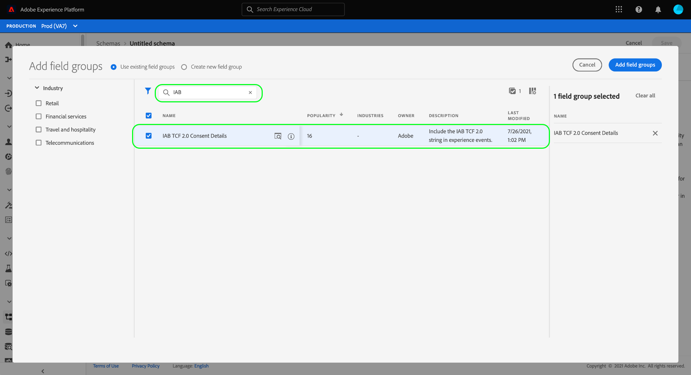

# Gegevenssets maken voor het vastleggen van gegevens met IAB TCF 2.0-toestemming

Adobe Experience Platform kan gegevens over toestemming van klanten alleen verwerken in overeenstemming met IAB [!DNL Transparency & Consent Framework] (TCF) 2.0 als die gegevens worden verzonden naar gegevenssets waarvan de schema&#39;s TCF 2.0-toestemmingsvelden bevatten.

Specifiek, worden twee datasets vereist voor het vangen van TCF 2.0 toestemmingsgegevens:

* Een dataset die op de [!DNL XDM Individual Profile] klasse wordt gebaseerd, die voor gebruik in [!DNL Real-Time Customer Profile] wordt toegelaten.
* Een dataset die op de [!DNL XDM ExperienceEvent] klasse wordt gebaseerd.

>[!IMPORTANT]
>
>Experience Platform dwingt alleen de TCF-tekenreeksen af die in de dataset Individueel profiel zijn verzameld. Terwijl een dataset ExperienceEvent nog wordt vereist om een gegevensstroom als deel van dit werkschema tot stand te brengen, moet u slechts gegevens in de profieldataset opnemen. De dataset ExperienceEvent kan nog worden gebruikt als u gebeurtenissen van de toestemmingsverandering in tijd wilt volgen, maar deze waarden worden niet gebruikt binnen wanneer het afdwingen op segmentactivering.

Dit document verstrekt stappen voor vestiging deze twee datasets. Voor een overzicht van het volledige werkschema om uw de gegevensverrichtingen van Experience Platform voor TCF 2.0 te vormen, verwijs naar [&#x200B; IAB TCF 2.0 nalevingsoverzicht &#x200B;](./overview.md).

## Vereisten

Deze zelfstudie vereist een goed begrip van de volgende onderdelen van Adobe Experience Platform:

* [&#x200B; Model van de Gegevens van de Ervaring (XDM) &#x200B;](../../../../xdm/home.md): Het gestandaardiseerde kader waardoor [!DNL Experience Platform] gegevens van de klantenervaring organiseert.
   * [&#x200B; Grondbeginselen van schemacompositie &#x200B;](../../../../xdm/schema/composition.md): Leer over de basisbouwstenen van schema&#39;s XDM.
* [&#x200B; Dienst van de Identiteit van Adobe Experience Platform &#x200B;](../../../../identity-service/home.md): Staat u toe om klantenidentiteiten van uw verschillende gegevensbronnen over apparaten en systemen te overbruggen.
   * [&#x200B; Identiteitsnaamruimten &#x200B;](../../../../identity-service/features/namespaces.md): De identiteitsgegevens van de klant moeten onder een specifieke identiteitsnaamruimte worden verstrekt die door de Dienst van de Identiteit wordt erkend.
* [&#x200B; Real-Time Profiel van de Klant &#x200B;](../../../../profile/home.md): Hefboomwerkingen [!DNL Identity Service] om u gedetailleerde klantenprofielen van uw datasets in real time te laten tot stand brengen. [!DNL Real-Time Customer Profile] haalt gegevens van het meer van Gegevens en handhaaft klantenprofielen in zijn eigen afzonderlijke gegevensopslag.

## TCF 2.0 veldgroepen {#field-groups}

De [!UICONTROL IAB TCF 2.0 Consent Details] schemagebiedgroep verstrekt de gebieden van de klantentoestemming die voor TCF 2.0 steun worden vereist. Er zijn twee versies van deze veldgroep: een versie is compatibel met de klasse [!DNL XDM Individual Profile] en een versie met de klasse [!DNL XDM ExperienceEvent] .

In de volgende secties wordt de structuur van elk van deze veldgroepen uitgelegd, inclusief de gegevens die ze tijdens inname verwachten.

### Profielveldgroep {#profile-field-group}

Voor schema&#39;s die zijn gebaseerd op [!DNL XDM Individual Profile], biedt de [!UICONTROL IAB TCF 2.0 Consent Details] -veldgroep één toewijzingsveld, `identityPrivacyInfo` , waarin de identiteit van de klant wordt toegewezen aan hun voorkeuren voor TCF-toestemming. Deze veldgroep moet in een op record gebaseerd schema worden opgenomen dat voor het Profiel van de Klant in real time wordt toegelaten voor automatische handhaving.

Zie de [&#x200B; verwijzingsgids &#x200B;](../../../../xdm/field-groups/profile/iab.md) voor deze gebiedsgroep om meer over zijn structuur en gebruiksgeval te leren.

### Groep Gebeurtenisvelden {#event-field-group}

Als u gebeurtenissen voor het wijzigen van de toestemming wilt bijhouden gedurende een tijdsverloop, kunt u de veldgroep [!UICONTROL IAB TCF 2.0 Consent Details] toevoegen aan uw [!UICONTROL XDM ExperienceEvent] -schema.

Als u niet van plan bent om gebeurtenissen van de toestemmingsverandering in tijd te volgen, te hoeven u om deze gebiedsgroep niet in uw gebeurtenisschema te omvatten. Wanneer het automatisch afdwingen van TCF toestemmingswaarden, gebruikt Experience Platform slechts de recentste toestemmingsinformatie die in de [&#x200B; wordt opgenomen groep van het profielgebied &#x200B;](#profile-field-group). Goedkeuringswaarden die door gebeurtenissen worden vastgelegd, nemen niet deel aan automatische workflows voor handhaving.

Zie de [&#x200B; verwijzingsgids &#x200B;](../../../../xdm/field-groups/event/iab.md) voor deze gebiedsgroep voor meer informatie over zijn structuur en gebruiksgeval.

## Goedkeuringsschema&#39;s voor klanten maken {#create-schemas}

Om datasets tot stand te brengen die toestemmingsgegevens vangen, moet u XDM schema&#39;s eerst creëren om die datasets op te baseren.

Zoals vermeld in de vorige sectie, is een schema dat de [!UICONTROL XDM Individual Profile] klasse gebruikt vereist om toestemming in stroomafwaartse workflows van Experience Platform af te dwingen. U kunt desgewenst ook een afzonderlijk schema maken op basis van [!UICONTROL XDM ExperienceEvent] als u wijzigingen in de toestemming wilt bijhouden. Beide schema&#39;s moeten een `identityMap` gebied en een aangewezen TCF 2.0 gebiedsgroep bevatten.

Selecteer in de gebruikersinterface van Experience Platform de optie **[!UICONTROL Schemas]** in de linkernavigatie om de werkruimte van [!UICONTROL Schemas] te openen. Voer van hieruit de stappen in de onderstaande secties uit om elk vereist schema te maken.

>[!NOTE]
>
>Als u bestaande XDM-schema&#39;s hebt die u wilt gebruiken om toestemmingsgegevens in plaats daarvan te vangen, kunt u die schema&#39;s uitgeven in plaats van nieuwe te creëren. Als een bestaand schema echter is ingeschakeld voor gebruik in Real-Time Klantprofiel, kan de primaire identiteit van het schema geen rechtstreeks identificeerbaar veld zijn dat niet mag worden gebruikt in op rente gebaseerde reclame, zoals een e-mailadres. Raadpleeg uw juridische adviseur als u niet zeker weet welke velden beperkt zijn.
>
>Bovendien kunnen bij het bewerken van bestaande schema&#39;s alleen additieve (vaste) wijzigingen worden aangebracht. Zie de sectie over de [&#x200B; principes van schemaevolutie &#x200B;](../../../../xdm/schema/composition.md#evolution) voor meer informatie.

### Een schema voor profieltoestemming maken {#profile-schema}

Selecteer **[!UICONTROL Create schema]** en kies vervolgens **[!UICONTROL XDM Individual Profile]** in het vervolgkeuzemenu.

Het dialoogvenster **[!UICONTROL Add field groups]** wordt weergegeven, zodat u meteen veldgroepen aan het schema kunt toevoegen. Selecteer **[!UICONTROL IAB TCF 2.0 Consent Details]** in de lijst. U kunt de zoekbalk desgewenst gebruiken om de resultaten te beperken en zo de veldgroep gemakkelijker te vinden.

Zoek vervolgens de veldgroep **[!UICONTROL IdentityMap]** in de lijst en selecteer deze ook. Selecteer **[!UICONTROL Add field groups]** als beide veldgroepen in de rechtertrack worden weergegeven.

Het canvas verschijnt weer en geeft aan dat de velden `identityPrivacyInfo` en `identityMap` zijn toegevoegd aan de schemastructuur.

Voordat u meer velden aan het schema toevoegt, selecteert u het basisveld dat **[!UICONTROL Schema properties]** in de rechtertrack moet worden weergegeven. Hier kunt u een naam en een beschrijving voor het schema opgeven.

Nadat u een naam en beschrijving hebt opgegeven, kunt u optioneel meer velden aan het schema toevoegen door **[!UICONTROL Add]** onder de sectie **[!UICONTROL Field groups]** links op het canvas te selecteren.

Als u een bestaand schema uitgeeft dat reeds voor gebruik in [!DNL Real-Time Customer Profile] is toegelaten, selecteer **[!UICONTROL Save]** om uw veranderingen te bevestigen alvorens vooruit naar de sectie over te slaan op [&#x200B; creërend een dataset die op uw toestemmingsschema &#x200B;](#dataset) wordt gebaseerd. Als u een nieuw schema maakt, gaat u verder met de stappen in de onderstaande subsectie.

#### Het schema inschakelen voor gebruik in [!DNL Real-Time Customer Profile]

Experience Platform kan de gegevens die het ontvangt alleen koppelen aan specifieke klantprofielen als het toestemmingsschema is ingeschakeld voor gebruik in [!DNL Real-Time Customer Profile] .

>[!NOTE]
>
>Het voorbeeldschema dat in deze sectie wordt getoond gebruikt zijn `identityMap` gebied als zijn primaire identiteit. Als u een ander veld wilt instellen als primaire identiteit, moet u ervoor zorgen dat u een indirecte id gebruikt, zoals een cookie-id, en niet een rechtstreeks identificeerbaar veld dat niet mag worden gebruikt in op rente gebaseerde reclame, zoals een e-mailadres. Raadpleeg uw juridische adviseur als u niet zeker weet welke velden beperkt zijn.
>
>De stappen op hoe te om een primair identiteitsgebied voor een schema te plaatsen kunnen in de [[!UICONTROL Schemas] gids UI &#x200B;](../../../../xdm/ui/fields/identity.md) worden gevonden.

Als u het schema voor [!DNL Profile] wilt inschakelen, selecteert u de naam van het schema in de linkertrack om het gedeelte **[!UICONTROL Schema properties]** te openen. Van hier, selecteer de **[!UICONTROL Profile]** knevelknoop.

Er wordt een pop-up weergegeven die aangeeft dat de primaire identiteit ontbreekt. Schakel het selectievakje in voor het gebruik van een andere primaire identiteit, aangezien de primaire identiteit zich in het veld `identityMap` bevindt.

Selecteer ten slotte **[!UICONTROL Save]** om uw wijzigingen te bevestigen.

### Een schema voor gebeurtenismachtigingen maken {#event-schema}

>[!NOTE]
>
>Regelingen voor toestemming voor gebeurtenissen worden alleen gebruikt om gebeurtenissen met betrekking tot wijziging van de toestemming in de loop der tijd te volgen en nemen niet deel aan workflows voor afdwinging stroomafwaarts. Als u niet toestemmingsveranderingen in tijd wilt volgen, kunt u vooruit aan de volgende sectie overslaan op [&#x200B; creërend toestemmingsdatasets &#x200B;](#datasets).

Selecteer in de **[!UICONTROL Schemas]** -werkruimte **[!UICONTROL Create schema]** en kies vervolgens **[!UICONTROL XDM ExperienceEvent]** in het vervolgkeuzemenu.

Het dialoogvenster **[!UICONTROL Add field groups]** wordt weergegeven. Selecteer **[!UICONTROL IAB TCF 2.0 Consent Details]** in de lijst. U kunt de zoekbalk desgewenst gebruiken om de resultaten te beperken en zo de veldgroep gemakkelijker te vinden.

Zoek vervolgens de veldgroep **[!UICONTROL IdentityMap]** in de lijst en selecteer deze ook. Selecteer **[!UICONTROL Add field groups]** als beide veldgroepen in de rechtertrack worden weergegeven.

Het canvas verschijnt weer en geeft aan dat de velden `consentStrings` en `identityMap` zijn toegevoegd aan de schemastructuur.

Voordat u meer velden aan het schema toevoegt, selecteert u het basisveld dat **[!UICONTROL Schema properties]** in de rechtertrack moet worden weergegeven. Hier kunt u een naam en een beschrijving voor het schema opgeven.

Nadat u een naam en beschrijving hebt opgegeven, kunt u optioneel meer velden aan het schema toevoegen door **[!UICONTROL Add]** onder de sectie **[!UICONTROL Field groups]** links op het canvas te selecteren.

Nadat de gewenste veldgroepen zijn toegevoegd, selecteert u **[!UICONTROL Save]** .

## Gegevenssets maken op basis van uw toestemmingsschema&#39;s {#datasets}

Voor elk van de vereiste hierboven beschreven schema&#39;s, moet u een dataset tot stand brengen die uiteindelijk de gegevens van de klantentoestemming zal opnemen. De dataset die op het verslagschema wordt gebaseerd moet voor [!DNL Real-Time Customer Profile] worden toegelaten, terwijl de dataset die op het tijd-reeksenschema **wordt gebaseerd** niet [!DNL Profile] - toegelaten zou moeten zijn.

Selecteer eerst **[!UICONTROL Datasets]** in de linkernavigatie en selecteer vervolgens **[!UICONTROL Create dataset]** in de rechterbovenhoek.

Selecteer op de volgende pagina **[!UICONTROL Create dataset from schema]** .

De **[!UICONTROL Create dataset from schema]** -workflow wordt weergegeven, te beginnen bij de **[!UICONTROL Select schema]** -stap. Zoek in de opgegeven lijst een van de toestemmingsschema&#39;s die u eerder hebt gemaakt. U kunt de zoekbalk desgewenst gebruiken om de resultaten te beperken en het schema gemakkelijker te vinden. Selecteer het keuzerondje naast het gewenste schema en selecteer vervolgens **[!UICONTROL Next]** om door te gaan.

De stap **[!UICONTROL Configure dataset]** wordt weergegeven. Geef een unieke, gemakkelijk herkenbare naam en beschrijving voor de gegevensset op voordat u **[!UICONTROL Finish]** selecteert.

De detailspagina voor de pas gecreëerde dataset verschijnt. Als de dataset op uw tijd-reeksen schema gebaseerd is, dan is het proces volledig. Als de dataset op uw verslagschema gebaseerd is, is de definitieve stap in het proces om de dataset voor gebruik in [!DNL Real-Time Customer Profile] toe te laten.

Selecteer in de rechtertrack de **[!UICONTROL Profile]** -schakeloptie en selecteer vervolgens **[!UICONTROL Enable]** in de bevestigingspop-up om het schema in te schakelen voor [!DNL Profile] .

Volg de bovenstaande stappen opnieuw om een op gebeurtenis-gebaseerde dataset tot stand te brengen als u een schema voor het creeerde.

## Volgende stappen

Door deze zelfstudie te volgen, hebt u minstens één dataset gecreeerd die nu kan worden gebruikt om de gegevens van de klantentoestemming te verzamelen:

* Een op verslag-gebaseerde dataset die voor gebruik in het Profiel van de Klant in real time wordt toegelaten. **(Required)**
* Een op tijdreeksen gebaseerde dataset die niet is ingeschakeld voor [!DNL Profile]. (Optioneel)

U kunt nu aan het [&#x200B; IAB TCF 2.0 overzicht &#x200B;](./overview.md#merge-policies) terugkeren om het proces voort te zetten om Experience Platform voor TCF 2.0 naleving te vormen.
