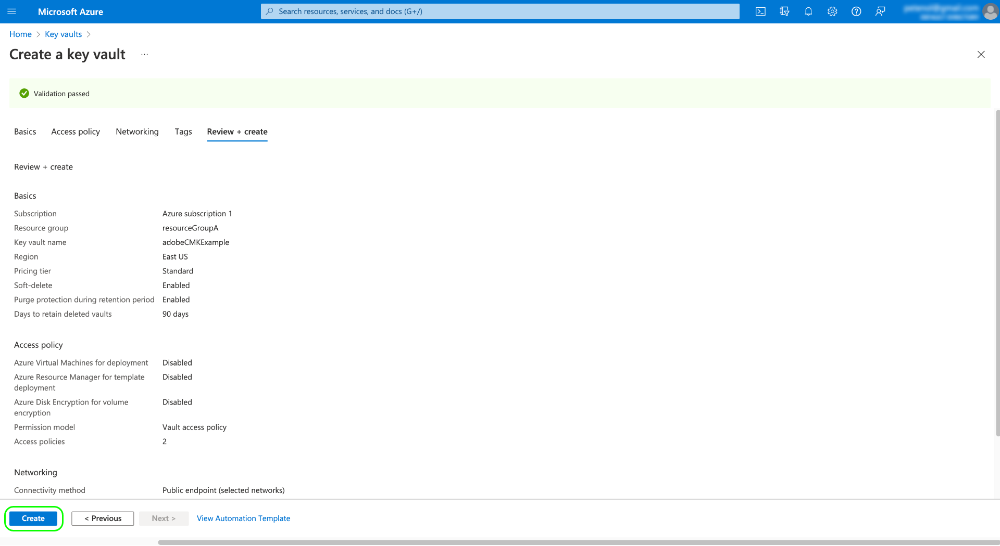
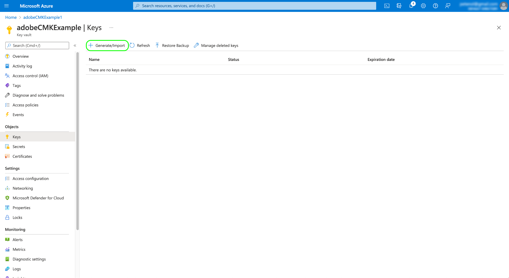
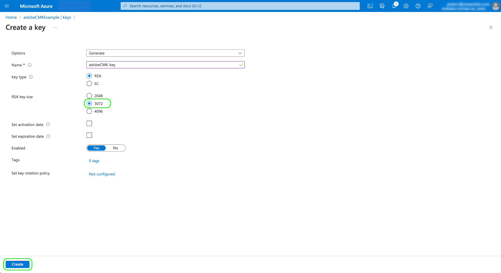

# Door de klant beheerde sleutels in Adobe Experience Platform

Gegevens die op Adobe Experience Platform zijn opgeslagen, worden in rust gecodeerd met systeemtoetsen. Als u een toepassing gebruikt die bovenop Platform wordt gebouwd, kunt u verkiezen om uw eigen encryptiesleutels in plaats daarvan te gebruiken, die u grotere controle over uw gegevensveiligheid geven.

Dit document behandelt het proces voor het toelaten van de klant-geleide sleuteleigenschap (CMK) in Platform.

## Procesoverzicht

CMK is opgenomen in het gezondheidsschild en het aanbod van privacy en beveiligingsschild van Adobe. Nadat uw organisatie een licentie voor een van deze aanbiedingen heeft aangeschaft, kunt u een eenmalig proces starten om de functie in te stellen.

>[!WARNING]
>
>Nadat u CMK hebt ingesteld, kunt u niet terugkeren naar de toetsen die door het systeem worden beheerd. U bent verantwoordelijk voor het veilig beheren van uw sleutels en het bieden van toegang tot uw Key Vault-, Key- en CMK-app binnen [!DNL Azure] om te voorkomen dat toegang tot uw gegevens verloren gaat.

Het proces is als volgt:

1. [Een [!DNL Microsoft Azure] Key Vault](#create-key-vault)vervolgens [een coderingssleutel genereren](#generate-a-key) (gebaseerd op het beleid van uw organisatie) die uiteindelijk met Adobe zal worden gedeeld.
1. API-aanroepen gebruiken voor [de CMK-toepassing registreren](#register-app) met uw [!DNL Azure] huurder.
1. [De serviceprincipal toewijzen voor de CMK-toepassing](#assign-to-role) naar een geschikte rol voor de sleutelkluis.
1. API-aanroepen gebruiken voor [Verstuur uw encryptiesleutel-id naar Adobe](#send-to-adobe).

Wanneer het installatieproces is voltooid, worden alle gegevens die in het Platform van alle sandboxen zijn ingevoerd, gecodeerd met uw [!DNL Azure] toetsinstelling, specifiek voor uw [[!DNL Cosmos DB]](https://docs.microsoft.com/en-us/azure/cosmos-db/) en [[!DNL Data Lake Storage]](https://docs.microsoft.com/en-us/azure/storage/blobs/data-lake-storage-introduction) middelen. Als u CMK wilt gebruiken, gebruikt u [!DNL Microsoft Azure] functionaliteit die deel kan uitmaken van [openbaar voorvertoningsprogramma](https://azure.microsoft.com/en-ca/support/legal/preview-supplemental-terms/).

## Een [!DNL Azure] Key Vault {#create-key-vault}

CMK ondersteunt alleen toetsen van een [!DNL Microsoft Azure] Key Vault. Om aan de slag te gaan, moet u werken met [!DNL Azure] om een nieuwe bedrijfsaccount te maken, of gebruik een bestaande bedrijfsaccount en volg de onderstaande stappen om de Key Vault te maken.

>[!IMPORTANT]
>
>Alleen de serviceniveaus Premium en Standaard voor [!DNL Azure] Key Vault wordt ondersteund. [!DNL Azure Managed HSM], [!DNL Azure Dedicated HSM] en [!DNL Azure Payments HSM] worden niet ondersteund. Zie de [[!DNL Azure] documentatie](https://learn.microsoft.com/en-us/azure/security/fundamentals/key-management#azure-key-management-services) voor meer informatie over de aangeboden services voor sleutelbeheer.

>[!NOTE]
>
>In de onderstaande documentatie worden alleen de basisstappen beschreven voor het maken van de sleutelkluis. Buiten deze begeleiding, zou u de belangrijkste kluis volgens het beleid van uw organisatie moeten vormen.

Aanmelden bij de [!DNL Azure] openen en de zoekbalk gebruiken om te zoeken naar **[!DNL Key vaults]** onder de lijst van diensten.


De **[!DNL Key vaults]** wordt weergegeven nadat u de service hebt geselecteerd. Selecteer **[!DNL Create]**.


Vul met behulp van het opgegeven formulier de basisgegevens voor de sleutelvault in, inclusief een naam en een toegewezen bronnengroep.

>[!WARNING]
>
>Hoewel de meeste opties als standaardwaarden kunnen worden gelaten, **zorg ervoor dat u de opties voor het verwijderen en wissen van de software inschakelt**. Als u deze functies niet inschakelt, loopt u het risico dat de toegang tot uw gegevens verloren gaat als de sleutelvault wordt verwijderd.
>
>

Van hier, ga door het belangrijkste werkschema van de de creatie van de kluis en vorm de verschillende opties volgens het beleid van uw organisatie.

Zodra u bij **[!DNL Review + create]** U kunt de details van de sleutelvault bekijken terwijl deze wordt gevalideerd. Selecteer **[!DNL Create]** om het proces te voltooien.



## Netwerkopties configureren

Als uw sleutelkluis wordt gevormd om openbare toegang tot bepaalde virtuele netwerken te beperken of openbare toegang volledig onbruikbaar te maken, moet u Microsoft een firewalluitzondering verlenen.

Selecteren **[!DNL Networking]** in de linkernavigatie. Onder **[!DNL Firewalls and virtual networks]**, selecteert u het selectievakje **[!DNL Allow trusted Microsoft services to bypass this firewall]** selecteert u vervolgens **[!DNL Apply]**.


## Een sleutel genereren {#generate-a-key}

Nadat u een sleutelvault hebt gemaakt, kunt u een nieuwe sleutel genereren. Ga naar de **[!DNL Keys]** en selecteert u **[!DNL Generate/Import]**.



Gebruik het meegeleverde formulier om een naam voor de sleutel op te geven en selecteer **RSA** voor het toetstype. De **[!DNL RSA key size]** moet ten minste **3072** bits zoals vereist door [!DNL Cosmos DB]. [!DNL Azure Data Lake Storage] is ook compatibel met RSA 3027.

>[!NOTE]
>
>Onthoud de naam die u voor de sleutel opgeeft, aangezien deze in een latere stap wordt gebruikt wanneer [verzenden van de toets naar Adobe](#send-to-adobe).

Gebruik de resterende besturingselementen om de sleutel te configureren die u naar wens wilt genereren of importeren. Als u klaar bent, selecteert u **[!DNL Create]**.



De geconfigureerde sleutel wordt weergegeven in de lijst met toetsen voor de vault.


## De CMK-toepassing registreren {#register-app}

Wanneer u de sleutelkluis hebt geconfigureerd, moet u zich registreren voor de CMK-toepassing die een koppeling naar uw [!DNL Azure] huurder.

>[!NOTE]
>
>Wanneer u de CMK-toepassing registreert, moet u oproepen naar Platform-API&#39;s uitvoeren. Voor details op hoe te om de vereiste authentificatiekopballen te verzamelen om deze vraag te maken, zie [Handleiding voor Platform-API-verificatie](../../landing/api-authentication.md).
>
>Terwijl de authentificatiegids instructies op hoe te om uw eigen unieke waarde voor vereiste te produceren verstrekt `x-api-key` aanvraagkoptekst, alle API-bewerkingen in deze handleiding gebruiken de statische waarde `acp_provisioning` in plaats daarvan. U moet nog steeds uw eigen waarden opgeven voor `{ACCESS_TOKEN}` en `{ORG_ID}`echter.

### URL voor verificatie ophalen

Als u het registratieproces wilt starten, vraagt u een GET aan bij het eindpunt van de toepassingsregistratie om de vereiste verificatie-URL voor uw organisatie op te halen.

**Verzoek**

```shell
curl -X GET \
  https://platform.adobe.io/data/infrastructure/manager/byok/app-registration \ 
  -H 'Authorization: Bearer {ACCESS_TOKEN}' \
  -H 'x-api-key: acp_provisioning' \
  -H 'x-gw-ims-org-id: {ORG_ID}'
```

**Antwoord**

Een geslaagde reactie retourneert een `applicationRedirectUrl` eigenschap, die de verificatie-URL bevat.

```json
{
    "id": "byok",
    "name": "acpebae9422Caepcmkmultitenantapp",
    "applicationUri": "https://adobe.com/acpebae9422Caepcmkmultitenantapp",
    "applicationId": "e463a445-c6ac-4ca2-b36a-b5146fcf6a52",
    "applicationRedirectUrl": "https://login.microsoftonline.com/common/oauth2/authorize?response_type=code&client_id=e463a445-c6ac-4ca2-b36a-b5146fcf6a52&redirect_uri=https://adobe.com/acpebae9422Caepcmkmultitenantapp&scope=user.read"
}
```

Kopieer en plak de `applicationRedirectUrl` adres in browser om een authentificatiedialoog te openen. Selecteren **[!DNL Accept]** om de CMK-toepassingsserviceprincipal aan uw [!DNL Azure] huurder.


## De CMK-toepassing toewijzen aan een rol {#assign-to-role}

Navigeer na het voltooien van het verificatieproces terug naar uw [!DNL Azure] Key Vault en selecteer **[!DNL Access control]** in de linkernavigatie. Selecteer **[!DNL Add]** gevolgd door **[!DNL Add role assignment]**.


In het volgende scherm wordt u gevraagd een rol voor deze toewijzing te kiezen. Selecteren **[!DNL Key Vault Crypto Service Encryption User]** voordat u selecteert **[!DNL Next]** om door te gaan.


Kies in het volgende scherm de optie **[!DNL Select members]** een dialoog op gang te brengen in het rechterspoor . Gebruik de zoekbalk om de serviceprincipal voor de CMK-toepassing te zoeken en selecteer deze in de lijst. Als u klaar bent, selecteert u **[!DNL Save]**.

>[!NOTE]
>
>Als u uw toepassing niet in de lijst kunt vinden, dan is uw de diensthoofd niet in uw huurder goedgekeurd. Werk met uw [!DNL Azure] beheerder of vertegenwoordiger om ervoor te zorgen dat u de juiste rechten hebt.

## Sleutel-URI naar Adobe verzenden {#send-to-adobe}

Nadat u de CMK-toepassing hebt geïnstalleerd op [!DNL Azure]kunt u de id van de coderingssleutel naar Adobe sturen. Selecteren **[!DNL Keys]** in de linkernavigatie, gevolgd door de naam van de sleutel u wilt verzenden.


Selecteer de meest recente versie van de sleutel en de detailpagina wordt weergegeven. Van hier kunt u naar keuze de toegelaten verrichtingen voor de sleutel vormen. De sleutel moet ten minste worden toegekend aan de **[!DNL Wrap Key]** en **[!DNL Unwrap Key]** machtigingen.

De **[!UICONTROL Key Identifier]** wordt de URI-id voor de sleutel weergegeven. Kopieer deze URI-waarde voor gebruik in de volgende stap.


Nadat u de sleutelvault-URI hebt verkregen, kunt u deze met een verzoek van de POST naar het CMK-configuratiepunt verzenden.

>[!NOTE]
>
>Alleen de sleutelvault en sleutelnaam worden met Adobe opgeslagen, niet de sleutelversie.

**Verzoek**

```shell
curl -X POST \
  https://platform.adobe.io/data/infrastructure/manager/customer/config \ 
  -H 'Authorization: Bearer {ACCESS_TOKEN}' \
  -H 'x-api-key: acp_provisioning' \
  -H 'x-gw-ims-org-id: {ORG_ID}' \
  -d '{
        "name": "Config1",
        "type": "BYOK_CONFIG",
        "imsOrgId": "{ORG_ID}",
        "configData": {
          "providerType": "AZURE_KEYVAULT",
          "keyVaultIdentifier": "https://adobecmkexample.vault.azure.net/keys/adobeCMK-key/7c1d50lo28234cc895534c00d7eb4eb4"
        }
      }'
```

| Eigenschap | Beschrijving |
| --- | --- |
| `name` | Een naam voor de configuratie. Zorg ervoor dat u deze waarde onthoudt omdat deze nodig is om de status van de configuratie bij een [latere stap](#check-status). De waarde is hoofdlettergevoelig. |
| `type` | Het configuratietype. Moet worden ingesteld op `BYOK_CONFIG`. |
| `imsOrgId` | Uw IMS-organisatie-id. Dit moet dezelfde waarde zijn als in het kader van de `x-gw-ims-org-id` header. |
| `configData` | Bevat de volgende details over de configuratie:<ul><li>`providerType`: Moet worden ingesteld op `AZURE_KEYVAULT`.</li><li>`keyVaultIdentifier`: De sleutelkluis-URI die u hebt gekopieerd [eerder](#send-to-adobe).</li></ul> |

**Antwoord**

Een succesvolle reactie keert de details van de configuratietaak terug.

```json
{
  "id": "4df7886b-a122-4391-880b-47888d5c5b92",
  "config": {
    "configData": {
      "keyVaultUri": "https://adobecmkexample.vault.azure.net",
      "keyVaultKeyIdentifier": "https://adobecmkexample.vault.azure.net/keys/adobeCMK-key/7c1d50lo28234cc895534c00d7eb4eb4",
      "keyVersion": "7c1d50lo28234cc895534c00d7eb4eb4",
      "keyName": "Config1",
      "providerType": "AZURE_KEYVAULT"
    },
    "name": "acpcf978863Aaepcmkmultitenantapp",
    "type": "BYOK_CONFIG",
    "imsOrgId": "{IMS_ORG}",
    "status": "NEW"
  },
  "status": "CREATED"
}
```

De taak moet de verwerking binnen een paar minuten voltooien.

### De status van de configuratie controleren {#check-status}

Om de status van het configuratieverzoek te controleren, kunt u een verzoek van de GET indienen.

**Verzoek**

U moet de opdracht `name` van de configuratie die u wilt controleren op het pad (`config1` in het onderstaande voorbeeld) en een `configType` queryparameter ingesteld op `BYOK_CONFIG`.

```shell
curl -X GET \
  https://platform.adobe.io/data/infrastructure/manager/customer/config/config1?configType=BYOK_CONFIG \ 
  -H 'Authorization: Bearer {ACCESS_TOKEN}' \
  -H 'x-api-key: acp_provisioning' \
  -H 'x-gw-ims-org-id: {ORG_ID}'
```

**Antwoord**

Een geslaagde reactie retourneert de status van de taak.

```json
{
  "name": "acpcf978863Aaepcmkmultitenantapp",
  "type": "BYOK_CONFIG",
  "status": "COMPLETED",
  "configData": {
    "keyVaultUri": "https://adobecmkexample.vault.azure.net",
    "keyVaultKeyIdentifier": "https://adobecmkexample.vault.azure.net/keys/adobeCMK-key/7c1d50lo28234cc895534c00d7eb4eb4",
    "keyVersion": "7c1d50lo28234cc895534c00d7eb4eb4",
    "keyName": "Config1",
    "providerType": "AZURE_KEYVAULT"
  },
  "imsOrgId": "{IMS_ORG}",
  "subscriptionId": "cf978863-7325-47b1-8fd9-554b9fdb6c36",
  "id": "4df7886b-a122-4391-880b-47888d5c5b92",
  "rowType": "BYOK_KEY"
}
```

De `status` attribuut kan één van vier waarden met de volgende betekenis hebben:

1. `RUNNING`: Valideert of het Platform toegang heeft tot de sleutel- en sleutelvault.
1. `UPDATE_EXISTING_RESOURCES`: Het systeem voegt de sleutelvault en sleutelnaam aan de datastores over alle zandbakken in uw organisatie toe.
1. `COMPLETED`: De sleutelvault en sleutelnaam zijn toegevoegd aan de datastores.
1. `FAILED`: Er heeft zich een probleem voorgedaan dat voornamelijk te maken heeft met de toepassingsinstellingen van de toepassing key, key vault of multi-huurder.

## Volgende stappen

Door de bovenstaande stappen te voltooien, hebt u CMK voor uw organisatie ingeschakeld. Gegevens die in Platform worden ingevoerd, worden nu gecodeerd en gedecodeerd met de sleutel(s) in uw [!DNL Azure] Key Vault. Als u de toegang van het Platform tot uw gegevens wilt intrekken, kunt u de gebruikersrol die aan de toepassing is gekoppeld, verwijderen uit de sleutelkluis [!DNL Azure].

Nadat u de toegang tot de toepassing hebt uitgeschakeld, kan het een paar minuten tot 24 uur duren voordat de gegevens in het Platform niet meer toegankelijk zijn. Dezelfde tijdvertraging geldt voor gegevens die weer beschikbaar komen wanneer de toegang tot de toepassing opnieuw wordt ingeschakeld.

>[!WARNING]
>
>Als de Key Vault-, Key- of CMK-toepassing eenmaal is uitgeschakeld en gegevens in Platform niet meer toegankelijk zijn, zijn downstreambewerkingen met betrekking tot die gegevens niet meer mogelijk. Zorg ervoor dat u de downstreameffecten begrijpt van het intrekken van de toegang van het Platform tot uw gegevens voordat u wijzigingen aanbrengt in uw configuratie.
