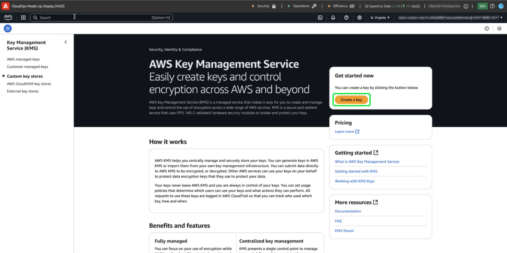

# AWS KMS configureren voor door de klant beheerde sleutels

>[!AVAILABILITY]
>
>Dit document is van toepassing op implementaties van Experience Platform die op Amazon Web Services (AWS) worden uitgevoerd. Experience Platform die op AWS wordt uitgevoerd, is momenteel beschikbaar voor een beperkt aantal klanten. Meer over de gesteunde infrastructuur van Experience Platform leren, zie het [&#x200B; multi-wolkenoverzicht van Experience Platform &#x200B;](https://experienceleague.adobe.com/nl/docs/experience-platform/landing/multi-cloud).
>
>[&#x200B; Klant Beheerde Sleutels &#x200B;](../overview.md) (CMK) op AWS worden gesteund voor Privacy en het Schild van de Veiligheid maar zijn niet beschikbaar voor het Schild van de Gezondheidszorg. CMK on Azure wordt ondersteund voor zowel het privacyschild als het beveiligingsschild.

Met deze handleiding kunt u uw gegevens beveiligen met Amazon Web Services (AWS) Key Management Service (KMS) door coderingssleutels voor Adobe Experience Platform te maken, te beheren en te beheren. Deze integratie vereenvoudigt naleving, stroomlijnt verrichtingen door automatisering, en elimineert de behoefte om uw eigen zeer belangrijke beheerinfrastructuur te handhaven.

Voor Customer Journey Analytics-specifieke instructies, verwijs naar de [&#x200B; documentatie van Customer Journey Analytics CMK &#x200B;](https://experienceleague.adobe.com/nl/docs/analytics-platform/using/cja-privacy/cmk)

>[!IMPORTANT]
>
>Adobe Experience Platform codeert gegevens standaard in rust met behulp van door het systeem beheerde sleutels. Door CMK (Customer Managed Keys) in te schakelen, hebt u volledige controle over uw gegevensbeveiliging. Deze wijziging is echter onomkeerbaar, wanneer CMK is ingeschakeld, kunt u niet terugkeren naar de door het systeem beheerde toetsen. U bent verantwoordelijk voor het veilig beheren van uw sleutels om ononderbroken toegang tot uw gegevens te verzekeren en potentiële ontoegankelijkheid te verhinderen.

Gebruik AWS KMS om de gegevensbeveiliging te verbeteren met geïntegreerd beheer van coderingssleutels voor Adobe Experience Platform. Volg deze handleiding om coderingssleutels te maken en te beheren, zodat uw gegevens beveiligd blijven.

## Vereisten {#prerequisites}

Voordat u doorgaat met dit document, hebt u een goed inzicht in de volgende belangrijke concepten en mogelijkheden:

- **de Zeer belangrijke Dienst van het Beheer van AWS (KMS)**: Begrijp de grondbeginselen van AWS KMS, met inbegrip van hoe te om, encryptiesleutels tot stand te brengen te beheren en te roteren. Verwijs naar de [&#x200B; officiële documentatie van KMS &#x200B;](https://docs.aws.amazon.com/kms/) om meer te leren.
- **Identiteit en het beleid van het Toegangsbeheer (IAM) in AWS**: IAM is de dienst die u toelaat om toegang tot de diensten en de middelen van AWS veilig te beheren. IAM gebruiken voor:
   - Bepaal welke gebruikers, groepen, en rollen toegang tot specifieke middelen hebben.
   - Geef op welke handelingen gebruikers mogen uitvoeren of mogen niet uitvoeren.
   - Voer fijnkorrelig toegangsbeheer door toestemmingen toe te wijzen gebruikend beleid IAM uit.
Verwijs naar het [&#x200B; IAM Beleid voor de officiële documentatie van AWS KMS &#x200B;](https://docs.aws.amazon.com/kms/latest/developerguide/iam-policies.html) voor meer informatie.
- **Veiligheid van Gegevens in Experience Platform**: Onderzoek hoe Experience Platform gegevensveiligheid verzekert en met de externe diensten zoals AWS KMS voor encryptie integreert. Experience Platform beschermt gegevens met HTTPS TLS v1.2 voor doorvoer, codering van cloudproviders in rust, geïsoleerde opslag en aanpasbare verificatie- en coderingsopties. Zie het [&#x200B; bestuur, de privacy, en veiligheidsoverzicht &#x200B;](../overview.md), of het document over [&#x200B; gegevensencryptie in Experience Platform &#x200B;](../../encryption.md) voor meer informatie over hoe uw gegevens veilig wordt gehouden.
- **AWS Management Console**: Een centrale hub waar u tot al uw diensten van AWS van één Web-based toepassing kunt toegang hebben en leiden. Met de zoekbalk kunt u snel gereedschappen zoeken, meldingen controleren, uw account en facturering beheren en uw instellingen aanpassen. Verwijs naar de [&#x200B; officiële documentatie van de de beheersconsole van AWS &#x200B;](https://docs.aws.amazon.com/awsconsolehelpdocs/latest/gsg/what-is.html) voor meer informatie.

## Aan de slag {#get-started}

Deze handleiding vereist dat u al toegang hebt tot een Amazon Web Services-account en toegang hebt tot de beheerconsole. Voer de onderstaande stappen uit om aan de slag te gaan:

### Selecteer een ondersteund gebied {#select-supported-region}

AWS KMS is beschikbaar in specifieke gebieden. Zorg ervoor dat u werkt in een gebied waar KMS wordt ondersteund. U kunt een volledige lijst van gesteunde gebieden in de [&#x200B; AWS KMS eindpunten en quotalijst &#x200B;](https://aws.amazon.com/about-aws/global-infrastructure/regional-product-services/) bekijken.

Zorg ervoor dat uw AWS KMS-coderingssleutel zich in dezelfde regio bevindt als uw Adobe Experience Platform-exemplaar, zodat u voldoet aan de vereisten voor gegevensresidentie, de prestaties optimaliseert en extra kosten voor andere regio&#39;s vermijdt. Verkeerd uitgelijnde gebieden kunnen leiden tot ontoegankelijkheid van gegevens en mislukte integratie.

### Machtigingen verifiëren {#verify-permissions}

Zorg ervoor dat u over de benodigde AWS Identity and Access Management (IAM)-machtigingen beschikt voor het maken, beheren en gebruiken van coderingssleutels in KMS. Om uw toestemmingen te verifiëren:

1. Heb toegang tot de [&#x200B; Simulator van het Beleid IAM &#x200B;](https://policysim.aws.amazon.com/).
2. Selecteer uw gebruikersaccount of rol.
3. Simuleer KMS-handelingen zoals `kms:CreateKey` of `kms:Encrypt` .

Als de simulatie een fout terugkeert of u bent onzeker over uw toestemmingen, raadpleeg uw beheerder van AWS voor hulp.

### De configuratie van uw AWS-account controleren

Bevestig dat je AWS-account is ingeschakeld voor het gebruik van AWS KMS-services. De meeste rekeningen hebben toegang KMS die door gebrek wordt toegelaten, maar u kunt uw rekeningsopstelling herzien door de [&#x200B; Console van het Beheer van AWS &#x200B;](https://aws.amazon.com/console/) te bezoeken. Voor meer details, zie de [&#x200B; gids van de Ontwikkelaar van de Dienst van het Beheer van AWS Zeer belangrijke &#x200B;](https://docs.aws.amazon.com/kms/latest/developerguide/overview.html).

### Navigeren naar AWS KMS om sleutelinstellingen te starten

Als u uw coderingssleutel wilt instellen en beheren, meldt u zich aan bij uw AWS-account en navigeert u naar de AWS Key Management Service (KMS). Van de Console van het Beheer van AWS en selecteer **Zeer belangrijke Dienst van het Beheer (KMS)** van het de dienstenmenu.

## Een nieuwe sleutel maken {#create-a-key}

>[!IMPORTANT]
>
>Zorg voor de veilige opslag, toegang en beschikbaarheid van de coderingssleutels. U bent verantwoordelijk voor het beheer van uw sleutels en het voorkomen van onderbrekingen in Experience Platform-bewerkingen.

Selecteer **[!DNL Create a key]** in de [!DNL Key Management Service (KMS)] -werkruimte.

## Sleutelinstellingen configureren {#configure-key}

De [!DNL Configure Key] -workflow wordt weergegeven. Standaard is het toetstype ingesteld op **[!DNL Symmetric]** en wordt het sleutelgebruik ingesteld op **[!DNL Encrypt and Decrypt]** . Zorg ervoor dat deze opties zijn geselecteerd voordat u verdergaat.

Vouw het vervolgkeuzemenu **[!DNL Advanced options]** uit. U wordt aangeraden de optie **[!DNL KMS]** te gebruiken, waarmee AWS het sleutelmateriaal kan maken en beheren. De optie **[!DNL KMS]** is standaard geselecteerd.

>[!NOTE]
>
>Als u al een bestaande sleutel hebt, kunt u extern sleutelmateriaal importeren of de sleutelarchief van AWS [!DNL CloudHSM] gebruiken. Deze opties vallen niet binnen het bereik van dit document.

Selecteer vervolgens de instelling [!DNL Regionality] , die het bereik van het gebied van de sleutel opgeeft. Selecteer **[!DNL Single-Region key]**, gevolgd door **[!DNL Next]** om verder te gaan naar stap twee.

>[!IMPORTANT]
>
>AWS past gebiedsbeperkingen voor KMS-sleutels toe. Deze gebiedsbeperking betekent dat de sleutel in het zelfde gebied moet zijn zoals uw Adobe rekening. Adobe heeft alleen toegang tot KMS-sleutels die zich in het gebied van uw account bevinden. Zorg ervoor dat het gebied dat u selecteert, overeenkomt met het gebied van uw Adobe-account voor één gebruiker.

## Label en label uw sleutel {#add-labels-and-tags-to-key}

Het tweede, [!DNL Add labels] werkgebied wordt weergegeven. Hier configureert u de velden [!DNL Alias] en [!DNL Tags] om u te helpen uw coderingssleutel te beheren en te vinden via de AWS KMS-console.

Voer in het invoerveld **[!DNL Alias]** een beschrijvend label voor de toets in. De alias fungeert als een gebruikersvriendelijke id waarmee u de sleutel snel kunt vinden met de zoekbalk in de AWS KMS-console. Om verwarring te voorkomen, kiest u een betekenisvolle naam die het doel van de sleutel weerspiegelt, zoals &quot;Adobe-Experience-Platform-Key&quot; of &quot;Customer-Encryption-Key&quot;. U kunt ook een beschrijving van de sleutel opnemen als de belangrijkste alias niet volstaat om het doel te beschrijven.

Tot slot wijs meta-gegevens aan uw sleutel toe door sleutel-waarde paren in de [!DNL Tags] sectie toe te voegen. Deze stap is optioneel, maar u moet codes toevoegen om AWS-bronnen te categoriseren en te filteren, zodat u ze eenvoudiger kunt beheren. Als uw organisatie bijvoorbeeld meerdere aan Adobe gerelateerde bronnen gebruikt, kunt u deze coderen met &quot;Adobe&quot; of &quot;Experience-Platform&quot;. Deze extra stap maakt het eenvoudig om al uw bijbehorende bronnen in de AWS Management Console te zoeken en te beheren. Selecteer **[!DNL Add tag]** om met het proces te beginnen.

<!-- I do not have an AWS account with which to document the Add tag process as yet. -->

Als u tevreden bent met de instellingen, selecteert u **[!DNL Next]** om door te gaan met de workflow.

## Sleutelbeheermachtigingen definiëren {#define-key-admins}

Stap drie van de workflow voor het maken van sleutels wordt weergegeven. Om veilige en gecontroleerde toegang te verzekeren, kunt u kiezen welke van de gebruikers IAM en de rollen de sleutel kunnen beheren. Er zijn in dit stadium twee opties: [!DNL Key administrators] en [!DNL Key deletion] . Selecteer in de sectie **[!DNL Key administrators]** een of meer selectievakjes naast de naam van een gebruiker of rol die u beheerdersmachtigingen voor deze sleutel wilt verlenen.

>[!NOTE]
>
>In deze fase van de workflow kunt u geen beheerders maken.

Schakel in de sectie **[!DNL Key deletion]** het selectievakje in zodat belangrijke beheerders deze sleutel kunnen verwijderen. Als u het selectievakje niet inschakelt, mogen beheerders die bewerking niet uitvoeren.

Selecteer **[!DNL Next]** om door te gaan met de workflow.

## Toegang verlenen aan sleutelgebruikers {#assign-key-users}

In stap vier van de workflow kunt u [!DNL Define key usage permissions] gebruiken. Selecteer in de lijst **[!DNL Key users]** de selectievakjes voor alle IAM-gebruikers en -rollen die u gemachtigd wilt hebben om deze sleutel te gebruiken.

Vanuit deze weergave kunt u ook [!DNL Add another AWS account] gebruiken. Het toevoegen van andere AWS-accounts wordt echter sterk afgeraden. Het toevoegen van een andere account kan risico&#39;s met zich meebrengen en het beheer van machtigingen voor versleuteling en ontsleuteling bemoeilijken. Door de sleutel voor één AWS-account te behouden, zorgt Adobe voor een veilige integratie met AWS KMS, minimaliseert het risico&#39;s en zorgt het voor een betrouwbare werking.

Selecteer **[!DNL Next]** om door te gaan met de workflow.

## Toetsconfiguratie controleren {#review}

De revisiefase van de sleutelconfiguratie wordt weergegeven. Controleer de belangrijkste details in de [!DNL Key configuration] en [!DNL Alias and description] secties.

>[!NOTE]
>
>Zorg ervoor dat het hoofdgebied hetzelfde is als het AWS-account.

Selecteer **[!DNL Confirm]** om het proces te voltooien. U bent teruggekeerd aan de KMS KlantBeheerde werkruimte van Sleutels die alle beschikbare sleutels een lijst maakt.

## Volgende stappen

Nadat AWS KMS is geconfigureerd, voert u de integratie uit met de [!UICONTROL Platform Encryption Configuration] -gebruikersinterface of de Adobe Experience Platform-API. Om het eenmalig proces voor vestiging de Klant Beheerde eigenschap van Sleutels voort te zetten, ga met de [&#x200B; UI opstellingsgids &#x200B;](./ui-set-up.md) verder.
