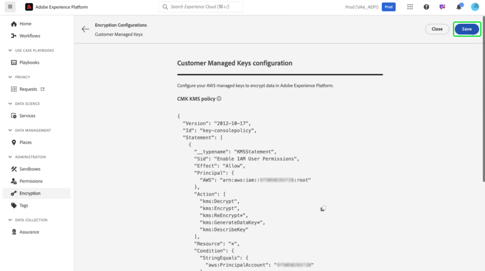

# Door de klant beheerde toetsen instellen en configureren met AWS via de interface van het platform

Gebruik deze handleiding om CMK (Customer Managed Keys) in te schakelen voor platforminstanties die via de gebruikersinterface van het platform op AWS worden gehost.

>[!IMPORTANT]
>
>Alvorens u met deze gids verdergaat, zorg ervoor u de opstelling hebt voltooid die in [ wordt gedetailleerd &quot;vormt AWS KMS voor CMK&quot;](./configure-kms.md) document.

## Het sleutelbeleid van AWS bijwerken om de sleutel met Experience Platform te integreren

Als u uw AWS-sleutel wilt integreren met Experience Platform, moet u de JSON bewerken in het gedeelte **[!DNL Key Policy]** van de KMS-werkruimte. Een standaardsleutelbeleid ziet er ongeveer hetzelfde uit als de JSON hieronder.

<!-- The AWS ID below is fake. Q) Can I refer to it simply as AWS_ACCOUNT_ID ? Is that suitable? -->

```JSON
{
  "Id": "key-consolepolicy-3",
  "Version": "2012-10-17",
  "Statement": [
    {
      "Sid": "Enable IAM User Permissions",
      "Effect": "Allow",
      "Principal": {
        "AWS": "arn:aws:iam::123464903283:root" // this is a mock AWS Principal ID, your ID will differ
      },
      "Action": "kms:*",
      "Resource": "*"
    }
  ]
}
```

In het bovenstaande voorbeeld hebben alle bronnen (`"Resource": "*"`) binnen dezelfde account (`Principal.AWS` ) toegang tot de sleutel. Dit beleid staat de diensten in de rekening toe om encryptie en decryptieverrichtingen uit te voeren, die tot de gespecificeerde rekening worden beperkt. Om uw Platform enig-huurdersrekening toegang tot deze sleutel te verlenen, voeg nieuwe verklaringen aan het standaard beleid van AWS toe. U kunt het vereiste JSON-beleid verkrijgen via de platforminterface en dit toepassen op de AWS KMS-sleutel om een veilige verbinding met Adobe Experience Platform tot stand te brengen.

Ga in de UI Platform naar de sectie **[!UICONTROL Administration]** in de linkernavigatieregel en selecteer **[!UICONTROL Encryption]** . Selecteer **[!UICONTROL Configure]** in de [!UICONTROL Customer Managed Keys] -kaart in de [!UICONTROL Encryption Configuration] -werkruimte.


De lus [!UICONTROL Customer Managed Keys configuration] wordt weergegeven. Kopieer het `statement` -object uit het CMK KMS-beleid dat wordt weergegeven in [!UICONTROL Customer Managed Keys] [!UICONTROL Encryption Configuration] .

<!-- Select the copy icon () to copy the CMK KMS policy to your clipboard. A green pop-up notification confirms that the policy was copied.  -->

<!-- I cannot add the 'and the copy icon highlighted.' to the alt text below as i do not have access to this UI. -->


<!-- This part of the workflow was in contention at the time of the demo.  -->

Ga vervolgens terug naar de AWS KMS-werkruimte en werk het onderstaande sleutelbeleid bij.


Voeg aan het standaardbeleid de vier instructies van de werkruimte [!UICONTROL Platform Encryption Configuration] toe, zoals hieronder wordt weergegeven: `Enable IAM User Permissions`, `CJA Flow IAM User Permissions`, `CJA Integrity IAM User Permissions`, `CJA Oberon IAM User Permissions` .

```json
{
    "Version": "2012-10-17",
    "Id": "key-consolepolicy",
    "Statement": [
        {
            "Sid": "Enable IAM User Permissions",
            "Effect": "Allow",
            "Principal": {
                "AWS": "arn:aws:iam::975049898882:root" // this is a mock AWS Principal ID, your ID will differ
            },
            "Action": [
                "kms:Decrypt",
                "kms:Encrypt",
                "kms:ReEncrypt*",
                "kms:GenerateDataKey*",
                "kms:DescribeKey",
                "kms:CreateGrant"
            ],
            "Resource": "*",
            "Condition": {
                "StringEquals": {
                    "aws:PrincipalAccount": "975049898882" // this is a mock AWS Principal ID, your ID will differ
                }
            }
        },
        {
            "Sid": "CJA Flow IAM User Permissions",
            "Effect": "Allow",
            "Principal": {
                "AWS": "arn:aws:iam::767397686373:root"
            },
            "Action": [
                "kms:Decrypt",
                "kms:Encrypt",
                "kms:ReEncrypt*",
                "kms:GenerateDataKey*",
                "kms:DescribeKey",
                "kms:CreateGrant"
            ],
            "Resource": "*",
            "Condition": {
                "StringEquals": {
                    "aws:PrincipalAccount": "767397686373"
                }
            }
        },
        {
            "Sid": "CJA Integrity IAM User Permissions",
            "Effect": "Allow",
            "Principal": {
                "AWS": "arn:aws:iam::730335345392:root"
            },
            "Action": [
                "kms:Decrypt",
                "kms:Encrypt",
                "kms:ReEncrypt*",
                "kms:GenerateDataKey*",
                "kms:DescribeKey",
                "kms:CreateGrant"
            ],
            "Resource": "*",
            "Condition": {
                "StringEquals": {
                    "aws:PrincipalAccount": "730335345392"
                }
            }
        },
        {
            "Sid": "CJA Oberon IAM User Permissions",
            "Effect": "Allow",
            "Principal": {
                "AWS": "arn:aws:iam::891377157113:root"
            },
            "Action": [
                "kms:Decrypt",
                "kms:Encrypt",
                "kms:ReEncrypt*",
                "kms:GenerateDataKey*",
                "kms:DescribeKey",
                "kms:CreateGrant"
            ],
            "Resource": "*",
            "Condition": {
                "StringEquals": {
                    "aws:PrincipalAccount": "891377157113"
                }
            }
        }
    ]
}
```

Selecteer **[!DNL Finish]** om het bijgewerkte beleid te bevestigen en de sleutel te maken. De configuratie bevat nu vijf instructies, waarmee uw AWS-account kan communiceren met Adobe Experience Platform. De wijzigingen worden onmiddellijk van kracht.

De bijgewerkte [!DNL Customer Managed Keys] werkruimte van de AWS [!DNL Key Management Service] wordt weergegeven.

### AWS-coderingssleutelgegevens toevoegen aan platform

Voeg vervolgens de Amazon Resource Name (ARN) van de sleutel aan het platform toe om codering in te schakelen [!UICONTROL Customer Managed Keys configuration] . Selecteer in de sectie [!DNL Customer Managed Keys] van AWS de alias van de nieuwe sleutel in de lijst in [!DNL Key Management Service] .


De details van uw sleutel worden getoond. Alles in AWS heeft een Amazon Resource Name (ARN) die
is een unieke id die wordt gebruikt om bronnen op te geven voor verschillende AWS-services. De notatie volgt een gestandaardiseerde notatie: `arn:partition:service:region:account-id:resource`.

Selecteer het kopieerpictogram om uw ARN te kopiëren. Er wordt een bevestigingsvenster weergegeven.


Navigeer nu terug naar de interface Platform [!UICONTROL Customer Managed Keys configuration] . Voeg in de sectie **[!UICONTROL Add AWS encryption key details]** een **[!UICONTROL Configuration name]** en de **[!UICONTROL KMS key ARN]** toe die u uit de gebruikersinterface van AWS hebt gekopieerd.


Selecteer vervolgens **[!UICONTROL SAVE]** om de configuratienaam, de KMS-sleutel ARN en de validatie van de toets te starten.



U wordt teruggestuurd naar de werkruimte van [!UICONTROL Encryption Configurations] . De status van de coderingsconfiguratie wordt onder aan de **[!UICONTROL Customer Managed Keys]** -kaart weergegeven.


Nadat de sleutel is gevalideerd, worden de sleutelvault-id&#39;s toegevoegd aan het dataroopbestand en de profieldatastores voor alle sandboxen.

>[!NOTE]
>
>De duur van het proces is afhankelijk van de grootte van uw gegevens. Doorgaans wordt het proces binnen 24 uur voltooid. Elke sandbox wordt meestal binnen twee tot drie minuten bijgewerkt.

## Toetsintrekking {#key-revocation}

>[!IMPORTANT]
>
>Begrijp de implicaties van zeer belangrijke intrekking op stroomafwaartse toepassingen alvorens u om het even welke toegang herroept.

Hier volgen enkele belangrijke overwegingen voor het intrekken van toetsen:

- Als u de toets intrekt of uitschakelt, zijn de gegevens van het platform niet toegankelijk. Deze actie is onomkeerbaar en dient met voorzichtigheid te worden uitgevoerd.
- Denk aan de tijdlijnen van de propagatie wanneer de toegang tot encryptiesleutels wordt ingetrokken. De primaire gegevensopslag wordt binnen een paar minuten tot 24 uur ontoegankelijk. Gegevensopslag in cache of van voorbijgaande aard is binnen zeven dagen ontoegankelijk.

Als u een toets wilt intrekken, navigeert u naar de AWS KMS-werkruimte. In de sectie **[!DNL Customer managed keys]** worden alle beschikbare sleutels voor uw AWS-account weergegeven. Selecteer de alias van uw sleutel in de lijst.


De details van uw sleutel worden getoond. Selecteer **[!DNL Key actions]** en **[!DNL Disable]** in het vervolgkeuzemenu om de toets uit te schakelen.


Er wordt een bevestigingsvenster weergegeven. Selecteer **[!DNL Disable key]** om uw keuze te bevestigen. Het effect van het onbruikbaar maken van de sleutel zou in de toepassingen van het Platform en UI binnen ongeveer vijf minuten moeten worden weerspiegeld.

>[!NOTE]
>
>Nadat u de toets hebt uitgeschakeld, kunt u de toets weer inschakelen met dezelfde methode die hierboven is beschreven, als dat nodig is. Deze optie is beschikbaar in het vervolgkeuzemenu **[!DNL Key actions]** .


Alternatief, als uw sleutel over andere diensten wordt gebruikt, kunt u toegang voor Experience Platform direct uit het belangrijkste beleid verwijderen. Selecteer **[!UICONTROL Edit]** in de sectie **[!DNL Key Policy]** .


De pagina **[!DNL Edit key policy]** wordt weergegeven. Markeer en verwijder de beleidsinstructie, gekopieerd uit de platforminterface, om de machtigingen voor de door Klant beheerde toetsenapp te verwijderen. Selecteer vervolgens **[!DNL Save changes]** om het proces te voltooien.


## Toetsrotatie {#key-rotation}

AWS biedt automatisch en op aanvraag sleutelrotatie. Om het risico van zeer belangrijk compromis te verminderen of aan veiligheids nalevingsvereisten te voldoen, kunt u nieuwe encryptiesleutels automatisch produceren op bestelling, of met regelmatige intervallen. Plan automatische sleutelomwenteling om de levensduur van een sleutel te beperken en ervoor te zorgen dat als een sleutel wordt gecompromitteerd, het na omwenteling onbruikbaar wordt. Terwijl moderne encryptiealgoritmen hoogst veilig zijn, is de zeer belangrijke omwenteling van de sleutel een belangrijke veiligheidsnalevingsmaatregel en toont aanhang aan veiligheid beste praktijken.

### Automatische sleutelrotatie {#automatic-key-rotation}

Automatisch roteren van toetsen is standaard uitgeschakeld. Als u automatische sleutelrotatie vanuit de KMS-werkruimte wilt plannen, selecteert u de tab **[!DNL Key rotation]** , gevolgd door **[!DNL Edit]** in de **[!DNL Automatic key rotation section]** .


De werkruimte van **[!DNL Edit automatic key rotation]** wordt weergegeven. Selecteer hier het keuzerondje om automatisch roteren van toetsen in of uit te schakelen. Kies vervolgens het tekstinvoerveld of het vervolgkeuzemenu om een tijdsperiode voor de toetsrotatie te kiezen. Selecteer **[!DNL Save]** om uw instellingen te bevestigen en terug te keren naar de werkruimte met de belangrijkste details.

>[!NOTE]
>
>De minimale rotatieperiode is 90 dagen en het maximum is 2560 dagen.


### Sleutelrotatie op aanvraag {#on-demand-key-rotation}

Selecteer **[!DNL Rotate Now]** om een directe toetsrotatie uit te voeren als de huidige toets is ingedrukt. AWS beperkt deze functie tot tien rotaties. Voor regelmatig onderhoud moet u in plaats daarvan automatische toetsrotaties plannen.


## Volgende stappen

Nadat u dit document hebt gelezen, hebt u geleerd hoe u coderingssleutels in AWS KMS for Adobe Experience Platform kunt maken, configureren en beheren. Controleer vervolgens het beveiligings- en compatibiliteitsbeleid van uw organisatie om de beste praktijken te implementeren, zoals het plannen van belangrijke rotaties en het garanderen van veilige sleutelopslag.
