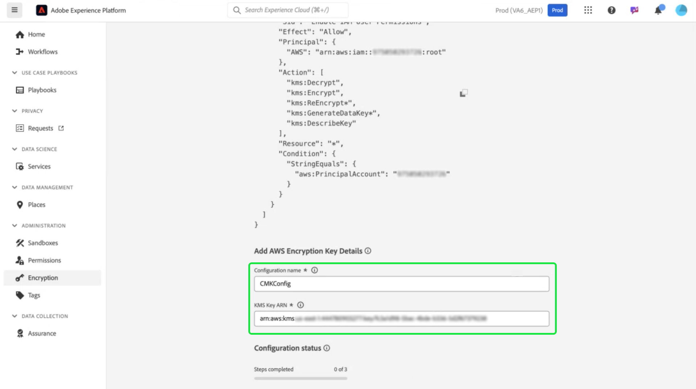
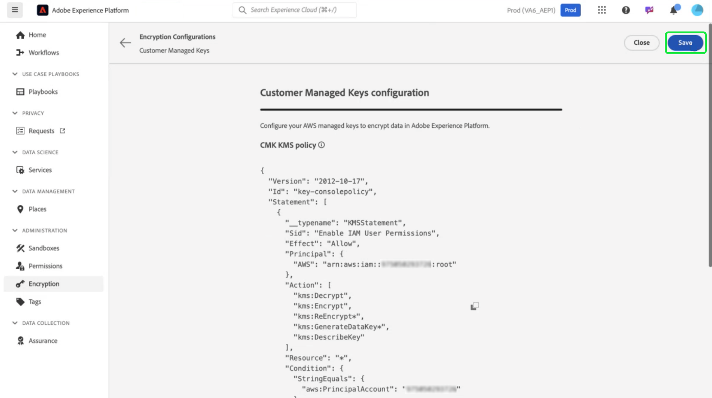

# Amazon Web Services Key Management Service voor Adobe Experience Platform-gegevenscodering gebruiken

>[!AVAILABILITY]
>
>Dit document is van toepassing op implementaties van Experience Platforms die op Amazon Web Services (AWS) worden uitgevoerd. Experience Platform dat op AWS wordt uitgevoerd, is momenteel beschikbaar voor een beperkt aantal klanten. Meer over de gesteunde infrastructuur van het Experience Platform leren, zie het [ Experience Platform multi-cloud overzicht ](https://experienceleague.adobe.com/en/docs/experience-platform/landing/multi-cloud).
>
>[ Klant Beheerde Sleutels ](../customer-managed-keys/overview.md) (CMK) op AWS worden gesteund voor Privacy en het Schild van de Veiligheid maar zijn niet beschikbaar voor het Schild van de Gezondheidszorg. CMK on Azure wordt ondersteund voor zowel het privacyschild als het beveiligingsschild.

Met deze handleiding kunt u uw gegevens beveiligen met Amazon Web Services (AWS) Key Management Service (KMS) door coderingssleutels voor Adobe Experience Platform te maken, te beheren en te beheren. Deze integratie vereenvoudigt naleving, stroomlijnt verrichtingen door automatisering, en elimineert de behoefte om uw eigen zeer belangrijke beheerinfrastructuur te handhaven.

Voor Customer Journey Analytics-specifieke instructies, verwijs naar de [ documentatie van de Customer Journey Analytics CMK ](https://experienceleague.adobe.com/en/docs/analytics-platform/using/cja-privacy/cmk)

>[!IMPORTANT]
>
>Adobe Experience Platform codeert gegevens standaard in rust met behulp van door het systeem beheerde sleutels. Door CMK (Customer Managed Keys) in te schakelen, hebt u volledige controle over uw gegevensbeveiliging. Deze wijziging is echter onomkeerbaar, wanneer CMK is ingeschakeld, kunt u niet terugkeren naar de door het systeem beheerde toetsen. U bent verantwoordelijk voor het veilig beheren van uw sleutels om ononderbroken toegang tot uw gegevens te verzekeren en potentiële ontoegankelijkheid te verhinderen.

Deze handleiding bevat informatie over het proces voor het maken en beheren van coderingssleutels in AWS KMS om uw gegevens in Experience Platform te beveiligen.

## Vereisten {#prerequisites}

Voordat u doorgaat met dit document, hebt u een goed inzicht in de volgende belangrijke concepten en mogelijkheden:

- **de Zeer belangrijke Dienst van het Beheer van AWS (KMS)**: Begrijp de grondbeginselen van AWS KMS, met inbegrip van hoe te om, encryptiesleutels tot stand te brengen te beheren en te roteren. Verwijs naar de [ officiële documentatie van KMS ](https://docs.aws.amazon.com/kms/) om meer te leren.
- **Identiteit en het beleid van het Toegangsbeheer (IAM) in AWS**: IAM is de dienst die u toelaat om toegang tot de diensten en de middelen van AWS veilig te beheren. IAM gebruiken voor:
   - Bepaal welke gebruikers, groepen, en rollen toegang tot specifieke middelen hebben.
   - Geef op welke handelingen gebruikers mogen uitvoeren of mogen niet uitvoeren.
   - Voer fijnkorrelig toegangsbeheer door toestemmingen toe te wijzen gebruikend beleid IAM uit.
Verwijs naar het [ IAM Beleid voor de officiële documentatie van AWS KMS ](https://docs.aws.amazon.com/kms/latest/developerguide/iam-policies.html) voor meer informatie.
- **Veiligheid van Gegevens in Experience Platform**: Onderzoek hoe het Platform gegevensveiligheid verzekert en met de externe diensten zoals AWS KMS voor encryptie integreert. Platform beveiligt gegevens met HTTPS TLS v1.2 voor doorvoer, cloudprovidercodering in rust, geïsoleerde opslag en aanpasbare verificatie- en coderingsopties. Zie het [ bestuur, de privacy, en veiligheidsoverzicht ](../overview.md), of het document op [ gegevensencryptie in Platform ](../encryption.md) voor meer informatie over hoe uw gegevens veilig wordt gehouden.
- **AWS Management Console**: Een centrale hub waar u tot al uw diensten van AWS van één Web-based toepassing kunt toegang hebben en leiden. Met de zoekbalk kunt u snel gereedschappen zoeken, meldingen controleren, uw account en facturering beheren en uw instellingen aanpassen. Verwijs naar de [ officiële documentatie van de de beheersconsole van AWS ](https://docs.aws.amazon.com/awsconsolehelpdocs/latest/gsg/what-is.html) voor meer informatie.

## Aan de slag {#get-started}

Deze handleiding vereist dat u al toegang hebt tot een Amazon Web Services-account en toegang hebt tot de beheerconsole. Voer de onderstaande stappen uit om aan de slag te gaan:

1. **verifieer toestemmingen**: Zorg ervoor dat u de noodzakelijke toestemmingen van het Beheer van de Identiteit en van de Toegang van AWS (IAM) hebt om, encryptiesleutels binnen KMS tot stand te brengen te leiden en te gebruiken. Om uw toestemmingen te verifiëren:
   1. Heb toegang tot de [ Simulator van het Beleid IAM ](https://policysim.aws.amazon.com/).
   1. Selecteer uw gebruikersaccount of rol.
   1. Simuleer KMS-handelingen zoals `kms:CreateKey` of `kms:Encrypt` .
Als de simulatie een fout terugkeert of u bent onzeker over uw toestemmingen, raadpleeg uw beheerder van AWS voor hulp.

1. **controleer uw de rekeningsconfiguratie van AWS**: Bevestig dat uw rekening van AWS wordt toegelaten om de diensten van AWS KMS te gebruiken. De meeste rekeningen hebben toegang KMS die door gebrek wordt toegelaten, maar u kunt uw rekeningsopstelling herzien door de [ Console van het Beheer van AWS ](https://aws.amazon.com/console/) te bezoeken. Voor meer details, zie de [ gids van de Ontwikkelaar van de Dienst van het Beheer van AWS Zeer belangrijke ](https://docs.aws.amazon.com/kms/latest/developerguide/overview.html).

1. **Uitgezocht een gesteund gebied**: AWS KMS is beschikbaar in specifieke gebieden. Zorg ervoor dat u werkt in een gebied waar KMS wordt ondersteund. U kunt een volledige lijst van gesteunde gebieden in de [ AWS KMS eindpunten en quotalijst ](https://aws.amazon.com/about-aws/global-infrastructure/regional-product-services/) bekijken.

### Navigeren naar AWS KMS om sleutelinstellingen te starten

>[!IMPORTANT]
>
>Zorg voor de veilige opslag, toegang en beschikbaarheid van de coderingssleutels. U bent verantwoordelijk voor het beheer van uw toetsen en het voorkomen van verstoringen van de werking van het platform.

Als u uw coderingssleutel wilt instellen en beheren, meldt u zich aan bij uw AWS-account en navigeert u naar de AWS Key Management Service (KMS). Van de Console van het Beheer van AWS en selecteer **Zeer belangrijke Dienst van het Beheer (KMS)** van het de dienstenmenu.


## Een nieuwe sleutel maken {#create-a-key}

De werkruimte van [!DNL Key Management Service (KMS)] wordt weergegeven. Selecteer **[!DNL Create a key]**.


## Sleutelinstellingen configureren {#configure-key}

De [!DNL Configure Key] -workflow wordt weergegeven. Standaard is het toetstype ingesteld op **[!DNL Symmetric]** en wordt het sleutelgebruik ingesteld op **[!DNL Encrypt and Decrypt]** . Zorg ervoor dat deze opties zijn geselecteerd voordat u verdergaat.


Vouw het vervolgkeuzemenu **[!DNL Advanced options]** uit. U wordt aangeraden de optie **[!DNL KMS]** te gebruiken, waarmee AWS het sleutelmateriaal kan maken en beheren. De optie **[!DNL KMS]** is standaard geselecteerd.

>[!NOTE]
>
>Als u al een bestaande sleutel hebt, kunt u extern sleutelmateriaal importeren of de sleutelarchief van AWS [!DNL CloudHSM] gebruiken. Deze opties vallen niet binnen het bereik van dit document.

Selecteer vervolgens de instelling [!DNL Regionality] , die het bereik van het gebied van de sleutel opgeeft. Selecteer **[!DNL Single-Region key]**, gevolgd door **[!DNL Next]** om verder te gaan naar stap twee.

>[!IMPORTANT]
>
>AWS past gebiedsbeperkingen voor KMS-sleutels toe. Deze gebiedsbeperking betekent dat de sleutel in het zelfde gebied moet zijn zoals uw rekening van de Adobe. Adobe heeft alleen toegang tot KMS-sleutels die zich in het gebied van uw account bevinden. Zorg ervoor dat het gebied dat u selecteert, overeenkomt met het gebied van uw Adobe-account voor één gebruiker.


## Label en label uw sleutel {#add-labels-and-tags-to-key}

Het tweede, [!DNL Add labels] werkgebied wordt weergegeven. Hier configureert u de velden [!DNL Alias] en [!DNL Tags] om u te helpen uw coderingssleutel te beheren en te vinden via de AWS KMS-console.

Voer in het invoerveld **[!DNL Alias]** een beschrijvend label voor de toets in. De alias fungeert als een gebruikersvriendelijke id waarmee u de sleutel snel kunt vinden met de zoekbalk in de AWS KMS-console. Om verwarring te voorkomen kiest u een betekenisvolle naam die het doel van de sleutel weerspiegelt, zoals &quot;Adobe-Platform-Sleutel&quot; of &quot;Customer-Encryption-Key&quot;. U kunt ook een beschrijving van de sleutel opnemen als de belangrijkste alias niet volstaat om het doel te beschrijven.

Tot slot wijs meta-gegevens aan uw sleutel toe door sleutel-waarde paren in de [!DNL Tags] sectie toe te voegen. Deze stap is optioneel, maar u moet codes toevoegen om AWS-bronnen te categoriseren en te filteren, zodat u ze eenvoudiger kunt beheren. Als uw organisatie bijvoorbeeld meerdere bronnen gebruikt die te maken hebben met Adobe, kunt u deze coderen met &#39;Adobe&#39; of &#39;Experience-Platform&#39;. Deze extra stap maakt het eenvoudig om al uw bijbehorende bronnen in de AWS Management Console te zoeken en te beheren. Selecteer **[!DNL Add tag]** om met het proces te beginnen.

<!-- I do not have an AWS account with which to document the Add tag process as yet. -->

Als u tevreden bent met de instellingen, selecteert u **[!DNL Next]** om door te gaan met de workflow.


## Sleutelbeheermachtigingen definiëren {#define-key-admins}

Stap drie van de workflow voor het maken van sleutels wordt weergegeven. Om veilige en gecontroleerde toegang te verzekeren, kunt u kiezen welke van de gebruikers IAM en de rollen de sleutel kunnen beheren. Er zijn in dit stadium twee opties: [!DNL Key administrators] en [!DNL Key deletion] . Selecteer in de sectie **[!DNL Key administrators]** een of meer selectievakjes naast de naam van een gebruiker of rol die u beheerdersmachtigingen voor deze sleutel wilt verlenen.

>[!NOTE]
>
>In deze fase van de workflow kunt u geen beheerders maken.

Schakel in de sectie **[!DNL Key deletion]** het selectievakje in zodat belangrijke beheerders deze sleutel kunnen verwijderen. Als u het selectievakje niet inschakelt, mogen beheerders die bewerking niet uitvoeren.

Selecteer **[!DNL Next]** om door te gaan met de workflow.


## Toegang verlenen aan sleutelgebruikers {#assign-key-users}

In stap vier van de workflow kunt u [!DNL Define key usage permissions] gebruiken. Selecteer in de lijst **[!DNL Key users]** de selectievakjes voor alle IAM-gebruikers en -rollen die u gemachtigd wilt hebben om deze sleutel te gebruiken.

Vanuit deze weergave kunt u ook [!DNL Add another AWS account] gebruiken. Het toevoegen van andere AWS-accounts wordt echter sterk afgeraden. Het toevoegen van een andere account kan risico&#39;s met zich meebrengen en het beheer van machtigingen voor versleuteling en ontsleuteling bemoeilijken. Door de sleutel voor één AWS-account te behouden, zorgt Adobe voor een veilige integratie met AWS KMS, minimaliseert het risico&#39;s en zorgt het voor een betrouwbare werking.

Selecteer **[!DNL Next]** om door te gaan met de workflow.


## Toetsconfiguratie controleren {#review}

De revisiefase van de sleutelconfiguratie wordt weergegeven. Controleer de belangrijkste details in de [!DNL Key configuration] en [!DNL Alias and description] secties.

>[!NOTE]
>
>Zorg ervoor dat het hoofdgebied hetzelfde is als het AWS-account.


### Het belangrijkste beleid bijwerken om de sleutel met Experience Platform te integreren

Bewerk vervolgens de JSON in de sectie **[!DNL Key Policy]** om de sleutel te integreren met het Experience Platform. Een standaardsleutelbeleid ziet er ongeveer hetzelfde uit als de JSON hieronder.

<!-- The AWS ID below is fake. Q) Can I refer to it simply as AWS_ACCOUNT_ID ? Is that suitable? -->

```JSON
{
  "Id": "key-consolepolicy-3",
  "Version": "2012-10-17",
  "Statement": [
    {
      "Sid": "Enable IAM User Permissions",
      "Effect": "Allow",
      "Principal": {
        "AWS": "arn:aws:iam::123464903283:root" // this is a mock AWS Principal ID, your ID will differ
      },
      "Action": "kms:*",
      "Resource": "*"
    }
  ]
}
```

In het bovenstaande voorbeeld hebben alle bronnen (`"Resource": "*"`) in dezelfde account (`Principal.AWS` ) toegang tot deze sleutel. Het beleid staat andere diensten in de zelfde rekening toe om de sleutel te gebruiken om encryptie en decryptie te doen. De services hebben alleen machtigingen voor dit account.

Daarna, verleent uw Platform enige huurdersrekening toegang tot deze sleutel door nieuwe verklaringen aan dit beleid toe te voegen. U kunt het JSON-beleid verkrijgen via de gebruikersinterface van het platform en het toepassen op uw AWS KMS-sleutel om het beleid veilig aan het platform te koppelen.

Navigeer naar de gebruikersinterface van het platform. Selecteer **[!UICONTROL Encryption]** in het gedeelte **[!UICONTROL Administration]** van de linkernavigatieregel. De werkruimte van [!UICONTROL Encryption Configuration] wordt weergegeven. Selecteer vervolgens **[!UICONTROL Configure]** op de [!UICONTROL Customer Managed Keys] -kaart.


De lus [!UICONTROL Customer Managed Keys configuration] wordt weergegeven. Selecteer het exemplaarpictogram ( ) om het CMK KMS-beleid naar het klembord te kopiëren. Een groen pop-upbericht bevestigt dat het beleid is gekopieerd.


<!-- This part of the workflow was in contention at the time of the demo.  -->

Ga vervolgens terug naar de AWS KMS-werkruimte en werk het onderstaande sleutelbeleid bij.


Voeg aan het standaardbeleid de vier instructies van de werkruimte [!UICONTROL Platform Encryption Configuration] toe, zoals hieronder wordt weergegeven: `Enable IAM User Permissions`, `CJA Flow IAM User Permissions`, `CJA Integrity IAM User Permissions`, `CJA Oberon IAM User Permissions` .

```json
{
    "Version": "2012-10-17",
    "Id": "key-consolepolicy",
    "Statement": [
        {
            "Sid": "Enable IAM User Permissions",
            "Effect": "Allow",
            "Principal": {
                "AWS": "arn:aws:iam::975049898882:root" // this is a mock AWS Principal ID, your ID will differ
            },
            "Action": [
                "kms:Decrypt",
                "kms:Encrypt",
                "kms:ReEncrypt*",
                "kms:GenerateDataKey*",
                "kms:DescribeKey",
                "kms:CreateGrant"
            ],
            "Resource": "*",
            "Condition": {
                "StringEquals": {
                    "aws:PrincipalAccount": "975049898882" // this is a mock AWS Principal ID, your ID will differ
                }
            }
        },
        {
            "Sid": "CJA Flow IAM User Permissions",
            "Effect": "Allow",
            "Principal": {
                "AWS": "arn:aws:iam::767397686373:root"
            },
            "Action": [
                "kms:Decrypt",
                "kms:Encrypt",
                "kms:ReEncrypt*",
                "kms:GenerateDataKey*",
                "kms:DescribeKey",
                "kms:CreateGrant"
            ],
            "Resource": "*",
            "Condition": {
                "StringEquals": {
                    "aws:PrincipalAccount": "767397686373"
                }
            }
        },
        {
            "Sid": "CJA Integrity IAM User Permissions",
            "Effect": "Allow",
            "Principal": {
                "AWS": "arn:aws:iam::730335345392:root"
            },
            "Action": [
                "kms:Decrypt",
                "kms:Encrypt",
                "kms:ReEncrypt*",
                "kms:GenerateDataKey*",
                "kms:DescribeKey",
                "kms:CreateGrant"
            ],
            "Resource": "*",
            "Condition": {
                "StringEquals": {
                    "aws:PrincipalAccount": "730335345392"
                }
            }
        },
        {
            "Sid": "CJA Oberon IAM User Permissions",
            "Effect": "Allow",
            "Principal": {
                "AWS": "arn:aws:iam::891377157113:root"
            },
            "Action": [
                "kms:Decrypt",
                "kms:Encrypt",
                "kms:ReEncrypt*",
                "kms:GenerateDataKey*",
                "kms:DescribeKey",
                "kms:CreateGrant"
            ],
            "Resource": "*",
            "Condition": {
                "StringEquals": {
                    "aws:PrincipalAccount": "891377157113"
                }
            }
        }
    ]
}
```


Selecteer **[!DNL Finish]** om uw belangrijkste details met uw bijgewerkte beleid te bevestigen en de sleutel tot stand te brengen. De sleutel en het beleid zijn nu geconfigureerd met het totaal van vijf instructies zodat uw AWS-account kan communiceren met uw Experience Platform-account. Het effect is onmiddellijk.

De bijgewerkte [!DNL Customer managed keys] werkruimte van de AWS [!DNL Key Management Service] wordt weergegeven.

### AWS-coderingssleutelgegevens toevoegen aan platform

Voeg vervolgens de Amazon Resource Name (ARN) van de sleutel aan het platform toe om codering in te schakelen [!UICONTROL Customer Managed Keys configuration] . Selecteer in de sectie [!DNL Customer Managed Keys] van AWS de alias van de nieuwe sleutel in de lijst in [!DNL Key Management Service] .


De details van uw sleutel worden getoond. Alles in AWS heeft een Amazon Resource Name (ARN) die
is een unieke id die wordt gebruikt om bronnen op te geven voor verschillende AWS-services. De notatie volgt een gestandaardiseerde notatie: `arn:partition:service:region:account-id:resource`.

Selecteer het kopieerpictogram om uw ARN te kopiëren. Er wordt een bevestigingsvenster weergegeven.


Navigeer nu terug naar de interface Platform [!UICONTROL Customer Managed Keys configuration] . Voeg in de sectie **[!UICONTROL Add AWS encryption key details]** een **[!UICONTROL Configuration name]** en de **[!UICONTROL KMS key ARN]** toe die u uit de gebruikersinterface van AWS hebt gekopieerd.



Selecteer vervolgens **[!UICONTROL SAVE]** om de configuratienaam, de KMS-sleutel ARN en de validatie van de toets te starten.



U wordt teruggestuurd naar de werkruimte van [!UICONTROL Encryption Configurations] . De status van de coderingsconfiguratie wordt onder aan de **[!UICONTROL Customer Managed Keys]** -kaart weergegeven.


Nadat de sleutel is gevalideerd, worden de sleutelvault-id&#39;s toegevoegd aan het dataroopbestand en de profieldatastores voor alle sandboxen.

>[!NOTE]
>
>De duur van het proces is afhankelijk van de grootte van uw gegevens. Doorgaans wordt het proces binnen 24 uur voltooid. Elke sandbox wordt meestal binnen twee tot drie minuten bijgewerkt.

## Toetsintrekking {#key-revocation}

>[!IMPORTANT]
>
>Begrijp de implicaties van zeer belangrijke intrekking op stroomafwaartse toepassingen alvorens u om het even welke toegang herroept.

Hier volgen enkele belangrijke overwegingen voor het intrekken van toetsen:

- Als u de toets intrekt of uitschakelt, zijn de gegevens van het platform niet toegankelijk. Deze actie is onomkeerbaar en dient met voorzichtigheid te worden uitgevoerd.
- Denk aan de tijdlijnen van de propagatie wanneer de toegang tot encryptiesleutels wordt ingetrokken. De primaire gegevensopslag wordt binnen een paar minuten tot 24 uur ontoegankelijk. Gegevensopslag in cache of van voorbijgaande aard is binnen zeven dagen ontoegankelijk.

Als u een toets wilt intrekken, navigeert u naar de AWS KMS-werkruimte. In de sectie **[!DNL Customer managed keys]** worden alle beschikbare sleutels voor uw AWS-account weergegeven. Selecteer de alias van uw sleutel in de lijst.


De details van uw sleutel worden getoond. Selecteer **[!DNL Key actions]** en **[!DNL Disable]** in het vervolgkeuzemenu om de toets uit te schakelen.


Er wordt een bevestigingsvenster weergegeven. Selecteer **[!DNL Disable key]** om uw keuze te bevestigen. Het effect van het onbruikbaar maken van de sleutel zou in de toepassingen van het Platform en UI binnen ongeveer vijf minuten moeten worden weerspiegeld.

>[!NOTE]
>
>Nadat u de toets hebt uitgeschakeld, kunt u de toets weer inschakelen met dezelfde methode die hierboven is beschreven, als dat nodig is. Deze optie is beschikbaar in het vervolgkeuzemenu **[!DNL Key actions]** .


Alternatief, als uw sleutel over andere diensten wordt gebruikt, kunt u toegang voor Experience Platform direct uit het belangrijkste beleid verwijderen. Selecteer **[!UICONTROL Edit]** in de sectie **[!DNL Key Policy]** .


De pagina **[!DNL Edit key policy]** wordt weergegeven. Markeer en verwijder de beleidsinstructie, gekopieerd uit de platforminterface, om de machtigingen voor de door Klant beheerde toetsenapp te verwijderen. Selecteer vervolgens **[!DNL Save changes]** om het proces te voltooien.


## Toetsrotatie {#key-rotation}

AWS biedt automatisch en op aanvraag sleutelrotatie. Om het risico van zeer belangrijk compromis te verminderen of aan veiligheids nalevingsvereisten te voldoen, kunt u nieuwe encryptiesleutels automatisch produceren op bestelling, of met regelmatige intervallen. Plan automatische sleutelomwenteling om de levensduur van een sleutel te beperken en ervoor te zorgen dat als een sleutel wordt gecompromitteerd, het na omwenteling onbruikbaar wordt. Terwijl moderne encryptiealgoritmen hoogst veilig zijn, is de zeer belangrijke omwenteling van de sleutel een belangrijke veiligheidsnalevingsmaatregel en toont aanhang aan veiligheid beste praktijken.

### Automatische sleutelrotatie {#automatic-key-rotation}

Automatisch roteren van toetsen is standaard uitgeschakeld. Als u automatische sleutelrotatie vanuit de KMS-werkruimte wilt plannen, selecteert u de tab **[!DNL Key rotation]** , gevolgd door **[!DNL Edit]** in de **[!DNL Automatic key rotation section]** .


De werkruimte van **[!DNL Edit automatic key rotation]** wordt weergegeven. Selecteer hier het keuzerondje om automatisch roteren van toetsen in of uit te schakelen. Kies vervolgens het tekstinvoerveld of het vervolgkeuzemenu om een tijdsperiode voor de toetsrotatie te kiezen. Selecteer **[!DNL Save]** om uw instellingen te bevestigen en terug te keren naar de werkruimte met de belangrijkste details.

>[!NOTE]
>
>De minimale rotatieperiode is 90 dagen en het maximum is 2560 dagen.


### Sleutelrotatie op aanvraag {#on-demand-key-rotation}

Als de huidige sleutel gecompromitteerd is, selecteer **[!DNL Rotate Now]** om het onmiddellijk te roteren. AWS staat slechts 10 rotaties op aanvraag toe. Gebruik een geplande sleutelrotatie tenzij de beveiliging al in gevaar is gebracht.


## Volgende stappen

Nadat u dit document hebt gelezen, hebt u geleerd hoe u coderingssleutels in AWS KMS kunt maken, configureren en beheren voor gebruik met Adobe Experience Platform. Als volgende stap kunt u overwegen het beveiligings- en compatibiliteitsbeleid van uw organisatie te herzien om te zorgen voor juiste beheerpraktijken, zoals geplande sleutelrotatie en veilige sleutelopslag.
