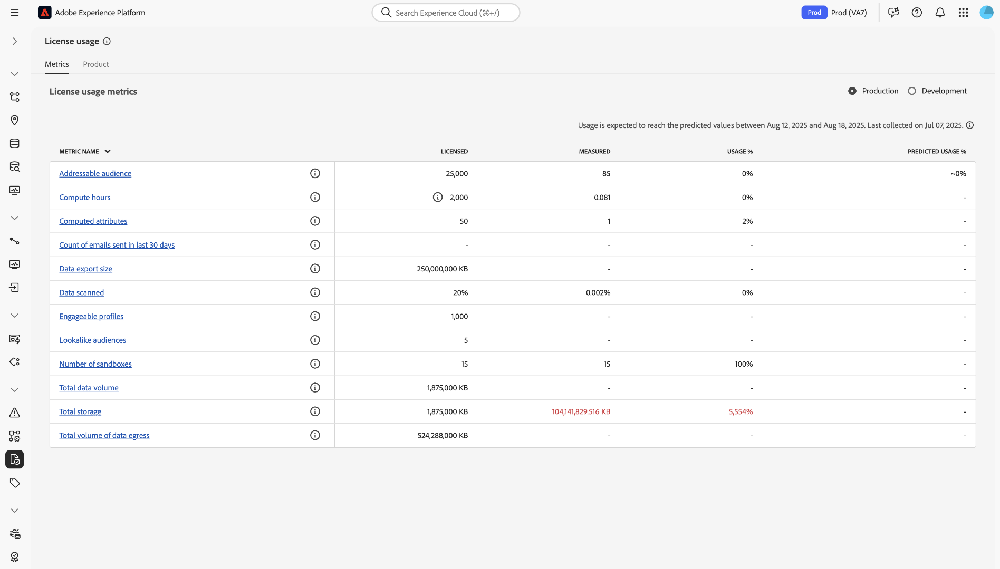
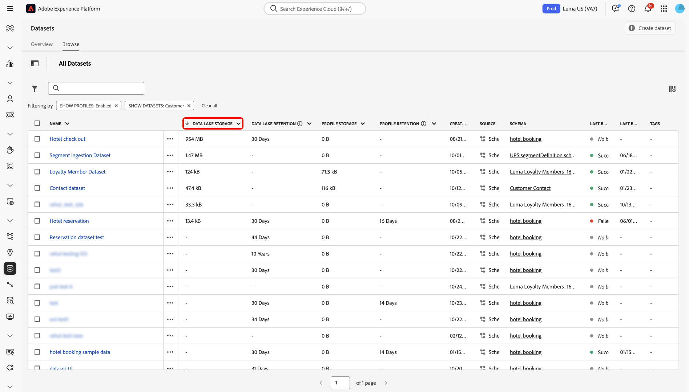
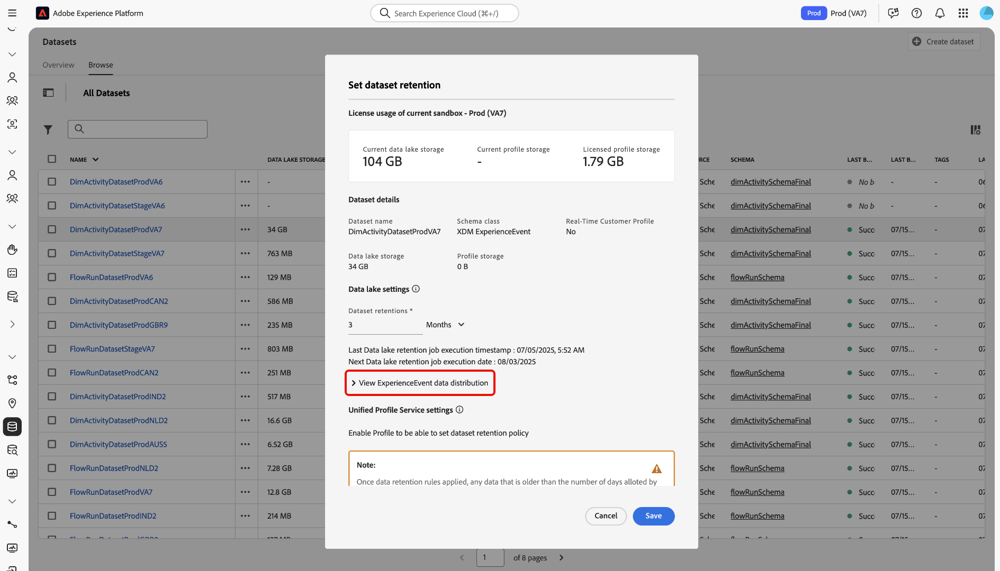

# Aanbevolen best practices voor licentierechten voor gegevensbeheer

Adobe Experience Platform is een open systeem dat uw gegevens omzet in robuuste klantprofielen die in real time worden bijgewerkt en op AI gebaseerde inzichten gebruiken om u te helpen de juiste ervaringen over elk kanaal te leveren. Met behulp van bronnen kunt u gegevens van verschillende typen, volumes en historie invoeren naar Experience Platform. Vervolgens kunt u die gegevens gebruiken voor gevallen die variëren van segmentatie en personalisatie tot analyse en machinaal leren.

Experience Platform biedt licenties waarmee u kunt bepalen hoeveel profielen u kunt maken en hoeveel gegevens u kunt invoeren. Gezien de capaciteit om om het even welke bron, volume, of geschiedenis van gegevens in te voeren, is het mogelijk om uw vergunningsrechten te overschrijden aangezien uw gegevensvolumes groeien.

Lees deze handleiding voor tips en trucs die u kunt gebruiken om uw licentierechten beter te beheren met Experience Platform.

## Overzicht van functies {#summary-of-features}

Gebruik de beste werkwijzen en gereedschappen die in dit document worden beschreven om het gebruik van uw licentierechten in Experience Platform beter te beheren. Dit document wordt bijgewerkt wanneer extra functies worden uitgebracht die alle Experience Platform-klanten zichtbaar en bestuurbaar maken.

In de volgende tabel wordt de lijst met momenteel beschikbare functies weergegeven, zodat u uw gebruiksrechten voor licenties beter kunt beheren.

| Functie | Beschrijving |
| --- | --- |
| [ Dataset UI - het gegevensbehoud van de Gebeurtenis van de Ervaring ](../../catalog/datasets/user-guide.md#data-retention-policy) | Configureer een vaste retentieperiode voor gegevens in de opslag van gegevens in het meer en het profiel. De verslagen worden geschrapt aangezien de gevormde bewaarperiode beëindigt. |
| [ laat/maakt Datasets voor het Profiel van de Klant in real time toe ](../../catalog/datasets/user-guide.md) | Schakel gegevenssetinvoer in of uit in realtime-klantprofiel. |
| [ Verlopen van de Gebeurtenis van de Ervaring in de opslag van het Profiel ](../../profile/event-expirations.md) | Pas een vervaltijd voor alle gebeurtenissen toe die in een profiel-Toegelaten dataset worden opgenomen. Neem contact op met uw Adobe-accountteam of de klantenservice om deze functie in te schakelen. |
| [ Prep van Gegevens van Adobe Analytics filters ](../../sources/tutorials/ui/create/adobe-applications/analytics.md#filtering-for-real-time-customer-profile) | Pas [!DNL Kafka] -filters toe om onnodige gegevens uit te sluiten van inname. |
| [ de bronschakelaarfilters van Adobe Audience Manager ](../../sources/tutorials/ui/create/adobe-applications/audience-manager.md) | Pas Audience Manager-bronverbindingsfilters toe om overbodige gegevens uit te sluiten van inname. |
| [ Gebeurtenis die gegevensfilters ](../../tags/ui/event-forwarding/overview.md) door:sturen | Pas server-kant [!DNL Kafka] filters toe om onnodige gegevens van opname uit te sluiten.  Zie de documentatie over [ markeringsregels ](../../tags/ui/managing-resources/rules.md) voor extra informatie. |
| [ het Dashboard UI van het Gebruik van de Vergunning ](../../dashboards/guides/license-usage.md#license-usage-dashboard-data) | De consumptie van Experience Platform-producten door uw organisatie controleren op basis van rechten waarvoor een vergunning is verleend. Toegang tot momentopnamen voor dagelijks gebruik, voorspellende trends en gedetailleerde gegevens op sandboxniveau ter ondersteuning van proactief licentiebeheer. |
| [ Dataset overlap Rapport API ](../../profile/tutorials/dataset-overlap-report.md) | Output de datasets die het meest aan uw Adresseerbare Publiek bijdraagt. |
| [ Identiteitsoverlapping Rapport API ](../../profile/api/preview-sample-status.md#generate-the-identity-namespace-overlap-report) | Output de identiteitsnaamruimten die het meest aan uw Adresseerbare Publiek bijdragen. |
| [ Pseudoniem de gegevensvervalsing van het Profiel ](../../profile/pseudonymous-profiles.md) | Configureer de vervaltijden van gegevens voor Pseudoniem-profielen en verwijder automatisch gegevens uit de profielopslag. |

{style="table-layout:auto"}

## Experience Platform-gegevensopslag

Experience Platform bestaat voornamelijk uit twee gegevensopslagruimten: het datumpeer en het Profile Store.

Het datumpeer dient hoofdzakelijk de volgende doeleinden:

* fungeert als testgebied voor gegevens aan boord in Experience Platform;
* fungeert als de gegevensopslag op lange termijn voor alle Experience Platform-gegevens;
* Hiermee worden gebruiksgevallen ingeschakeld, zoals gegevensanalyse en gegevenswetenschap.

De **opslag van het Profiel** is waar de klantenprofielen worden gecreeerd en hoofdzakelijk de volgende doeleinden dienen:

* treedt op als gegevensopslag voor profielen die worden gebruikt om ervaring in real time te steunen;
* Laat gebruiksgevallen zoals segmentatie, activering, en verpersoonlijking toe.

>[!NOTE]
>
>Uw toegang tot [!DNL data lake] kan afhankelijk zijn van de product-SKU die u hebt aangeschaft. Neem contact op met uw Adobe-vertegenwoordiger voor meer informatie over product-SKU&#39;s.

## Licentiegebruik {#license-usage}

Wanneer u Experience Platform een licentie geeft, krijgt u gebruiksrechten voor licenties die afhankelijk zijn van de SKU:

**[!DNL Addressable Audience]**: het totale aantal klantprofielen dat contractueel is toegestaan in Experience Platform, inclusief bekende en pseudoniem-profielen.

**[!DNL Total Data Volume]**: de totale hoeveelheid gegevens die beschikbaar is voor realtime klantprofiel voor gebruik in betrokkenheidsworkflows.

De beschikbaarheid van deze cijfers en de specifieke definitie van elk van deze cijfers variëren afhankelijk van de licenties die uw organisatie heeft aangeschaft.

## Het gebruiksdashboard voor licenties

De gebruikersinterface van Adobe Experience Platform biedt een dashboard waarmee u een momentopname kunt bekijken van de licentiegegevens van uw organisatie voor Experience Platform. De gegevens in het dashboard worden precies zo weergegeven als op het specifieke tijdstip waarop de momentopname is gemaakt. De momentopname is geen benadering of een steekproef van gegevens, en het dashboard werkt niet in real time bij.

Voor meer informatie, zie de gids op [ gebruikend het dashboard van het vergunningsgebruik op Experience Platform UI ](../../dashboards/guides/license-usage.md#license-usage-dashboard-data).

## Aanbevolen werkwijzen voor gegevensbeheer

In de volgende secties worden aanbevolen procedures beschreven voor een beter gegevensbeheer.

### Uw gegevens begrijpen

Niet alle gegevens zijn hetzelfde in Adobe Experience Platform. Sommige gegevens kunnen dicht, maar laag in waarde zijn, terwijl andere gering, maar hoog in waarde kunnen zijn. Sommige gegevens kunnen hun waarde verliezen zodra ze zijn gegenereerd, terwijl andere voor maanden, zo niet voor jaren, waardevol kunnen zijn.

U moet rekening houden met drie dimensies om de waarde van uw gegevens te begrijpen:

| Dimension | Beschrijving | Voorbeeld |
| --- | --- | --- |
| Volume | Geeft de hoeveelheid en het totaal van de opgenomen gegevens aan. | Web klikt - hoog in volume en gematigd in trouw. De waarde kan snel afnemen. |
| Timespan | Vertegenwoordigt de tijdsduur dat ingesloten gegevens waardevol blijven. | Offlineaankopen - gematigd in volume en getrouwheid, maar kunnen gedurende lange perioden waardevol zijn. |
| Getrouwheid | Vertegenwoordigt hoe rijk de gegevens met informatie zijn. | Klantenaccounts: laag volume, maar hoog getrouw. Kan waardevol zijn na het leven van een klant. |

### Gereedschappen voor gegevensbeheer {#data-management-tools}

Er zijn twee centrale scenario&#39;s om in overweging te nemen wanneer u ervoor zorgt dat uw gegevensgebruik binnen uw grenzen van de vergunningsbevoegdheid blijft:

### Welke gegevens moeten in Experience Platform worden ingevoerd?

Gegevens kunnen in een of meerdere systemen in Experience Platform worden ingevoerd, namelijk in de [!DNL data lake] - en/of de Profile Store. Dit betekent dat er in beide systemen verschillende gegevens kunnen bestaan voor verschillende gebruiksgevallen. U kunt bijvoorbeeld historische gegevens in de [!DNL data lake] opslaan, maar niet in de Profile Store. U kunt selecteren welke gegevens naar de opslag van het Profiel moeten verzenden door een dataset voor de opname van het Profiel toe te laten.

>[!NOTE]
>
>Uw toegang tot [!DNL data lake] kan afhankelijk zijn van de product-SKU die u hebt aangeschaft. Neem contact op met uw Adobe-vertegenwoordiger voor meer informatie over product-SKU&#39;s.

U moet ook beslissen of om raadplegingsdatasets voor het Profiel van de Klant in real time toe te laten, naast het gebruiken van hen voor algemene raadplegingsdoeleinden. Volg de onderstaande richtlijnen om te voorkomen dat u uw licentielimieten overschrijdt.

#### Profielenactivering voor opzoekgegevenssets {#profile-enablement-lookup-datasets}

Een raadplegingsdataset is een dataset u in Experience Platform toelaat zodat kunnen de toepassingen het bij runtime van verwijzingen voorzien. Gebruik opzoekgegevenssets om relatief statische, vergrendelde gegevens op te slaan, zoals productdetails, opslagmetagegevens of aanbiedingsconfiguraties, in plaats van datasets die als belangrijkste doel hebben profielkenmerken (bijvoorbeeld naam, e-mail of loyaliteitslaag) of ervaringsgebeurtenissen (bijvoorbeeld paginaweergaven of aankopen) bij te dragen.

Experience Platform-toepassingen zoals [!DNL Journey Optimizer] en andere beslissingstoepassingen gebruiken deze datasets om extra velden op te halen op basis van een sleutel (bijvoorbeeld product-id of winkel-id) en om de workflows voor personalisatie, besluitvorming en organisatie te verrijken. Het toelaten van raadplegingsdatasets voor het Profiel van de Klant in real time beïnvloedt uw volume van profielgegevens, zodat gebruik de volgende begeleiding om binnen uw vergunningsrechten te blijven.

Wanneer u datasets voor raadplegingsdoeleinden vormt, overweeg de twee rollen die een dataset in Experience Platform kan spelen:

* **datasets van de Raadpleging**: Toestaan toepassingen om verwijzingsgegevens, voor de diensten zoals verpersoonlijking en besluit in [!DNL Journey Optimizer] terug te winnen.
* **profiel-Toegelaten datasets**: draag attributen en gebeurtenissen aan verenigde klantenprofielen in het Profiel van de Klant in real time bij. Deze datasets stellen hun gebieden ter beschikking voor segmentatie en activeringsgebruiksgevallen.

>[!IMPORTANT]
>
>Laat slechts een opzoekdataset voor het Profiel van de Klant in real time toe wanneer u gebieden van die dataset in het Profiel van de Klant in real time (bijvoorbeeld, voor publieksdefinities, activering, of multi-entiteitssegmentatie) moet gebruiken. Als u een opzoekgegevensset inschakelt voor Real-Time Klantprofiel, neemt het volume van uw profielgegevens toe. Voor meer informatie, zie het leerprogramma op [ multi-entiteitsegmentatie ](../../segmentation/tutorials/multi-entity-segmentation.md).

**wanneer om datasets voor het Profiel van de Klant in real time toe te laten:**

Schakel in de volgende gevallen een dataset voor Real-Time Klantprofiel in:

* De dataset bevat klantenattributen die u in klantenprofielen (bijvoorbeeld, loyaliteitsrij, voorkeur, rekeningsinformatie) moet verenigen.
* De dataset bevat ervaringsgebeurtenissen die tot de analyse en segmentatie van het klantengedrag bijdragen.
* De dataset bevat verwijzing of verrijkingsattributen (bijvoorbeeld, product, opslag, of rekeningsattributen) die u in publieksdefinities, met inbegrip van multi-entiteitssegmentatie, of stroomafwaartse activering moet gebruiken.

**Wanneer NIET om datasets voor het Profiel van de Klant in real time toe te laten:**

Vermijd het toelaten van een dataset voor het Profiel van de Klant in real time in de volgende gevallen:

* De dataset bevat verwijzingsgegevens zoals productcatalogi, de details van SKU, opslagplaatsen, of andere niet-klantengegevens, en u hebt deze attributen in het Profiel van de Klant in real time voor segmentatie of activering, met inbegrip van multi-entiteitssegmentatie niet nodig.
* De dataset bevat verrijkingsgegevens die slechts in raadplegingen bij runtime worden gebruikt en niet als deel van de klantenidentiteit of in publieksdefinities worden vereist.

### Welke gegevens moeten worden bewaard?

U kunt zowel gegevensinnamefilters als vervalregels toepassen om gegevens te verwijderen die verouderd zijn geworden voor uw gebruiksgevallen. Gewoonlijk verbruikt gedragsgegevens (zoals analysegegevens) aanzienlijk meer opslag dan recordgegevens (zoals CRM-gegevens). Veel Experience Platform-gebruikers hebben bijvoorbeeld een toename tot 90% van de profielen die alleen worden gevuld met gedragsgegevens, in vergelijking met recordgegevens. Daarom is het beheren van uw gedragsgegevens essentieel om naleving binnen uw vergunningsrechten te verzekeren.

U kunt een aantal tools gebruiken om binnen uw gebruiksrechten voor licenties te blijven:

* [Inktfilters](#ingestion-filters)
* [Profielenarchief](#profile-service)

### Identiteitsservice en adresseerbaar publiek {#identity-service}

Identiteitsgrafieken tellen niet voor uw totale adresseerbare publieksrecht omdat het adresseerbare publiek naar uw totale aantal klantenprofielen verwijst.

Limieten voor identiteitsgrafieken kunnen echter gevolgen hebben voor het adresseerbare publiek als gevolg van het splitsen van identiteiten. Als bijvoorbeeld de oudste ECID uit de grafiek wordt verwijderd, blijft ECID bestaan in Real-Time klantprofiel als een pseudoniem profiel. U kunt [ Pseudoniem de vervaltijden van profielgegevens ](../../profile/pseudonymous-profiles.md) plaatsen om dit gedrag te ontwijken. Voor meer informatie, lees de [ gidsen voor de gegevens van de Dienst van de Identiteit ](../../identity-service/guardrails.md).

### Inktfilters {#ingestion-filters}

Met insluitingsfilters kunt u alleen de gegevens invoeren die nodig zijn voor uw gebruik en kunt u alle gebeurtenissen die niet vereist zijn, filteren.

| Inslikken, filter | Beschrijving |
| --- | --- |
| Adobe Audience Manager-bronfiltering | Wanneer u een Adobe Audience Manager-bronverbinding maakt, kunt u kiezen welke segmenten en kenmerken u in het [!DNL data lake] en Real-Time Klantprofiel wilt opnemen in plaats van de Audience Manager-gegevens in hun geheel in te voeren. Zie de gids bij [ het creëren van een Audience Manager bronverbinding ](../../sources/tutorials/ui/create/adobe-applications/audience-manager.md) voor meer informatie. |
| Adobe Analytics Data Prep | U kunt [!DNL Data Prep] -functies gebruiken wanneer u een verbinding maakt met een bron voor Analytics om gegevens uit te filteren die niet vereist zijn voor uw gebruik. Via [!DNL Data Prep] kunt u definiëren welke kenmerken/kolommen naar Profiel moeten worden gepubliceerd. U kunt ook voorwaardelijke instructies opgeven om Experience Platform te laten weten of gegevens naar verwachting naar Profiel zullen worden gepubliceerd, of alleen naar de [!DNL data lake] . Zie de gids bij [ het creëren van een Analytics bronverbinding ](../../sources/tutorials/ui/create/adobe-applications/analytics.md) voor meer informatie. |
| Ondersteuning voor het in- en uitschakelen van gegevenssets voor profiel | Om gegevens in het Profiel van de Klant in real time in te voeren, moet u een dataset voor gebruik in de opslag van het Profiel toelaten. Hiermee voegt u uw rechten [!DNL Addressable Audience] en [!DNL Total Data Volume] toe. Zodra een dataset niet meer voor de gebruiksgevallen van het klantenprofiel wordt vereist, kunt u de integratie van die dataset aan Profiel onbruikbaar maken om ervoor te zorgen dat uw gegevens vergunning volgzaam blijven. Zie de gids op [ toelatend en onbruikbaar makend datasets voor Profiel ](../../catalog/datasets/enable-for-profile.md) voor meer informatie. |
| Web SDK en Mobile SDK gegevensuitsluiting | Er zijn twee soorten gegevens die door Web en Mobiele SDK worden verzameld: gegevens die automatisch en gegevens worden verzameld die uitdrukkelijk door uw ontwikkelaar worden verzameld. Voor een beter beheer van de naleving van de licentie kunt u automatische gegevensverzameling in de configuratie van de SDK uitschakelen via de context-instelling. Aangepaste gegevens kunnen ook worden verwijderd of niet worden ingesteld door de ontwikkelaar. |
| Server-kant die gegevensuitsluiting door:sturen | Als u gegevens naar Experience Platform verzendt gebruikend server-zij door:sturen, kunt u uitsluiten welke gegevens door of de afbeelding in een regelactie te verwijderen worden verzonden om het over alle gebeurtenissen uit te sluiten, of door voorwaarden aan de regel toe te voegen zodat de gegevens slechts voor bepaalde gebeurtenissen in brand steken. Zie de documentatie over [ gebeurtenissen en voorwaarden ](/help/tags/ui/managing-resources/rules.md#events-and-conditions-if) voor meer informatie. |
| Gegevens filteren op bronniveau | U kunt logische operatoren en vergelijkingsoperatoren gebruiken om gegevens op rijniveau uit uw bronnen te filteren voordat u een verbinding maakt en gegevens aan Experience Platform toevoegt. Voor meer informatie, lees de gids over [ het filtreren rij-vlakke gegevens voor een bron gebruikend  [!DNL Flow Service]  API ](../../sources/tutorials/api/filter.md). |

{style="table-layout:auto"}

### Profielenarchief {#profile-service}

De opslag van het Profiel is samengesteld uit de volgende componenten:

| Profielopslagcomponent | Beschrijving |
| --- | --- |
| Profielfragmenten | Elk klantenprofiel is samengesteld uit veelvoudige **profielfragmenten** die zijn samengevoegd om één enkele mening van die klant te vormen. Bijvoorbeeld, als een klant met uw merk over verscheidene kanalen in wisselwerking staat, zal uw organisatie veelvoudige **profielfragmenten** met betrekking tot die enige klant hebben die in veelvoudige datasets verschijnen. Wanneer deze fragmenten in Experience Platform worden opgenomen, worden ze aan elkaar gehecht met behulp van de identiteitsgrafiek om één profiel voor die klant te maken. {de fragmenten van het 0} Profiel **bestaan uit een identiteit namespace als herkenningsteken, met bijbehorende verslaggegevens en/of tijd-reeksgegevens.** |
| Opnamegegevens (kenmerken) | Een profiel is een vertegenwoordiging van een onderwerp, een organisatie of een individu, dat uit vele **Attributen** (ook als **wordt bekend verslaggegevens** wordt samengesteld). Het profiel van een product kan bijvoorbeeld een SKU en een beschrijving bevatten, terwijl het profiel van een persoon informatie bevat zoals voornaam, achternaam en e-mailadres. **gegevens van het Verslag** is gewoonlijk laag/gematigd in volume, maar waardevol voor lange periodes. |
| Gegevens uit tijdreeksen (gedrag) | **tijd-reeksen gegevens** verstrekt informatie over een gebruikersgedrag. De gegevens uit tijdreeksen die worden vertegenwoordigd door het standaard XDM (Experience Data Model) van de schemaklasse [!DNL ExperienceEvent] kunnen gebeurtenissen beschrijven zoals items die worden toegevoegd aan een winkelwagentje, koppelingen waarop wordt geklikt en weergegeven video&#39;s. De waarde van gedrag kan in de loop der tijd afnemen. |
| Naamruimte (identiteiten) | Aangezien de klantengegevens samenkomen, wordt het samengevoegd in één enkel profiel door het gebruik van **identiteit namespaces**, en de capaciteit om deze identiteiten samen te kleven aangezien meer informatie over de gebruiker gekend wordt. Zie het [ overzicht van identiteitsnaamruimten ](../../identity-service/features/namespaces.md) voor meer informatie. |

{style="table-layout:auto"}

### Compositierapporten opslaan van profiel

Er zijn een aantal rapporten beschikbaar om u te helpen de samenstelling van de opslag van het Profiel begrijpen. Met deze rapporten kunt u geïnformeerde beslissingen nemen over hoe en waar u de vervaldatum van de Experience Event moet instellen om uw licentiegebruik beter te optimaliseren:

* **Dataset overlapt Rapport API**: stelt de datasets bloot die het meest aan uw Adresseerbare Publiek bijdragen. U kunt dit rapport gebruiken om aan te geven voor welke [!DNL ExperienceEvent] -gegevenssets een vervaldatum moet worden ingesteld. Zie het leerprogramma bij [ het produceren van de datasetoverlapping rapport ](../../profile/tutorials/dataset-overlap-report.md) voor meer informatie.
* **Identiteitskaart overlap Rapport API**: Verleent de identiteit namespaces die het meest aan uw Adresseerbare Publiek bijdragen. Zie het leerprogramma op [ producerend het rapport van de identiteitsoverlap ](../../profile/api/preview-sample-status.md#generate-the-identity-namespace-overlap-report) voor meer informatie.
<!-- * **Unknown Profiles Report API**: Exposes the impact of applying pseudonymous expirations for different time thresholds. You can use this report to identify which pseudonymous expirations threshold to apply. See the tutorial on [generating the unknown profiles report](../../profile/api/preview-sample-status.md#generate-the-unknown-profiles-report) for more information.
-->

### Verlopen van gegevens van pseudoniem profiel {#pseudonymous-profile-expirations}

Met de gegevensvervalfunctie van de Pseudoniem-profielgegevens kunt u automatisch gegevens verwijderen die niet meer geldig of nuttig zijn voor uw gebruiksgevallen in het archief Profiel. Bij het verlopen van gegevens van een pseudoniem profiel worden zowel gebeurtenis- als profielrecords verwijderd. Dientengevolge, zal dit het plaatsen adresseerbare volumes van de Publiek verminderen. Voor meer informatie over deze eigenschap, te lezen gelieve het [ Pseudoniem overzicht van de gegevensvervalsing van het Profiel ](../../profile/pseudonymous-profiles.md).

### Dataset-interface - Behouden gegevensset voor gebeurtenissen ervaren {#data-retention}

Configureer de instellingen voor de vervaldatum en het behoud van gegevenssets om een vaste retentieperiode voor uw gegevens in de opslag van gegevens in het gegevensmeer en het profiel in te stellen. Wanneer de bewaarperiode is afgelopen, worden de gegevens verwijderd. De gegevensvervaldatum van de Gebeurtenis van de ervaring verwijdert slechts gebeurtenissen en verwijdert geen gegevens van de profielklasse, die [ totaal gegevensvolume ](total-data-volume.md) in metriek van het vergunningsgebruik zullen verminderen. Voor meer informatie, lees de gids over [ plaatsend het beleid van het gegevensbehoud ](../../catalog/datasets/user-guide.md#data-retention-policy).

### Verlopen van gebeurtenissen voor profielervaring {#event-expirations}

Vorm vervaltijden om gedragsgegevens uit uw profiel-toegelaten dataset automatisch te verwijderen zodra zij niet meer waardevol voor uw gebruiksgevallen zijn. Lees het overzicht op [ Verlopen van de Gebeurtenis van de Ervaring ](../../profile/event-expirations.md) voor meer informatie.

## Overzicht van best practices voor compatibiliteit met het gebruik van licenties {#best-practices}

Hieronder volgt een lijst met aanbevolen tips die u kunt volgen om ervoor te zorgen dat u zich beter houdt aan uw gebruiksrechten voor licenties:

* Gebruik het [ dashboard van het vergunningsgebruik ](../../dashboards/guides/license-usage.md) om trends van het klantengebruik te volgen en te controleren. Hierdoor kunt u eventuele overschrijdingen die zich kunnen voordoen, overtreffen.
* Vorm [ innamefilters ](#ingestion-filters) door de gebeurtenissen te identificeren die voor uw segmentatie en het verpersoonlijkingsgebruik worden vereist gevallen. Op deze manier kunt u alleen belangrijke gebeurtenissen verzenden die vereist zijn voor uw gebruiksgevallen.
* Zorg ervoor dat u slechts [ toegelaten datasets voor profiel ](#ingestion-filters) hebt die voor uw segmentatie en verpersoonlijkingsgebruiksgevallen worden vereist.
* Vorm {de Verlopen van de Gebeurtenis van 0} Ervaring [ en ](../../catalog/datasets/user-guide.md#data-retention-policy) Pseudoniem de gegevensvervalsing van het Profiel [ voor high-frequency gegevens zoals Webgegevens.](../../profile/pseudonymous-profiles.md)
* Vorm [ tijd-aan-Levende (TTL) bewaarbeleid voor de datasets van de Gebeurtenis van de Ervaring ](../../catalog/datasets/experience-event-dataset-retention-ttl-guide.md) in het gegevensmeer om verouderde verslagen automatisch te verwijderen en opslaggebruik in lijn met uw vergunningsrechten te optimaliseren.
* Controleer periodiek de [ Rapporten van de Samenstelling van het Profiel ](#profile-store-composition-reports) om uw de opslagsamenstelling van het Profiel te begrijpen. Op deze manier kunt u de gegevensbronnen begrijpen die het meest bijdragen aan het gebruik van uw licentie.

## Hoofdlettergebruik: naleving van gebruiksvoorwaarden voor licenties

### Waarom dit gebruiksgeval overwegen

Door uw naleving met **de bepalingen van het vergunningsgebruik** voor zowel gegevens te verzekeren meer als de opslag van het Profiel, kunt u overages met vertrouwen verhinderen, kosten optimaliseren, en uw beleid van het gegevensbehoud op uw bedrijfsvereisten richten.

### Vereisten en planning

Overweeg de volgende voorwaarden in uw planningsproces:

* **Toegang en toestemmingen**:
   * Zorg ervoor dat u **hebt beheren Datasets** toestemming om de Gebeurtenis van de Ervaring te gebruiken TTL.
   * Zorg ervoor dat u **de Montages van het Profiel** hebt beheren om Pseudoniem Profiel te gebruiken TTL.
* **Begrip van beleid van het gegevensbehoud**:
   * Organisatiebeleid inzake gegevensbewaring en -naleving
   * Bedrijfsbehoeften voor gegevensanalyse en terugkijkvensters voor segmentatie

### UI-functionaliteit, Experience Platform-componenten en Experience Cloud-producten die u wilt gebruiken

Als u dit geval wilt gebruiken, moet u meerdere gebieden van Adobe Experience Platform gebruiken. Verzeker u de noodzakelijke op attribuut-gebaseerde toegangsbeheertoestemmingen voor al deze gebieden hebt, of vraag uw systeembeheerder om hen te verlenen.

* Het gebruiksdashboard van de vergunning - bekijk uw huidig machtigingsgebruik op het zandbakniveau.
* Dataset management - Behoud op gegevenssetniveau controleren en beheren.
* Soorten publiek (Real-Time Klantprofiel) - zorg ervoor dat de segmentatieregels worden uitgelijnd op de vensters voor gegevensbewaring.
* Bewaking en waarschuwingen - Updates bijhouden en inzichten in de bewaarbewerkingen van gegevenssets ontvangen.

### Hoe het gebruiksgeval te bereiken: Step-by-step instructies

Lees de onderstaande secties door, die koppelingen naar verdere documentatie bevatten, om alle stappen in het bovenstaande overzicht op hoog niveau te voltooien.

**Controle uw huidige vergunningsgebruik**

Eerst, navigeer aan het **dashboard van het vergunningsgebruik van de vergunning** en herzie uw machtigingsgebruik op het zandbakniveau.

>[!BEGINTABS]

>[!TAB  zandbak van de Productie ]

Gebruik de interface [!UICONTROL Metrics] om de gegevens voor uw licentiegebruik weer te geven. De interface geeft standaard informatie voor uw productiesandbox weer.

>[!TAB  zandbak van de Ontwikkeling ]

Selecteer [!UICONTROL Development] om de gegevens van het licentiegebruik voor uw ontwikkelingssandboxen weer te geven.

>[!ENDTABS]

Voor meer informatie, lees de documentatie op [ gebruikend het dashboard van het vergunningsgebruik ](../../dashboards/guides/license-usage.md).

**analyseert dataset-vlakke opslaggebruik**

Gebruik de **Dataset doorbladert mening** om uw metriek van het gegevenssetgebruik voor zowel gegevens meer als in real time het Profiel van de Klant te herzien. Selecteer de kolomkoppen voor **[!UICONTROL Data Lake Storage]** of **[!UICONTROL Profile Storage]** en selecteer vervolgens **[!UICONTROL Sort Descending]** in het pop-updeelvenster.

>[!BEGINTABS]

>[!TAB  de opslag van het meer van Gegevens ]

Uw datasets in gegevens worden meer gesorteerd door opslaggrootte. Gebruik deze functie om de grootste gebruikers van opslag in het datumpomeer te identificeren.

>[!TAB  opslag van het Profiel ]

De gegevenssets in Profiel worden gesorteerd op opslaggrootte. Gebruik deze functie om de grootste gebruikers van opslag in Profiel te identificeren.

>[!ENDTABS]

**evalueert en vormt bewaarregel**

Daarna, bepaal als uw datasets het aangewezen bewaarbeleid hebben dat op vergunningsgrenzen en bedrijfsvereisten voor Analytics en Segmentation wordt gebaseerd. Om het het behoudbeleid van een dataset te bekijken, selecteer dan de ellipsen (`...`) naast uw dataset, dan **[!UICONTROL Set data retention policy]**.

De interface *[!UICONTROL Set dataset retention]* wordt weergegeven. Gebruik deze interface om een bewaarbeleid voor uw dataset te vormen. U kunt het ook gebruiken om te bekijken hoeveel opslagruimte uw dataset in of het gegevensmeer of Profiel verbruikt.

U kunt het effect van het behoud van uw dataset verder analyseren gebruikend het effect voorspelde. Selecteer **[!UICONTROL View ExperienceEvent data distribution]** om een diagram weer te geven waarin uw retentievenster en het totale opslagpercentage worden weergegeven dat is ingesteld op verlopen.

Selecteer **[!UICONTROL Save]** wanneer u klaar bent

**bevestigt behoudveranderingen**

Nadat u het retentiebeleid hebt toegepast, kunt u de volgende gereedschappen gebruiken om uw wijzigingen te valideren:

* [ het gebruiksmetriek van de Dataset ](../../catalog/datasets/user-guide.md#enhanced-visibility-of-retention-periods-and-storage-metrics) in de dataset doorbladert mening.
* Het [ controledashboard ](../../dataflows/ui/monitor.md) om effect van behoud te bekijken en te analyseren.
* Het [ dashboard van het vergunningsgebruik ](../../dashboards/guides/license-usage.md) om dagelijkse momentopnamen, voorspellende tendensen, en zandbak-vlakke inzichten te bekijken.
