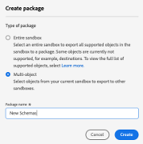

# Adobe Experience Platform for multi-region, multi-brand companies

## Inleiding

Adobe Experience Platform staat voorop bij het transformeren van oplossingen, zodat u optimaal kunt profiteren van het volledige potentieel van uw klantgegevens en -inhoud. Met Experience Platform kunt u gegevens van verschillende systemen centraliseren en standaardiseren en de kracht van gegevenswetenschap en computerleren toepassen. Het resultaat is het verbeteren van het creëren en leveren van persoonlijke ervaringen die aansluiten bij uw consumenten.

Experience Platform stelt u in staat om structuur te vertegenwoordigen en uw bedrijfsgegevens te beheren voor schaalbare, flexibele implementaties. Het uitvoeren van de toepassingen van het Platform is een significante reis die strategische planning en zorgvuldige overwegingen vereist, vooral als u over globale, regionale, en merkspecifieke domeinen of een combinatie van al deze aspecten werkt.

Dit whitepaper dient als referentie en biedt een productief standpunt en een aantal richtlijnen. Het hoofddoel is om u en uw implementatieteams de middelen en inzichten te geven die nodig zijn om effectief door de ingewikkeldheid van Experience Platform te navigeren. Door een gestructureerd kader te bieden voor het evalueren van uw specifieke vereisten, overwegingen en praktijkgevallen, beschikt u over de kennis die nodig is om het volledige potentieel van Experience Platform en platformgebaseerde toepassingen te ontsluiten. Als u de volgende secties leest, zult u waardevolle inzichten en aanbevelingen vinden om het implementatieproces te stroomlijnen en het vermogen van uw organisatie te verhogen om uitzonderlijke ervaringen aan uw publiek te leveren terwijl het verstrekken van bestuur en controles om privacy en naleving te handhaven.


## Werken met de multibrand-onderneming met meerdere regio&#39;s

Als u een multibrand, multi-region onderneming in werking stelt, hebt u waarschijnlijk unieke gegevensbeheervereisten voor Experience Platform. Kennis van uw specifieke vereisten is van cruciaal belang voor het aanpassen van de Experience Platform-implementatie aan uw specifieke behoeften.

Wanneer het onderzoeken van plaatsingsopties, moet u de karakters begrijpen en overwegen die met Experience Platform en op platform-gebaseerde toepassingen zullen communiceren. Het ontwerpen van hun ervaring op basis van hun rollen en belangen zorgt voor een succesvolle implementatie. Hier zijn drie belangrijke personen die u in overweging moet nemen wanneer u de opties verkent:

**Mary, de teler:**

- Focus: aanschaf van de klant en ervaar personalisatie op schaal.
- Doelstellingen: uitgebreide profielen maken, de media-efficiëntie verbeteren.

**Ted, de technoloog**

- Focus: beheer van organisatorische gegevens.
- Doelstellingen: naleving garanderen, gegevenssilo&#39;s beheren en verschillende bedrijfsonderdelen onderhouden.

**Dan, de gegevensarchitect**

- Focus: nauwkeurigheid en kwaliteit van gegevens.
- Doelstellingen: zorgen voor privacy en vertrouwen van gegevens, ontwerpen van schema&#39;s en gegevensmodellen, beheer van gegevensbronnen.

### Een onderneming met beperkte gegevensisolatie

Een belangrijk architectuurbeginsel in Experience Platform is een beginsel waarbij klantgegevens beperkt blijven tot een specifieke productiesandbox op basis van het beleid en de vereisten inzake governance.

Als uw organisatie een specifieke gegevensomgeving nodig heeft om uw marketingervaring op schaal te kunnen gebruiken, kunt u er de voorkeur aan geven al uw gegevens te consolideren in één Experience Platform-sandbox met minimale vereisten voor gegevensisolatie. Binnen deze set-up worden gegevens opgenomen in een sandbox en worden alle verwante identiteiten weergegeven als één enkel, eenvormig profiel, ongeacht of dit wordt geïdentificeerd door een pseudoniem of een bekende identiteit. Dit betekent dat uw marketers binnen Experience Platform toegang hebben tot alle profielkenmerken en gebeurtenisgegevens kunnen ervaren. Ze kunnen deze gegevens gebruiken met platformgebaseerde toepassingen om een publiek en reizen te maken met een minimale behoefte om marketers te beperken in het gebruik van alle gegevens, ongeacht het merk of de regio. Deze benadering vergemakkelijkt naadloze segmentatie en publieksactivering in de bestemmingen die door de toepassingen van Experience Platform worden gesteund. Deze strategie werkt goed als u probeert om uw volledige klantenbasis, ongeacht regionale of merkspecifieke verschillen, voor verenigde en samenhangende marketing inspanningen te hefboomwerken.


#### Hoe werkt dit

Laten we beginnen met het plannen van uw implementatie en het configureren van uw omgeving op hoofdniveau. Daarna, zult u op het aantal zandbakken, rollen, en toestemmingen beslissen die worden vereist om Experience Platform en op platform-gebaseerde toepassingen voor uw onderneming optimaal in werking te stellen.

##### Algemene instellingen voor uw implementatie

- Vorm zandbakken om het bouwen van verenigde klantenprofielen toe te laten.
- De rollen van de opstelling en toegangscontroles om zandbakken en toegang tot functionaliteit voor elke persoon te beheren.
- De ontwikkelingslevenscyclus beheren met behulp van een ontwikkelingssandbox en sandbox.

**Sandboxes**

Sandboxen zijn virtuele partities binnen één exemplaar van Experience Platform, die naadloze integratie met het ontwikkelingsproces van uw digitale ervaringstoepassingen mogelijk maken. Alle inhoud en handelingen die in een sandbox worden uitgevoerd, worden beperkt tot die sandbox en hebben geen invloed op andere sandboxen, zoals gegevens en toegang tot gegevens. Op Experience Platform worden twee soorten sandboxen ondersteund:

- **zandbak van de Productie**: Een productiestandaard wordt bedoeld om met profielen in uw productiemilieu te worden gebruikt. Met Experience Platform kunt u meerdere productie-sandboxen maken om de juiste gegevensfunctionaliteit te bieden terwijl de operationele isolatie behouden blijft.

- **zandbak van de Ontwikkeling**: Een ontwikkelingszandbak kan uitsluitend voor ontwikkeling en het testen met niet-productieprofielen worden gebruikt.

U kunt veelvoudige zandbakken van om het even welk type tot stand brengen, en voor dit type van onderneming, zullen wij één productie en één ontwikkelingszandbak gebruiken om te illustreren hoe te om dit type van onderneming in werking te stellen en in werking te stellen.


In de productiesandbox, verwachten wij u om uw productieprofiel in te voeren en gebeurtenisgegevens te ervaren om een verenigd profiel voor uw marketing activiteiten te bouwen. Voor meer details op hoe te om bekende en anonieme gegevens van veelvoudige ondernemingsbronnen te combineren om klantenprofielen tot stand te brengen die kunnen worden gebruikt om gepersonaliseerde klantenervaringen over alle kanalen en apparaten in real time te verstrekken, zie de [&#x200B; documentatie van Adobe Real-Time Customer Data Platform &#x200B;](https://experienceleague.adobe.com/nl/docs/experience-platform/rtcdp/home).

**controles van de Toegang**

U kunt toegangscontroles met rollen en toestemmingen bepalen om toegang tot toepassingsmiddelen afhankelijk van de persoon en zijn vereiste functionaliteit te controleren. Bovendien kunt u de toegang tot specifieke velden van de profielgegevens beperken. U zou door deze stap diepgaand moeten nadenken om het gebruik van Experience Platform, op platform-gebaseerde toepassingen, en uw klantengegevens beter te regeren.

Overweeg een gegevensengineer die mogelijk geen toegang nodig heeft tot alle Experience Platform en platformgebaseerde toepassingsfunctionaliteit. Zij zijn typisch verantwoordelijk voor het creëren van gegevensdefinities (schema&#39;s), het vormen gegevensbronnen aan ingeschrevene gegevens, en het creëren van datasets. Nochtans, kunnen zij niet de zelfde persoon zijn die tot publiek voor gepersonaliseerde klantenervaringen leidt en activeert. Voor deze persoon, creeer een rol, voeg de aangewezen toestemmingen toe, en verleent toegang slechts tot de vereiste functionaliteit. Een markeringspersoneel daarentegen zou geen schema&#39;s maken en gegevens invoeren, maar zich richten op het maken en activeren van publiek om persoonlijke klantenervaringen mogelijk te maken.

Indien gewenst, denk na toevoegend korrelige toegangscontroles om toegang tot specifieke gebieden op het verenigde klantenprofiel met op attribuut-gebaseerde toegangsbeheer/gebied-vlakke toegangsbeheercapaciteit te beperken. Dit zijn governancemechanismen in Experience Platform waarmee u de toegang tot gegevenskenmerken kunt beperken op basis van vooraf gedefinieerde labels. Met toegangsbeheer op veldniveau kunnen persoonlijke identificeerbare gegevens worden beheerd en is de toegang beperkt tot alle Experience Platform- en toepassingsworkflows. Voor meer details op toegangsbeheermogelijkheden, zie de [&#x200B; documentatie van de toegangscontrole &#x200B;](https://experienceleague.adobe.com/nl/docs/experience-platform/access-control/home).


**Levenscyclus van de Ontwikkeling met ontwikkelingszandbakken**

Een ontwikkelingssandbox gedraagt zich in alle functionele aspecten op dezelfde manier als een productiesandbox. Het is anders omdat het een aantal contractuele garanties zal hebben om je binnen de grenzen van je licentie te houden. Het is uitsluitend ontworpen voor ontwikkeling en het testen met niet-productieprofielen, die tot 10% van uw vergunning gegeven profielverplichting steunen (cumulatief die over alle erkende ontwikkelingszandbakken wordt gemeten). Voor extra details en begeleiding, zie de [&#x200B; documentatie van het zandbakenoverzicht &#x200B;](https://experienceleague.adobe.com/nl/docs/experience-platform/sandbox/home) en de [&#x200B; pagina van de productbeschrijvingen &#x200B;](https://helpx.adobe.com/nl/legal/product-descriptions.html) voor machtigingsdetails.

U kunt meerdere ontwikkelingssandboxen gebruiken (tot 4 in dit bedrijfsvoorbeeld, aangezien we één productiesandbox gebruiken) voor de ontwikkelings- en testlevenscyclus.

**het Exporteren van en het invoeren van pakketten met zandbak tooling**

Met de functie voor het gereedmaken van de sandbox kunnen gebruikers met de juiste machtigingen hun werk verpakken vanuit een ontwikkelingssandbox en het exporteren naar een opslagplaats. Deze opslagplaats is toegankelijk voor andere gebruikers, die deze pakketten in hun aangewezen sandboxen kunnen importeren. Deze mogelijkheid zorgt voor consistente configuraties in sandboxen, waardoor het exporteren en importeren van bestanden naadloos verloopt.

Het gebruik van sandboxgereedschappen verbetert de configuratienauwkeurigheid aanzienlijk en verkort de tijd die nodig is voor de implementatie. Hierdoor kunnen configuraties met succes over verschillende sandboxen worden verplaatst.

Met de functie voor het gereedmaken van de sandbox kunt u verschillende objecten selecteren en naar een pakket exporteren. Een pakket kan één object of meerdere objecten bevatten, maar alle objecten moeten uit dezelfde sandbox afkomstig zijn.

**zandbakautomatisering via APIs**

U kunt Experience Platform API&#39;s gebruiken om sandboximplementaties en configuratietaken te automatiseren. API&#39;s maken programmeerbare controle mogelijk voor herhaalde taken zoals het exporteren, importeren of wijzigen van sandboxconfiguraties, zodat u over flexibiliteit beschikt als u de voorkeur geeft aan geautomatiseerde workflows.

Voor extra details op zandbak tooling, zie de [&#x200B; zandbak tooling documentatie &#x200B;](https://experienceleague.adobe.com/nl/docs/experience-platform/sandbox/ui/sandbox-tooling).

|  |  |
| --- | --- |

### Regio of merkspecifieke gegevensisolatie

Als u volledig geïsoleerd moet zijn (bijvoorbeeld regionaal of op merk gebaseerd), kunt u werken onder strikte beleidsregels voor gegevenstoegang of wettelijke vereisten die de toegang van uw merkteams tot gegevens beperken specifiek voor hun respectieve regio&#39;s of merken. U bepaalt toegangspatronen die op gebied of merkspecifieke gegevens worden gebaseerd, die naleving van interne, regelgevende, en protocollen van het gegevensbeheer verzekeren. Deze aanpak is van cruciaal belang als u werkt in sterk gereguleerde bedrijfstakken (zoals het verwerken van PII-gegevens) of als u afzonderlijke en gesegmenteerde gegevens moet bijhouden voor verschillende geografische regio&#39;s of merkidentiteiten.


#### Hoe werkt dit

Laten we beginnen met het plannen van uw implementatie, het configureren van uw omgeving op hoofdniveau en het bepalen van het aantal sandboxen, rollen en machtigingen dat vereist is om Experience Platform en platformgebaseerde toepassingen optimaal te laten werken voor uw onderneming.

##### Algemene instellingen voor de implementatie van meerdere sandboxen

- Configureer meerdere productie-sandboxen om het samenstellen van de uniforme klantprofielen in elke sandbox mogelijk te maken.

- De rollen van de opstelling en toegangscontroles om zandbakken en toegang tot functionaliteit voor elke persoon te beheren.

- De ontwikkelingscyclus beheren met gereedschappen voor sandboxen.

- Wereldwijde rapportage en activering (gegevens van meerdere sandboxen voor interorganisationele inzichten met Customer Journey Analytics).

**Sandboxes**

In tegenstelling tot een opstelling met één enkele productiestandaard, kunt u een complexere benadering vereisen als u volledige isolatie van gegevens en werkschema&#39;s nodig hebt. Hier worden meerdere productiesandboxen gebruikt, die elk een afzonderlijke, op uw specifieke behoeften toegesneden eenheid vormen.

Zoals vermeld, is elke zandbak een virtuele verdeling binnen één enkele platforminstantie. Met deze sandboxen kunt u uw gegevens, workflows en processen beheren in een gecontroleerde omgeving die andere sandboxen niet beïnvloedt. Terwijl ontwikkelingssandboxen bedoeld zijn voor test- en ontwikkelingsactiviteiten met niet-productieprofielen, vormen productiesandboxen de ruggengraat van levende activiteiten, en ondersteunen zij de opname van feitelijke productiegegevens voor echte marketingactiviteiten.

Belangrijkste voordelen van schone isolatie in productiesandboxen:

1. **het bestuur en de naleving van Gegevens:** als u in gereglementeerde industrieën of gebieden met de strenge wetten van de gegevensprivacy werkt, moet u ervoor zorgen dat de gegevens van één gebied of merk geïsoleerd blijven. Met meerdere productiesandboxen kunt u voldoen aan governancevereisten of industriespecifieke standaarden door ervoor te zorgen dat gegevens alleen toegankelijk zijn binnen de juiste sandbox.

2. **Operationele efficiency:** door gegevens en werkschema&#39;s te isoleren, kunt u uw verrichtingen efficiënter beheren. Uw teams die verantwoordelijk zijn voor verschillende regio&#39;s of merken, kunnen onafhankelijk werken binnen hun eigen sandboxen zonder zich zorgen te maken over gegevenslekken bij ongevallen of onbevoegde toegang.

3. **Aangepaste werkschema&#39;s:** u kunt elke productiesandbox aan de specifieke behoeften van uw gebied of het merk aanpassen het vertegenwoordigt. Hierdoor kunt u aangepaste workflows, gegevensmodellen en marketingstrategieën implementeren die voor dat segment zijn geoptimaliseerd.

4. **Schaalbaarheid:** aangezien u groeit, kunt u extra productiestanddozen gemakkelijk tot stand brengen om nieuwe gebieden of merken aan te passen. Deze schaalbaarheid zorgt ervoor dat het platform zich kan aanpassen aan uw veranderende behoeften zonder de gegevensintegriteit of prestaties in gevaar te brengen.

5. **Verbeterde controle:** met veelvoudige productiesandboxen, hebben uw beheerders gekorrede controle over toegangstoestemmingen, gegevensopname, en werkschemauitvoering. Dit laat u toe om een veiligere en georganiseerde benadering van het beheren van complexe verrichtingen over uw globale onderneming te kiezen.

**controles van de Toegang**

In de context van veelvoudige productiesandboxen, blijven de toegangscontroles een kritieke component van het beheren van gegevens en werkschema&#39;s binnen Experience Platform. De complexiteit neemt echter toe als uw beheerders ervoor moeten zorgen dat gebruikers alleen toegang hebben tot de sandboxen die relevant zijn voor hun rollen en dat ze tegelijkertijd bewerkingen tussen sandboxen blijven toestaan voor gebruikers die deze nodig hebben, zoals uw marketingteams die meerdere regio&#39;s of gegevensengineers omspannen die verantwoordelijk zijn voor het opnemen van gegevens en het modelleren van gegevens.

**die rollen en toestemmingen over zandbakken bepalen:**

Enkel zoals in het enige scenario van de productiestandaard, kunt u toegangsbeheerbeleid met rollen en toestemmingen bepalen die aan de behoeften van verschillende personen worden aangepast. U moet echter wel bedenken hoe deze rollen zich uitstrekken over verschillende sandboxen in een omgeving met meerdere sandboxen.

Bijvoorbeeld:

- **Regionale marketers:** als uw marketers in veelvoudige gebieden werken, zouden hun rollen meer dan één zandbak kunnen moeten overspannen. U kunt hun de noodzakelijke toestemmingen verlenen om tot middelen over veelvoudige zandbakken toegang te hebben terwijl het verzekeren van hun toegang nog beperkt is tot de aangewezen gegevens en de werkschema&#39;s binnen elke zandbak.

- **de ingenieurs van Gegevens:** de ingenieurs van Gegevens verantwoordelijk voor het creëren van gegevensmodellen, het bepalen van schema&#39;s, en het beheren van gegevensopname zouden toegang tot alle zandbakken kunnen vereisen. U kunt hun rollen ontwerpen om hen toe te staan om over het volledige platform te werken terwijl het beperken van hun toegang tot slechts de functionaliteiten en de gegevens relevant voor hun taken. Zo kan uw gegevensengineer die werkt aan gegevensmodellen voor Europa en Noord-Amerika toegang krijgen tot de productiesandboxen voor deze regio&#39;s met toestemming om schema&#39;s te wijzigen en gegevens in te voeren. Zij zouden echter geen toegang hebben tot marketingfuncties zoals het creëren en activeren van het publiek.

**korrelige overwegingen van het toegangsbeheer:**

In een multi-zandbakmilieu, wordt het korrelige toegangsbeheer nog kritiek. Met toegangsbeheer op basis van kenmerken (toegangsbeheer op veldniveau/toegangsbeheer op objectniveau) kunt u de toegang tot specifieke gegevensvelden binnen profielen of bepaalde soorten publiek verder beperken, zodat gevoelige of persoonlijk identificeerbare informatie (PII) in al uw sandboxen wordt beschermd. Bijvoorbeeld:

- U kunt de toegang tot bepaalde gegevensvelden in een sandbox beperken tot alleen gebruikers binnen dat gebied. Dit zorgt ervoor dat PII of gevoelige gegevens alleen zichtbaar zijn voor degenen die het nodig hebben, in overeenstemming met privacyregels en intern governancebeleid.

- Voor gebruikers met dwars-zandbak toegang, op attribuut-gebaseerde toegangscontrole zorgt ervoor dat zelfs als zij toegang tot veelvoudige zandbakken hebben, hun zicht in gevoelige gegevens door hun rol en een behoefte-aan-weet basis wordt beperkt.

Voordelen van op rol-gebaseerde en op attribuut-gebaseerde toegangscontroles:

1. Door toegang te controleren die op rollen en attributen wordt gebaseerd, kunt u het risico van onbevoegde gegevenstoegang beduidend verminderen, die ervoor zorgen dat slechts die met de aangewezen toestemmingen gevoelige informatie kunnen bekijken of manipuleren.

2. Duidelijke en duidelijk bepaalde rollen en toestemmingen stroomlijnen verrichtingen, aangezien elke persoon toegang tot de functionaliteit en de gegevens heeft die zij zonder onnodige rommel of risico nodig hebben. Deze helderheid ondersteunt efficiënte workflows en vermindert wrijving.

3. Aangezien uw onderneming groeit en evolueert, kunnen de toegangscontroles worden aangepast om nieuwe gebieden, merken, of rollen aan te passen. De flexibiliteit om toegang te wijzigen zonder bestaande workflows te onderbreken is van cruciaal belang voor het schalen van uw bewerkingen.

4. Beheerders kunnen de gecentraliseerde controle over alle sandboxen behouden, zodat u consistent bent in de manier waarop toegangsbesturingselementen in uw hele onderneming worden toegepast, terwijl ze aanpassing voor verschillende regio&#39;s of merken mogelijk maken.

**Levenscyclus van de Ontwikkeling met ontwikkelingszandbakken**

Voor het beheer van uw ontwikkelingscyclus in meerdere regio&#39;s en merken binnen Experience Platform is een robuuste aanpak vereist die consistentie, efficiëntie en schaalbaarheid garandeert. De zandbakken van de ontwikkeling steunen de ontwikkelingscyclus in een complexe omgeving met talrijke productiesandboxen. Ze worden verbeterd met de functie voor het gereedmaken van de sandbox, waarmee u probleemloos configuratie kunt delen en implementeren in verschillende omgevingen.

Ontwikkelingssandboxen spelen een cruciale rol in de ontwikkelingscyclus. Deze sandboxen bieden een geïsoleerde omgeving waarin ontwikkelaars en gegevensengineers configuraties kunnen bouwen, testen en herhalen zonder dat dit van invloed is op productiegegevens. Hoewel in functionaliteit vergelijkbaar met productiesandboxen, verschillen de ontwikkelingssandboxen omdat ze bedoeld zijn voor tests met niet-productieprofielen en waarvoor contractuele limieten gelden, zoals het ondersteunen van maximaal 10% van uw gelicentieerde profielverplichting voor alle toegestane ontwikkelingssandboxen.

U kunt meerdere ontwikkelingssandboxen maken ter ondersteuning van verschillende teams of regio&#39;s. Hierdoor kan elk van uw teams experimenteren met workflows die specifiek zijn voor hun regio of merk, zodat de productieomgevingen tijdens de ontwikkeling stabiel en veilig blijven. Als u veel productiesandboxen hebt, raden we u aan een pool met ontwikkelingssandboxen te gebruiken om meerdere regio&#39;s/merken te ondersteunen.

**het Exporteren van en het invoeren van pakketten met zandbak tooling**

De functie voor het gereedmaken van de sandbox is een krachtig gereedschap als u meerdere sandboxen beheert. Het laat ontwikkelaars, gegevensingenieurs, en marketers toe om hun werk in een ontwikkelingszandbak, met inbegrip van schema&#39;s, gegevensmodellen, en andere configuraties te verpakken, en dan hen naar een bewaarplaats uit te voeren. Van daar, kunnen andere gebruikers tot deze pakketten toegang hebben en invoeren in hun aangewezen zandbakken, die naadloos het delen en plaatsing van succesvolle configuraties over het zaken vergemakkelijken.

Bijvoorbeeld, kan uw gegevensingenieur die in een ontwikkelingszandbak voor het Noord-Amerikaanse gebied werkt een schema tot stand brengen en het met al zijn gebiedsdelen verpakken. Een andere gegevenstechnicus in een andere regio, zoals Europa, kan dit pakket openen en importeren in hun regionale sandbox. Dit proces zorgt voor consistentie in gegevensmodellering en configuratie in uw hele onderneming, waardoor het risico op fouten wordt verminderd en de operationele efficiëntie wordt verbeterd.

Voordelen van sandboxgereedschappen in een omgeving met meerdere sandboxen:

1. Met gereedschappen voor sandboxen wordt de ontwikkelingscyclus gestroomlijnd doordat succesvolle configuraties gemakkelijk kunnen worden gedeeld tussen meerdere sandboxen. Dit vermindert dubbel werk en zorgt ervoor dat de beste praktijken in alle regio&#39;s of merken consequent worden toegepast.

2. De capaciteit om pakketten over verschillende zandbakken uit te voeren en in te voeren verbetert interoperabiliteit binnen de onderneming. Teams in verschillende regio&#39;s kunnen effectiever samenwerken, waardoor hun configuraties beter aansluiten bij de algemene bedrijfsdoelstellingen en tegelijk voldoen aan regionale of merkspecifieke vereisten.

3. Naarmate bedrijven groeien en meer sandboxen toevoegen om nieuwe regio&#39;s of merken te kunnen gebruiken, biedt de functie voor sandboxgereedschappen de schaalbaarheid die nodig is om deze omgevingen efficiënt te beheren. Nieuwe sandboxen kunnen snel worden geconfigureerd met bestaande pakketten, waardoor het instapproces wordt versneld en de tijd die nodig is om live te gaan, wordt verkort.

4. Door configuraties en afhankelijkheden in een ontwikkelingssandbox te verpakken en deze vervolgens in te zetten op productiesandboxen, kunnen bedrijven ervoor zorgen dat hun configuraties nauwkeurig en consistent zijn over de hele linie. Dit vermindert de waarschijnlijkheid van fouten en verbetert de algemene betrouwbaarheid van het platform.

5. Met gereedschappen voor sandboxen verloopt de overgang van ontwikkeling naar productie soepel en bestuurd. Nadat configuraties zijn getest en gevalideerd in een ontwikkelingssandbox, kunnen ze worden geëxporteerd en geïmporteerd in een productiesandbox met de zekerheid dat ze naar behoren zullen functioneren.

**Globale rapportering en activering**

Dit betekent dat gegevens uit meerdere sandboxen voor interorganisationele inzichten moeten worden samengevoegd, waarvoor vaak een specifieke rapportsandbox nodig is voor integratie met Customer Journey Analytics.

Hoewel de benadering met meerdere productiesandboxen duidelijk isolatievoordelen biedt voor regionale en merkspecifieke activiteiten, introduceert deze ook uitdagingen die creatieve oplossingen vereisen. Een belangrijke uitdaging is de mogelijkheid om gegevens in verschillende sandboxen te analyseren voor wereldwijde rapportage en wereldwijde campagnedoeleinden. Bedrijven moeten vaak de reis van klanten op mondiaal niveau begrijpen, waarbij gegevens van meerdere sandboxen worden geïntegreerd en marketinginspanningen tussen sandboxen mogelijk worden gemaakt. Hieronder schetsen we een aanpak van deze uitdagingen.

**Globaal rapporterend over zandbakken**

Wanneer een onderneming met meerdere productiesandboxen werkt, die elk een regio of merk vertegenwoordigen, wordt het analyseren van klantgegevens in alle sandboxen complex. Bijvoorbeeld, die een verenigde mening van de klantenreis over verschillende merken creëren vereist consoliderend gegevens van deze geïsoleerde milieu&#39;s.

**Specifieke globale zandbak**


Deze sandbox fungeert als een centrale opslagplaats waar gegevens van afzonderlijke regionale of merkspecifieke sandboxen worden geconsolideerd. Een gemeenschappelijke oplossing is de Dienst van de Vraag binnen elke zandbak te gebruiken om relevante klantengegevens te halen. Dit kunnen profielen en ervaringsgebeurtenissen zijn die voor verschillende regio&#39;s of merken moeten worden geanalyseerd. Zodra de gegevens van elke zandbak worden voorbereid, wordt het opgenomen in de globale rapporteringszandbak voor analyse en publieksverwezenlijking.

Gebruik Customer Journey Analytics voor het uitvoeren van een intermarket- en interbrand-analyse van geaggregeerde gegevens in de wereldwijde sandbox om een uitgebreid overzicht te krijgen van de interactie van klanten tussen alle merken en regio&#39;s. Hierdoor kunnen ze waardevolle inzichten genereren, zoals het identificeren van klanten die met meerdere merken werken en het creëren van een publiek dat voor meerdere merken of regio&#39;s geldt. Deze inzichten kunnen voor diverse doeleinden worden gebruikt, met inbegrip van het activeren van marketing strategieën, het personaliseren van klantenervaringen, en het drijven van ondernemingsgroei.

**het Delen van het publiek**

Met de wereldwijde sandbox kunnen wereldwijde marketingteams ook op grotere schaal soorten publiek definiëren en beheren. Met behulp van sandboxgereedschappen kunnen deze algemene doelgroepen (alleen definities, niet gegevens) worden geëxporteerd van de globale sandbox naar afzonderlijke merk- of regionale sandboxen, zodat lokale marketingteams ze op hun respectievelijke markten kunnen evalueren en activeren.

Bovendien kunt u de Overeenkomst van het Segment van Experience Platform gebruiken, een eigenschap in Platform die dwars-zandbaksegment het delen (gekwalificeerd publiek) tussen verschillende organisatorische eenheden of bedrijfsentiteiten toelaat.

Deze segment-delende dienst staat twee of meer gebruikers toe om segmentgegevens op een veilige, beheerde, en privacy-vriendelijke manier uit te wisselen.

Voor extra details op de eigenschap van de Gelijke van het Segment, zie de [&#x200B; documentatie van de Gelijke van het Segment &#x200B;](https://experienceleague.adobe.com/nl/docs/experience-platform/segmentation/ui/segment-match/overview).

### Een overvloeiing van benaderingen voor wereldwijde, regionale en merkspecifieke bewerkingen

Veel multibrand-ondernemingen opereren op mondiale schaal en streven als zodanig vaak naar een combinatie van zowel uniforme als geïsoleerde benaderingen voor gegevensbeheer. In dit scenario willen zij gegevens scheiden voor meerdere regio&#39;s of landen. Merken binnen de organisatie kunnen verwachten uitsluitend te werken op de gegevens die verband houden met hun specifieke merk, allemaal binnen dezelfde gegevensgrenzen van een geografisch gebied of land. Deze aanpak maakt een gecentraliseerd regionaal of landelijk gegevensbeheer mogelijk, terwijl de merkspecifieke marketing- en datatransacties worden vergemakkelijkt. Het is een model dat de voordelen van verenigd gegevensbeheer met de noodzaak voor merk en regio-specifieke isolatie combineert.

Experience Platform is zich bewust van deze uiteenlopende vereisten en kan zo worden geconfigureerd dat u beschikt over een zeer aanpasbare en flexibele oplossing voor gegevensbeheer, zodat bedrijven met meerdere merken en regio&#39;s uw bedrijf binnen het platform effectief kunnen vertegenwoordigen. Of het nu gaat om het maximaliseren van de collectieve klantgegevens, het behouden van een strikte gegevensisolatie of het bereiken van een evenwicht tussen beide, Experience Platform is uitgerust om aan de uiteenlopende behoeften van uw onderneming te voldoen.


#### Hoe werkt dit

Laten we beginnen met het plannen van uw implementatie, het configureren van uw omgeving op hoofdniveau en het bepalen van het aantal sandboxen, rollen en machtigingen dat vereist is om Experience Platform en platformgebaseerde toepassingen optimaal te laten werken voor deze onderneming.

##### Algemene instelling voor deze onderneming

- Vorm veelvoudige productiesandboxen om de bouw van de verenigde klantenprofielen toe te laten.

- De rollen van de opstelling en toegangscontroles om zandbakken en toegang tot functionaliteit voor elke persoon te beheren.

- Stel op een kenmerk gebaseerd toegangsbeheer in: toegangsbeheer op veldniveau/toegangsbeheer op objectniveau voor korrelige besturingselementen voor profielkenmerken en publiek.

- Beheer de ontwikkelingslevenscyclus met ontwikkelsandboxen en sandboxgereedschappen.

- Wereldwijde rapportage.

**Sandboxes**

Stel een sandbox per merk/regio in. Raadpleeg de bovenstaande secties voor het maken van meerdere productiesandboxen.

**controles van de Toegang**

Rollen en gebruikersmachtigingen:

- Creeer de rol &quot;**de markering-Globale**&quot;en verlenen toestemming om, publiek tot stand te brengen te bekijken en te leiden. Bovendien, zal deze rol toestemming krijgen om alle klantengegevens te bekijken.

- Creëer rollen en geef slechts toegang tot bepaalde eigenschappen voor de juiste persoon. Bijvoorbeeld, zouden de gebruikersrollen &quot;**Marketer-Duitsland**&quot; en &quot;**Marketer-Frankrijk**&quot;slechts toestemming krijgen om, publiek op landgegevens tot stand te brengen te bekijken en te beheren die door een combinatie van gebied-vlakke toegangscontrole, objecten toegangsbeheer, en standaardpubliek worden toegelaten.

- Creeer de rol &quot;**Technologist-Globaal**&quot; en geef de juiste toestemmingen om schema&#39;s, datasets, beleid, bronnen, etc. tot stand te brengen en te beheren. Deze rol zou voor alle noodzakelijke beleid en configuraties verantwoordelijk zijn.

###### Het ontwerp van het schema en op attribuut-gebaseerde toegangsbeheer: Het gebied-vlakke toegangsbeheer

**het gegevensmodel van de Ervaring (XDM)**

Een gestandaardiseerd gegevensschema in Experience Platform dat consistente gegevensstructuur en interoperabiliteit over alle op platforms gebaseerde toepassingen verzekert.

**op Attributen-Gebaseerd toegangsbeheer: Het gebied-vlakke toegangsbeheer en gegevens modelleringsoptie:**

- Creeer een gegevensmodel om huurspecifieke gebieden XDM (PII) te omvatten die voor elk land zouden moeten worden beperkt.

- Landlabels maken en toepassen op XDM-velden. Labels = Duitsland, Frankrijk, Ierland, Nederland, enz.

- Voeg labels toe aan de juiste rol. Voeg bijvoorbeeld het label Duitsland toe aan de rol &quot;Marketer-Germany&quot;.

Individueel XDM-profielschema:

```
\- PII
\- Germany
    \- name --> Label: "Germany"
    \- email --> Label: "Germany"
    \- birthdate --> Label: "Germany"

\- France
    \- name --> Label: "France"
    \- email --> Label: "France"
    \- birthdate --> Label: "France"

\- Netherland
    \- name --> Label: "Netherland", "Germany"
    \- email --> Label: "Netherland", "Germany"
    \- birthdate --> Label: "Netherland", "Germany"

\- Loyalty
    \- member
    \- registrationDate
```

###### Soorten publiek: Gebruik attribuut-based toegangsbeheer: De toegangscontrole van het niveau van Objecten om toegang tot merk/landspecifiek publiek te controleren

**op attributen-Gebaseerd toegangsbeheer: De toegangsbeheer van het niveau van objecten voor publiek:**

- Creeer publiek en controle wie hen kan bekijken.

- Maak landlabels en pas deze toe op het publiek. Labels = Duitsland, Frankrijk, Ierland, Nederland, enzovoort.

- Voeg labels toe aan de juiste rol. Voeg bijvoorbeeld het label &quot;Duitsland&quot; toe aan de rol &quot;Marketer-Duitsland&quot;.


###### Een standaardpubliek opnemen wanneer u een merk-/landspecifiek publiek maakt

**StandaardPubliek: Alternatief aan rij-Vlakke Controle van de Toegang:**

- Op dit moment kunt u in de publieksbuilder bestaande doelgroepen opnemen als bouwstenen voor het maken van publiek.

- Het resultaat wordt afgeleid van het publiek, gevolgd door kenmerken en gebeurtenissen.

- Er is geen mechanisme om een of meer soorten publiek automatisch toe te voegen op het moment van compositie.

 toe

###### Filteren van profielen voor activering en merk/land

**optie van het de toestemmingsbeleid van de Douane:**

Zo kunt u profielen besturen of filteren op het moment van activering:

- Maak een marketingactie.

- Maak een bestemming en koppel de marketingactie.

- Maak een beleid voor aangepaste machtigingen.

>[!NOTE]
>
> De SKU Privacy en het Veiligheidsschild is vereist om toestemmingsbeleid tot stand te brengen.


Complexiteit van multimerkactivering en -beleid:

Om de activering van het publiek voor meerdere merken te beheren, is een gedetailleerd beheer van het beleid voor toestemming vereist, zodat aan de unieke vereisten van elk merk wordt voldaan. Daarnaast kunnen Adobe Privacy and Security Shield (een compliancefunctie in Experience Platform die het beleid inzake gegevensbescherming afdwingt en zorgt voor aanpassing van de regelgeving via verschillende activeringskanalen) specifieke beperkingen opleggen aan de manier waarop het toestemmingsbeleid via verschillende activeringskanalen wordt afgedwongen. U moet deze overwegingen zorgvuldig beoordelen en governancekaders implementeren om naleving en operationele efficiëntie te handhaven.

U moet ook zorgvuldig navigeren rond configuraties van het toestemmingsbeleid en kanaal-specifieke activeringen. Het is van cruciaal belang dat er een duidelijk beleid voor de goedkeuring van elke regio of elk merk wordt vastgesteld en dat deze configuraties consistent worden beheerd, zodat de naleving en de operationele efficiëntie worden gewaarborgd.

## Algemene overwegingen

In sommige scenario&#39;s, kunt u verkiezen voor het opstellen van Experience Platform en op platform-gebaseerde toepassingen over veelvoudige organisatie IDs eerder dan het gebruiken van één enkele organisatie identiteitskaart met vele zandbakken. Deze benadering kan voordelen in termen van gegevensingezetenschap, veiligheid, en beleid, maar het introduceert ook ingewikkeldheid. Hier volgen enkele belangrijke overwegingen om te bepalen wanneer een aanpak met meerdere organisaties geschikt kan zijn.

### Wat is een organisatie-id

- Een organisatie-id is de Adobe-implementatie van het Federated ID- en OAuth 2.0-protocol.

- Een organisatie-id is een verzameling van alle toepassingen, gebruikers en machtigingen die een organisatie onder haar contractuele Adobe-voorwaarden mag uitvoeren.

- Gebruikersaccounts en -machtigingen worden beheerd via de Admin Console van elke organisatie.

- Organisatie-id&#39;s bepalen ook hoe Adobe-oplossingen met elkaar communiceren. Oplossingen binnen dezelfde organisatie kunnen interoperabiliteit hebben.

- In het algemeen wordt een organisatie-id geïmplementeerd in één geografische regio.


**Veelvoudige organisatie IDs: Voordelen en overwegingen &#x200B;**

| Voordelen | Overwegingen |
| -------- | -------------- |
| Hieronder volgt een lijst met voordelen van het hebben van meerdere organisatie-id&#39;s: <ul><li>Flexibiliteit om gegevens op te slaan in bepaalde mondiale regio&#39;s.</li><li>&#x200B; Afzonderlijke gebruikerslogins per instantie - Hele voedingsmiddelen kunnen zich dus niet aanmelden bij Audible. &#x200B;</li><li>Specifieke API eindpunten die elke Markt/BU de capaciteit geven om douaneverbindingen te bouwen zoals nodig in hun eigen milieu &#x200B;.</li><li>Elke bedrijfseenheid zou hun eigen klant-beheerde &#x200B; hebben.</li><li>GDPR-verzoeken kunnen per bedrijfseenheid &#x200B; worden gedaan.</li><li>Volledig geïsoleerde opslag en computer tussen bedrijfseenheden &#x200B;.</li><li>Vermindert sommige organisatie-vlakke prestatiesgidsen/grenzen &#x200B;.</li><li>Meer flexibiliteit met levering en het mengen van SKUs tussen bedrijfseenheden. Een organisatie kan bijvoorbeeld een andere SKU van Adobe Journey Optimizer dan een andere organisatie hebben.</li></ul> | Het volgende is te overwegen dingen wanneer het hebben van veelvoudige organisatie IDs: <ul><li>Meerdere organisatie-id&#39;s die moeten worden beheerd, versus één. &#x200B;</li><li>Meerdere afzonderlijke instanties/omgevingen die moeten worden beheerd (integratie, gegevensbelasting, enzovoort).</li><li>&#x200B; ECID&#39;s zijn uniek per organisatie, waardoor het moeilijk wordt om gegevens tussen bedrijfseenheden aan te passen &#x200B;.</li><li>Moet worden gemigreerd/opnieuw worden geïmplementeerd voor Analytics en Target per organisatie - de globale roll-up kwijtraken (als deze momenteel wordt gebruikt). &#x200B;</li><li>Meer orkestatie vereist om GDPR-verzoeken te doen over bedrijfseenheden &#x200B;.</li><li>In sommige op Experience Platform gebaseerde toepassingen worden metagegevens opgeslagen op het niveau van de organisatie. Niet alles is &quot;sandbox&quot; van sandboxen. &#x200B;</li><li>Organisatie-id is vastgezet aan een gebied. De hostinglocatie voor Adobe AWS is momenteel alleen in de VS. Adobe biedt geen ondersteuning voor het migreren van het ene naar het andere hostgebied. &#x200B;</li><li>Edge is niet bekend met de sandbox (voor het doorsturen van gebeurtenissen).</li></ul> |

**Enige organisatie identiteitskaart: Voordelen en overwegingen**


| Voordelen | Overwegingen |
| -------- | -------------- |
| Hieronder volgt een lijst met voordelen van één organisatie-id: <ul><li>Individuele sandboxen voorzien in een logische scheiding tussen bedrijfseenheden binnen een geïmplementeerde regio</li><li>Eén organisatie-id die IT voor gebruikers, provisioning enzovoort kan beheren.</li><li>Geen migratie van Adobe-tags, Doel, Analytics en meer als u in dezelfde organisatie-id blijft.</li><li>Geen voorinstelling vereist voor bestaande ECID&#39;s - voorkomt &#39;knippen&#39; in Adobe Analytics-gegevens.</li><li>Eén aanmelding voor globale marketingbronnen.</li><li>De toegangsrechten van de gebruiker aan controle wie toegang tot welke zandbakken, met aangewezen niveaus van op rol-gebaseerde toegangsbeheer heeft.</li><li>Gebruik Global Analytics en Target-instanties en rapportsuite-gegevens.</li></ul> | Het volgende is dingen om te overwegen wanneer het hebben van één enkele organisatieidentiteitskaart: <ul><li>Gegevens worden in één gebied opgeslagen.</li><li>Mogelijke noodzaak om gegevens te consolideren in één organisatie-id.</li><li>Alle bedrijfseenheden delen dezelfde infrastructuur in verschillende toepassingen (Experience Platform, Real-Time CDP, Adobe Journey Optimizer, Customer Journey Analytics).</li><li>Guardrails: sommige zijn globaal per organisatie, zoals streamingsegmentatie, die 1,5 kRPS is.</li><li>GDPR-verzoeken werken op organisatieniveau en kunnen niet worden gericht op specifieke sandboxen.</li><li>Door de klant beheerde sleutels worden ingesteld op het niveau van de organisatie-id. Alle sandboxen in de bedrijfseenheid zouden met deze aanpak dezelfde coderingssleutel delen.</li><li>Er is duidelijkheid nodig over bedrijfslicenties in DX en CC om ervoor te zorgen dat toepassingen in de juiste organisatie-id&#39;s zijn opgenomen.</ul></li> |

**Voordelen en overwegingen**

Meerdere organisatie-id&#39;s regelen gebruikerstoegang, rechten en gegevenssegregatie op organisatorisch niveau ten opzichte van één organisatie-id, die op sandboxniveau wordt beheerd.

| Scenario/voorschrift | Meerdere organisatie-id&#39;s | Meerdere sandboxen (enkele organisatie-id) |
| ----------------------------------- | --------------------------------------------------- | ----------------------------------------------- |
| Woonplaats gegevens | Volledige isolatie en regio-specifieke organisatie-id&#39;s | Implementatie voor één regio |
| Beheer en isolatie van gegevens | Volledige scheiding en isolatie | Operationele isolatie, id van gedeelde organisatie |
| Compatibiliteitsbeheer (bv. GDPR) | Afzonderlijke aanvragen per organisatie-id | Eén aanvraag geldt voor alle sandboxen |
| Infrastructuurkosten en licenties | Mogelijk hoger door dubbele installatie | Meestal lager bij gecentraliseerde toediening |
| Wereldwijde rapportage en activering | Uitdaging vanwege geïsoleerde omgevingen | Gemakkelijker rapportage en activering tussen regio&#39;s |
| Administratieve complexiteit | Hoger vanwege meerdere geïsoleerde organisatie-id&#39;s | Lagere, gecentraliseerde toediening |

## Samenvattende conclusie

Experience Platform biedt bedrijven een robuust kader om klantgegevens te centraliseren, te besturen en te activeren voor meerdere merken, bedrijfsmodellen met meerdere regio&#39;s. In dit whitepaper zijn belangrijke implementatiestrategieën, governancemodellen en best practices verkend voor het optimaliseren van Experience Platform-implementatie voor organisaties met verschillende gegevensisolatie en operationele behoeften.

## Toetsen

1. **Flexibele plaatsingsmodellen**

   - De ondernemingen kunnen tussen **enig-zandbak, multi-zandbak, of hybride benaderingen** kiezen die op hun operationele, naleving, en governancevereisten worden gebaseerd.

   - **Globale organisaties** kunnen veelvoudige productiesandboxen vereisen om aan governancevereisten te voldoen terwijl het handhaven van operationele efficiency.

2. **het bestuur van Gegevens en toegangsbeheer**

   - **op attributen-Gebaseerd toegangsbeheer, gebied-vlakke toegangsbeheer, en voorwerp-vlakke toegangsbeheer** laat nauwkeurige governance over gegevenstoegang toe.

   - U moet **duidelijke rollen en toestemmingen** voor verschillende persona&#39;s (b.v., marketers, gegevensarchitecten, en de teams van IT) bepalen om behoorlijk gegevensgebruik te verzekeren.

3. **zandbak tooling en automatisering**

   - **zandbak het tooling** vereenvoudigt configuratiebeheer, toestaand teams om montages efficiënt uit te voeren en in te voeren.

   - **op API-Gebaseerde automatisering** is een beschikbare optie voor ondernemingen die zandbakplaatsingen en bestuur op schaal proberen te stroomlijnen.

4. **Globale het melden en activeringsstrategieën**

   - De ondernemingen die **Customer Journey Analytics** leveraging moeten gegevenssynchronisatie en commerciële implicaties overwegen wanneer het consolideren van globale rapportering.

   - **de Gelijke van het Segment** verstrekt een privacy-volgzaam mechanisme voor cross-sandbox publiek het delen, die naadloze marketing activiteiten verzekeren.

5. **Multiorganisatie IDs vs. multi-zandbakoverwegingen**

   - U moet zorgvuldig beoordelen of om **veelvoudige organisatie IDs of veelvoudige zandbakken** op gegevensresidentie, naleving, en operationele behoeften op te stellen.

   - **IDs van de Organisatie** biedt volledige isolatie**, terwijl multi-zandbakmontages operationele flexibiliteit binnen een gedeeld governancekader* verstrekken.

## Slotopmerkingen

Als bedrijven hun mogelijkheden voor digitale beleving uitbreiden, fungeert Experience Platform als een basisplatform voor het maken van marketing op basis van gegevens, klantintelligentie en het activeren van verschillende kanalen. Een succesvolle implementatie vereist zorgvuldige planning van **zandbakbestuur, nalevingsbeleid, en operationele werkschema&#39;s** om efficiency en scalability op lange termijn te verzekeren.

Door best praktijken leveraging die in dit whitepaper worden geschetst, kunt u **Experience Platform voor multi-brand en multi-regio verrichtingen** optimaliseren, die naadloos gegevensbeheer, naleving, en gepersonaliseerde klantenervaringen op schaal verzekeren.

## Erkenning

Dit whitepaper is ontwikkeld met inzichten en feedback van vakspecialisten in verschillende teams en zorgt voor nauwkeurigheid, duidelijkheid en praktische begeleiding. Wij danken alle collega&#39;s voor hun waardevolle inbreng en herziening. Hun expertise heeft ertoe bijgedragen dit document te verfijnen om bedrijven die Adobe Experience Platform implementeren beter te kunnen bedienen in omgevingen met meerdere merken en regio&#39;s.
