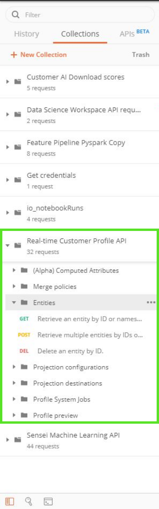

# Postman in Adobe Experience Platform

Postman is een samenwerkingsplatform voor API-ontwikkeling waarmee u omgevingen kunt instellen met vooraf ingestelde variabelen, API-verzamelingen kunt delen, CRUD-aanvragen kunt stroomlijnen en nog veel meer. De meeste Platform API diensten hebben de inzamelingen van Postman die kunnen worden gebruikt om bij het maken van API vraag te helpen.

## Een postmanomgeving instellen voor Experience Platform

De volgende videohandleiding geeft een overzicht van het maken en instellen van uw Postman-omgeving. Een Postman-omgeving bevat alle vereiste headers die u nodig hebt om API-aanroepen uit te voeren naar de verschillende hieronder vermelde verzamelingen. Zodra opstelling, om het even welke tijd een waarde (zoals `ACCESS_TOKEN`) verloopt kunt u de huidige waarde in het milieu bijwerken, en deze nieuwe waarde wordt gebruikt over al uw inzamelingen.

>[!VIDEO](https://video.tv.adobe.com/v/28832)

## Postmancollecties {#collections}

Een omslag die alle beschikbare inzamelingen van Postman bevat kan door worden gevonden, bezoekend de [Experience Platform Postman steekproeven GitHub bewaarplaats](https://github.com/adobe/experience-platform-postman-samples/tree/master/apis/experience-platform). U kunt ook een postmanverzamelingskoppeling vinden in elk afzonderlijk wagerbestand in de [API-naslagdocumentatie](http://www.adobe.com/go/platform-api-reference-en) op Adobe I/O.

Om een inzameling van Postman te downloaden, selecteer **[!DNL Raw]** van de pagina GitHub om het ruwe JSON dossier in een nieuw lusje te laden. Klik vervolgens met de rechtermuisknop en selecteer **[!DNL Save as]** om het bestand op te slaan naar een andere lokale bestemming.

## Een Postmanverzameling {#import} importeren

Als u een [Postman-verzameling](#collections) wilt gebruiken, moet u een omgeving hebben ingesteld. Nadat u de omgeving hebt ingesteld, selecteert u de **[!DNL Manage Environments]**-kiezer in de rechterbovenhoek.

Er verschijnt een pop-upvenster met daarin al uw huidige omgevingen. Selecteer **[!DNL import]** om een verzameling te importeren.

U wordt gevraagd een bestand te kiezen dat u wilt importeren. Selecteer het Postman-verzamelingsbestand dat u wilt importeren. Als deze optie is geselecteerd, wordt de verzameling in de linkertrack gevuld onder het tabblad Verzamelingen.

Elke inzameling heeft verschillende zeer belangrijk-waardeparen die kunnen worden vereist om een succesvolle verrichting uit te voeren CRUD. Lees de [API-ontwikkelaarshandleiding](api-guide.md#api-guides) van de service voor meer informatie over vereiste waarden, tips en voorbeelden.

Voor meer informatie over de interface van Postman en zijn beschikbare eigenschappen, bezoek de [documentatie Postman](https://learning.postman.com/docs/getting-started/navigating-postman/).

### Een toegangstoken met Postman genereren voor niet-productiegebruik

>[!WARNING]
>
>Zoals vermeld in de Adobe I/O toegangstoken van de generatie Postman inzameling, zijn de gesignaleerde generatiemethodes geschikt voor **niet productiegebruik**. Bij lokaal ondertekenen wordt een JavaScript-bibliotheek geladen van een externe host en bij extern ondertekenen wordt de persoonlijke sleutel verzonden naar een webservice die eigendom is van en wordt beheerd door Adobe. Hoewel Adobe deze persoonlijke sleutel niet opslaat, mogen productietoetsen nooit met iemand worden gedeeld.

De video hieronder gebruikt [Adobe I/O toegangstoken generatieinzameling](https://github.com/adobe/experience-platform-postman-samples/blob/master/apis/ims/Adobe%20IO%20Access%20Token%20Generation.postman_collection.json) die van de openbare bewaarplaats GitHub kan worden gedownload.

>[!VIDEO](https://video.tv.adobe.com/v/29698/?quality=12&learn=on)

## Volgende stappen

Dit document introduceerde Postman-omgevingen, -verzamelingen en hoe verzamelingen te importeren. Nu u Postman klaar hebt, bezoek [Platform begonnen gids](api-guide.md) voor informatie over vereiste kopballen, voorbeelden, en een lijst van [API gidsen](api-guide.md#api-guides) beschikbaar voor elke dienst van het Platform.