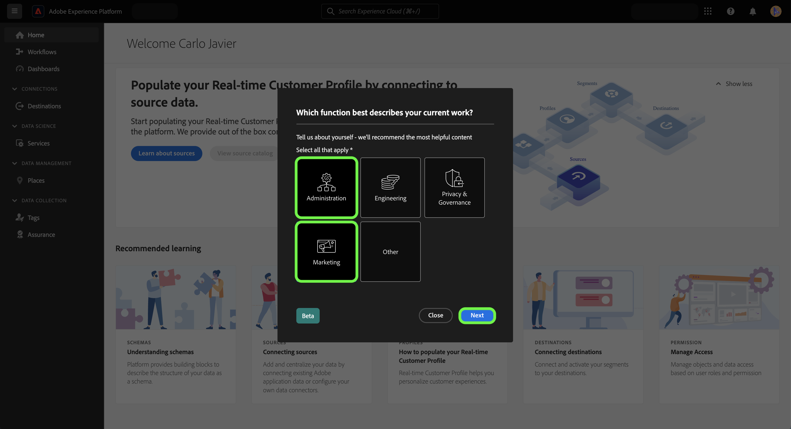

# Gebruik de zelfidentificatiecode-enquête om uw persoonlijke profiel voor Experience Platforms samen te stellen

>[!NOTE]
>
>Het zelfidentificatieonderzoek is in bèta. De kenmerken en documentatie van het programma kunnen worden gewijzigd.

De zelfidentificatiecode-enquête is een korte vragenlijst die wordt weergegeven op de homepage van de gebruikersinterface van Adobe Experience Platform. U kunt de enquête invullen om informatie te verschaffen over uw functies en algemene doelstellingen. Deze informatie wordt dan gebruikt om in-product gidsen beter te richten en uiteindelijk inhoud te leveren die voor uw doelstellingen relevanter is.

Dit document verstrekt informatie over hoe u het zelf-identificatieonderzoek in het Platform UI kunt gebruiken om relevante inhoud te ontvangen die op uw doelstellingen en taken wordt gebaseerd, evenals hoe te om uw persoonlijke profielattributen opnieuw te vormen gebruikend UI.

Lees voor meer informatie over Adobe Experience Platform de [Overzicht van Experience Platform](home.md).

## Zelfidentificatieonderzoek in de gebruikersinterface van het Platform

De herinnering van het zelfidentificatienonderzoek verschijnt in het bodemrecht van de homepage van het Platform UI bij het ondertekenen binnen.

Selecteer **[!UICONTROL Start]**.

Voor de eerste enquêtevraag selecteert u de functie die het beste uw werk beschrijft.

De beschikbare opties zijn:

* Beheer
* Engineering
* Privacy en governance
* Marketing
* Overige

>[!NOTE]
>
>U kunt meerdere functies selecteren in de lijst met opties. Als u [!UICONTROL Other], wordt u gevraagd om details over uw doel op te geven.

Als u wilt doorgaan, selecteert u de functie(s) die het beste uw huidige werk beschrijft en selecteert u **[!UICONTROL Next]**.

Selecteer vervolgens de specifieke doelstelling(en) die het beste op uw werk van toepassing is.

De lijst met beschikbare doelstellingen omvat:

* Gebruikers maken en beheren
* Rollen, machtigingen en productprofielen toewijzen
* Het gebruik van licenties, sandboxen en waarschuwingen beheren
* Het systeem voor gegevensinvoer configureren
* De gegevensstructuur van mijn organisatie modelleren
* Gegevens opvragen, filteren en optimaliseren om inzichten te genereren
* Beleid voor machtigingen en gegevens configureren
* Beheer van gegevens en naleving van privacy
* marketingstrategieën ontwikkelen
* Doelgroepen maken, beheren en segmenteren
* Stel dashboards in om de zakelijke impact te analyseren
* Gegevens naar doelen activeren voor downstreamgerichte toepassingen

Als u klaar bent, selecteert u **[!UICONTROL Submit]**.

Als uw zelfidentificatie-enquête is voltooid, selecteert u **[!UICONTROL Done]**.

>[!NOTE]
>
>De doelstellingen en aanbevelingen (indien aanwezig) zullen veranderen gebaseerd op de geselecteerde baanfuncties.

## Antwoorden van enquêtes bijwerken

Werk uw taakfuncties en objecten bij met het voorkeurenmenu Experience Cloud. Als u het voorkeurenmenu wilt openen, selecteert u het profielpictogram in de bovenste navigatie en selecteert u vervolgens **[!UICONTROL Preferences]**.

Volgende, in [!UICONTROL General] in het menu met uw profielvoorkeuren selecteert u **[!UICONTROL Update your job functions and objectives]**.

De zelfidentificatiecode wordt weergegeven, zodat u de reacties opnieuw kunt configureren en uw profiel kunt bijwerken.

## Volgende stappen

Door dit document te lezen, hebt u nu informatie over uw taakfuncties en -doelstellingen verzonden en bijgewerkt om meer relevante inhoud te ontvangen wanneer u de gebruikersinterface van het Platform gebruikt. Lees voor meer informatie over de gebruikersinterface van het Platform de [Overzicht van Experience Platform](home.md).
